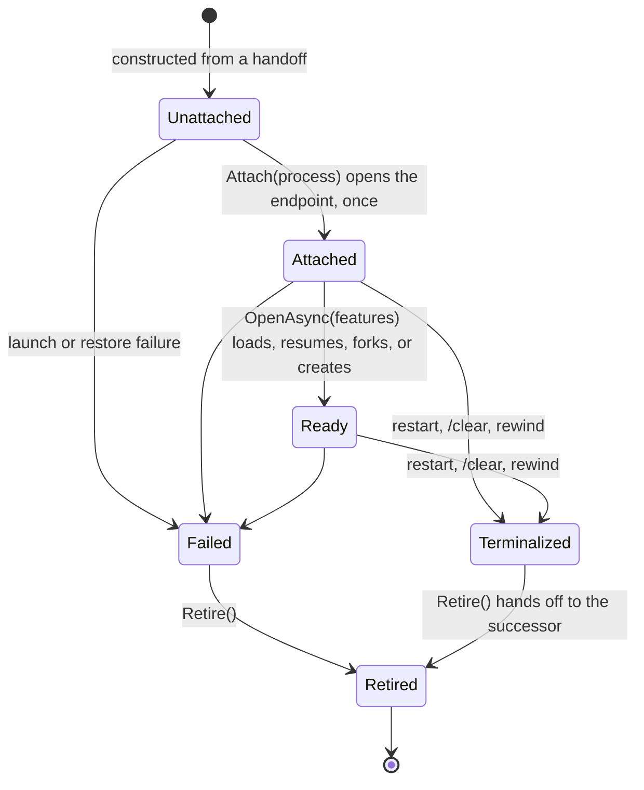

# ACP conversations

`AcpAgentSession` is the public face of one native ACP session: it owns the agent process, the display
journal, the set of conversations, and the routing of user input. Every conversation on that process —
the primary and each `/btw` side — is an `AcpConversation`: one owned incarnation that reaches the process
only through its own endpoint and its owner only through its own port.

## Slot and incarnation

The model mirrors the [session message bus](session-message-bus.md). The persisted continuation
(`AcpConversationState`: provider session, turn number, guidance, plan turns) is the slot. An
`AcpConversation` is one incarnation of that slot. Restart, `/clear`, Rewind and reconnecting after a
failure retire the incarnation and hand its successor the same, an empty, or a rewound continuation, plus the
submissions still queued and the interaction identities already shown in the pane.
Ownership is the object itself: a conversation's `Live` is a check on its own lifetime, never a comparison
with a shared "current" generation, epoch, or session id.

The primary and sides are one type. `AcpConversationSpec` gives the seed, the opening (`Continue`: load or
resume the seed's session, or create one; `ForkFromOpening`: fork a live parent, at a message for a rewind), and
whether the conversation is side-scoped. The side-only behaviour left inside the conversation is the scope instruction
in its prompts, settling an interrupted opening, and its opening strategy; everything else that differs
lives in its port.

## Four owned channels

1. **Endpoint** — opened by `Attach` and held in a write-once cell. It addresses outgoing operations,
   receives the conversation's notifications and requests, answers requests, reports health, terminates its
   process, and receives that process's protocol faults. A retired endpoint refuses sends and drops late
   traffic; responses to the agent's own requests still go out. Closing an endpoint retires it and sends
   `session/close` once any opening request (new, fork, load, resume) settles, so a session that opens after
   its conversation was replaced is still closed.
2. **Port** — `AcpConversationPort`, handed in at construction, is the conversation's only event sink and its
   only way to persist, publish, report controls, usage and queue changes, fail the process, or restart it.
   `PrimaryPort` raises the facade events; `SidePort` namespaces side messages and events and completes the
   side; `RewindPort` stages a rewind's fork (below). Every port call takes the transition gate and is inert
   once the port is detached.
3. **Lifetime** — a cancellation source cancelled when the incarnation fails, is terminalized, retires, or is
   disposed. Agent-request tokens are linked to it, so a dead conversation's in-flight requests cancel. A
   login is cancelled only when the conversation is replaced or closed: one that outlives a runtime failure
   still completes, and a terminal login then restarts the agent.
4. **Terminals** — one `AcpTerminalManager` per conversation, closed when the incarnation ends; a terminal
   create racing the close fails.

The owner keeps only process-level state: the connection, `initialize` and the advertised
`AcpAgentFeatures`, the attached process generation (to terminate it, attach sides, and route unscoped
traffic), the journal, and the conversation set. Launch failures are the owner's, because an unattached
primary has no endpoint to receive them.

## Locking

The order is transition gate → owner gate → conversation gate. Never take an outer lock while holding an
inner one, and never hold any of them across an await. The transition gate is one reentrant lock per
process owner, shared into every conversation; it serialises transitions, port detachment, and every port
call, so port calls happen with no inner lock held. A request's own state lock is a leaf: a request card
publishes under the transition gate after checking the request is still open, and any completion's
resolution, also emitted under that gate, follows it. The owner captures the conversation it acts on at the
synchronous entry point and never re-reads `_primary` after an await.

## Replacing a conversation

The predecessor is dead before its successor runs, so nothing the old incarnation still has in flight — a
prompt, an approval, an input request, a login, a control change, a terminal request, steering, a late
`session/update` — can reach the successor:

1. terminalize the primary and suspend the sides; a running prompt gets `session/cancel`;
2. settle the primary's pending approvals, inputs and authentication, answering each request as cancelled;
3. retire the primary and install the successor from its handoff;
4. start the successor.

When the agent advertises `sessionCapabilities.close` and the predecessor's session has opened, `/clear` and Rewind
keep the running process: the predecessor retires *closing* its provider session, and the successor attaches a new
endpoint to the same initialized process and opens there. An agent that refuses the close has the process stopped,
since nothing else would stop that session. Without close, or while the predecessor is still opening (a request
that may never return), only stopping the process stops the predecessor's work, so
the successor waits for a restart, which attaches it; the restart failing the old process's pending requests can
no longer reach the retired incarnation. Restart always restarts the process.

A primary's pane request ids stay unprefixed: every successor on a live process opens a new provider session, so
its cards carry a different thread identity, and the predecessor's cards are all resolved before it retires.

## Rewinding onto a verified fork

ACP advertises no capability for the AIR fork point, so a rewind proves it. The fork is a full primary
`AcpConversation` (`ForkFromOpening` with the rewind message) behind a staged `RewindPort`, attached to the
running process beside the untouched original. Its own opening forks, loads, and checks that the replay ends at
the fork-point message; until then the staged port publishes and persists nothing. Once verified, the port asks
the owner to commit: the journal and continuation are replaced together, the original retires, and the fork is
adopted as the primary with the predecessor's queue — loaded once. If the fork fails, or the original was replaced
meanwhile, the fork retires closing its session and the original is unchanged. An agent without close restarts
onto the verified fork instead.
