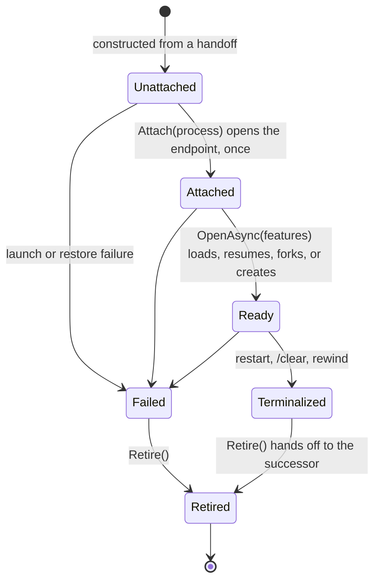

# ACP conversations

`AcpAgentSession` is the public face of one native ACP session: it owns the agent process, the display
journal, the set of conversations, and the routing of user input. Every conversation on that process —
the primary and each `/btw` side — is an `AcpConversation`: one owned incarnation that reaches the process
only through its own endpoint and its owner only through its own port.

## Slot and incarnation

The model mirrors the [session message bus](session-message-bus.md). The persisted continuation
(`AcpConversationState`: provider session, turn number, guidance, plan turns) is the slot. An
`AcpConversation` is one incarnation of that slot. Restart, `/clear`, Rewind and reconnecting after a
failure retire the incarnation and construct a successor from a handoff — the same, an empty, or a rewound
continuation, plus the submissions still queued and the interaction identities already shown in the pane.
Ownership is the object itself: a conversation's `Live` is a check on its own lifetime, never a comparison
with a shared "current" generation, epoch, or session id.

The primary and sides are one type. `AcpConversationSpec` gives the seed, the opening (`Continue`: load or
resume the seed's session, or create one; `ForkFromOpening`: fork a live parent), and whether the
conversation is side-scoped. The side-only behaviour left inside the conversation is the scope instruction
in its prompts, settling an interrupted opening, and its opening strategy; everything else that differs
lives in its port.

## Four owned channels

1. **Endpoint** — opened by `Attach` and held in a write-once cell. It addresses outgoing operations,
   receives the conversation's notifications and requests, answers requests, reports health, terminates its
   process, and receives that process's protocol faults. A retired endpoint refuses sends and drops late
   traffic; responses to the agent's own requests still go out.
2. **Port** — `AcpConversationPort`, handed in at construction, is the conversation's only event sink and its
   only way to persist, publish, report controls, usage and queue changes, fail the process, or restart it.
   `PrimaryPort` raises the facade events; `SidePort` namespaces side messages and events and completes the
   side. Every port call takes the transition gate and is inert once the port is detached.
3. **Lifetime** — a cancellation source cancelled when the incarnation fails, is terminalized, retires, or is
   disposed. Agent-request tokens and authentication are linked to it, so a dead conversation's in-flight
   work cancels.
4. **Terminals** — one `AcpTerminalManager` per conversation, closed when the incarnation ends; a terminal
   create racing the close fails.

The owner keeps only process-level state: the connection, `initialize` and the advertised
`AcpAgentFeatures`, the attached process generation (to terminate it, attach sides, and route unscoped
traffic), the journal, and the conversation set. Launch failures are the owner's, because an unattached
primary has no endpoint to receive them.

## Locking

The order is transition gate → owner gate → conversation gate. Never take an outer lock while holding an
inner one, and never hold any of them across an await. The transition gate is one reentrant lock per
process owner, shared into every conversation; it serialises transitions, port detachment, and every port
call, so port calls happen with no inner lock held. The owner captures the conversation it acts on at the
synchronous entry point and never re-reads `_primary` after an await.

## Retiring before restarting

The predecessor must be dead before the process restarts; otherwise the connection failing its pending
requests would reach the old continuation and fail the new process:

1. terminalize the primary and suspend the sides;
2. settle the primary's pending approvals, inputs and authentication;
3. `Retire()` the primary and install the successor from its handoff;
4. restart the process, which attaches the successor.

## Replacing without a restart

Because late traffic for a retired incarnation is rejected or dropped by construction, a successor can
attach a new endpoint to the same running process. `/clear`, Rewind and Restart still restart the process;
replacing a conversation on a live process only needs the owner to retire the incarnation and attach its
successor to the current `AcpProcess`.
