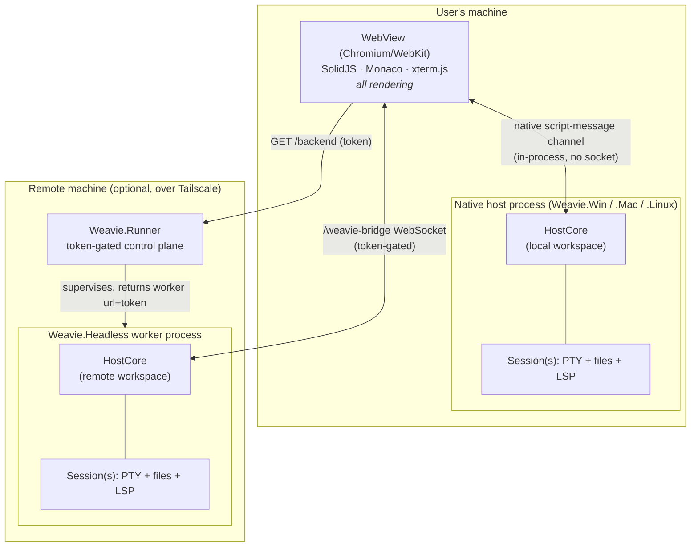
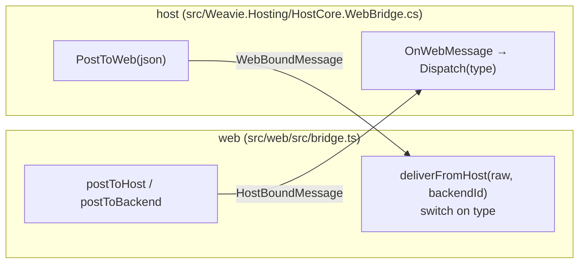
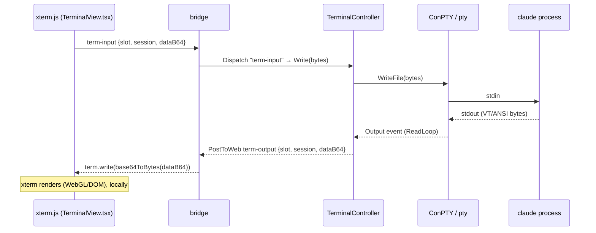
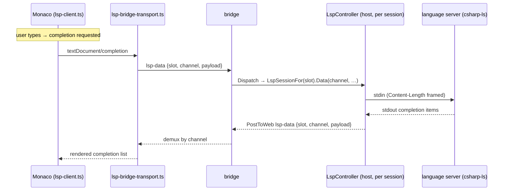
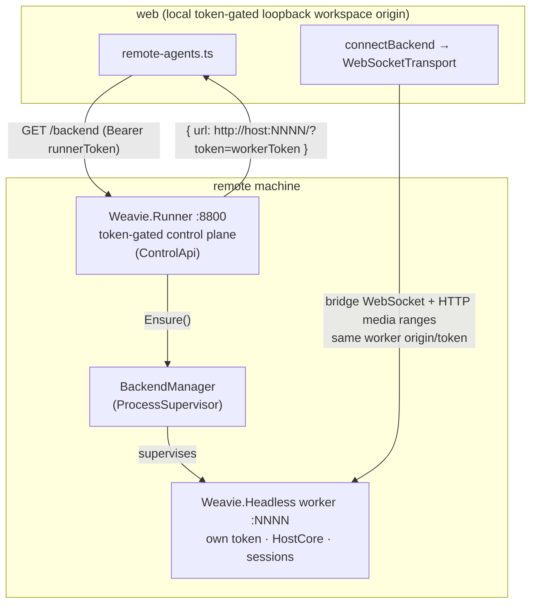

# Architecture overview

A map of how Weavie is put together end to end: the processes and where they run, the one channel
everything rides, what renders where, and the full path of the three flows that matter most — a keystroke
in the Claude TUI, opening a file, and an autocomplete. It closes with how remote runners work and the
transport constraint that TLS termination now closes.

This is the orientation doc. The deeper, per-area specs are linked inline; load those when you need detail.

## The one idea to hold first

**Rendering always happens in the web layer, next to the user. Compute always happens in a host process,
next to the code.** The editor (Monaco), the terminals (xterm.js), and the chrome (SolidJS) all run in a
WebView the user is looking at. Files, PTYs, the embedded `claude`, language servers, and git all live in a
*host* — a `HostCore` that owns a workspace. The two halves never share memory; they exchange small JSON
messages over a single channel called the **bridge**.

Everything else follows from that split. A "remote session" is just the same web layer pointed at a host
that happens to be on another machine. The Claude TUI is "sent over the network" the same way local
terminal output is — as raw PTY bytes, base64-framed, replayed into a local xterm.js. There is no remote
desktop, no pixel streaming, no second renderer.

## Processes and where they run



- **The web layer** (`src/web`, SolidJS) renders everything and is transport-agnostic. It can hold several
  *backends* at once: the local host plus any number of remote ones. One backend is *active* at a time and
  drives the page.
- **A host** is one `HostCore` (`src/Weavie.Hosting`) owning a workspace and its sessions. Every platform
  shell — Win/Mac/Linux native windows, and the Headless worker — is a thin adapter over the same
  `HostCore`; see [host-core-unification](../specs/host-core-unification.md). A host renders nothing.
- **A session** is one worktree's worth of state inside a host: a `claude` PTY, a shell PTY, the editor file
  provider, the LSP servers, the change tracker. Multiple sessions share one host process; see
  [multi-session-and-worktrees](../specs/multi-session-and-worktrees.md).
- **A runner** (`src/Weavie.Runner`) is the remote entry point: a small token-gated HTTP control plane that
  supervises a Headless *worker* (the actual remote host) and tells the web how to reach it. See
  [remote-sessions](../specs/remote-sessions.md) and [headless-host](../specs/headless-host.md).

## The bridge: one channel, one envelope

Every interaction — terminal bytes, file reads, editor opens, commands, session status, LSP config — is a
JSON message over the bridge. The wire is deliberately dumb: **one UTF-8 JSON object per message, with a
`type` field**; there is no envelope at the transport layer. The `{type, ...}` convention is enforced only
by the dispatchers at each end.



Two transports implement the same contract (`BridgeTransport`, `src/web/src/bridge.ts`):

- **Native** (`nativeTransport`) — the local Win/Mac window. Outbound JS→host via
  `window.webkit.messageHandlers` / WebView2 web-messages; inbound host→JS via `window.__weavieReceive`
  (`src/Weavie.Win/Hosting/HostBridge.cs`). In-process, no socket.
- **WebSocket** (`WebSocketTransport`) — a Headless worker. The page connects to `/weavie-bridge`, gated by
  a token, with a buffered outbox and reconnect-with-backoff (`src/Weavie.Headless/WebSocketHostBridge.cs`,
  `src/Weavie.Headless/Program.cs`).

The host contract is just two members — `event MessageReceived` (raw JSON in) and `PostToWeb(string)` (raw
JSON out) — at `src/Weavie.Hosting/IHostBridge.cs`. The same message protocol flows over either transport;
only the pipe differs. **Multiplexing is by convention in the message body**: a `slot` (session id) plus a
`session`/channel id, and request/response correlation by a `token`/`id`. The terminal, the fs provider, and
commands all use this; see the flows below.

## What renders where

All three surfaces live in the WebView and read their state over the bridge:

| Surface | Renderer | Where state comes from |
| --- | --- | --- |
| Editor | **Monaco** (`monaco-editor` + `monaco-languageclient`), `src/web/src/editor/` | host file provider over `fs-*`; LSP over a side channel |
| Terminals | **xterm.js** (`@xterm/xterm` 6.1 beta + fit/webgl addons), `src/web/src/terminal/TerminalView.tsx` | PTY bytes over `term-output` |
| Chrome (rail, title bar, omnibar, menus, file browser) | **SolidJS** components, `src/web/src/chrome/`, `src/web/src/layout/` | session list / status / commands |

The build is Vite, multi-page (`index.html` for the workspace, `welcome.html` for the empty state), output
copied to the host's `wwwroot`. Every workspace HostCore owns the same token-gated Kestrel server
(`src/Weavie.Hosting/Web/WorkspaceHttpServer.cs`): native hosts bind it to an OS-assigned loopback port,
while Headless supplies its configured local/remote binding. It serves the app, injects bootstrap globals,
and streams confined workspace media with HTTP ranges. Native welcome windows may still use their app/WebView
resource scheme because they have no workspace HostCore or file access.

Images and videos do not ride the JSON bridge. Their elements load `/weavie-media` directly with the server
token, exact loaded-session id, and path. The shared route accepts only that session's worktree, the
workspace scratch directory, and that session's pasted-image directory; missing and disallowed paths are both
404. ASP.NET Core owns Range and conditional responses, so video seeking is byte streaming rather than a
full-file base64 message and browser remounts reuse an unchanged URL.

## Flow 1 — a keystroke in the Claude TUI

This is the answer to "how is the Claude Code TUI sent over the network." It is a real PTY. The host spawns
`claude` under a pseudo-console; its raw output bytes are base64-framed onto the bridge and written verbatim
into a local xterm.js. Input goes back the same way. xterm.js does all the VT parsing and rendering, locally.



- The `claude` and `shell` panes are spawned per session by `TerminalController`
  (`src/Weavie.Hosting/TerminalController.cs`) under a `ProcessSupervisor` with `RestartPolicy.Always`
  (see [process-supervisor](../specs/process-supervisor.md)). The OS-specific PTY is an injected
  `IPtyLauncher`; Windows uses hand-rolled **ConPTY** P/Invoke (`src/Weavie.Core/Terminal/WindowsConPtyTerminal.cs`).
  `claude` launches with `ANTHROPIC_API_KEY` stripped (subscription billing, interactive TUI — never `-p`/SDK).
- Output framing is `{"slot":"<sessionId>","type":"term-output","session":"claude|shell","dataB64":"…"}`
  (`TerminalController.cs`, `TermOutputJson`). **Every frame is double-tagged** with `slot` (which session)
  and `session` (which pane). That is what lets every loaded session stream into its own hidden xterm so
  switching sessions is instant — the bytes were already arriving.
- The same `TerminalView` component renders both panes; they differ only by `pane` id and by keyboard
  protocol. The shell pane advertises enhanced input (`win32InputMode` + `kittyKeyboard`); the claude pane is
  left legacy and gets `Shift+Enter` synthesized as `CSI 13;2u` via a custom key handler (see
  [terminal-host-actions](../specs/terminal-host-actions.md) for the surrounding OSC copy/paste/title/cwd
  handling).

The crucial point for the remote story: in a remote session the **only** thing that changed is which host
the bridge talks to. The PTY runs on the remote worker; its bytes cross the WebSocket instead of the
in-process channel; xterm.js renders them identically on the user's machine.

## Flow 2 — opening a file in the editor

The editor's buffers are real VSCode working copies behind a **host-backed `file://` provider**. Monaco
never touches the disk; it asks the host for bytes over `fs-*` messages. See
[editor-session](../specs/editor-session.md) and [editor-tabs](../specs/editor-tabs.md).

```mermaid
sequenceDiagram
    participant H as host (FileOpener)
    participant B as bridge
    participant EC as editor-controller.ts
    participant EH as editor-host.ts (working copy)
    participant FP as HostFileProvider
    participant FS as session FileProvider (disk)

    H-->>B: open-file {path, line}
    B-->>EC: case "open-file" → openFile()
    EC->>EH: showFile → ensureRef(uri)
    EH->>FP: createModelReference resolves → readFile(uri)
    FP->>B: fs-read {id, path}
    B->>FS: Dispatch "fs-read" → Read(path)
    FS-->>B: fs-read-result {id, bytes}
    B-->>FP: resolve bytes
    FP-->>EH: contents → editor.setModel(workingCopy)
    Note over EH: reveal line; later edits debounce-flush via fs-write
```

- The host pushes `open-file` (from a terminal `path:line` link, an MCP `reveal-file`, or active-editor
  context) carrying path/line; `FileOpener` reads through the validated `FileProviderService.ReadIfAllowed`
  (`src/Weavie.Hosting/FileOpener.cs`).
- The provider (`src/web/src/editor/host-file-provider.ts`) services Monaco's `stat`/`readFile`/`writeFile`
  as correlated `fs-stat`/`fs-read`/`fs-write` requests (each carries an `id` the host echoes).
- **`fs-*` is routed by path to the owning session's worktree, not the active session**
  (`HostCore.WebBridge.cs`) — this is what keeps the editor correct across multiple sessions; see
  [session-isolation-invariants](../specs/session-isolation-invariants.md).
- Saving is a debounced flush of the working copy to disk. Claude reads disk, so the editor is the sole
  writer; there is no Monaco autosave.

## Flow 3 — an autocomplete (LSP)

Autocomplete, hover, diagnostics, go-to-definition all ride the **Language Server Protocol**. A language
server (e.g. `csharp-ls`, `gopls`, `tsgo`) is a separate process the *host* spawns, rooted at the workspace.
The web runs a `monaco-languageclient` per language and speaks LSP JSON-RPC to it.

That JSON-RPC **rides the bridge** — the same `(slot, channel)` multiplexing the terminal uses — so LSP has no
socket of its own and inherits whatever transport the backend has. This is what lets it reach remote sessions:



- The host side is `LspController` (`src/Weavie.Hosting/LspController.cs`): one per session, it spawns a language
  server per page-minted channel (`LspChannel` under a `ProcessSupervisor`) and routes JSON-RPC both ways. The
  process is spawned through an injected `ILspServerLauncher` (`src/Weavie.Core/Lsp/`), with `LspFraming` on the
  server's stdio.
- The web learns the session's slot + worktree root + server catalog from an `lsp-config` message /
  `window.__WEAVIE_LSP__` bootstrap, then opens one bridge channel per language
  (`src/web/src/lsp/lsp-bridge-transport.ts`, `lsp-client.ts`). No URL, no port, no per-session token. See
  [lsp-over-bridge](../specs/lsp-over-bridge.md) and [theming-and-lsp](../specs/theming-and-lsp.md).

This is what makes the remote story uniform: like the terminal, the **only** thing that changes in a remote
session is which host the bridge talks to.

## How remote runners work

A remote machine runs **two** processes: the **runner** (control plane) and the **worker** (the real host).



1. The user registers a `RemoteAgent { url, token }` — the runner's base URL plus its token. The host
   persists these in `~/.weavie/remote-agents.json`; the web owns the live connections
   (`src/web/src/chrome/remote-agents.ts`).
2. The web calls `GET /backend` on the runner with the runner token (`ControlApi.cs`). The runner ensures a
   worker is up — `BackendManager.Ensure()` allocates a free port, mints a fresh worker token, and starts a
   supervised `Weavie.Headless` worker (`BackendManager.cs`, `WorkspaceBackend.cs`). One worker hosts every
   worktree session via its shared `HostCore` — no process per session.
3. The runner returns the worker's page URL, `http://<host>:<port>/?token=<workerToken>`, built against the
   request's own host so it is reachable by the same path the client used.
4. The web converts that page URL to a backend descriptor (bridge WebSocket plus HTTP media base, both carrying
   the token) and calls `connectBackend`, opening a `WebSocketTransport` to `…/weavie-bridge`. From there it is just another
   backend: terminals, files, status — all the flows above — over that socket. The transport re-runs this
   `GET /backend` handshake on **every** reconnect, so when the runner is restarted — which mints a fresh
   worker port+token — the socket follows it to the new worker instead of retrying the now-dead URL forever.

Transport security: the runner terminates TLS in front of its loopback endpoints (`--tls tailscale` runs
`tailscale serve` with the node's trusted cert; `--tls proxy` for a bring-your-own terminator), so the app
reaches a remote backend as `wss://`; an exposed bind without TLS fails closed. The control plane is token-gated
default-deny. See [remote-sessions](../specs/remote-sessions.md) and [tls-on-the-runner](../specs/tls-on-the-runner.md).

## LSP and the bridge's transport constraint

LSP used to have its **own** reachability bug. The web ended up with two URLs for a remote backend: the bridge
was origin-relative (`pageUrlToBridgeWs` → `ws://<remote-host>:<port>/weavie-bridge`, pointing at the remote ✅),
but LSP was a literal `ws://127.0.0.1:{lspPort}` baked into the config — the *browser's own* loopback, where
nothing was listening ❌. So a remote session silently aimed language intelligence at the wrong machine.

Folding LSP into the bridge removed that: there is no LSP socket left to mis-address. What remains is the
bridge's single constraint, now shared by every control-plane capability — the **mixed-content** problem. A
browser on an HTTPS origin will only open an insecure socket to **loopback**
(treated as trustworthy) or a **TLS** origin. A plain `ws://<remote>` is neither, so it is blocked. This is
solved by terminating TLS in front of the one loopback bridge — `--tls tailscale` runs `tailscale serve` (the
node's trusted `*.ts.net` cert, zero client install), or `--tls proxy` for any reverse proxy. See
[tls-on-the-runner](../specs/tls-on-the-runner.md).

Because LSP now rides the one bridge socket, there is exactly **one authenticated HTTP origin** per backend to
secure and proxy — not a second per-session LSP port. Solve the bridge's reachability once and language
intelligence comes along for free: the web already derives `wss://` from an `https://` page, so when the bridge
upgrades, LSP rides it with no LSP-side change. See [lsp-over-bridge](../specs/lsp-over-bridge.md).

## Where to go next

- The split and how to add host features once for all four shells → [host-core-unification](../specs/host-core-unification.md)
- Gating/recording Claude's tools → [hook-bridge](hook-bridge.md), [permission-modes-and-change-tracking](../specs/permission-modes-and-change-tracking.md)
- Capabilities Weavie exposes back to Claude (settings, commands) → [mcp-registry](mcp-registry.md), [commands](../specs/commands.md)
- Multiple sessions / worktrees / remote → [multi-session-and-worktrees](../specs/multi-session-and-worktrees.md), [remote-sessions](../specs/remote-sessions.md)
- Editor internals → [editor-session](../specs/editor-session.md), [editor-tabs](../specs/editor-tabs.md)
- LSP over the bridge → [lsp-over-bridge](../specs/lsp-over-bridge.md); LSP + theming → [theming-and-lsp](../specs/theming-and-lsp.md)
