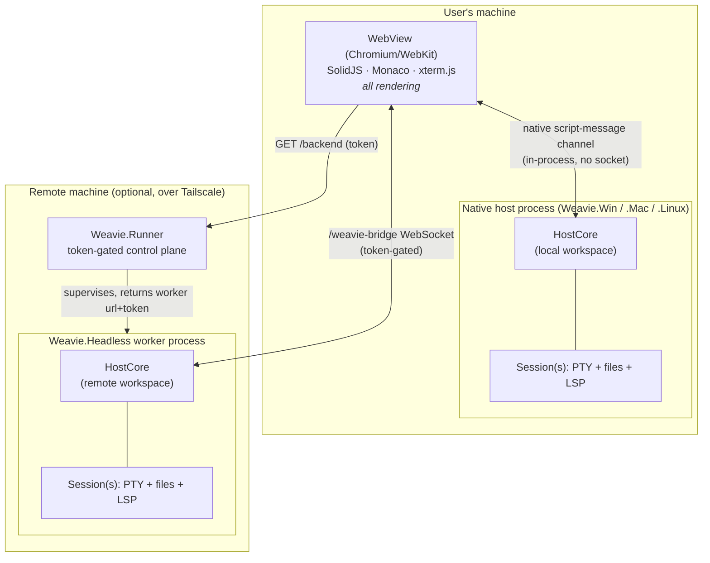
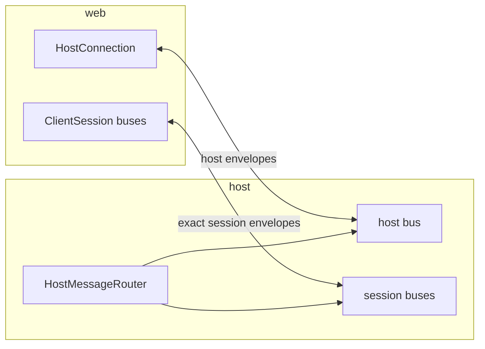
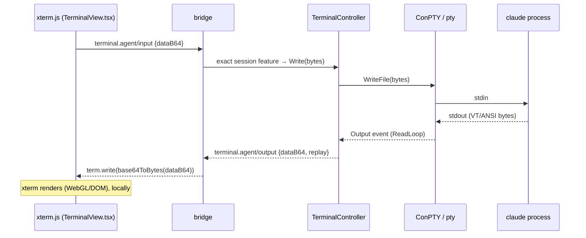
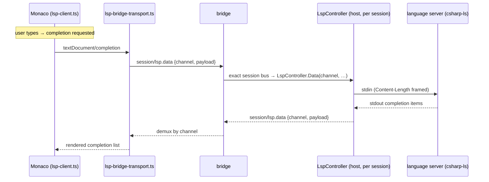
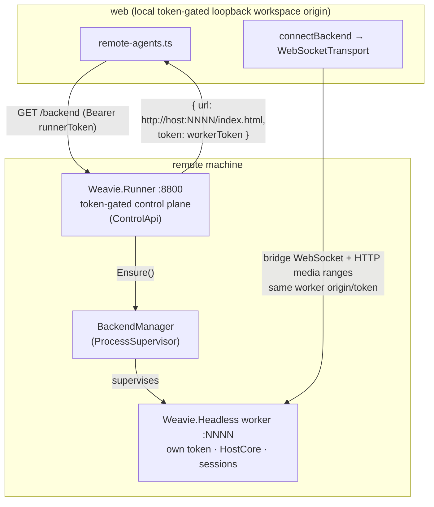

# Architecture overview

A map of how Weavie is put together end to end: the processes and where they run, the one channel
everything rides, what renders where, and the full path of the three flows that matter most — a keystroke
in the Claude TUI, opening a file, and an autocomplete. It closes with how remote runners work and the
transport constraint that TLS termination now closes.

This is the orientation doc. The deeper, per-area specs are linked inline; load those when you need detail.

## The one idea to hold first

**Rendering always happens in the web layer, next to the user. Compute always happens in a host process,
next to the code.** The editor (Monaco), the terminals (xterm.js), and the chrome (SolidJS) all run in a
WebView the user is looking at. Files, PTYs, the embedded `claude`, language servers, and git all live in a
*host* — a `HostCore` that owns a workspace. The two halves never share memory; they exchange small JSON
messages over a single channel called the **bridge**.

Everything else follows from that split. A "remote session" is just the same web layer pointed at a host
that happens to be on another machine. The Claude TUI is "sent over the network" the same way local
terminal output is — as raw PTY bytes, base64-framed, replayed into a local xterm.js. There is no remote
desktop, no pixel streaming, no second renderer.

## Processes and where they run


```mermaid
graph TB
    subgraph user["User's machine"]
        WV["WebView (Chromium/WebKit)<br/>SolidJS · Monaco · xterm.js<br/><i>all rendering</i>"]
        subgraph hostproc["Native host process (Weavie.Win / .Mac / .Linux)"]
            HC1["HostCore<br/>(local workspace)"]
            S1["Session(s): PTY + files + LSP"]
        end
    end

    subgraph remote["Remote machine (optional, over Tailscale)"]
        RUN["Weavie.Runner<br/>token-gated control plane"]
        subgraph worker["Weavie.Headless worker process"]
            HC2["HostCore<br/>(remote workspace)"]
            S2["Session(s): PTY + files + LSP"]
        end
    end

    WV <-->|"native script-message channel<br/>(in-process, no socket)"| HC1
    WV <-->|"/weavie-bridge WebSocket<br/>(token-gated)"| HC2
    WV -->|"GET /backend (token)"| RUN
    RUN -->|"supervises, returns worker url+token"| worker
    HC1 --- S1
    HC2 --- S2
```

- **The web layer** (`src/web`, SolidJS) renders everything and is transport-agnostic. It keeps one
  `HostConnection` per local or remote host and one `ClientSession` per live session. All remain active;
  client-only selection chooses which owner the shared presentation renders.
- **A host** is one `HostCore` (`src/Weavie.Hosting`) owning a workspace and its sessions. Every platform
  shell — Win/Mac/Linux native windows, and the Headless worker — is a thin adapter over the same
  `HostCore`; see [host-core-unification](../specs/host-core-unification.md). A host renders nothing.
- **A session** is one worktree's worth of state inside a host: a `claude` PTY, a shell PTY, the editor file
  provider, the LSP servers, the change tracker. Multiple sessions share one host process; see
  [multi-session-and-worktrees](../specs/multi-session-and-worktrees.md).
- **A runner** (`src/Weavie.Runner`) is the remote entry point: its root remembers browser authentication and
  opens the app, while its Bearer-gated control API tells native clients how to reach the supervised Headless
  *worker* (the actual remote host). See
  [remote-sessions](../specs/remote-sessions.md) and [headless-host](../specs/headless-host.md).

## The bridge: one channel, one envelope

Every interaction — terminal bytes, file reads, editor opens, commands, session status, LSP config — is one
standard JSON envelope over the bridge:

```text
{scope, session, kind, requestId, feature, name, payload, error}
```

`scope` is `host` or `session`. A session envelope carries the exact `(slot, incarnation)`; payloads never
duplicate routing identity. `kind` is `event`, `request`, `response`, or `cancel`.


```mermaid
graph LR
    subgraph web["web"]
        HC["HostConnection"]
        CS["ClientSession buses"]
    end
    subgraph host["host"]
        R["HostMessageRouter"]
        HB["host bus"]
        SB["session buses"]
    end
    HC <-->|"host envelopes"| HB
    CS <-->|"exact session envelopes"| SB
    R --> HB & SB
```

Two transports carry the same envelopes (`BridgeTransport`, `src/web/src/bridge.ts`):

- **Native** (`nativeTransport`) — the local Win/Mac window. Outbound JS→host via
  `window.webkit.messageHandlers` / WebView2 web-messages; inbound host→JS via `window.__weavieReceive`
  (`src/Weavie.Win/Hosting/HostBridge.cs`). In-process, no socket.
- **WebSocket** (`WebSocketTransport`) — a Headless worker. The page connects to `/weavie-bridge`, gated by
  a token, with a buffered outbox and reconnect-with-backoff (`src/Weavie.Headless/WebSocketHostBridge.cs`,
  `src/Weavie.Headless/Program.cs`).

The host transport contract is `IWebTransportHub`: inbound raw JSON with an opaque physical `WebPeer`,
broadcast events, and unicast sends. `HostMessageRouter` parses and validates envelopes, routes host scope to
one host bus, and routes session scope to the exact session endpoint. Requests and cancellations use the
bus's common correlation; features do not implement token maps. See
[session-owned message bus](session-message-bus.md).

## What renders where

All three surfaces live in the WebView and read their state over the bridge:

| Surface | Renderer | Where state comes from |
| --- | --- | --- |
| Editor | **Monaco** (`monaco-editor` + `monaco-languageclient`), `src/web/src/editor/` | owning session's `files`, `editor`, `review`, and `lsp` features |
| Terminals | **xterm.js** (`@xterm/xterm` 6.1 beta + fit/webgl addons), `src/web/src/terminal/TerminalView.tsx` | owning session's `terminal.agent` / `terminal.shell` features |
| Chrome (rail, title bar, omnibar, menus, file browser) | **SolidJS** components, `src/web/src/chrome/`, `src/web/src/layout/` | host catalog plus session-owned status |

The build is Vite, multi-page (`index.html` for the workspace, `welcome.html` for the empty state), output
copied to the host's `wwwroot`. Every workspace HostCore owns the same token-gated Kestrel server
(`src/Weavie.Hosting/Web/WorkspaceHttpServer.cs`): native hosts bind it to an OS-assigned loopback port,
while Headless supplies its configured local/remote binding. It serves the app, injects bootstrap globals,
and streams workspace media with HTTP ranges. Native welcome windows may still use their app/WebView
resource scheme because they have no workspace HostCore or file access.

Images and videos do not ride the JSON bridge. Their elements load `/weavie-media` directly with the server
token, exact loaded-session id, and path. The shared route accepts only that session's worktree, the
workspace scratch directory, and that session's pasted-image directory; missing and disallowed paths are both
404. ASP.NET Core owns Range and conditional responses, so video seeking is byte streaming rather than a
full-file base64 message and browser remounts reuse an unchanged URL.

## Flow 1 — a keystroke in the Claude TUI

This is the answer to "how is the Claude Code TUI sent over the network." It is a real PTY. The host spawns
`claude` under a pseudo-console; its raw output bytes are base64-framed onto the bridge and written verbatim
into a local xterm.js. Input goes back the same way. xterm.js does all the VT parsing and rendering, locally.


```mermaid
sequenceDiagram
    participant X as xterm.js (TerminalView.tsx)
    participant B as bridge
    participant TC as TerminalController
    participant PTY as ConPTY / pty
    participant CL as claude process

    X->>B: terminal.agent/input {dataB64}
    B->>TC: exact session feature → Write(bytes)
    TC->>PTY: WriteFile(bytes)
    PTY->>CL: stdin
    CL-->>PTY: stdout (VT/ANSI bytes)
    PTY-->>TC: Output event (ReadLoop)
    TC-->>B: terminal.agent/output {dataB64, replay}
    B-->>X: term.write(base64ToBytes(dataB64))
    Note over X: xterm renders (WebGL/DOM), locally
```

- The `claude` and `shell` panes are spawned per session by `TerminalController`
  (`src/Weavie.Hosting/TerminalController.cs`) under a `ProcessSupervisor` with `RestartPolicy.Always`
  (see [process-supervisor](../specs/process-supervisor.md)). The OS-specific PTY is an injected
  `IPtyLauncher`; Windows uses hand-rolled **ConPTY** P/Invoke (`src/Weavie.Core/Terminal/WindowsConPtyTerminal.cs`).
  `claude` launches with its normal authentication environment (configured API key or stored OAuth) using the
  interactive TUI rather than `-p`/SDK.
- Pane identity is the feature (`terminal.agent` or `terminal.shell`); session identity is the envelope
  address. `TerminalController` receives an already-owned feature channel, so it cannot publish into another
  pane or session. Every loaded session streams into its own retained xterm state, making selection a
  show/present operation rather than a replay or reroute.
- The same `TerminalView` component renders both panes; they differ only by `pane` id and by keyboard
  protocol. The shell pane advertises enhanced input (`win32InputMode` + `kittyKeyboard`); the claude pane is
  left legacy and gets `Shift+Enter` synthesized as `CSI 13;2u` via a custom key handler (see
  [terminal-host-actions](../specs/terminal-host-actions.md) for the surrounding OSC copy/paste/title/cwd
  handling).

The crucial point for the remote story: in a remote session the **only** thing that changed is which host
the bridge talks to. The PTY runs on the remote worker; its bytes cross the WebSocket instead of the
in-process channel; xterm.js renders them identically on the user's machine.

## Flow 2 — opening a file in the editor

The editor's buffers are real VSCode working copies behind a **host-backed file provider**. Monaco
never touches the disk; it asks the owning session for bytes over its message bus. See
[editor-session](../specs/editor-session.md) and [editor-tabs](../specs/editor-tabs.md).

```mermaid
sequenceDiagram
    participant H as host (FileOpener)
    participant B as bridge
    participant EC as editor-controller.ts
    participant EH as editor-host.ts (working copy)
    participant FP as HostFileProvider
    participant FS as session FileProvider (disk)

    H-->>B: session/editor.openFile {path, line}
    B-->>EC: owner ClientSession → openFile()
    EC->>EH: showFile → ensureRef(uri)
    EH->>FP: createModelReference resolves → readFile(uri)
    FP->>B: session/files.read request {path}
    B->>FS: owning bus → Read(path)
    FS-->>B: correlated response {content, stat}
    B-->>FP: resolve bytes
    FP-->>EH: contents → editor.setModel(workingCopy)
    Note over EH: reveal line; later edits debounce-flush via files.write
```

- The host publishes `editor.openFile` on the owning session (from a terminal `path:line` link, an MCP
  reveal, or editor
  context) carrying path/line; `FileOpener` gates the open on existence via `FileProviderService.CanRead`
  (`src/Weavie.Hosting/FileOpener.cs`).
- The provider (`src/web/src/editor/host-file-provider.ts`) services Monaco's `stat`/`readFile`/`writeFile`
  as correlated `files.stat`/`files.read`/`files.write` requests on the model owner's `ClientSession`.
- The bus address, not a path heuristic or selected-session lookup, chooses the worktree. See
  [session-owned message bus](session-message-bus.md).
- Saving is a debounced flush of the working copy to disk. Claude reads disk, so the editor is the sole
  writer; there is no Monaco autosave.

## Flow 3 — an autocomplete (LSP)

Autocomplete, hover, diagnostics, go-to-definition all ride the **Language Server Protocol**. A language
server (e.g. `csharp-ls`, `gopls`, `tsgo`) is a separate process the *host* spawns, rooted at the workspace.
The web runs a `monaco-languageclient` per language and speaks LSP JSON-RPC to it.

That JSON-RPC **rides the owning session bus**, with `channel` multiplexing language clients inside the
session. LSP has no socket of its own and inherits whatever transport the host has:


```mermaid
sequenceDiagram
    participant M as Monaco (lsp-client.ts)
    participant T as lsp-bridge-transport.ts
    participant B as bridge
    participant LC as LspController (host, per session)
    participant LS as language server (csharp-ls)

    Note over M: user types → completion requested
    M->>T: textDocument/completion
    T->>B: session/lsp.data {channel, payload}
    B->>LC: exact session bus → LspController.Data(channel, …)
    LC->>LS: stdin (Content-Length framed)
    LS-->>LC: stdout completion items
    LC-->>B: session/lsp.data {channel, payload}
    B-->>T: demux by channel
    T-->>M: rendered completion list
```

- The host side is `LspController` (`src/Weavie.Hosting/LspController.cs`): one per session, it spawns a language
  server per page-minted channel (`LspChannel` under a `ProcessSupervisor`) and routes JSON-RPC both ways. The
  process is spawned through an injected `ILspServerLauncher` (`src/Weavie.Core/Lsp/`), with `LspFraming` on the
  server's stdio.
- The web learns each session's worktree root and server catalog from `lsp.config` during
  `lifecycle.sync`, then opens one bus channel per language
  (`src/web/src/lsp/lsp-bridge-transport.ts`, `lsp-client.ts`). No URL, no port, no per-session token. See
  [lsp-over-bridge](../specs/lsp-over-bridge.md) and [theming-and-lsp](../specs/theming-and-lsp.md).

This is what makes the remote story uniform: like the terminal, the **only** thing that changes in a remote
session is which host the bridge talks to.

## How remote runners work

A remote machine runs **two** processes: the **runner** (control plane) and the **worker** (the real host).


```mermaid
graph TB
    subgraph web["web (local token-gated loopback workspace origin)"]
        RA["remote-agents.ts"]
        BK["connectBackend → WebSocketTransport"]
    end
    subgraph remote["remote machine"]
        RUN["Weavie.Runner :8800<br/>token-gated control plane<br/>(ControlApi)"]
        BM["BackendManager<br/>(ProcessSupervisor)"]
        WK["Weavie.Headless worker :NNNN<br/>own token · HostCore · sessions"]
    end

    RA -->|"GET /backend (Bearer runnerToken)"| RUN
    RUN -->|"Ensure()"| BM
    BM -->|"supervises"| WK
    RUN -->|"{ url: http://host:NNNN/index.html,<br/>token: workerToken }"| RA
    BK -->|"bridge WebSocket + HTTP media ranges<br/>same worker origin/token"| WK
```

1. The user registers a `RemoteAgent { url, token }` — the runner's base URL plus its token. The host
   persists these in `~/.weavie/remote-agents.json`; the web owns the live connections
   (`src/web/src/chrome/remote-agents.ts`).
2. The web calls `GET /backend` on the runner with an explicit Bearer runner token (`ControlApi.cs`). The runner
   ensures a worker is up — `BackendManager.Ensure()` allocates a port, derives a stable role-separated worker
   token from the runner credential and workspace identity, and starts a supervised `Weavie.Headless` worker
   (`BackendManager.cs`, `WorkspaceBackend.cs`). One worker hosts every worktree session via its shared `HostCore`
   — no process per session.
3. The runner returns the worker's clean page URL and transport token as separate fields, built against the
   request's own host so it is reachable by the same path the client used.
4. The web converts that endpoint pair to a backend descriptor (bridge WebSocket plus HTTP media base, both
   carrying the token) and calls `connectBackend`, opening a `WebSocketTransport` to `…/weavie-bridge`. From there it is just another
   backend: terminals, files, status — all the flows above — over that socket. The transport re-runs this
   `GET /backend` handshake on **every** reconnect, so when the runner is restarted the socket follows any new
   worker port instead of retrying the now-dead URL forever. The worker token remains stable while the configured
   runner token and workspace identity remain the same.

Transport security: the runner terminates TLS in front of its loopback endpoints (`--tls tailscale` runs
`tailscale serve` with the node's trusted cert; `--tls proxy` for a bring-your-own terminator), so the app
reaches a remote backend as `wss://`; an exposed bind without TLS fails closed. The control plane is token-gated
default-deny. See [remote-sessions](../specs/remote-sessions.md) and [tls-on-the-runner](../specs/tls-on-the-runner.md).

## LSP and the bridge's transport constraint

LSP used to have its **own** reachability bug. The web ended up with two URLs for a remote backend: the bridge
was origin-relative (`pageUrlToBridgeWs` → `ws://<remote-host>:<port>/weavie-bridge`, pointing at the remote ✅),
but LSP was a literal `ws://127.0.0.1:{lspPort}` baked into the config — the *browser's own* loopback, where
nothing was listening ❌. So a remote session silently aimed language intelligence at the wrong machine.

Folding LSP into the bridge removed that: there is no LSP socket left to mis-address. What remains is the
bridge's single constraint, now shared by every control-plane capability — the **mixed-content** problem. A
browser on an HTTPS origin will only open an insecure socket to **loopback**
(treated as trustworthy) or a **TLS** origin. A plain `ws://<remote>` is neither, so it is blocked. This is
solved by terminating TLS in front of the one loopback bridge — `--tls tailscale` runs `tailscale serve` (the
node's trusted `*.ts.net` cert, zero client install), or `--tls proxy` for any reverse proxy. See
[tls-on-the-runner](../specs/tls-on-the-runner.md).

Because LSP now rides the one bridge socket, there is exactly **one authenticated HTTP origin** per backend to
secure and proxy — not a second per-session LSP port. Solve the bridge's reachability once and language
intelligence comes along for free: the web already derives `wss://` from an `https://` page, so when the bridge
upgrades, LSP rides it with no LSP-side change. See [lsp-over-bridge](../specs/lsp-over-bridge.md).

## Where to go next

- The split and how to add host features once for all four shells → [host-core-unification](../specs/host-core-unification.md)
- Gating/recording Claude's tools → [hook-bridge](hook-bridge.md), [permission-modes-and-change-tracking](../specs/permission-modes-and-change-tracking.md)
- Capabilities Weavie exposes back to Claude (settings, commands) → [mcp-registry](mcp-registry.md), [commands](../specs/commands.md)
- Multiple sessions / worktrees / remote → [multi-session-and-worktrees](../specs/multi-session-and-worktrees.md), [remote-sessions](../specs/remote-sessions.md)
- Editor internals → [editor-session](../specs/editor-session.md), [editor-tabs](../specs/editor-tabs.md)
- LSP over the bridge → [lsp-over-bridge](../specs/lsp-over-bridge.md); LSP + theming → [theming-and-lsp](../specs/theming-and-lsp.md)
