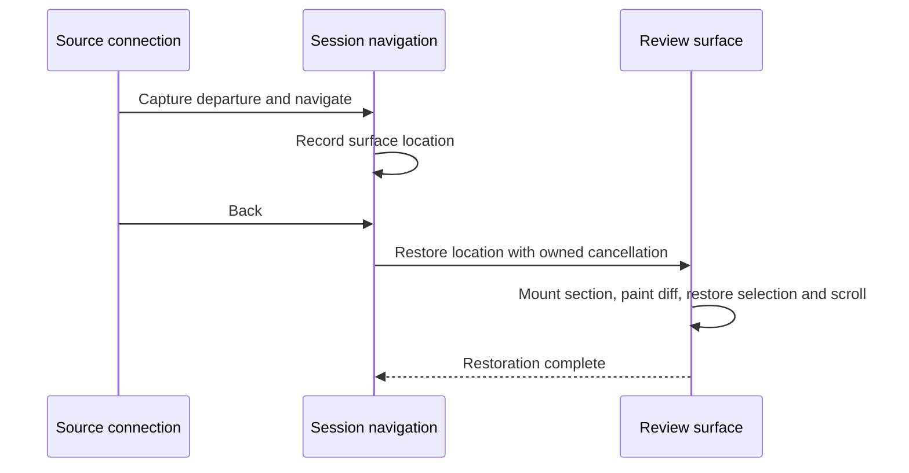

# Owned editor surfaces

Every open tab owns its lifetime, mounted content, and saved reading position. File editors and
unified-review sections share text behavior through exact session/model connections.
The main Monaco widget is a renderer that can be rebound; it is never an owner or a routing address.
This follows the [session message bus](session-message-bus.md) ownership contract.

## Ownership

`OwnedEditorSession` owns `TabOwner` instances keyed by the existing entry kind and resource path.
Closing a tab aborts its ownership; reopening the same resource creates a new owner. `TabContent`
selects the renderer and mounts it through that owner. Previously activated web tabs retain their
browsing contexts while hidden; restored inactive URLs remain dormant. There is one activation path
for every kind, with no separate review or web presentation registry.

`editor-context.ts` registers each mounted text editor's tab, session, model, capabilities, and
binding lifetime. A model swap disposes the previous connection, even when the widget is reused.
Virtualized review sections unregister only their own connections. A preview exposes no text target.

`editor-contributions.ts` attaches selection reporting, status, selection search, symbols, spelling,
blame, revision decorations, and Alt-click peek to these connections. Saving remains working-copy
owned. Proposal models support text commands but are not durable navigation destinations; their
lifecycle belongs to the pending proposal. Deleted review snapshots support selection and navigation,
while working-copy operations remain restricted to actual files.

## Commands

Keyboard dispatch captures the command connection before entering an execution lane. Menus and the
omnibar capture their connections when opening, before moving focus into chrome. An incoming view
command captures from its exact session endpoint. Session-scoped Core commands also retain that
session when invoked from captured chrome.

Editor commands retain the original model and selection. An expired binding or detached view reports
that it is unavailable; it cannot substitute another editor. Durable requests already submitted to a
session, such as revision work, remain addressed to that session after its view changes.

Context menus originate from each connection's Monaco event. Menu state carries its captured command
runner through dismissal and asynchronous spelling suggestions; rendering never resolves another editor.
Revise's pending editor confirmation cancels when its selected view detaches.

## Navigation

`editor-navigation.ts` owns per-session history and restoration lifetimes. A history location contains
an existing tab descriptor and its captured view state. The renderer owns that state's shape: Monaco
state for a file, or a section location and outer scroll anchor for Review. The same file in a normal
file tab and in Review therefore has two distinct destinations without a special navigation union.

Monaco definition/reference opens enter through `ICodeEditorService`'s source-carrying handler. The
source's registered connection supplies the departure; the destination URI must belong to the same
session. The adapter awaits the destination before returning its editor.

History suppresses recording during traversal and symbol previews. Restoration completes after the
review section is mounted and its diff is painted. Session detachment, a superseding navigation, or
tab disposal cancels the pending presentation work. A missing saved review section produces a
notice and leaves the user in the coherent Review tab. Session restoration preserves pane focus.

The regression suite covers exact Back/Forward restoration, same-file definitions, palette and symbol
navigation, search previews, and late definition replies after session switches. Unit tests pin
connection disposal, shared-widget rebinding, captured command scopes, and history failure semantics.
