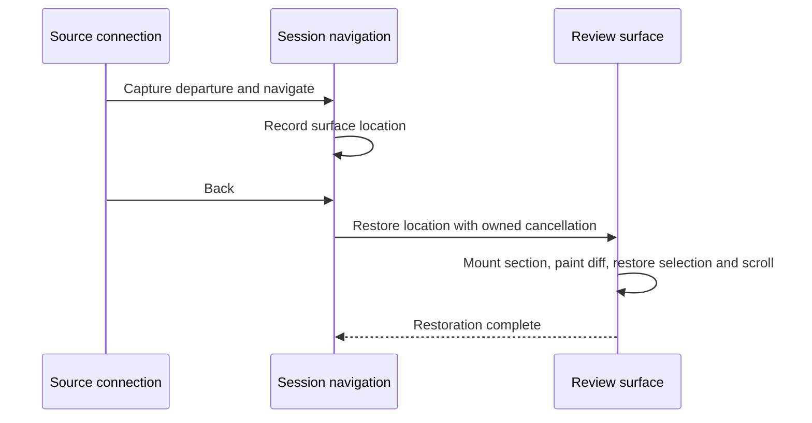

# Owned editor surfaces

File editors and unified-review sections share text behavior through exact session/model connections.
The main Monaco widget is a renderer that can be rebound; it is never an owner or a routing address.
This follows the [session message bus](session-message-bus.md) ownership contract.

## Ownership

`editor-context.ts` registers one owner for each `ClientSession`. Its presentation is read from the
authoritative review board. Each mounted text editor registers its session, model, capabilities,
and binding lifetime. A model swap disposes the previous connection, even when the widget is reused.
Virtualized review sections unregister only their own connections.

`editor-contributions.ts` attaches selection reporting, status, selection search, symbols, spelling,
blame, revision decorations, and Alt-click peek to these connections. Saving remains working-copy
owned. Proposal models support text commands but are not durable navigation destinations; their
lifecycle belongs to the pending proposal. Deleted review snapshots support selection and navigation,
while working-copy operations remain restricted to actual files.

## Commands

Keyboard dispatch captures the command connection before entering an execution lane. Menus and the
omnibar capture their connections when opening, before moving focus into chrome. An incoming view
command captures from its exact session endpoint. Session-scoped Core commands also retain that
session when invoked from captured chrome.

Editor commands retain the original model and selection. An expired binding or detached view reports
that it is unavailable; it cannot substitute another editor. Durable requests already submitted to a
session, such as revision work, remain addressed to that session after its view changes.

## Navigation

`editor-navigation.ts` owns per-session history and restoration lifetimes. A history location contains
the presentation kind, path, reading line, Monaco view state, and, for review, an anchor relative to
the outer scroller. The same file in file and review presentation is two distinct destinations.

Monaco definition/reference opens enter through `ICodeEditorService`'s source-carrying handler. The
source's registered connection supplies the departure; the destination URI must belong to the same
session. The adapter awaits the destination before returning its editor.

History suppresses recording during traversal and symbol previews. Restoration completes after the
review section is mounted and its diff is painted. Session detachment, a superseding navigation, or
surface disposal cancels the pending presentation work. Missing review destinations produce a
visible failure instead of opening an unrelated file editor.

The regression suite covers exact Back/Forward restoration, same-file definitions, palette and symbol
navigation, search previews, and late definition replies after session switches. Unit tests pin
connection disposal, shared-widget rebinding, captured command scopes, and history failure semantics.
