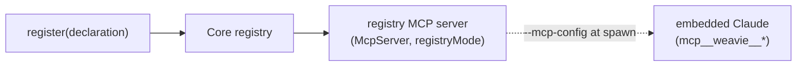

# Claude-facing capability registry

Weavie embeds the real Claude Code CLI and exposes its own capabilities to that embedded Claude as
MCP tools — so the user can drive Weavie by *talking to Claude* rather than hunting through menus or
memorizing a config file's shape.

## Two MCP servers, on purpose

Both are `Weavie.Core/Mcp/McpServer.cs` (loopback WebSocket, JSON-RPC, one shared per-session token),
but they reach Claude two different ways — and only one is model-facing:

- **IDE server** — discovered via the `~/.claude/ide/<port>.lock` file. Carries the *harness RPC*
  tools (openDiff/openFile/getDiagnostics/…). **Claude Code filters the IDE tool list down to a fixed
  allowlist before it reaches the model** (essentially just `getDiagnostics`/`executeCode`), so custom
  tools added here are invisible to the model. This server is for the CLI's own UI, not for
  user-facing capabilities.
- **Registry server** *(`registryMode: true`)* — advertised to the spawned `claude` via a generated
  `--mcp-config` file (`~/.weavie/internals/mcp/weavie-<port>.mcp.json`, a `ws://` + Bearer-token
  entry; port-scoped so concurrent instances don't collide). Carries **only the capability tools**,
  which **do** reach the model as `mcp__weavie__*`. This is the channel that makes *"set my weavie
  shell to nushell"* work. The same auth token authorizes both servers (IDE header or `Authorization:
  Bearer`).

The unifying idea: capabilities are **registered** in Core and automatically surfaced to Claude as
MCP tools *on the registry server*. There are two kinds.

- **Settings** *(being built now)* — declared configuration values, each with a type, default,
  human-readable description, aliases, and validation. Surfaced as `listSettings` / `getSetting` /
  `setSetting`, which lets the user say *"set my weavie shell to nushell."* The registry's
  descriptions and aliases are what let Claude map natural language onto the exact setting key.
  Concrete design: [docs/specs/settings.md](../specs/settings.md).
- **Commands** *(implemented: Core + Windows + web; macOS host wiring pending)* — named actions Weavie can perform (e.g. "reopen the
  terminal", "open the diff panel", "split the editor"). Registered the same way and surfaced as
  invokable MCP tools (`listCommands`/`runCommand`), so the user can ask Claude to run them — and the
  same declaration drives keybindings and the omnibar command palette. Design:
  [docs/specs/commands.md](../specs/commands.md).

## The shared pattern

One declaration drives everything downstream: the MCP tool schema, validation, defaults, and the
descriptions/aliases Claude uses for natural-language mapping. Why a registry rather than
hand-written MCP tools per capability:

- **Single source of truth.** A capability is declared once; the MCP surface is generated from the
  registry, so adding a setting or command never means editing the MCP server wiring.
- **Plugin-extensible.** Future plugins contribute declarations the same way, and their
  capabilities appear to Claude automatically.
- **Format-agnostic boundary.** The Claude-facing contract is always JSON (MCP/JSON-RPC),
  regardless of how a capability is stored or implemented internally — e.g. settings persist as
  TOML, but Claude only ever sees JSON.

## Status

- Settings registry + registry MCP server — implemented. Verified end to end: the embedded Claude
  connects to the registry server via `--mcp-config` and calls `mcp__weavie__setSetting` to change the
  shell against the running app (see the settings spec).
- Commands registry — [implemented](../specs/commands.md) (Core + Windows host + web; macOS host wiring
  pending). Registers onto the same registry server (`listCommands`/`runCommand`); the one declaration also
  drives keybindings (`~/.weavie/keybindings.json`) + the omnibar command palette.
