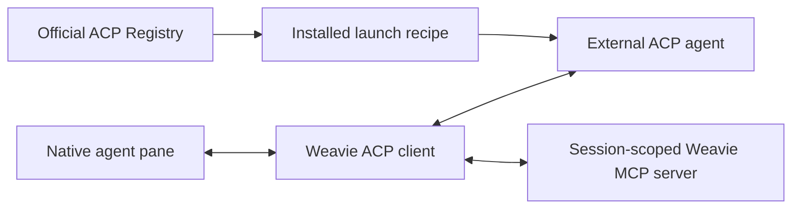

# Native ACP agents

Weavie's native agent surface is one provider-neutral ACP client. Agents installed from the official ACP Registry
and user-defined ACP commands join the same provider catalog and use the same pane, controls, session persistence,
IDE context, MCP bridge, and status machine. The existing Claude terminal UI remains the separate `claude` provider.

## Runtime boundary

Weavie does not translate Codex, Claude Code, or another provider's private protocol. An ACP agent owns that
integration. This keeps provider churn outside Weavie and makes provider differences explicit through ACP
capabilities rather than provider-specific host branches.

Every ACP child is owned by `ProcessSupervisor` with `RestartPolicy.Never`. A launch failure or crash is a visible,
terminal session error. An explicit restart or a new submitted prompt reconnects the failed runtime; the
interrupted prompt is never resent. Reconnection preserves the conversation identity and fails visibly if the
agent cannot restore it. Only the user's new prompt and previously unsent submissions are delivered afterward.

## Registry distributions

The Manage ACP Agents command reads the current official index from
`https://cdn.agentclientprotocol.com/registry/v1/latest/registry.json`. An install records one exact launch recipe
under `~/.weavie/acp/installations.json`:

- `binary` downloads the current platform archive, verifies its SHA-256 digest, safely extracts it under
  `~/.weavie/acp/packages/`, and launches the declared binary;
- `npx` launches with `npx --yes --no-audit --no-fund --no-update-notifier --min-release-age=0 --`
  followed by the registry's exact package recipe, so repository or user npm release-age policies do not
  delay ACP agent installs and updates;
- `uvx` launches the registry's exact `uvx <package> ...` recipe.

Updating an installed provider leaves its running processes alone. `Restart Agent` resolves the latest installed
launch recipe and resumes the existing provider session through that new process.

Weavie ships no Node, npm, npx, Python, uv, or uvx runtime. On Unix, executable lookup uses the child's PATH,
including the imported login-shell environment and launch-recipe overrides. If the selected runner is absent,
process launch fails visibly in the native pane. When an agent offers
multiple distributions, the user chooses one; Weavie does not silently change distribution kinds during install or
update.

Registry removal deletes the installed recipe. User-defined agents are independent and remain untouched.

## Custom commands

User-defined ACP commands live at `~/.weavie/acp/custom.json`:
/
Commands may be absolute paths or PATH names. Parsing is strict: unknown fields, duplicate ids, malformed values,
and collisions with installed registry agents produce one unavailable ACP configuration provider with the exact
error. There is no preflight dependency probe or alternate executable lookup.

## ACP contract

The client speaks ACP protocol version 1 over strict JSON-RPC framing. It uses capabilities as advertised:

- `session/new`, plus load, resume, and close when supported;
- text, images, embedded editor guidance, and selection context when supported;
- dynamic modes, configuration options, and slash commands;
- permission, elicitation, filesystem, and terminal client requests;
- streaming messages and thoughts, structured tools, locations, diffs, plans, usage, and session metadata;
- cancellation, plus `_session/steering` when the agent advertises that extension.

Advertised slash commands retain their command identity through the web and host. ACP still invokes them through
standard `session/prompt`, but the request contains exactly one canonical text block and waits for the active turn
instead of using steering. This prevents embedded guidance, editor resources, or images from turning a command
such as `/compact` into model-directed prose. A command waiting for its own turn never holds back the queue behind
it: prompts submitted afterwards still steer the running turn. Everything still waiting is published to the
composer as the authoritative queue, so a deferred command is visible rather than silent.
Interrupt cancels the running turn while preserving accepted submissions: queued commands and prompts run
after cancellation settles, and pending steering responses retain their delivery ownership.

Unsupported optional capabilities stay absent from the UI; they do not create another session type. Malformed
advertised data or protocol output fails the exact agent generation visibly.

ACP's standard `plan` update is the agent's replaceable execution checklist, so Weavie renders it as progress
activity rather than an openable document. Weavie advertises the separate plan-document capability: explicit
`plan_update` notifications create or revise openable plan artifacts by provider plan id, while `plan_removed`
retracts them. File-backed plans are snapshotted when received and must resolve to a local file. Open editor
tabs follow the complete document's revisions; removed plans show an unavailable notice, including after reconnect.

Permission requests can introduce a tool identity before its execution notifications. The same tool state merges
both sources in receive order, while only execution notifications establish background activity. Mode-change
permissions (`switch_mode`), including plan implementation, always require a user choice even when automatic
tool approval is enabled.

Agents mirror one mode axis in both `configOptions` and the legacy `modes` block. The configuration option owns
that axis, because `session/set_config_option` is what writes it back; a legacy-only mode axis is written with
`session/set_mode`. A tool may also embed a terminal the agent runs itself, so an embedded terminal id that
Weavie never created carries no client-side output rather than failing the session.

The generic idle condition is the absence of a primary prompt and live ACP tool calls. A prompt response may arrive
while a tool remains active; the session stays Waiting until the tool completes. Runtime failure and explicit
restart terminalize partial content and active tools so stale work cannot appear live.

Runtime restart preserves the current ACP conversation and reconnects it. The Weavie-owned `/clear` action is a
different lifecycle: it clears the exact persisted association, resets the pane and local turn state, and restarts
without a session id so the replacement process must call `session/new`. Provider-owned history is abandoned, not
deleted.

Side conversations share the primary conversation's ACP process and run concurrently with one another and
the primary turn. Each `/btw` immediately creates its own card and runtime; replies enter that runtime's
submission queue. Collapsible cards retain independent drafts and history expansion. Interrupt stops the
primary while it has work, otherwise all active side conversations.
Before the primary has any turns, a side conversation starts with `session/new`: there is no history to fork,
and providers may not have created a transcript yet. Otherwise, the fork is loaded on the connection that
created it: transferring it to another process can conflict with the provider's existing transcript writer.
Each conversation owns a session endpoint bound to its provider identity and process generation. Endpoints
address outgoing operations; callers cannot supply a session id. The connection dispatches incoming messages
to the registered endpoint, including request-scoped elicitation through its originating request owner.
The connection serializes only `session/new` and `session/fork` identity handshakes, assigning early
unknown-session messages to the endpoint that owns that opening request. Authentication waits, loads, and
prompts do not hold this opening gate. The conversation owns its fork from startup.
Retired endpoints reject requests and discard late updates until their generation ends. Closing a side conversation leaves the connection running;
an unrecoverable runtime failure stops the shared process so failed work cannot continue invisibly.
An explicit process restart interrupts side work but retains the saved child identities for later replies.

**Only the current conversation can own live work.** Provider load replays are excluded from the pane and
activity tracking. Weavie restores its own display journal and explicitly cancels work owned by the previous
process. A saved `/btw` remains replyable through its exact persisted child identity; its runtime opens lazily
when the user replies.

Elicitation is an explicit trust boundary. Form and URL cards support accept, decline, and cancel; browser flows
require absolute HTTP(S) URLs. Password fields and unsafe URL schemes are rejected visibly. Permissions default to
the strongest allow choice the agent advertises; provider sandboxing remains provider-owned.

### Usage windows

`usage_update` carries only context-window `used`/`size`. Usage windows — the 5-hour and weekly quotas — are a
vendor extension: Claude's adapter attaches `_meta["_claude/rateLimit"]` to that same update, one window per
event, so Weavie accumulates them by window id. Utilization arrives as a 0-1 fraction and only once a warning
threshold is crossed, so a window renders its status and reset time even with no percentage. Codex's adapter
reports no window over the protocol at all — it renders them as markdown inside its `/status` reply — so its
sessions show the context circle alone until it exposes structured data.

## Persistence

Weavie owns the displayed transcript in the private `acp-conversations.db` SQLite database. Each display event
commits with the exact conversation identity and local turn/plan state before publication. The ACP agent
continues owning model context. Reopen restores Weavie's display and resumes the saved provider session;
load-only adapters replay for setup, but their history does not replace the display.

BTW identities, anchors, and independent continuation state survive unload. Reply resumes the saved child,
including its original fork context and prior exchanges. Provider failures leave the saved display readable
and fail continuation visibly. Storage failures stop submissions and surface an error. Existing provider-only
history and activity performed outside Weavie are not imported.

Live content visibility follows ACP's [`annotations.audience`](https://agentclientprotocol.com/protocol/v1/schema#annotations).
Weavie marks injected guidance and editor selections as assistant-only resources. No XML tags or resource URIs
are classified during rendering or reload. See [native pane persistence](../specs/agent-pane-persistence.md)
for storage, recovery, and transport ownership.

There is no legacy Codex wire, bundled private-provider adapter, protocol negotiation, or migration branch. Host
and web protocol changes move together.
