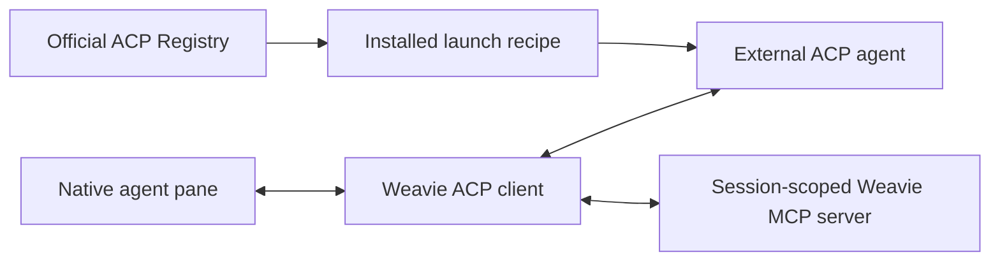

# Native ACP agents

Weavie's native agent surface is one provider-neutral ACP client. Agents installed from the official ACP Registry
and user-defined ACP commands join the same provider catalog and use the same pane, controls, session persistence,
IDE context, MCP bridge, and status machine. The existing Claude terminal UI remains the separate `claude` provider.

## Runtime boundary

Weavie does not translate Codex, Claude Code, or another provider's private protocol. An ACP agent owns that
integration. This keeps provider churn outside Weavie and makes provider differences explicit through ACP
capabilities rather than provider-specific host branches.

Every ACP child is owned by `ProcessSupervisor` with `RestartPolicy.Never`. A launch failure or crash is a visible,
terminal session error. Restart is an explicit user action; there is no hidden provider or transport fallback.

## Registry distributions

The Manage ACP Agents command reads the current official index from
`https://cdn.agentclientprotocol.com/registry/v1/latest/registry.json`. An install records one exact launch recipe
under `~/.weavie/acp/installations.json`:

- `binary` downloads the current platform archive, verifies its SHA-256 digest, safely extracts it under
  `~/.weavie/acp/packages/`, and launches the declared binary;
- `npx` launches the registry package with `npx --yes <package> ...`, avoiding an interactive first-run prompt;
- `uvx` launches the registry's exact `uvx <package> ...` recipe.

Weavie ships no Node, npm, npx, Python, uv, or uvx runtime. Package-manager distributions use the user's PATH
literally. If the selected runner is absent, process launch fails visibly in the native pane. When an agent offers
multiple distributions, the user chooses one; Weavie does not silently change distribution kinds during install or
update.

Registry removal deletes the installed recipe. User-defined agents are independent and remain untouched.

## Custom commands

User-defined ACP commands live at `~/.weavie/acp/custom.json`:
/
Commands may be absolute paths or PATH names. Parsing is strict: unknown fields, duplicate ids, malformed values,
and collisions with installed registry agents produce one unavailable ACP configuration provider with the exact
error. There is no preflight dependency probe or alternate executable lookup.

## ACP contract

The client speaks ACP protocol version 1 over strict JSON-RPC framing. It uses capabilities as advertised:

- `session/new`, plus load, resume, and close when supported;
- text, images, embedded editor guidance, and selection context when supported;
- dynamic modes, configuration options, and slash commands;
- permission, elicitation, filesystem, and terminal client requests;
- streaming messages and thoughts, structured tools, locations, diffs, plans, usage, and session metadata;
- cancellation, plus `_session/steering` when the agent advertises that extension.

Unsupported optional capabilities stay absent from the UI; they do not create another session type. Malformed
advertised data or protocol output fails the exact agent generation visibly.

Agents mirror one mode axis in both `configOptions` and the legacy `modes` block. The configuration option owns
that axis, because `session/set_config_option` is what writes it back; a legacy-only mode axis is written with
`session/set_mode`. A tool may also embed a terminal the agent runs itself, so an embedded terminal id that
Weavie never created carries no client-side output rather than failing the session.

The generic idle condition is the absence of a primary prompt and live ACP tool calls. A prompt response may arrive
while a tool remains active; the session stays Waiting until the tool completes. Runtime failure and explicit
restart terminalize partial content and active tools so stale work cannot appear live.

Elicitation is an explicit trust boundary. Form and URL cards support accept, decline, and cancel; browser flows
require absolute HTTP(S) URLs. Password fields and unsafe URL schemes are rejected visibly. Permissions default to
the strongest allow choice the agent advertises; provider sandboxing remains provider-owned.

## Persistence

ACP session ids are stored by exact provider id and canonical workspace before the first prompt is sent. If that
atomic write fails, the exact agent generation is terminated before it can do work. Provider transcripts remain
provider-owned; Weavie's pane journal is rendering state. Loading asks a capable agent for its transcript and
replaces the pane snapshot before accepting new turns. Malformed or unreadable association data at the current
document version is never reset or overwritten. A document written at another version holds nothing this build can
read — Weavie carries no migrations — so it starts with no associations and the next write takes the file over.

There is no legacy Codex wire, bundled private-provider adapter, protocol negotiation, or migration branch. Host
and web protocol changes move together.
