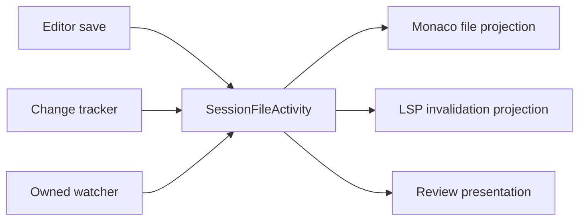

# Session file activity

Every loaded `HostSession` owns one `SessionFileActivity`: the transient ordering and drain boundary for
completed file state and workspace invalidations. It is layered inside the session's exact message-bus
owner; client selection never participates.

The vocabulary is deliberately generic:

- `BufferSaved` — a host-backed editor save completed, including its resulting stat;
- `FileChanged` — a producer now knows the completed path state and resulting stat;
- `FileDeleted` — a producer now knows the path is absent;
- `FilesInvalidated` — the owned workspace watcher observed a debounced native-path batch.

These facts do not say who caused a disk transition. Provider-reported changes, review reverts, and later
watcher invalidations may describe the same transition independently; the activity stream does not infer,
correlate, or deduplicate them.

## Ordering and failure

Admission is synchronous and assigns a monotonic per-session sequence. One reader processes facts in that
order and invokes a snapshot of subscribers in registration order. A `FileActivityTicket` settles after all
snapshotted consumers or their required failure handlers settle; `DrainAsync` is a barrier behind every fact
admitted before the call.

A consumer failure is isolated: its handler publishes an owner-scoped session notification, later consumers
and facts continue, and a successful source write stays successful. A failure handler that itself fails faults
the ticket and drain rather than disappearing into a log.

Editor correction state is captured synchronously at the successful save boundary so a later agent edit
cannot move the attributed region first. Corpus publication runs after the response attempt; then
`BufferSaved` enters file activity for ordered presentation.

## Ownership boundaries

`SessionFileActivity` is not a filesystem facade, content cache, review store, journal, or second message bus.
It performs no workspace scan and persists or replays no facts. Reconnect recovery remains `lifecycle.sync`.

Feature state stays with its domain:

- review persistence stores review state, including keep/accept actions that touch no file;
- live spellcheck follows editor-buffer changes and may use activity only for saved/invalidated files;
- pre-write approval belongs to hooks/review, while activity begins after completion.

## Lifecycle

The watcher starts only after `HostCore` registers every projection. Unload quiesces message ingress, stops
and flushes watcher admission, stops remaining file producers, drains activity while the bus and LSP are
alive, and closes the session endpoint last. Selecting another session performs none of these steps.

See [session-message-bus.md](session-message-bus.md) and
[file-management-and-sessions.md](../specs/file-management-and-sessions.md).
