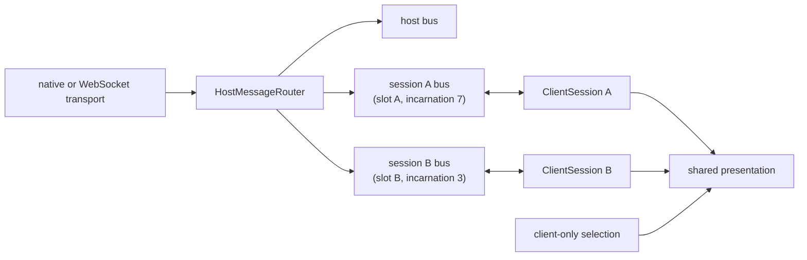

# Session-owned message bus

Every loaded workspace session owns its own message endpoint in the host and its own `ClientSession`
in the web client. A domain message cannot mean “the current session”: its envelope carries the exact
owner address, and the router delivers it only to that owner.

The address is `(slot, incarnation)`. The slot is the stable rail identity; the incarnation changes
every time that slot is loaded. A delayed message for an unloaded instance therefore cannot enter a
new session that later reuses the same slot.

## Selection is not routing

All live sessions receive and process their own terminal, agent, editor, review, file, LSP, status,
and attention traffic whether or not they are visible. Feature state is keyed by `ClientSession`.
Selecting a session chooses which state the shared editor, layout, and agent surfaces render.
The local host persists the client-selected stable `(backendId, slot)` as rail UI state so reload can
restore the presentation after hello. That preference is not a routing input.

This means:

- a background agent completion updates its transcript and can play a sound;
- a background editor command updates that session's tabs and loads them when selected;
- a delayed file or LSP response returns to the session that issued it;
- no domain handler asks whether its session is current, active, focused, or selected.

The shared Monaco instance is presentation, not ownership. Models use session-namespaced URIs, and
each `OwnedEditorSession` holds its own open list, active path, view state, and pending persistence.

## Host scope

One `HostConnection` owns transport and true host concerns: hello/catalog, settings and command
catalogs, window, clipboard, layout, remote-host registry, and updates. Command invocation and
anything else whose meaning changes by workspace belong on a session bus.

## View binding

A view binding is deliberately narrower than session ownership. The selected client publishes
`session/view/attach`; the host records which peer is presenting that exact session. Only transient
requests that require a visible browser surface use the binding, such as focusing a pane or running a
web-only command.

The attachment also identifies the page generation. A native window can reuse its physical peer
after reload, so a changed page epoch replaces the old presentation and settles its pending view
requests; stale generations cannot detach the replacement.

Durable events never use the binding. Editor, review, LSP, agent, files, status, and attention mutate
their owner even when no view is attached. Detaching a view cancels outstanding view requests; it
does not discard session state. Client code uses `registerViewFeature` for this narrow presentation
boundary and `registerSessionFeature` for owned state, so feature handlers never hand-roll selection
subscriptions.

Snapshots authored by the shared editor widget are admitted only from the peer bound to their exact
session. That check establishes who may write the host snapshot; it does not decide which session
receives the message, and it cannot invalidate work after admission.

The one durable view interaction is teardown: unload/delete asks the exact attached editor view to
save dirty models and return its final session snapshot. If no view is attached, the host-owned state
is already sufficient. A save failure leaves the session live.

## Execution

Handlers are serial within one feature by default. Host handlers enter through the platform UI
dispatcher after lane admission, preserving native affinity and host-state serialization even when a
queued handler resumes off-thread. Session handlers execute directly: different features and sessions
run in parallel, and a handler opts into concurrent execution only when its feature defines that as
safe. Command routes partition admission by catalog-declared execution lane because they multiplex unrelated
domains: distinct lanes run concurrently, while related commands retain FIFO within their exact host or
session owner. Feature ownership follows the state being read or mutated, not the UI that renders the result.

Events are one-way state notifications. Requests have exact peer-local correlation, responses, and
cancellation. A transport drop fails outstanding requests; the system does not guess whether an
unacknowledged mutation happened. Bounded durable state is recovered by the session's
`lifecycle.sync` snapshot after hello, not by replaying arbitrary commands. Unbounded surfaces such
as agent history expose feature-owned pull protocols. Sync snapshots are unicast to the requesting
page, so reconnecting cannot roll back another page. If the peer disappears while a handler is
replying, the completed mutation is not run again and session teardown still proceeds after that
delivery attempt.

## Lifecycle

The connection hello returns the complete catalog and exact addresses before session traffic is
admitted. A newly built host endpoint buffers its bounded initial snapshot and construction-time
frames until its address has been published in the catalog, then activates and flushes them in
order. The new `ClientSession` consumes that snapshot without issuing a racing sync. Sessions that
were already live when a page connects explicitly sync after hello; reconnect traffic is held until
the replacement catalog validates its exact address.

Session shutdown has two phases:

1. quiesce inbound dispatch and cancel/drain session-owned background work;
2. flush and drain [session file activity](session-file-activity.md), allow final owned events, then close the
   endpoint and remaining session resources.

Removing a catalog address closes the corresponding `ClientSession`, its handlers, pending requests,
models, LSP channels, and background work as one ownership unit.

A loaded structured-agent session starts with its host endpoint. Selection and view attachment never
start domain work; they only choose where the already-owned state is rendered.

The implementation contract and test matrix live in
[session-message-bus.md](../specs/session-message-bus.md).
