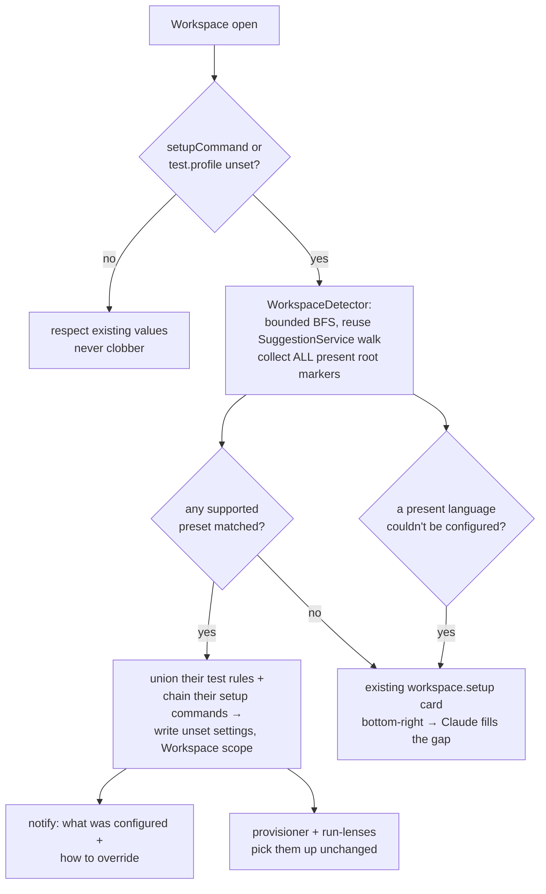

# Built-in workspace auto-config

When Weavie opens a workspace whose setup settings are unset, it **detects the language(s) present from a
curated, hardcoded catalog and writes the setup command + test profile itself** — no model call, no
waiting. A repo can match several presets at once (e.g. .NET + pnpm): their test rules union and their
setup commands chain. The Claude-driven setup flow is demoted from the default to the *override /
gap-filler* path. Detection is pure code, so it spends **zero tokens** and lands in milliseconds instead
of ~15 minutes.

Supported at v1: **TypeScript/JavaScript, C#, Go**. Rust and Python are the next entries — the catalog
is built to grow one record at a time.

## Why — reversing the "no presets" stance

The [test-running-and-workspace-setup spec](../specs/test-running-and-workspace-setup.md) deliberately
shipped **zero framework knowledge**, in code *or* data: Weavie provides the mechanisms (a test-profile
schema, a setup-command setting, the run-lens surface) and the resident model supplies the knowledge,
inferred per-repo and saved as settings. Its "No bundled framework presets" section rejected a shipped
preset table as "recreating the language×framework matrix as maintained data."

That mechanism/knowledge split is elegant but the knowledge half is delivered badly:

- **Slow.** The `weavie.workspace.setup` flow pre-fills a prompt into the primary session's Claude; a
  full inspect-propose-confirm turn runs **~15 minutes** on a real repo.
- **Inconsistent.** The model re-derives globs, symbol regexes, and command templates from scratch each
  time, so the same repo yields different profiles, some subtly wrong.
- **Front-loaded onto every user.** It fires the first time you open essentially any repo — the worst
  possible first impression for a common case Weavie could just *know*.

The escaped cost the old spec feared — maintaining a matrix — is real but **small and bounded**: three
languages, each with a handful of common test libraries and one package-restore command. We're trading
an unbounded per-repo model inference for a bounded, curated, testable table. **This concept supersedes
the "No bundled framework presets" section of that spec** (the spec text should be updated when this
lands).

The token-gate invariant the suggestions surface guards ("never spend model tokens without a click") is
**not** violated: detection is deterministic C#, not a model call. Auto-applying it is exactly the kind
of zero-cost action that was always allowed to run without a click.

## What it writes — nothing new downstream

Detection produces the **same two settings** the Claude flow produces, so everything downstream (the
`ShellWorktreeProvisioner` that runs the setup command on worktree create, the web run-lenses, the
`TestCommandComposer`) is unchanged. No new settings, no new consumers.

| setting | scope | what detection fills |
| --- | --- | --- |
| `worktree.setupCommand` (`CoreSettings.cs`) | Workspace | the package-restore command (`pnpm install`, `dotnet restore`, `go mod download`) |
| `test.profile` (`TestSettings.cs`, JSON array of `TestRule`) | Workspace | one rule per detected test convention — `glob` + `symbol`(+`header`) + `runOne`/`runFile` |

Both are `SettingScope.Workspace`, persisted out-of-repo at `~/.weavie/workspaces/<id>/settings.toml`.
The unset/`[]` distinction is preserved: detection writes concrete values on success and **leaves a
setting unset** when it can't derive one confidently (see *Graceful degradation*).

## The preset catalog

A curated list mirroring `LanguageServerCatalog` (`src/Weavie.Core/Lsp/LanguageServerCatalog.cs`), which
**already classifies these same three languages by root marker** — the natural template and, ideally, a
shared classifier. Each preset is a record: a set of root markers to detect it, plus functions that read
the manifest content to refine the setup command and the test rules.

```csharp
public sealed record WorkspacePreset {
    public required string Id { get; init; }                              // "typescript" | "csharp" | "go"
    public required IReadOnlyList<string> RootMarkers { get; init; }      // "package.json", "*.csproj", "go.mod"
    public required Func<DetectionContext, string> SetupCommand { get; init; }   // package restore
    public required Func<DetectionContext, IReadOnlyList<TestRule>> TestRules { get; init; }
}
```

`DetectionContext` carries the workspace root, the directory the marker was found in (for the monorepo
`cd` prefix, below), and a small file-read helper — detection reads `package.json`
devDependencies/lockfiles and `.csproj` `PackageReference`s to pick *within* a language.

### Multiple languages in one repo are first-class

Detection is **not** "pick the primary language" — it runs **every** preset whose root marker is present
and **combines** their outputs. This is natural because of the shapes involved:

- **`test.profile` is already a JSON array of rules.** A multi-language repo is just the **union** of
  each language's rules. Files route to their own rule by glob/extension (disjoint across languages), so
  the run-lens matcher already picks the right one per file — no cross-language ambiguity.
- **`worktree.setupCommand` is one shell string, so restores chain.** Each detected language contributes
  its restore, wrapped in a `cd`-subshell when its manifest isn't at the root so cwd never leaks between
  steps, joined with `&&`.

**Weavie's own repo is the worked example** (`weavie.slnx` + `.csproj` at root, `src/web/package.json`):

```
worktree.setupCommand = dotnet restore && (cd src/web && pnpm install)
test.profile          = [ …TS rules (cd-anchored to src/web)…, …C# rules… ]   # + Go if present
```

The `cd src/web`, not `pnpm -C`, matters: corepack resolves the packageManager pin from cwd, and a
subshell keeps the pnpm step from shifting cwd for anything after it. TS test commands are likewise
anchored to the package dir (`(cd src/web && pnpm vitest run ${file})`) so vitest and `node_modules`
resolve.

The genuinely hard case is **many packages of the *same* language** (e.g. a JS workspace with several
independent vitest packages). Detection still emits a reasonable single rule + root install there; it
does not try to model per-package installs. If that ever proves wrong for a repo, the card + Claude
override is one click away.

### TypeScript / JavaScript — marker `package.json`

- **Setup command** — package manager by most-specific signal: a `packageManager` field (corepack) wins;
  else lockfile (`pnpm-lock.yaml`→`pnpm`, `yarn.lock`→`yarn`, `bun.lock[b]`→`bun`,
  `package-lock.json`→`npm`); else `npm` (the baseline that ships with Node). Command is `<pm> install`.
- **Test rules** — runner from `package.json` deps (`vitest` / `jest` / `mocha`):

  | runner | `runFile` | `runOne` |
  | --- | --- | --- |
  | vitest | `<pm> vitest run ${file}` | `<pm> vitest run ${file} -t ${name}` |
  | jest | `<pm> jest ${file}` | `<pm> jest ${file} -t ${name}` |
  | mocha | `<pm> mocha ${file}` | `<pm> mocha ${file} -g ${name}` |

  `glob: **/*.{test,spec}.{ts,tsx,js,jsx,mts,cts}`, `symbol: ^(?:describe|it|test)\((?:'|")(.+?)(?:'|")`,
  `nameSeparator: " > "`. (`<pm>` is `pnpm`/`yarn`/`bun`/`npx` — npm invokes binaries via `npx`.)

### C# / .NET — markers `*.slnx` / `*.sln` / `*.csproj`

- **Setup command** — `dotnet restore` (the canonical package restore; resolves a solution from cwd).
- **Test rules** — framework from `.csproj` `PackageReference` (`xunit` → xUnit, else `nunit`/`MSTest`),
  defaulting to xUnit. Uses the `header` slice (attribute region between `range.start` and
  `selectionRange.start`, verified against csharp-ls): `header: \[(Fact|Theory)\b` (or
  `\[(Test|TestMethod)\b`), `glob: **/*.cs` (the header regex is the real filter).
- **Scoped runs via `--filter`, not the whole solution.** `dotnet test` filters on `FullyQualifiedName`,
  which reaches method and class scope. Note the template carries **no literal quotes** around the
  placeholder — the composer already shell-quotes every substitution, so `FullyQualifiedName~${name}`
  composes to `FullyQualifiedName~'Adds'` → the shell strips the quotes → `FullyQualifiedName~Adds`
  (matching); a `"…"`-wrapped template would embed the quotes into the filter value and never match.
  - `runOne: dotnet test --filter FullyQualifiedName~${name}` — contains-match on the method name.
  - `runFile: dotnet test --filter FullyQualifiedName~${fileName}` — scopes to the file's class **by
    convention** (`${fileName}` = the file's base name without extension, resolved host-side in the
    composer; `MathTests.cs` → `FullyQualifiedName~MathTests`). No new web plumbing, no whole-solution
    coarseness. The precise, *symbol-derived* class scope (for files whose class ≠ filename, and OR'd
    multi-class files) is a scoped follow-up — see *Known limitations*.

### Go — markers `go.mod` / `go.work`

- **Setup command** — `go mod download`.
- **Test rules** (empirically verified in the parent spec): `glob: **/*_test.go`, `symbol: ^(Test\w+)`,
  `runOne: go test ${fileDir} -run '^${name}$'`, `runFile: go test ${fileDir}`.

## Detection & apply flow



- **Runs on workspace open**, on the same path `SuggestionService` already uses, reusing its bounded BFS
  (`MaxDepth = 2`, skip `node_modules`/`bin`/`obj`/…). The probe's boolean `HasBuildManifest` generalizes
  to "which presets matched, and did each configure cleanly" — one walk, richer result.
- **Unset-only, no clobber.** A value the user (or a prior detection) already set is never overwritten.
  Detection fills only the gaps.
- **Silent but visible.** No card on a clean detection — but a `notify` toast reports what was configured
  and that it's overridable via `/mcp__weavie__setup-workspace`, so the user learns *why* setup and
  test-running suddenly work.
- **A write drops the card automatically.** Each write raises `SettingChanged`, which re-runs
  `SuggestionService.Evaluate()`. Sequence detection before the card evaluates so it never flashes.

### Falling back — the existing card, not a new surface

Where detection can't finish, the fallback is exactly today's **`workspace.setup` suggestion card**
(bottom-right, `Suggestions.tsx`) → the Claude flow. No new UI. The card's relevance widens from "a
setting is empty" to **"detection reported an unresolved gap"** — so it also shows when detection *did*
write something but left a present language unconfigured:

- **Language matched, runner unknown** (e.g. `package.json` with no vitest/jest/mocha) → write the other
  languages' rules + the install command, **flag the gap** → card offers Claude to finish the profile.
- **Unsupported language** (Rust/Python today) → nothing matched → card → Claude flow, as it works now.
- **Many packages of one language** → best-effort single rule + root install; if the user finds it
  wrong, the card/override is there.

This keeps the no-fallbacks rule intact: an unconfident detector **refuses that piece** (leaves it unset
and surfaces the card) rather than running a wrong default command — while still banking every language
it *could* configure.

## The Claude flow's new role

`weavie.workspace.setup` / `/mcp__weavie__setup-workspace` and `WorkspaceSetupPrompt.cs` **stay**, now as:

1. the **override** — re-run to replace a detected profile you don't like, and
2. the **gap-filler / fallback** — reached via the same bottom-right card, for unsupported languages and
   the pieces detection couldn't resolve. (A future refinement: pass Claude what's already configured so
   it only fills the gap; today it re-derives the whole profile, which is harmless.)

The card's trigger is the same surface as before — it simply fires far less often, and when it does, it's
targeting a genuine gap rather than every fresh repo.

## Placement (Core-first)

- **New** `src/Weavie.Core/Workspaces/WorkspacePresetCatalog.cs` (the preset records, mirroring
  `LanguageServerCatalog`) + `WorkspaceDetector.cs` (walk + classify + manifest-read, reusing the bounded
  BFS from `SuggestionService`). Emits `TestRule`s straight into the existing `TestProfile` JSON shape.
- **New** per-workspace `WorkspaceAutoConfig` collaborator, initialized from `HostCore` construction
  alongside `InitSuggestions()` (`HostCore` is already per-workspace, rooted at `WorkspaceRoot` with
  `RegisterWorkspace(WorkspaceRoot)` called). On open it runs the detector and writes each unset setting
  via the workspace-scoped write overload `SettingsStore.Set(key, value, WorkspaceRoot)` — which routes
  to `~/.weavie/workspaces/<id>/settings.toml`. Wired in `HostCore`, not per-OS, so all four hosts get it.
- **Optional command** `weavie.workspace.autodetect` (Core, MCP-reachable, palette-visible) to force a
  re-detect on demand — keyboard-first parity. Deferred unless wanted.

## Known limitations (documented, not hidden)

- **Go subtests** — `t.Run(...)` subtests aren't LSP symbols, so only the enclosing `TestXxx` gets a
  lens (inherited from the parent spec).
- **Same-language multi-package repos** — several independent packages of one language get a best-effort
  single rule + root install, not per-package installs. Multi-*language* repos are fully supported (union
  + chained setup); it's the many-packages-of-one-language shape that's approximate. Card/override covers it.
- **Shell-unsafe manifest subdirectories** — the composed setup command runs unattended on session create,
  so a manifest in a subdirectory whose name carries spaces or shell metacharacters (which a cloned repo
  could ship) is **declined**, not cd-wrapped — untrusted repo content must never reach that sink. The card
  then offers the Claude flow for that repo. Root and ordinary-named subdirs (`src/web`, `packages/app`)
  are unaffected.
- **C# `runFile` scopes by filename, not symbol** — v1 uses `${fileName}` (host-side, zero web plumbing),
  which is precise when a test class matches its filename (the dominant convention) and over/under-matches
  when it doesn't. The exact, symbol-derived `${fileClass}` — the run-file lens reading the enclosing
  type(s) from the document symbols, incl. OR'd multi-class files — is a **scoped follow-up** (it touches
  the pure matcher in `test-match.ts`, not just data). Everything v1 ships reuses existing placeholders.

## Sequencing — why open-time detection lands in time

Detection runs at **workspace open** (`HostCore` init), not at worktree create, because a repo's
language is a workspace-level fact and the test profile must light up run-lenses in the **primary /
main-worktree session immediately** — not only once the user makes a worktree.

`worktree.setupCommand` is consumed one layer down, per-worktree: `HostCore.StartWorktreeSetup`
(`src/Weavie.Hosting/HostCore.Sessions.cs:241`) fires on worktree *create* (`NewSession` and the
fresh-worktree branch of `AttachExistingSession`) and runs `ShellWorktreeProvisioner.RunSetupAsync`,
which reads the command through a **live** `Func<string?>` getter bound to
`_settings.GetString("worktree.setupCommand", WorkspaceRoot)`. Because workspace open precedes any
worktree create and the getter is read at run time, an open-time write is always in place before the
first setup runs. No new hook is needed — detection just fills the setting the existing seam already
reads live.

## Resolved / open questions

- **Shared classifier (resolved).** The *walk* is consolidated into `WorkspaceDetector` — there is now
  exactly one bounded BFS, which `SuggestionService` consumes through an injected `Func<bool>` probe
  (it no longer walks the disk itself). But `WorkspacePresetCatalog` stays **separate** from
  `LanguageServerCatalog`: presets match only build manifests (`package.json`/`*.csproj`/`go.mod`), never
  the LSP root markers (`.git`, `tsconfig.json`), and carry setup/test knowledge the LSP catalog has no
  business holding. Merging would couple two unrelated axes.
- **Symbol-exact C# class scope.** The `${fileClass}` follow-up above.
- **Rust / Python.** The next two presets — `Cargo.toml`/`cargo test` and
  `pyproject.toml`/`pytest` — slot in as two more catalog records. Scoped as a follow-up.
