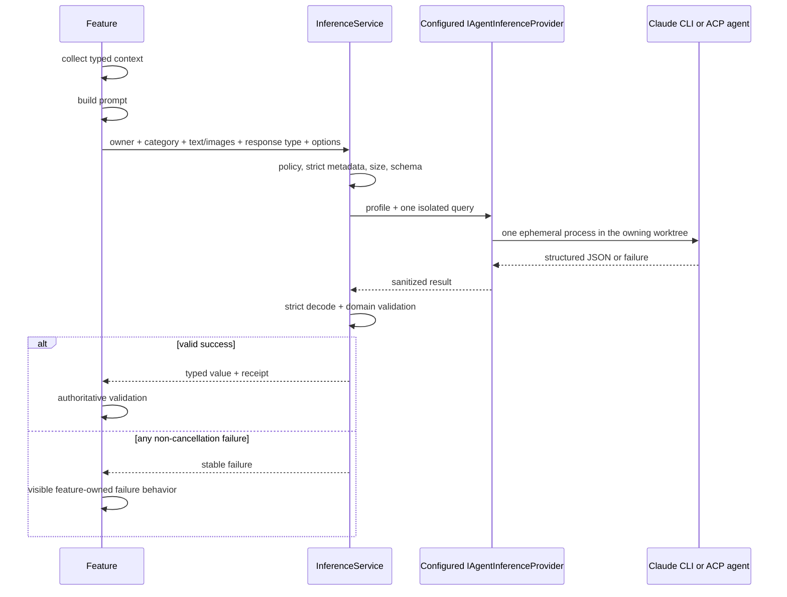

# Typed ad-hoc inference

Status: built foundation + branch-naming proving slice

## Purpose

Weavie often owns the exact context needed for a small semantic decision: a new-session prompt and recent branches,
a completed plan, failed-test output, or selected editor text. Ad-hoc inference submits that bounded context without
polluting or resuming the interactive agent transcript.

## Ownership and boundaries

`IAgentInferenceProvider` is an optional capability subtype of `IAgentProvider`. `InferenceService` resolves the live
`inference.defaultProvider` through the existing `AgentProviderRegistry`. Terminal Claude implements the capability
through its installed CLI path; every ACP agent implements it through one transient process and one throwaway
session. There is no parallel inference-provider registry. A query remains owned by the session it is about for its
worktree, while provider and profile selection are global user settings independent of the active agent pane.

The inference facet has no session-creation, terminal, editor, MCP, or mutation API. It is a generic internal API
for trusted feature code; there is no bridge message, command, or MCP tool accepting an arbitrary prompt. Any future
external surface owns its allowlist rather than pushing feature identity into provider transport.

Each call starts one transient process. It does not create a durable thread or resume identity, and the process is
killed as a tree when the caller or query deadline cancels. Transient helpers are exempt from `ProcessSupervisor`;
its restart behavior would violate the one-attempt contract. No process is pooled: provider prompt caches are
keyed by prefix rather than by connection, so a fresh process still reads a warm cache and pooling would buy only
the process start.

## Typed query contract

`IInferenceService.QueryAsync<TResponse>` accepts:

- an `InferenceOwner`: the owning session's worktree root;
- a caller-selected `InferenceModelCategory`;
- one complete provider-agnostic text prompt plus exact decoded images;
- strict `JsonTypeInfo<TResponse>` response metadata;
- invocation origin, prompt/output byte bounds, image-count and aggregate-image byte bounds, and a one-attempt time
  budget.

`InferencePrompts.WithJsonInput` is the shared path for typed feature context. It serializes the input through its
declared `JsonTypeInfo<TInput>` and applies consistent untrusted-data framing, so features do not reproduce prompt
plumbing. Response metadata must reject unknown members and respect required constructor parameters; non-strict
metadata is a programming error. Runtime, CLI, and model failures are values.

The provider seam contains category, the live provider-native profile, owning worktree, final prompt, native image
inputs, generated JSON Schema, and output byte bound. Images remain outside the prompt-size budget and are never
serialized into its typed JSON. Providers do not receive a feature or query id and never switch on product behavior:

| Category | Intended work | Terminal Claude profile | ACP agent |
|---|---|---|---|
| `Utility` | naming, extraction, classification | `haiku`, low | agent default |
| `Reasoning` | critique, diagnosis, risk ranking | `sonnet`, medium | agent default |

There is no default category, escalation, repair call, provider fallback, or Weavie retry. Empty model/effort settings
retain the table's provider/category defaults; explicit values replace them.

ACP exposes the reserved `model` and `thought_level` config-option categories but attaches no cost, capability, or
ordering semantics to their values. Weavie treats configured values as provider-opaque ids, applies model then effort
then an exact shipped Fast Mode option id (`fast` or `fast-mode`) when requested, and consumes the authoritative full
`configOptions` response after each mutation. Fast supports boolean and strict `on`/`off` select shapes; labels and
the broad `model_config` category are never treated as semantic identifiers. An absent, ambiguous, or incompatible
control or value is `NotConfigured`; it is never ignored and never selects another provider. The receipt records the
final advertised model.

## Process isolation

Terminal Claude uses print mode with safe mode, `--tools ""`, strict MCP configuration, no session persistence, the
configured or category-mapped `--model`/`--effort`, and `--json-schema`. Explicit Fast Mode `on`/`off` is passed as an
inline `--settings` document for that process; `inherit` omits it. Images are written to an owner-only directory
outside the repository, their paths lead the prompt, and the directory is deleted when the attempt ends. The process
inherits the normal Claude environment: an intentionally configured `ANTHROPIC_API_KEY` remains available, while an
unset key lets the CLI use its stored OAuth/subscription login.

An ACP agent receives images as native `image` content blocks only when its initialize response advertises
`promptCapabilities.image`; an image query against any other ACP agent fails as `InputRejected`. The agent is
isolated structurally rather than by flags, because ACP has no tool-suppression control. Weavie advertises only the
session capability for typed boolean configuration options, passes an empty `mcpServers` list, and refuses every agent-initiated request
— `fs/*`, `terminal/*`, `session/request_permission`, and elicitation. The session is created, prompted once, and
closed; its id is never persisted.

Both providers run in the **owning worktree**. Inference reasons about the user's repository, so the working
directory is the repository, and a stable working directory keeps the provider's cached prefix intact across
queries. Neither provider is granted a Weavie MCP connection.

Weavie starts one process and does not retry. A provider may internally retry transport operations without exposing
a supported control; the query deadline is the reliable outer latency bound.

## Structured output and validation

The service derives a JSON Schema from `TResponse`. Terminal Claude must return the CLI envelope's
`structured_output`. ACP carries no output-schema field, so the schema travels in the prompt and the reply must be
**exactly one JSON value** — leading prose, trailing commentary, and markdown fences are rejected rather than
salvaged, which is the same strictness expressed against a different transport. The raw JSON then passes through
the shared local validator, which:

1. rejects output beyond the query's byte limit;
2. parses exactly one JSON value;
3. rejects unknown, missing, and incorrectly typed members;
4. deserializes through the declared `JsonTypeInfo<TResponse>`;
5. leaves semantic and authoritative state validation to the feature.

## Failure behavior

Stable failures include disabled, policy denied, not configured, category unavailable, input rejected, timed out,
authentication failed, rate limited, provider unavailable, refused, and invalid response.

Every feature owns its non-success UI. This includes missing binaries/authentication, non-zero CLI exits,
malformed envelopes/JSON, shape/domain rejection, and authoritative feature rejection. Branch preview has no
generated fallback: every inference, validation, or collision failure leaves the branch field blank, marks the
failure with its reason, and requires the user to type a branch name.

Caller cancellation remains exceptional and propagates. A canceled branch-preview request must stop its CLI
process and must not publish a stale name into a newer composer draft.

Settings:

- `inference.enabled` — global ad-hoc-query opt-in, off by default;
- `inference.allowAutomatic` — additional opt-in for event-triggered calls, off by default.
- `inference.defaultProvider` — `claude` or an installed ACP provider id, default `claude`;
- `inference.model` — provider-native model id, empty to retain the provider/category default;
- `inference.effort` — provider-native effort id, empty to retain the provider/category default;
- `inference.fastMode` — `inherit`, `on`, or `off`, default `inherit`.

All six settings apply to the next query. For example:

```toml
inference.defaultProvider = "claude"
inference.model = "opus"
inference.effort = "low"
inference.fastMode = "on"
```

An ACP profile uses the same keys with its installed provider id and advertised option value ids. The provider is
open-ended because ACP installations are dynamic. An unavailable configured provider fails visibly, and an ACP
provider referenced by `inference.defaultProvider` cannot be removed until the setting changes.

After the first page hello in each host run, Weavie offers a persistent action notification when either gate is
off. Its action runs `weavie.inference.enableAutomatic`, which writes `inference.allowAutomatic` before
`inference.enabled` so a partial write remains fail-closed, then verifies both effective values. An environment
override or persistence failure is surfaced instead of being reported as success. The action advertises its
effective `$mod+alt+i` binding from the owning host's command catalog. Closing the notification means “not now”:
it changes neither setting, suppresses repeats for that host run, and permits a new offer after relaunch.

An explicit action is `UserInitiated` even when implemented asynchronously. Debounced branch preview, idle review,
and other event-triggered work are `Automatic`.

Prompts, outputs, CLI stderr, credentials, and raw provider errors are never logged or persisted by Weavie.
Receipts may contain provider/model ids, category, duration, upstream request id, and provider-reported usage.

## Flow



## First consumer: branch naming

The shared Sessions composer spends one host-scoped preview request per draft. It asks once the draft's text
carries at least sixteen words and has been idle for 1200 ms, and it settles there: growing the prompt afterwards
never buys a second name. Attached images do not count toward that gate — an image carries no task description on
its own, and neither does an opening clause like “there's a bug where”. Leaving the prompt field or pressing Start asks immediately for a draft that has not been
asked about yet, so submission never races the idle window. When “Current session” is selected, the request carries
that exact slot; “Main branch” needs no live session.
The host sends the text prompt, up to four exact validated images totaling at most 20 MB, the source checkout's
current branch, the repository's configured `user.email`, and up to twenty branches ordered by tip committer date —
local and remote-tracking, each name once, minus the default branch — that identity authored, plus the ones it did
not only when it authored none. An image-only draft is valid input.
The owner is the source workspace — the branch is named before its session exists — while the global inference
provider/profile answers it regardless of the provider selected for the future session. Only `Utility` is permitted.
An over-budget draft takes the same visible failure path as a provider rejection.

A proposed name is trimmed, checked with `GitService.IsValidBranchName`, checked against loaded/worktree labels,
and checked against Git branch existence. The model reports a draft that names no specific task as `needsMoreDetail`
instead of guessing one: that is the single outcome the composer stays open on, asking again once the draft grows.
Every other non-cancellation outcome returns an empty branch and marks the failure. The composer explains that the
user must type a branch, and Start stays disabled until they do. The editable field is the only branch creation
submits.

Manual branch input and a settled name both stop automatic work; `weavie.session.resuggestBranch` — the field's
control, unbound by default — is how the user asks for another name and replaces either. That click is the explicit
action, so it runs as `UserInitiated` and `inference.allowAutomatic` does not gate it; every other trigger in the
composer is the application's own work and stays `Automatic`. A query already in flight
runs to completion rather than restarting under continued typing, and the client never lets a stale response or an
automatic result overwrite manual input. A transport failure leaves the field blank and editable and shows that
preview is unavailable.

Programmatic `weavie.session.new` and fork calls also require a branch and never perform hidden inference. An
explicit branch is revalidated and used unchanged; omission or collision fails rather than silently substituting a
different name.

## Product surfaces

Ad-hoc inference is the bounded query layer between deterministic product logic and a durable interactive agent
turn. It is useful when Weavie already owns the context, needs one typed decision, and can continue normally if no
answer arrives. It is not a hidden agent loop and never mutates the workspace.

| Surface | Trigger | Category | Typed result | Disabled or query-failure behavior |
|---|---|---|---|---|
| Branch-name preview | Automatic once per idle draft | `Utility` | Valid branch candidate | Empty field; user types a branch |
| Plan review | Explicit review action | `Reasoning` | Prioritized findings | Plan remains available without review |
| Failed-test diagnosis | Explicit offer after a failed run | `Reasoning` | Diagnosis and proposed next action | Existing failed-test result remains unchanged |
| Semantic file review | Automatic after editor idle | `Utility` | High-impact, located suggestions | No semantic suggestions |

### Branch-name preview

The proving slice resolves a repository-specific convention that deterministic slugification cannot infer. Once a
session's text is long enough to describe a task and has gone idle, Weavie asks the configured provider for a branch
name using that input, the current branch, and the most recent local branches. This lets examples such as
`kapps/fix-webm` and `bug/webm-fails-to-load` emerge from each repository's own history without teaching Weavie a
global prefix convention.

The user's own conventions lead: branches whose tip commit the configured `user.email` authored are presented as
theirs, and a repository where everyone else's branches dominate cannot drown them out — other authors' branches are
withheld entirely unless the user has none, so imitating a teammate is impossible rather than merely discouraged.
The default branch is nobody's example and counts for neither side, so a user whose only authored tip is `main`
still sees the team's conventions. Remote-tracking refs count, minus the remote they live on, so a fresh clone still
sees the user's own history. The
configured email travels with them, so a convention whose examples carry a per-author segment gets the requesting
user's own segment rather than a copy of whoever committed last. Weavie never composes a prefix itself; an author
segment appears only where the examples already show one.

The suggestion populates the editable branch field before session creation. One draft costs one query — never a
query per keystroke, per pause, or per discarded partial prompt — and creation waits for that query only when it has
not run yet. Manual input wins until the user clears it. The complete lifecycle and validation rules are defined in
[First consumer: branch naming](#first-consumer-branch-naming).

### Plan review

A completed plan may expose a **Review plan** action that submits the immutable plan text and relevant task context
to another ad-hoc `Reasoning` call. Its output should contain a bounded list of findings with severity, the plan
step they concern, the risk or missing consideration, and a concrete recommendation. The surface keys its result
to the plan identity and content hash so an edit immediately invalidates an older review.

Review findings appear beside the plan for the user to accept, dismiss, or use as input to a normal agent turn.
The query does not silently rewrite the plan. This keeps independent critique cheap and isolated while preserving
the visible interactive agent as the owner of changes.

### Failed-test diagnosis and fix handoff

After a test run fails, the result surface may offer **Diagnose failure**. The action submits bounded test context:
the command, exit code, failing test names, relevant structured metadata, and size-limited output. The typed result
should distinguish likely product defects, test defects, and environment failures; summarize evidence; identify
likely relevant paths; and propose a next action without claiming certainty it does not have.

The diagnosis may expose **Fix with agent**, which starts a visible normal agent turn containing the failure and
diagnosis. Only that durable turn may inspect more context, edit files, rerun tests, and ask the user questions. No
model query runs merely because a test failed: the explicit diagnosis action controls cost, and declining it leaves
the current test workflow unchanged.

### Semantic file review

When automatic inference is enabled, an editor may request a lightweight semantic review after the current file
has been idle. The input is the current document version, language, path relative to the workspace, and bounded
file or changed-region content. The typed output contains only high-impact suggestions, each with a stable identity,
severity, source range, summary, and rationale. Syntax, formatting, and rules a deterministic language server or
linter can answer remain outside this query.

Requests are keyed to the document version and canceled when the user types, changes files, or closes the editor.
The surface deduplicates identical findings and lets users dismiss recurring suggestions. Suggestions never edit
the file; applying one opens a visible agent action or deterministic editor fix. The automatic opt-in and strict
impact threshold keep the feature from becoming a stream of speculative inline noise.

## Shared interaction rules

- Automatic work begins only after an idle boundary, allows one active request per owning surface, and cancels
  superseded processes instead of queueing model calls.
- Every result is keyed to all authoritative input that produced it. A stale result is discarded even if the
  provider completed successfully.
- User-authored values always outrank generated values. Generated text remains visibly editable or dismissible.
- Ad-hoc inference may recommend a mutation, but only a deterministic product action or visible interactive agent
  turn performs one.
- Product surfaces do not retry, escalate models, or switch providers. Provider, model, and response-validation
  failures take the feature's visible failure path. A transport failure remains a visible product error.
- Automatic surfaces require both `inference.enabled` and `inference.allowAutomatic`; explicit actions require only
  `inference.enabled`.

## Delivery order

1. Branch-name preview proves configured-provider routing, typed output, cancellation, automatic policy, and visible manual
   recovery.
2. Plan review proves a user-initiated `Reasoning` query and independent critique without mutation.
3. Failed-test diagnosis proves the handoff from a bounded query to a visible agent that can fix the problem.
4. Semantic file review proves sustained automatic use only after cancellation, deduplication, and dismissal
   behavior are established.

Each surface owns its prompt, response type, semantic/authoritative validation, failure behavior, and UX tests.
Shared query plumbing remains generic, while adding a surface never creates an external prompt endpoint.
