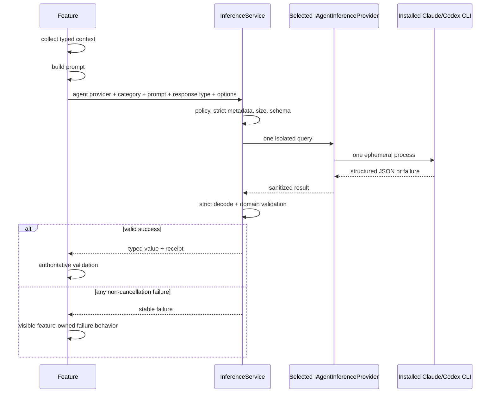

# Typed ad-hoc inference

Status: built foundation + branch-naming proving slice

## Purpose

Weavie often owns the exact context needed for a small semantic decision: a new-session prompt and recent branches,
a completed plan, failed-test output, or selected editor text. Ad-hoc inference submits that bounded context without
polluting or resuming the interactive agent transcript.

## Ownership and boundaries

`IAgentInferenceProvider` is an optional capability subtype of `IAgentProvider`. `InferenceService` resolves the
caller-supplied provider id through the existing `AgentProviderRegistry`; Claude and Codex therefore share their
installed CLI path, authentication, entitlement, and provider identity with interactive sessions. There is no
parallel inference-provider registry or `inference.provider` setting.

The inference facet has no session-creation, terminal, editor, MCP, or mutation API. It is a generic internal API
for trusted feature code; there is no bridge message, command, or MCP tool accepting an arbitrary prompt. Any future
external surface owns its allowlist rather than pushing feature identity into provider transport.

Each call starts one transient CLI process. It does not create a durable thread or resume identity, and the process
is killed as a tree when the caller or query deadline cancels. Transient helpers are exempt from
`ProcessSupervisor`; its restart behavior would violate the one-attempt contract.

## Typed query contract

`IInferenceService.QueryAsync<TResponse>` accepts:

- the selected existing agent-provider id;
- a caller-selected `InferenceModelCategory`;
- one complete provider-agnostic prompt;
- strict `JsonTypeInfo<TResponse>` response metadata;
- invocation origin, prompt/output byte bounds, and a one-attempt time budget.

`InferencePrompts.WithJsonInput` is the shared path for typed feature context. It serializes the input through its
declared `JsonTypeInfo<TInput>` and applies consistent untrusted-data framing, so features do not reproduce prompt
plumbing. Response metadata must reject unknown members and respect required constructor parameters; non-strict
metadata is a programming error. Runtime, CLI, and model failures are values.

The provider seam contains only category, final prompt, generated JSON Schema, and output byte bound. Providers do
not receive a feature or query id and never switch on product behavior:

| Category | Intended work | Codex profile | Claude profile |
|---|---|---|---|
| `Utility` | naming, extraction, classification | `gpt-5.6-luna`, low | `haiku`, low |
| `Reasoning` | critique, diagnosis, risk ranking | `gpt-5.6-sol`, medium | `sonnet`, medium |

There is no default category, model override, escalation, repair call, provider fallback, or Weavie retry.

## CLI isolation

Claude uses print mode with safe mode, `--tools ""`, strict MCP configuration, no session persistence, the mapped
model/effort, and `--json-schema`. The process inherits the normal Claude environment: an intentionally configured
`ANTHROPIC_API_KEY` remains available, while an unset key lets the CLI use its stored OAuth/subscription login.

Codex uses `codex exec` with an ephemeral rollout, ignored user config and exec rules, no repository requirement,
approval policy `never`, the mapped model/effort, an output-schema file, and a final-message file. Its stable
`shell_tool` feature and every configurable built-in tool surface are disabled: apps, browser/computer use, image
generation, multi-agent, plugins, workspace dependencies, and web search. A per-call permission profile denies all
filesystem reads/writes and network access to model tools, containing local-image access and the independently
registered `apply_patch` tool. Strict config parsing makes an unsupported restriction fail closed
instead of silently restoring access. The CLI itself can still read its authentication and write the requested
structured-result file outside the tool sandbox. Its working directory is a private, empty Weavie temporary
directory; it receives no Weavie MCP configuration. The temporary schema/output are deleted on every success,
failure, timeout, and cancellation path. Claude's tool set is explicitly empty as well.

Weavie starts one CLI process and does not retry. A CLI may internally retry transport operations without exposing
a supported control; the query deadline is the reliable outer latency bound.

## Structured output and validation

The service derives a JSON Schema from `TResponse`. Claude must return the CLI envelope's
`structured_output`; Weavie never extracts JSON from prose. Codex must write the schema-constrained final message.
Both paths then pass the raw JSON to the shared local validator, which:

1. rejects output beyond the query's byte limit;
2. parses exactly one JSON value;
3. rejects unknown, missing, and incorrectly typed members;
4. deserializes through the declared `JsonTypeInfo<TResponse>`;
5. leaves semantic and authoritative state validation to the feature.

## Failure behavior

Stable failures include disabled, policy denied, not configured, category unavailable, input rejected, timed out,
authentication failed, rate limited, provider unavailable, refused, and invalid response.

Every feature owns its non-success UI. This includes missing binaries/authentication, non-zero CLI exits,
malformed envelopes/JSON, shape/domain rejection, and authoritative feature rejection. Branch preview has no
generated fallback: every inference, validation, or collision failure leaves the branch field blank, marks the
failure, and requires the user to type a branch name.

Caller cancellation remains exceptional and propagates. A canceled branch-preview request must stop its CLI
process and must not publish a stale name into a newer composer draft.

Settings:

- `inference.enabled` — global ad-hoc-query opt-in, off by default;
- `inference.allowAutomatic` — additional opt-in for event-triggered calls, off by default.

After the first page hello in each host run, Weavie offers a persistent action notification when either gate is
off. Its action runs `weavie.inference.enableAutomatic`, which writes `inference.allowAutomatic` before
`inference.enabled` so a partial write remains fail-closed, then verifies both effective values. An environment
override or persistence failure is surfaced instead of being reported as success. The action advertises its
effective `$mod+alt+i` binding from the owning host's command catalog. Closing the notification means “not now”:
it changes neither setting, suppresses repeats for that host run, and permits a new offer after relaunch.

An explicit action is `UserInitiated` even when implemented asynchronously. Debounced branch preview, idle review,
and other event-triggered work are `Automatic`.

Prompts, outputs, CLI stderr, credentials, and raw provider errors are never logged or persisted by Weavie.
Receipts may contain provider/model ids, category, duration, upstream request id, and provider-reported usage.

## Flow

## First consumer: branch naming

The shared Sessions composer issues one host-scoped preview request after the prompt has been idle for 500 ms.
When “Current session” is selected, the request carries that exact slot; “Main branch” needs no live session.
The host sends only the text prompt, source checkout's current branch, and up to twenty local branches ordered by
tip committer date. It passes the provider already selected in the composer and permits only `Utility`.

A proposed name is trimmed, checked with `GitService.IsValidBranchName`, checked against loaded/worktree labels,
and checked against Git branch existence. Every other non-cancellation outcome returns an empty branch and marks
the failure. The composer explains that the user must type a branch, and Start stays disabled until they do. The
editable field is the only branch creation submits.

Typing, provider/location changes, manual branch input, hiding the composer, and submission cancel pending work.
The client keys results to the complete draft and never lets a stale response or automatic result overwrite manual
input. Start stays disabled until the field contains a branch. A transport failure leaves the field blank and
editable and shows that preview is unavailable.

Programmatic `weavie.session.new` and fork calls also require a branch and never perform hidden inference. An
explicit branch is revalidated and used unchanged; omission or collision fails rather than silently substituting a
different name.

## Product surfaces

Ad-hoc inference is the bounded query layer between deterministic product logic and a durable interactive agent
turn. It is useful when Weavie already owns the context, needs one typed decision, and can continue normally if no
answer arrives. It is not a hidden agent loop and never mutates the workspace.

| Surface | Trigger | Category | Typed result | Disabled or query-failure behavior |
|---|---|---|---|---|
| Branch-name preview | Automatic after prompt idle | `Utility` | Valid branch candidate | Empty field; user types a branch |
| Plan review | Explicit review action | `Reasoning` | Prioritized findings | Plan remains available without review |
| Failed-test diagnosis | Explicit offer after a failed run | `Reasoning` | Diagnosis and proposed next action | Existing failed-test result remains unchanged |
| Semantic file review | Automatic after editor idle | `Utility` | High-impact, located suggestions | No semantic suggestions |

### Branch-name preview

The proving slice resolves a repository-specific convention that deterministic slugification cannot infer. As the
user types a session prompt, Weavie waits for 500 ms of inactivity and asks the selected provider for a branch name
using the prompt, current branch, and twenty most recent local branches. This lets examples such as
`kapps/fix-webm` and `bug/webm-fails-to-load` emerge from each repository's own history without teaching Weavie a
global prefix convention.

The suggestion populates the editable branch field before session creation. It is never requested on every
keystroke, and session creation never waits for it. Manual input wins until the user clears it. The complete
lifecycle and validation rules are defined in [First consumer: branch naming](#first-consumer-branch-naming).

### Plan review

A completed plan may expose a **Review plan** action that submits the immutable plan text and relevant task context
to another ad-hoc `Reasoning` call. Its output should contain a bounded list of findings with severity, the plan
step they concern, the risk or missing consideration, and a concrete recommendation. The surface keys its result
to the plan identity and content hash so an edit immediately invalidates an older review.

Review findings appear beside the plan for the user to accept, dismiss, or use as input to a normal agent turn.
The query does not silently rewrite the plan. This keeps independent critique cheap and isolated while preserving
the visible interactive agent as the owner of changes.

### Failed-test diagnosis and fix handoff

After a test run fails, the result surface may offer **Diagnose failure**. The action submits bounded test context:
the command, exit code, failing test names, relevant structured metadata, and size-limited output. The typed result
should distinguish likely product defects, test defects, and environment failures; summarize evidence; identify
likely relevant paths; and propose a next action without claiming certainty it does not have.

The diagnosis may expose **Fix with agent**, which starts a visible normal agent turn containing the failure and
diagnosis. Only that durable turn may inspect more context, edit files, rerun tests, and ask the user questions. No
model query runs merely because a test failed: the explicit diagnosis action controls cost, and declining it leaves
the current test workflow unchanged.

### Semantic file review

When automatic inference is enabled, an editor may request a lightweight semantic review after the current file
has been idle. The input is the current document version, language, path relative to the workspace, and bounded
file or changed-region content. The typed output contains only high-impact suggestions, each with a stable identity,
severity, source range, summary, and rationale. Syntax, formatting, and rules a deterministic language server or
linter can answer remain outside this query.

Requests are keyed to the document version and canceled when the user types, changes files, or closes the editor.
The surface deduplicates identical findings and lets users dismiss recurring suggestions. Suggestions never edit
the file; applying one opens a visible agent action or deterministic editor fix. The automatic opt-in and strict
impact threshold keep the feature from becoming a stream of speculative inline noise.

## Shared interaction rules

- Automatic work begins only after an idle boundary, allows one active request per owning surface, and cancels
  superseded processes instead of queueing model calls.
- Every result is keyed to all authoritative input that produced it. A stale result is discarded even if the
  provider completed successfully.
- User-authored values always outrank generated values. Generated text remains visibly editable or dismissible.
- Ad-hoc inference may recommend a mutation, but only a deterministic product action or visible interactive agent
  turn performs one.
- Product surfaces do not retry, escalate models, or switch providers. Provider, model, and response-validation
  failures take the feature's visible failure path. A transport failure remains a visible product error.
- Automatic surfaces require both `inference.enabled` and `inference.allowAutomatic`; explicit actions require only
  `inference.enabled`.

## Delivery order

1. Branch-name preview proves provider reuse, typed output, cancellation, automatic policy, and visible manual
   recovery.
2. Plan review proves a user-initiated `Reasoning` query and independent critique without mutation.
3. Failed-test diagnosis proves the handoff from a bounded query to a visible agent that can fix the problem.
4. Semantic file review proves sustained automatic use only after cancellation, deduplication, and dismissal
   behavior are established.

Each surface owns its prompt, response type, semantic/authoritative validation, failure behavior, and UX tests.
Shared query plumbing remains generic, while adding a surface never creates an external prompt endpoint.
