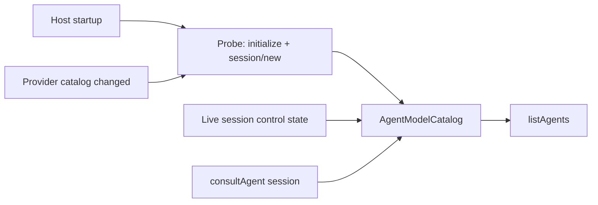

# Agent consultation

Status: built

## Purpose

A user talking to one agent can ask it to check with another configured agent by name, e.g. *"check with Astra"*.
When the Codex ACP agent is installed and advertises an `astra` model, the embedded agent resolves the name through
Weavie, starts a Codex ACP session with that model in the same worktree, and gets its final reply back.

The capability is two tools on the session's registry MCP server, so every provider that connects to the registry —
terminal Claude and every native ACP agent — can consult. Skills were rejected: they reach only Claude Code.

## Tools

- `listAgents` returns every registered provider with whether it can be consulted (and why not) and its cached model
  catalog: state (`ready`, `probing`, `failed`), the advertised model options, when and how the
  catalog was observed, and the failure detail when the last refresh failed.
- `consultAgent({provider, model, prompt})` runs one consult turn in the session's worktree and returns the consulted
  agent's final message. `model` may be omitted to keep the provider's default.

The embedded-agent instructions tell agents to call `listAgents` whenever the user names an agent or model they do
not recognize, then consult with the exact ids. Weavie never matches labels or guesses ids.

## Model catalog

`AgentModelCatalog` is the one owner of each consultable provider's model axis. A snapshot is replaced whole; a
failed refresh replaces a ready snapshot with the failure, so a stale list is never served as current.

Refresh triggers, and nothing else:

1. **Startup** — every consultable provider is probed in the background.
2. **Provider catalog change** — install, update, removal, or reload of ACP agents cancels in-flight probes, drops
   removed providers, and re-probes every consultable provider.
3. **Live sessions** — any ready control state published by a live session of that provider replaces its snapshot.
4. **Consults** — every consult that opened a session records the controls it saw, success or failure.

There is no timer. An unknown model name is resolved by the consult itself: it opens a live session, validates the
model against the controls advertised now, and records them — so a model released since the last probe is found
without a second process. A probe opens one throwaway session with no MCP servers and prompts nothing.

Each observation takes a number from one sequence; a probe result lands only when no newer observation has, so a
slow probe cannot overwrite a live session's report. Probes have no deadline: a hung probe stays visibly `probing`.

## Consult runtime

A consult is one transient ACP process, one session, and one prompt turn — the same transport as ad-hoc inference,
answering in free text instead of JSON. Its lifetime is the MCP call: caller cancellation, the caller's disconnect,
or session unload kills the process tree. It is a transient one-shot and therefore not `ProcessSupervisor`-owned.

The consulted agent is read-only by construction as far as the protocol allows:

- Weavie advertises no filesystem or terminal capability and passes **no MCP servers**, so the consulted agent has
  no Weavie registry and cannot consult further. Recursion is impossible rather than checked.
- Every permission request is answered with the agent's own reject option and listed in the reply's footer.
- A reported `edit`, `delete`, or `move` tool call cancels the turn and fails the consult, naming the paths.
- Every other agent request is refused.

The consulted agent still reads and searches with its own tools. A provider configured to act without asking can
change files before reporting the tool call; Weavie cannot prevent what the agent never reports, and does not guess
provider mode ids to select a read-only mode.

The prompt is prefixed with consultation framing: the agent was consulted on the user's behalf, must not modify
files, and its final message is returned. The reply is the agent message text after the last tool call.

Failures are values surfaced to the calling agent as tool errors naming the cause: the provider is unknown,
unavailable, or not consultable; the agent could not start; it requires authentication; the model is not advertised
(listing what is); it attempted a mutation; it stopped early; or it returned nothing.

Terminal Claude is listed but not consultable. Consulting Claude goes through the Claude ACP agent.

## MCP call cancellation

Long tool calls own a per-call cancellation source, cancelled by:

- `notifications/cancelled` from the same client — scoped per WebSocket connection, or per `Mcp-Session-Id`, which
  the server issues on the HTTP `initialize` response;
- the calling connection closing;
- server disposal on session unload.

The stdio MCP proxy has no client-side request timeout: the caller's cancellation owns a tool call's lifetime.

The calling agent's own tool timeout still applies. Codex defaults MCP tool calls to 60 seconds, and codex-acp
configures client-supplied MCP servers without a timeout, so a Codex caller gives up on a longer consult. Codex
reaches the registry over HTTP, so abandoning the request closes the connection and cancels the consult.

## Deferred

- A live, visible consult card streaming the consulted agent's work into the calling session.
- Routing the consulted agent's permission requests to the user instead of denying them.
- Multi-turn consults, effort and fast-mode arguments, and image input.
- Terminal Claude as a consult target.
