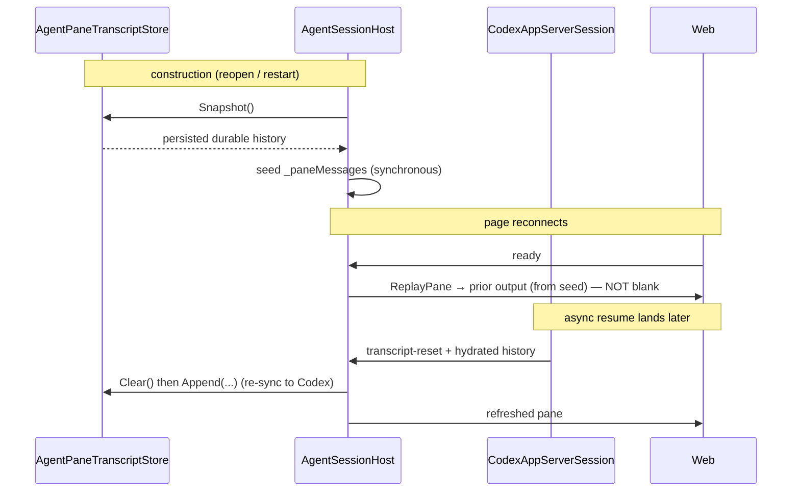

# Native agent pane persistence

The native (structured) agent pane — currently Codex — renders from a stream of provider-neutral
`AgentPaneMessage`s accumulated in `AgentSessionHost._paneMessages` (in memory). On any teardown of the
`HostSession` — a session unload/reload, a worker/app restart, or (on the remote transport) a page
navigation that recycles the worker — that buffer is gone, and the reopened session must reconstruct it.

## The problem this closes: the reconnect race

Codex resumes its conversation from its own rollout: `thread/resume` returns the thread's turns/items, and
`CodexAppServerSession.HydrateTranscript` re-emits them into the pane (after a `transcript-reset`). That
restores the pane — but only **after** the resume round-trip completes, which is asynchronous. That timing
gap is the bug:

- **Explicit session unload → reload** works, because the page is already connected when the fresh session
  resumes: hydration's messages post live straight onto the open pane.
- **Reopen + reconnect to a remote session** comes up **blank**, because the fresh worker's page connects and
  its `ready` → `ReplayPane` fires *before* the async resume/hydration lands. There is nothing in the
  in-memory buffer to replay yet, so the pane is empty — restore was gated on a network round-trip the
  reconnect lost the race to.
- **Connect to a background remote backend** loses its otherwise-correct `ready` replay at the browser's
  active-backend gate. Selecting that backend must project the transcript again after the gate admits it.
- **Initial native connect** can answer `ready` synchronously, so the page must mount its transcript listener
  before announcing that it is ready for replay.

`HydrateTranscript` alone cannot fix the reconnect case: the resume is inherently async.

## Design

A per-worktree transcript on disk, keyed like the shell scrollback log:
`~/.weavie/workspaces/<id>/agent-panes/<worktreeDigest>.json` (`WeaviePaths.WorkspaceAgentPaneFile`).

`AgentPaneTranscriptStore` (`Weavie.Core.Sessions`) persists the **durable subset** of the message stream
as **append-only JSONL** (one message per line), on an owner-only file (`SecureFile.Restrict`, since a
transcript can echo command output or file contents), with a `Log` event for I/O failures.

`AgentSessionHost` owns the seam. In the structured branch it **seeds `_paneMessages` from the persisted
snapshot synchronously, in the constructor** — before `Start()`, before any resume. So a reconnecting
page's `ReplayPane` always has the prior output to replay immediately, independent of the async resume.
It appends each durable message on publish, and on a `transcript-reset` it clears the buffer *and* the
persisted file.

`AgentSessionHost.ReplayState` projects the pane and controls at both authoritative browser-binding points:
the page's `ready` replay and `HostCore.SwitchToSlot`. The page sends its initial `ready` only after `App`
mounts, so a synchronous native reply has a listener. Background remote traffic stays isolated; selecting
that backend replays its retained state after it becomes active instead of admitting cross-backend frames.

The two mechanisms are complementary, not redundant:

- **Disk seed (this change):** synchronous, wins the reconnect race — the pane is never blank.
- **`HydrateTranscript` (existing):** authoritative refresh from Codex's own rollout once the resume lands
  (it emits `transcript-reset`, which also re-syncs the disk store to Codex's truth). Catches history
  produced outside Weavie (e.g. a `codex` CLI session on the same thread).

## What persists

`AgentPaneTranscriptStore.IsPersistable` keeps only durable conversation:

- **Persisted:** `user-message`, `user-steer`, `user-image` (submitted only), `item-completed`,
  `interrupted`.
- **Dropped (live-only):** turn lifecycle (`turn-*`), in-progress items (`item-started`), streaming deltas
  (`*-delta`), incremental diffs (`file-patch-updated`, `turn-diff`), pending/resolved prompts
  (`approval-*`, `input-*`), `draft`, `edit-location`, `thread-ready`, and transient launch/stderr
  `warning`/`error` (regenerated live on each launch).

JSONL append (not a whole-file rewrite per message) keeps the unbounded transcript off an O(n²) hot path;
load is line-resilient (a torn last line from a crash is skipped, not fatal). The transcript is
deliberately **uncapped** — capping would silently drop history.

## Reset

`transcript-reset` (emitted by `CodexAppServerSession` when it hydrates a resumed thread, and when it
abandons a saved thread codex refused to resume — rollout missing, corrupt, or otherwise rejected) clears
the in-memory buffer and deletes the disk file, so the persisted transcript never diverges from the live
thread. The abandon path only fires once a replacement thread has started: a rejection that also breaks
`thread/start` (a bad session config) surfaces as an error and leaves the mapping and transcript intact.
