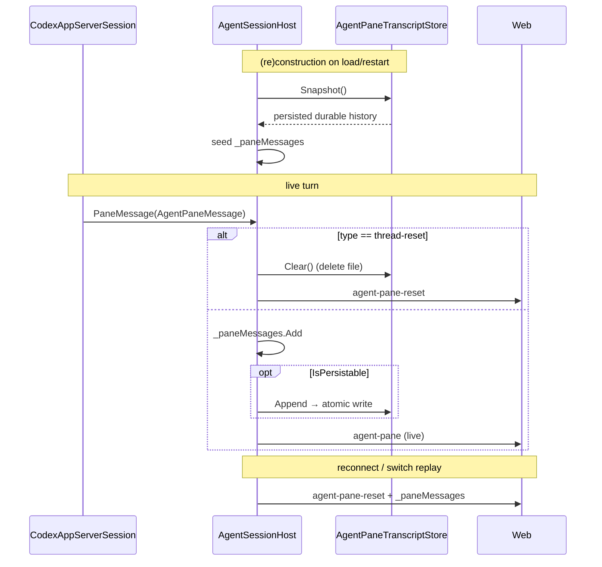

# Native agent pane persistence

The native (structured) agent pane — currently Codex — renders from a stream of provider-neutral
`AgentPaneMessage`s. Unlike the Claude pane (a TUI that repaints itself from `claude --resume`) or the
shell (which replays a `ScrollbackLog`), the structured pane had no durable record of its output: the
messages lived only in `AgentSessionHost._paneMessages` in memory. So any teardown of the `HostSession`
— a session unload/reload, a worker/app restart, or (on the remote transport) a page navigation that
recycles the worker — lost the rendered pane. `CodexThreadStore` still resumed the *conversation* for the
next turn, but the resumed thread does not repaint prior output, so the pane came up blank.

This adds the missing durable transcript, so the pane restores identically across all three paths.

## Design

A per-worktree transcript file, keyed like the shell scrollback log:
`~/.weavie/workspaces/<id>/agent-panes/<worktreeDigest>.json` (`WeaviePaths.WorkspaceAgentPaneFile`).

`AgentPaneTranscriptStore` (`Weavie.Core.Sessions`) persists the **durable subset** of the message
stream as **append-only JSONL** (one message per line), on an owner-only file (`SecureFile.Restrict`,
since a transcript can echo command output or file contents), with a `Log` event for I/O failures. It is
provider-neutral: any `IStructuredAgentSession` provider inherits persistence.

JSONL rather than a versioned single-document rewrite (as `CodexThreadStore`/`ClaudeSessionStore` use):
the transcript is unbounded, so rewriting the whole file on every completed item would be O(n²) on the
pane's hot path. Append is O(1). It trades whole-file atomicity for that — acceptable for a best-effort
cache: load is line-resilient, so a torn last line (a crash mid-append) or a stale-schema record is
skipped, never fatal to the rest.

`AgentSessionHost` owns the seam. In the structured branch it constructs the store, **seeds the in-memory
`_paneMessages` replay buffer from the persisted snapshot before subscribing** (so restored history
precedes live messages), then appends each durable message on publish. `ReplayPane` is unchanged — it
already re-posts `_paneMessages`, which now starts non-empty after a reload.

## What persists

`AgentPaneTranscriptStore.IsPersistable` keeps only durable conversation, not live-only chrome:

- **Persisted:** `user-message`, `user-steer`, `user-image` (submitted only), `item-completed`,
  `interrupted`.
- **Dropped (live-only):** turn lifecycle (`turn-*`), in-progress items (`item-started`), incremental
  diffs (`file-patch-updated`, `turn-diff`), pending/resolved prompts (`approval-*`, `input-*` — the
  request id is tied to a now-dead process, so a restored prompt is unanswerable), `draft`,
  `edit-location`, `thread-ready`, and transient launch/stderr `warning`/`error` (regenerated live on
  each launch — persisting them would re-accumulate the same notice on every restart).

The transcript is deliberately **uncapped** — capping would silently drop history, and the message count
is bounded by the conversation (Codex opts out of token-level streaming, so the persistable stream is
roughly one line per completed item and per user turn).

## Reset

When Codex abandons a saved thread (`thread/resume` → "no rollout found"), it clears `CodexThreadStore`
and emits a `thread-reset` control message; `AgentSessionHost` intercepts it, clears the buffer, deletes
the transcript file, and posts `agent-pane-reset`. So the on-disk transcript stays consistent with the
live thread: both survive a resume, both clear on a fresh thread.

## Not addressed

- **Dedup against resume-replay.** The observed protocol (and the fake app-server) do not replay history
  on `thread/resume`, so a seeded transcript is not double-rendered. If a future Codex build does replay
  completed items, add upsert-by-`itemId` at the seed/append boundary (kept out here to avoid the
  approval-request/resolved collapse that a naive whole-buffer upsert would cause, and to avoid guarding
  a behavior we do not observe).
- **Orphaned files on delete.** A deleted worktree's transcript file is left on disk, matching the
  existing behavior of the shell scrollback log. A reused worktree path stays coherent via the
  `thread-reset` path above.
