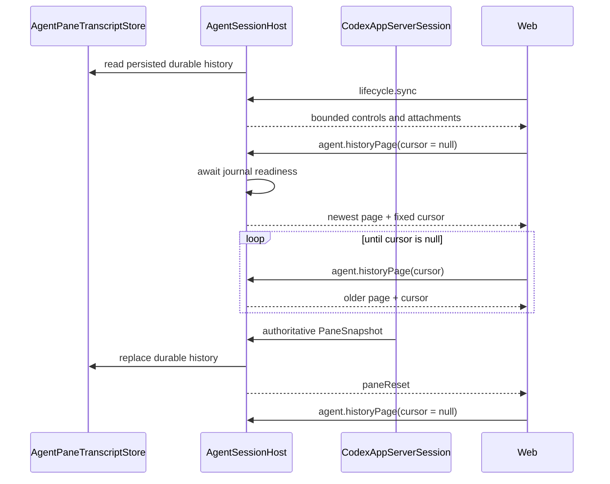

# Native agent pane persistence

The native structured-agent pane renders provider-neutral `AgentPaneMessage` records owned by
`AgentSessionHost`. The transcript survives session unloads and worker restarts without making session sync or
the shared message transport proportional to the transcript's size.

## Ownership

Each worktree has an owner-only transcript at
`~/.weavie/workspaces/<id>/agent-panes/<worktreeDigest>.json`
(`WeaviePaths.WorkspaceAgentPaneFile`). `AgentPaneTranscriptStore` persists the durable message subset as
append-only JSONL and reports I/O failures through its `Log` event.

`AgentSessionHost` is the single transcript owner. It maintains the materialized in-memory pane, journals live
messages, seeds persisted history on its journal worker, and replaces both stores when the provider supplies an
authoritative resumed-thread snapshot. The replacement increments a generation and publishes `paneReset`; it
does not replay the replacement through the live-message path.

## Pull-paged history

`lifecycle.sync` publishes bounded interactive state only. It never pushes transcript history.

The web pane requests `agent.historyPage` when it is first attached. Pages are returned newest first, with a
target serialized size of 192 KiB. A record larger than one page is serialized once and split on UTF-16
character boundaries. Every fragment identifies the record and declares its `jsonOffset` and total
`jsonLength`, so every unbounded record field remains pageable. The serialized form is cached by record revision,
keeping a fragmented read linear in the record size. A cursor fixes four values for the read:

- `generation` rejects pages from a transcript that has since been replaced.
- `ceiling` fixes the newest record included by the first request, so live appends cannot extend an active read.
- `before` advances toward the start of the fixed transcript.
- `jsonBefore` advances through one oversized record without changing its ordinal, while `jsonRevision` pins
  every fragment to one exact mutation. If that record changes mid-read, the page explicitly reports a restart
  from the current transcript tail and the client drops incomplete fragments from the superseded revision.

Every wire record carries its generation, stable ordinal, and per-mutation revision. The web accumulator
reassembles serialized-record fragments, validates their identity, selects the newest revision for each ordinal
across history and live traffic, and rejects stale generations. It publishes after every page and yields one
render frame before requesting the next
page, so a long transcript becomes visible incrementally and does not monopolize the browser main thread. Every
WebSocket reconnect starts a fresh fixed-ceiling read, recovering messages emitted while the page was offline.

The journal readiness task is awaited by `historyPage`, not session sync. A newly loaded session can therefore
answer unrelated commands while its transcript is still being read from disk.

## Provider hydration

Codex `thread/resume` is authoritative for history produced outside Weavie. Hydration raises one host-internal
`PaneSnapshot` event. `AgentSessionHost` atomically replaces the in-memory transcript and journal, increments the
generation, and tells attached panes to restart paging. This avoids broadcasting every hydrated item and avoids
temporarily exposing the persisted seed as a second copy of the same conversation.

```mermaid
sequenceDiagram
  participant Store as AgentPaneTranscriptStore
  participant Host as AgentSessionHost
  participant Codex as CodexAppServerSession
  participant Web

  Host->>Store: read persisted durable history
  Web->>Host: lifecycle.sync
  Host-->>Web: bounded controls and attachments
  Web->>Host: agent.historyPage(cursor = null)
  Host->>Host: await journal readiness
  Host-->>Web: newest page + fixed cursor
  loop until cursor is null
    Web->>Host: agent.historyPage(cursor)
    Host-->>Web: older page + cursor
  end

  Codex->>Host: authoritative PaneSnapshot
  Host->>Store: replace durable history
  Host-->>Web: paneReset
  Web->>Host: agent.historyPage(cursor = null)
```

## Transport isolation

The remote WebSocket transport fragments oversized logical messages into 64 KiB source chunks. Its send loop
round-robins active message routes while preserving FIFO order within each exact `(scope, session, feature)`
route. A large agent record therefore cannot hold branch results, command responses, or another session behind
all of its chunks. The browser receiver reassembles multiple interleaved logical messages independently.

This transport fairness is defense in depth. Paging is what prevents transcript loading itself from becoming one
unbounded logical operation.

## What persists

`AgentPaneTranscriptStore.IsPersistable` keeps only durable conversation:

- **Persisted:** `user-message`, `user-steer`, submitted `user-image`, `item-completed`, and `interrupted`.
- **Live only:** turn lifecycle, in-progress items, streaming deltas, incremental diffs, prompts, drafts,
  edit locations, thread readiness, and transient launch/stderr warnings and errors.

JSONL append keeps the unbounded transcript off an O(n²) whole-file rewrite path. Loading is line-resilient: a
torn final record is skipped and earlier records remain available. The transcript is deliberately uncapped.

## Reset

`transcript-reset` clears the in-memory pane and deletes the journal when Codex starts a genuinely fresh thread,
including recovery after a saved thread is rejected. An authoritative resumed-thread snapshot uses the atomic
replacement path described above. A resume rejection that also prevents the replacement thread from starting
surfaces as an error and leaves the saved mapping and transcript intact.
