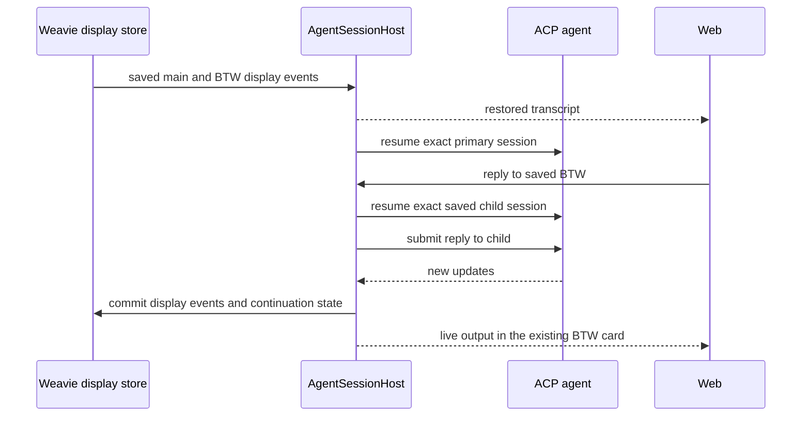

# Native agent pane state

The native structured-agent pane renders provider-neutral `AgentPaneMessage` records owned by
`AgentSessionHost`, without making session sync or the shared message transport proportional to the
transcript's size.

## Ownership

**Weavie owns the displayed ACP transcript; the agent owns model history and continuation.** The private
`acp-conversations.db` SQLite database stores the current primary ACP identity, BTW continuation identities,
local turn numbers, guidance state, plan-to-turn mappings, and ordered provider-neutral display events.
Each event and its conversation state commit in one transaction before the event reaches the pane. Writes
append only the new events, so streaming does not rewrite the conversation. Database failures stop the agent
and surface an error; saved data is never silently discarded or replaced with provider replay.

The host's existing pane reducer materializes these events in memory and serves both live updates and HTTP
history. Switching between loaded sessions uses that in-memory projection. Cold load restores the saved event
journal, including side conversations, before starting the agent. Pending interactions, active tools, partial
output, and interrupted turns receive explicit cancellation events; old process requests never become clickable
live requests after reload.

Submitted images retain the exact encoded bytes and MIME type sent in the ACP prompt. Images and other
structured media remain media fields in the journal, independent of temporary attachment files and any
text or data-URL representation in adapter replay.

The journal records activity observed by Weavie. It does not import older provider history or automatically
merge changes made in another client. The terminal pane keeps its existing provider-owned history behavior.

## Generations

A record is addressed by `(generation, ordinal, revision)`. Clearing the pane restarts ordinals, so the
generation is what lets a client tell new content from old — and a generation change is a specific claim:
*every ordinal you hold is void, re-fetch.*

It therefore changes only when content is genuinely discarded:

- a provider `transcript-reset` — the conversation is gone;
- a provider snapshot replacing a **non-empty** pane.

A snapshot filling an **empty** pane invalidates nothing, so it streams into the current generation as ordinary
live records. Restoring a transcript is not an epoch change, and treating it as one used to force every
connected client into a mid-load re-sync.

Clients must survive a generation change they did not see announced — `paneReset` is a broadcast, and a
reconnecting page can miss one. Observing a live record from a newer generation is itself sufficient notice:
the client discards its state and re-fetches history.

## Streamed history

`lifecycle.sync` publishes interactive state with agent controls first. Transcript transfer uses the shared
authenticated HTTP origin available on every platform, independently of WebSocket/native live messages.

The client requests `/weavie-agent-history` with its exact slot and incarnation. The host captures the
materialized records and generation/revision watermark under the pane lock, then serializes outside it.
The response is newline-delimited JSON: newest-first batches of up to 64 typed records, followed by an
explicit completion marker. Every batch carries the same generation, revision, and total record count.
There are no cursor requests, retained readers, or JSON-inside-JSON record fragments.

Serialization, writes, and flushes are awaited. HTTP/network buffering supplies producer backpressure;
the browser reads and applies batches sequentially rather than queueing detached work. This does not
require browser-render acknowledgements. Request cancellation and session shutdown cancel the stream.
Cross-origin reads require the explicit worker token; cookie-only requests remain same-origin.

The accumulator preserves generation/revision and cumulative-delta merging with live output. It publishes
the newest batch promptly, accumulates older records without repeatedly projecting the growing transcript,
and publishes the complete view at the final marker. A reconnect watermark advances only when that marker
matches the received count. Completed clients request only records changed since their watermark;
a generation change returns the complete replacement. Removing a client session or resetting history
aborts its outstanding HTTP read.

A stream failure leaves already-rendered text intact and shows a persistent error with the Reload Agent
History command and its effective shortcut. Reloading retries history without restarting the provider.

## Provider hydration

ACP reconnect uses `session/resume` when advertised. A load-only agent receives `session/load`; its replayed
messages, tools, and plans are drained without entering the display or live activity tracking. Configuration,
commands, and usage updates still establish the current controls. Local turn numbers and plan identities come
from Weavie's continuation records, independently of replay order or adapter content serialization.

A `/btw` record retains its exact child ACP session id, original anchor and question, and independent local turn
and plan state. Cold load restores its display without opening a child runtime. Reply creates a runtime bound
to that saved child, resumes or loads it, and submits there. It never forks a replacement from the current main
conversation. Missing provider sessions fail visibly while the saved conversation remains readable.

Provider identities are committed as soon as creation/fork succeeds, before a prompt can be submitted. A host
interruption during initial fork setup leaves the card explicitly interrupted. `/clear` retires current work,
atomically removes the primary and side descriptors and journal, resets the pane, and starts a new conversation.
Late events from retired generations and side runtimes cannot write into the replacement conversation.
Deleting a Weavie session removes its stored display and continuation data for all providers, including
uninstalled providers; unloading retains them. Cleanup errors are visible and leave the session entry for retry.

```mermaid
sequenceDiagram
  participant DB as Weavie display store
  participant Host as AgentSessionHost
  participant ACP as ACP agent
  participant Web

  DB->>Host: saved main and BTW display events
  Host-->>Web: restored transcript
  Host->>ACP: resume exact primary session
  Web->>Host: reply to saved BTW
  Host->>ACP: resume exact saved child session
  Host->>ACP: submit reply to child
  ACP-->>Host: new updates
  Host->>DB: commit display events and continuation state
  Host-->>Web: live output in the existing BTW card
```

## Transport isolation

The remote WebSocket transport lazily encodes oversized logical messages into bounded source chunks. Its send
loop round-robins active message routes while preserving FIFO order within each exact
`(scope, session, feature)` route. One connection admits one partial large body at a time while continuing to
serve small unrelated routes, bounding receiver reassembly memory without restoring head-of-line blocking. A
large agent record therefore cannot hold branch results, command responses, or another session behind all of its
chunks.

History uses HTTP streaming and does not enter this message outbox. Live updates retain the shared transport's
route fairness while history is in flight.

## Failure semantics

There is no rejected-session recovery fallback. If `session/load` or `session/resume` rejects the exact persisted
ACP session id, the native session fails visibly and retains its saved mapping for diagnosis. Starting a
different conversation is an explicit user action, never a silent transcript reset.

A saved display remains readable if continuation fails. The failure is shown explicitly; displaying history
never implies the provider session is available. A successful explicit restart after a storage failure must
reestablish persistence before accepting further work.
