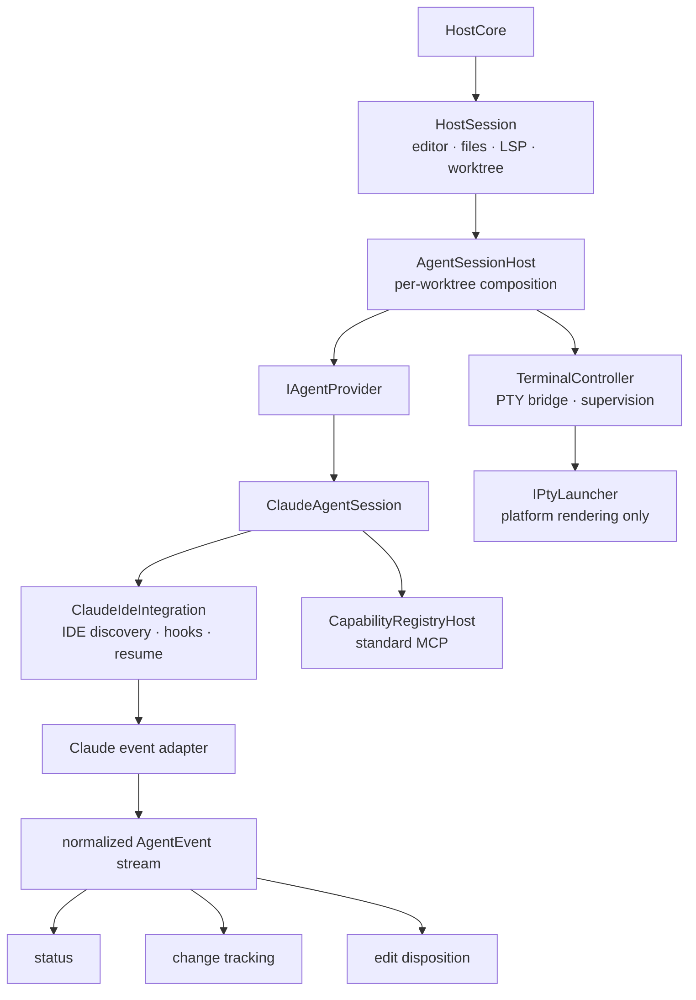

# Agent provider abstraction

**Status:** implemented

Weavie currently embeds Claude Code as the agent in every session. The integration is capable but its
responsibilities are spread across terminal lifecycle, CLI launch construction, conversation persistence,
Claude's IDE protocol, standard MCP capabilities, hooks, permission observation, change tracking, session
status, and the web pane protocol. Adding another agent directly to those branches would duplicate the
integration and make every consumer understand both CLIs.

This spec extracts the existing Claude behavior behind an agent-provider boundary before another provider
is implemented. The extraction is a compatibility refactor: **the Claude-only build must have no observable
behavior change and lose no functionality**. Codex support is a separate change which starts only after the
Claude provider passes the parity gate in this document.

## Goals

- Make one worktree-scoped agent an implementation selected through a provider registry.
- Preserve the complete Claude experience while moving its provider-specific behavior behind that boundary.
- Keep PTY transport, process supervision, editor/worktree/LSP state, session isolation, and web routing in
  Weavie's shared infrastructure.
- Keep the standard Weavie capability registry reusable by any provider that can connect to MCP.
- Normalize only the agent events Weavie consumes; retain provider-specific protocols inside the provider.
- Make a future Codex provider additive rather than a second set of branches through `HostSession`,
  `TerminalController`, and the platform PTY launchers.

## Non-goals

- Implement Codex.
- Build a model API, agent loop, planner, or cross-agent workflow engine.
- Define lowest-common-denominator permission, planning, or IDE semantics for every CLI.
- Rename user-visible Claude labels, settings, commands, persisted files, pane kinds, or bridge messages.
- Change Claude's launch arguments, environment, hook policy, resume policy, MCP tools, or review behavior.
- Let a session change providers in place. Provider selection and its persistence are designed when the
  second provider exists and its resume semantics are known.

## Compatibility contract

The first provider-only release contains exactly one registered provider: Claude. Selection is therefore
unconditional and introduces no setting or prompt. Existing state remains authoritative:

- `claude.path`, `claude.resumeSession`, and `claude.allowAllTools` retain their keys, defaults, scopes, and
  application modes.
- `~/.weavie/claude-sessions.json` retains its format and path.
- The terminal pane and bridge session remain `terminal:claude` and `"claude"`.
- Existing command ids, labels, shortcuts, layouts, bootstrap data, and session-rail payloads remain unchanged.
- Claude receives the same ordered CLI arguments, environment additions/removals, working directory, generated
  MCP/settings/system-prompt files, and resume/session id.
- The Claude IDE lock file and its authentication behavior remain unchanged.
- Hook decisions, clickable edit locations, openDiff behavior, status transitions, change baselines, and
  permission-mode behavior remain unchanged.
- Existing sessions, layouts, settings, worktrees, transcripts, and remote workers require no migration.
- `Weavie.FakeClaude` and the current full-stack journeys run without provider-specific test forks.

No opportunistic rename, cleanup, protocol revision, setting migration, or behavior correction belongs in
this extraction. A behavior that cannot be characterized is characterized before it is moved.

## Current coupling

The important coupling is concentrated even though Claude terminology appears throughout the product:

- `HostSession` constructs the Claude terminal, transcript store, change tracker, observed permission mode,
  IDE/registry servers, hook bridge, diff presenter, status machine, and all subscriptions between them.
- `TerminalController` owns generic PTY behavior and Claude-only resume selection, startup confirmation,
  poisoned-session recovery, transcript adoption, and CLI argument inputs.
- `IPtyLauncher` and both platform implementations branch on `IsClaude`, resolve `claude.path`, construct
  Claude arguments, strip the Anthropic API key, and inject Claude discovery environment variables.
- `IdeIntegration` combines three distinct responsibilities: Claude's proprietary IDE server/discovery,
  the provider-neutral capability registry MCP server, and Claude hook relay/configuration.
- `SessionStatusMachine`, `SessionChangeTracker`, and `ObservedPermissionMode` consume Claude hook payloads
  directly instead of events describing the facts Weavie needs.
- Host commands and the web correctly expose Claude-specific language. Those names are compatibility surface,
  not an architectural blocker, and remain in the first extraction.

## Target architecture



### Provider and session

`Weavie.Core/Agents` defines the provider-neutral contract and event vocabulary. A provider is stateless
apart from app-global services injected into its constructor; it creates one live provider session per
loaded Weavie session.

The intended contract is:

```csharp
public interface IAgentProvider {
    AgentProviderInfo Info { get; }
    IAgentSession CreateSession(AgentSessionContext context);
}

public interface IAgentSession : IAsyncDisposable {
    AgentProviderInfo Provider { get; }
    AgentLaunch ResolveLaunch();
    void ObserveTerminalOutput(ReadOnlyMemory<byte> data);
    void ObserveTerminalInput(ReadOnlyMemory<byte> data);
    void ObserveProcessExit(AgentProcessExit exit);
}
```

These terminal observations exist because Claude startup confirmation, permission-prompt input, and failed
resume recovery currently depend on the real terminal stream. They do not move PTY ownership into the
provider. `ResolveLaunch()` runs on every supervised start, not once at session construction: the current
Claude implementation can choose `--session-id` on one attempt, `--resume` on the next, and change the next
attempt after poisoned-session recovery. `AgentProcessExit` carries the exit code and whether the exit was
unexpected. `TerminalController` computes that fact from supervisor state before notifying the provider, then
notifies `ProcessSupervisor`, preserving the current recovery ordering. Methods that extraction proves
unnecessary are removed rather than retained for hypothetical providers.

`AgentSessionContext` carries only required, provider-neutral per-session dependencies: workspace and scratch
roots, settings, editor state, diff presentation, the current Weavie session id, host runtime information,
the session integration credential, capability-registry endpoint, and an `IAgentEventSink`. `AgentSessionHost`
uses command/layout/theme/keybinding services to build that registry before it creates the provider session;
those services do not leak into the provider context. Provider-only app-global state such as
`ClaudeSessionStore` belongs to `ClaudeAgentProvider`.

There are no nullable injected capabilities. If providers differ, `AgentProviderInfo` advertises explicit
capabilities and the corresponding action is either implemented or surfaced as unavailable. A missing
capability must never silently degrade to an unrelated behavior.

### Launch boundary

`AgentLaunch` is a logical child launch resolved afresh for each supervised start:

- executable;
- ordered arguments;
- working directory;
- environment additions/overrides;
- environment variables to remove;
- working-directory behavior (`Fixed` or `FollowReportedCwd`);
- output capture (`Disabled` or `File(path)`).

The provider constructs agent-specific flags, environment, and required terminal behavior. Claude uses a
fixed workspace cwd even after OSC 7 reports another directory, and alone tees output to `WEAVIE_PTY_LOG`;
the shell follows its reported cwd and does not use that capture file. These policies remain explicit without
making `TerminalController` know an agent identity. `TerminalController` supervises and bridges the resulting
PTY child. `IPtyLauncher` performs only platform rendering: ConPTY creation and Windows command shim handling,
or POSIX PTY creation and login-shell wrapping. It does not read agent settings or branch on an agent identity.

The shell launch remains a separate shared concern. It is not represented as an agent provider.

### Agent event boundary

Raw provider payloads do not cross into shared consumers. Events are discriminated records with only the
fields relevant to that event; they are not a single record with a collection of optional fields.

The initial vocabulary is derived from current Claude consumers:

- session started;
- prompt submitted / turn working;
- tool starting and tool completed;
- file mutation starting and completed, including normalized paths and correlation identity;
- permission requested and resolved;
- turn stopped or waiting to resume;
- edit disposition changed (`Plan`, `ReviewEdits`, `AutoApply`, or explicitly `Unknown`);
- user-facing message or edit location;
- provider process state, supplied by `ProcessSupervisor` through `AgentSessionHost`.

`ClaudeHookEventAdapter` parses `HookRequest`, classifies Claude tool names, and produces these events. It
delivers them synchronously to the required `IAgentEventSink` owned by `AgentSessionHost`. The sink updates
shared consumers and returns `AgentEventFeedback`; for a completed edit that feedback contains the clickable
location computed by `SessionChangeTracker`. `ClaudeIdeIntegration` folds the feedback into the same hook
response before replying to the relay. This preserves the current order: observe and snapshot disk, compute
`EditLocationFor`, enrich the Claude decision, then reply. A passive event stream alone is insufficient.

Claude decision JSON stays in the Claude integration. In particular, shared code must not learn about
`PermissionRequest`, `permission_mode`, `Edit`, `Write`, `MultiEdit`, or Claude's hook output schema.

The normalized event path preserves ordering and correlation from the hook stream. `SessionChangeTracker`
continues to snapshot before a mutation and inspect disk after it; it never trusts file contents supplied by
an agent. During the compatibility extraction, malformed, missing, and out-of-scope mutation paths retain the
current behavior: the tracker ignores them and never attributes them to another session. Changing how those
inputs surface is a separate behavior decision.

### MCP and IDE integration

The current `IdeIntegration` is split along the protocol boundary:

- `CapabilityRegistryHost` owns the standard, model-facing Weavie MCP capability server: settings, commands,
  layout, theme, and current-session identity. It exposes a connection description; each provider serializes
  that description into its own CLI configuration.
- `ClaudeIdeIntegration` owns Claude's IDE MCP server, `~/.claude/ide/<port>.lock`, discovery environment,
  filtered IDE tools, hook pipe/server, generated `--settings`, and Claude system-prompt appendix.
- `AgentSessionHost` creates one `AgentSessionCredential` per loaded session and passes it to both
  `CapabilityRegistryHost` and the selected provider through `AgentSessionContext`. `ClaudeIdeIntegration`
  uses that exact credential for the IDE server and lock file, preserving the current shared token across the
  Claude IDE and registry servers. Credential generation is extracted from `IdeLockFile` without changing
  token format or entropy. Token separation is a later security change, not refactor collateral.

The provider contract does not require Claude's filtered IDE protocol. A future provider uses the standard
registry and implements editor/diff integration through the surfaces it actually supports. Provider capability
metadata makes any missing feature explicit until parity is implemented.

### Host composition

`AgentSessionHost` in `Weavie.Hosting` composes a provider session with the generic terminal and Weavie-owned
consumers. It wires:

- terminal output/input/exit observations to the provider session;
- provider events to change tracking, status, edit-disposition observation, and user-facing messages;
- supervisor transitions to status;
- terminal-first/provider-integration-second disposal before worktree removal;
- the existing terminal bridge identity and slot binding.

`HostSession` continues to own files, scratch buffers, pasted images, editor channel/state, diff presentation,
commands, LSP, workspace watching, and the shell. Its agent construction block becomes one
`AgentSessionHost` created from the selected provider.

`HostServices` owns an `AgentProviderRegistry`. During the extraction that registry requires exactly one
Claude provider. It does not select by default string or fall back when a provider is missing; invalid
composition fails at startup.

## Session isolation

The invariants in [session-isolation-invariants.md](session-isolation-invariants.md) remain load-bearing:

- each loaded Weavie session owns exactly one provider session rooted at that session's worktree;
- every agent terminal frame remains slot-tagged and streams to its own xterm;
- editor-mutating output is gated by that session's `SessionEditorChannel`;
- MCP/IDE/hook endpoints and credentials remain per session;
- change events resolve against that session's workspace and scratch roots;
- background sessions cannot publish onto the active editor surface;
- provider disposal completes before its worktree may be removed.

Disposal preserves today's order: stop and dispose the agent PTY first, then stop the provider's hook/MCP
listeners and remove its generated artifacts. Only after both complete may the worktree be removed.

Provider identity must not be inferred from the active session. When provider selection is later introduced,
it becomes persisted session data and travels with the session through load, unload, restore, and remote hosts.

## Build sequence and gates

Each phase is independently buildable, testable, and behavior-preserving. No phase may leave another host or
the shared working tree broken.

### Phase 0 — freeze Claude behavior

Add missing characterization coverage before changing ownership:

- exact Windows and POSIX executable, ordered arguments, quoting, environment additions, and removals;
- registry MCP, Claude settings, and system-prompt file contents and permissions;
- IDE lock lifecycle and per-session endpoint isolation;
- new-session id vs. resume id, `/clear` adoption, missing transcript, and poisoned-resume recovery;
- hook payload to decision, status, change baseline, edit location, and observed mode;
- terminal restart, crash backoff, crash-loop state, and intentional teardown;
- existing bridge values and bootstrap/layout restoration.

**Gate:** tests describe the behavior being moved, including failure paths. Production code is unchanged.

### Phase 1 — extract the Claude session lifecycle

Introduce the provider/session contracts and move Claude-only launch, resume, transcript, startup watcher, and
recovery behavior out of `TerminalController` into `ClaudeAgentSession`. Keep direct hook consumers temporarily
if needed to keep the phase small.

**Gate:** launch and resume characterization tests are unchanged; all existing suites remain green.

### Phase 2 — make PTY infrastructure provider-blind

Replace `PtyLaunchRequest.IsClaude` and Claude-specific request fields with resolved neutral launch data. Move
agent flag/environment construction into Claude. Keep platform-specific executable wrapping in the platform
launchers. The generic terminal retains `ProcessSupervisor` with the same restart policy and signals.

**Gate:** Windows/POSIX launch snapshots and terminal/supervisor tests are identical in effect.

### Phase 3 — normalize consumed events

Add the Claude event adapter. Move `SessionStatusMachine`, `SessionChangeTracker`, edit disposition, resume
adoption, and clickable edit locations one consumer at a time from `HookRequest` to normalized events. Keep
the hook pipe, request parser, policy, and decision serializer Claude-owned. Preserve the synchronous
observe → edit-location feedback → hook-response path.

**Gate:** each old consumer test is ported alongside its consumer, and full-stack permission/change-review
journeys remain unchanged.

### Phase 4 — separate standard MCP from Claude IDE integration

Extract `CapabilityRegistryHost`. Move IDE discovery, lock file, hook setup, and Claude-generated files into
`ClaudeIdeIntegration`. Preserve tools, schemas, tokens, endpoints, file permissions, cleanup, and launch flags.

**Gate:** capability-registry and IDE protocol tests prove the same tools and lifecycle; real fake-Claude MCP
journeys remain green.

### Phase 5 — compose through `AgentSessionHost`

Replace `HostSession`'s inline Claude assembly and subscriptions with `AgentSessionHost`. Register Claude as
the sole provider in `HostServices`. Internally prefer `Agent` where the concept is genuinely generic, while
leaving compatibility names at public/wire/persistence surfaces.

**Gate:** the Claude parity matrix below is green on the completed abstraction. No Codex code exists yet.

### Phase 6 — provider contract proof

Run the provider contract suite, all Core/Hosting/host builds, web typecheck/unit tests, the complete headless
functional suite, and the remote transport-sensitive subset. Exercise a real local Claude session on supported
GUI hosts for behavior the deterministic process seam cannot prove. Review the complete extraction before
merging it.

**Gate:** Claude is observably identical to the pre-refactor baseline. Only after this gate may Codex design or
implementation begin.

## Claude parity matrix

Every row is required. “Not touched” is not evidence; each row needs an automated test, an existing journey
named in the implementation plan, or an explicit manual runtime check where automation cannot reach a native
surface.

| Area | Required parity |
| --- | --- |
| Discovery | Default/path-configured Claude resolves on Windows, macOS, Linux, and Headless exactly as before. |
| Launch | Argument order, quoting, cwd, environment injection/removal, PTY dimensions, and login-shell behavior are preserved. |
| Supervision | Clean exit, crash, restart/backoff, crash-loop failure, manual restart, and disposal retain their states and terminal notices. |
| Conversation | New id, resume, `/clear`, transcript existence check, startup confirmation, failed-resume recovery, and per-worktree mapping are preserved. |
| Terminal | Input, output, paste framing, resize, reset, replay behavior, clickable links, slot routing, and hidden/background streaming are preserved. |
| Image paste | Clipboard/DOM image paths, scratch-file lifecycle, prompt injection, cleanup, and remote transfer are preserved. |
| Standard MCP | Settings, commands, layout, theme, current-session identity, schemas, authentication, and model visibility are preserved. |
| Claude IDE | Lock discovery, authorization, editor selection/open tabs, open/close file, openDiff, diagnostics behavior, and cleanup are preserved. |
| Hooks | All configured events, additive user-hook behavior, relay discovery, pipe isolation, fail-open relay behavior, and decisions are preserved. |
| Permissions | `claude.allowAllTools`, user deny precedence, edit-vs-tool axes, pass-through prompts, and NeedsInput recovery are preserved. |
| Edit mode | Plan/default/accept-edits observation, auto-keep, pending-diff dismissal, and review gating are preserved. |
| Changes | Pre-edit baseline, post-edit disk observation, multi-edit behavior, scratch/workspace confinement, per-turn reset, and edit locations are preserved. |
| Review | Blocking background openDiff, switch-in replay, keep/reject, undo/redo, per-file/turn actions, and session isolation are preserved. |
| Status | Starting, Working, NeedsInput, Waiting, Idle, Error, notification classification, and rail updates are preserved. |
| Sessions | Primary/worktree creation, prompt seeding, load/unload/delete, restore, dormant sessions, commands, and per-session endpoints are preserved. |
| Editor context | Active selection/open editors, background clearing, switch replay, and stale owner rejection are preserved. |
| Remote | Headless worker launch, fake-Claude seam, bridge routing, reconnect, persistence, and worker teardown are preserved. |
| Configuration | Existing settings, files, defaults, live reactions, malformed-file reporting, and MCP edits require no migration. |
| UI contract | Pane kind/id, labels, shortcuts, commands, bootstrap globals, bridge messages, layout documents, and visual behavior are unchanged. |
| Teardown | PTYs, hook bridge, MCP servers, lock/config artifacts, watchers, LSP, scratch images, and worktree handles are fully released. |

## Test strategy

### Unit and component tests

- Core: Claude hook payload to normalized event; normalized event to status/change/edit-disposition behavior;
  resume selection/adoption/recovery; capability registry connection and cleanup.
- Hosting: exact platform launches; provider-blind terminal behavior; `AgentSessionHost` subscription, slot binding,
  restart, and disposal order; provider registry composition failure.
- Provider contract: workspace rooting, launch completeness, registry availability, lifecycle events, restart
  behavior, cleanup, and explicit capability reporting. Run against Claude first and every later provider.

### Full-stack tests

The fake remains at the child-process seam and exercises the real host graph. Existing journeys must not be
rewritten merely to accommodate the abstraction. Add assertions only where the parity matrix exposes a gap.

- Run the full functional suite on Headless.
- Run only transport-sensitive cross tests and remote-only provisioning/auth/reconnect tests on Remote.
- Keep the native bridge contract test.
- No test invokes a real model.
- No skips, retries, sleeps, quarantines, or loosened assertions are accepted as parity evidence.

### Runtime verification

After automated gates pass, run the real Claude CLI on available native hosts and verify startup/authentication,
resume, mode cycling, permission prompts, openDiff, image paste, crash recovery, session switching, and graceful
close. Record any unautomated check and its result in the implementation PR.

## File plan

Create:

- `src/Weavie.Core/Agents/IAgentProvider.cs` — provider and live-session contracts.
- `src/Weavie.Core/Agents/AgentLaunch.cs` — neutral logical launch data.
- `src/Weavie.Core/Agents/AgentEvent.cs` — discriminated normalized events and provider capability metadata.
- `src/Weavie.Core/Agents/IAgentEventSink.cs` — synchronous normalized observation and feedback contract.
- `src/Weavie.Core/Agents/AgentProviderRegistry.cs` — required provider registration and lookup.
- `src/Weavie.Core/Agents/Claude/ClaudeHookEventAdapter.cs` — raw Claude hooks to normalized events.
- `src/Weavie.Core/Agents/Claude/ClaudeIdeIntegration.cs` — Claude IDE discovery, hook relay, and generated launch files.
- `src/Weavie.Core/Mcp/CapabilityRegistryHost.cs` — standard model-facing Weavie MCP host.
- `src/Weavie.Hosting/Agents/AgentSessionHost.cs` — provider/terminal/consumer composition.
- `src/Weavie.Hosting/Agents/Claude/ClaudeAgentProvider.cs` — Claude provider factory and app-global state.
- `src/Weavie.Hosting/Agents/Claude/ClaudeAgentSession.cs` — per-worktree Claude launch, resume, IDE, hooks, and cleanup.

Modify or split:

- `TerminalController.cs` — retain generic PTY bridge and supervision only.
- `IPtyLauncher.cs`, `WindowsPtyLauncher.cs`, `PosixPtyLauncher.cs` — render neutral launches.
- `HostSession.cs` — delegate embedded-agent composition to `AgentSessionHost`.
- `IdeIntegration.cs` — split into `CapabilityRegistryHost` and `ClaudeIdeIntegration`, then remove the mixed class.
- `HostServices.cs`, `HostCore.cs`, `HostCore.Sessions.cs` — require and pass the provider registry.
- `SessionStatusMachine`, `SessionChangeTracker`, and `ObservedPermissionMode` — consume normalized events.
- Existing Claude persistence/startup classes — move behind the provider without changing their state formats.

Do not mechanically rename every Claude reference. Text and identifiers are changed only when ownership moves
or when a name would make the new internal boundary false.

## Risks and open questions

- **False portability:** Claude IDE tools, permission modes, and transcript formats are not universal. Keep them
  provider-owned instead of expanding the common API until Codex proves a shared need.
- **Event information loss:** normalization can accidentally drop data used by status, change correlation, or
  diagnostics. Characterization precedes every consumer migration, and raw payloads remain available inside
  the Claude adapter for logging and decisions.
- **Ordering races:** hooks, terminal bytes, supervisor changes, and UI input arrive on different threads. The
  existing status versioning and session attribution invariants remain; the event adapter cannot reorder them.
- **Lifecycle leaks:** preserve terminal-first/provider-integration-second teardown; both must finish before the
  worktree disappears. Disposal-order tests are mandatory.
- **Provider identity:** whether provider choice is global, per workspace, or per session is intentionally
  deferred. The likely durable answer is per session, but it must be designed with Codex resume and remote
  persistence rather than guessed here.
- **Structured providers:** a future Codex app-server implementation may not be PTY-first. The session façade
  may use a different transport, but this extraction must not add speculative methods for it.
- **Frontend migration:** replacing `"claude"` with `"agent"` touches layouts, persistence, bridge types,
  commands, tests, and user muscle memory. It is a separately versioned migration after a second provider works.

## Acceptance criteria

The abstraction is complete when:

1. `HostSession`, `TerminalController`, and platform PTY launchers contain no Claude protocol, resume, hook,
   transcript, IDE-discovery, or CLI-argument logic.
2. Claude is registered through `IAgentProvider` as the only provider.
3. Shared consumers receive normalized events rather than `HookRequest`.
4. Standard capability MCP ownership is separate from Claude IDE/hook ownership.
5. Every Claude parity-matrix row has evidence and all automated suites are green without skips or retries.
6. Existing user settings, persisted data, wire contracts, UI behavior, and real Claude workflows work without
   migration or reconfiguration.
7. The change has been reviewed for provider leakage, session isolation, lifecycle cleanup, and accidental
   behavior changes.

Codex work begins only after all seven criteria are met.
