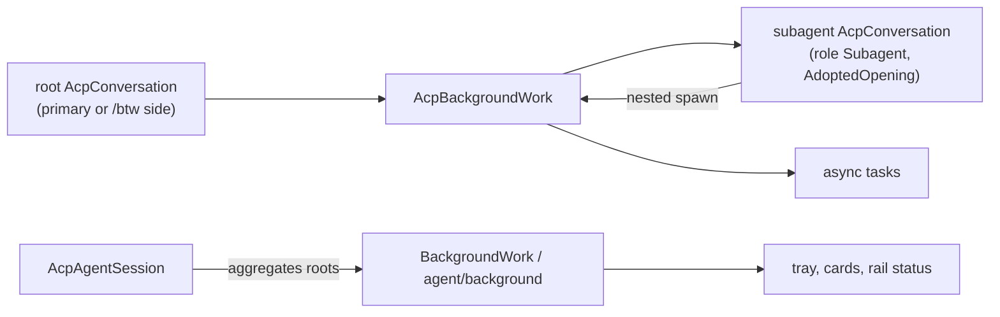
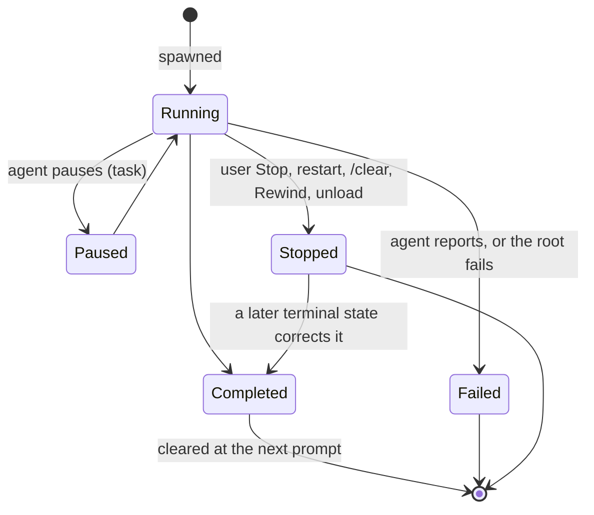

# Background work in the native ACP pane

A native ACP session can run work beside its turns: **subagents** (child conversations the agent spawns) and
**background tasks** (a backgrounded shell command, a Claude workflow). Weavie renders both, lets the user stop
tasks, and refuses actions that would silently end them.

## Protocol

The native pane's `initialize` declares exactly:

```json
"clientCapabilities": { "subagents": {},
  "session": { "configOptions": { "boolean": {} }, "notices": {} },
  "_meta": { "jetbrains": { "air": { "version": 1, "capabilities": ["nativeSubagentSessions", "asyncTasks"] } } } }
```

Inference and consult clients declare none of these. The AIR extension is a documented, opt-in contract both
official adapters implement; declaring it also turns on the AIR base bundle, of which Weavie reads:

- `asyncTasks.backgrounded` on a tool call: the call handed its work to a task, so it never holds the turn
  (`AgentPaneMessage.Background` carries this to the pane);
- `subagent` on a tool call: its subagent's card represents it, so the row is not shown;
- `customAnswer` on an elicitation property: the free-text companion of a choice question, which therefore offers
  Other. A typed single choice is sent as the answer; typed text beside multiple picks goes into the companion.

AIR markers are sticky per tool call. Unknown update kinds still fail the session. claude-agent-acp hides a
subagent's spawning `Agent` tool call from the parent yet sends the parent a metadata-only update for it; an
update for an unannounced call that carries nothing but `_meta` changes nothing and is ignored, while any other
update for an unknown call remains a protocol failure.

## Ownership



- A `subagent_spawned` update adopts the child session as a read-only `AcpConversation`: its endpoint is opened
  and bound on the parent's process from inside the announcement, so none of the child's traffic precedes it.
  It has the full request machinery, so a subagent's approvals and questions are answered in its card through
  request ids namespaced by its conversation id. It never opens, prompts, steers, sets controls, or closes.
- Nested spawns join the same root's work, naming their parent; `subagent_state_update` ends a subagent (a
  `turn-completed` with its state and `CompletedAtMs`) and retires it once its own nested subagents have ended.
- Tasks are keyed by the agent's task id. Progress only updates the live item; a later terminal state corrects an
  earlier one (Claude reports `stopped`, then `completed`). Stopping a task sends `_session/async_task/stop` on
  the root conversation's endpoint even when a subagent started it.
- A conversation loading history treats announcements as replays: a replayed id gets a retired sink owner whose
  traffic drops, an id already owned keeps its owner, and their later states are ignored. A retired endpoint that
  receives an announcement sinks the child the same way.
- Finished items stay until the root's next prompt; there are no timers.

## Lifecycle



The root's failure ends its subagents and tasks as failed; a restart, `/clear`, or Rewind ends them as stopped.
Running work keeps the session status on Waiting unless it works or needs input, which holds the update drain.

## Presentation

- **Subagent card** — a transcript row where it was spawned: label, live state and elapsed time, the parent of a
  nested spawn, its latest activity and any request. Expanded while running, collapsed when finished; Open
  (`weavie.agent.openSubagent`) shows its whole transcript as a read-only editor tab of its session, rendered
  with the agent pane's own transcript components and following the subagent live.
- **Workflow card** — a Claude workflow (`taskType` `workflow`; Claude reports `showInTranscript: false` for
  workflows) journals an item `task:<id>` from spawn to its final state, joined live with the task's usage and
  Stop. Phase 2 (phases, agent rows, log lines) attaches to this item.
- **Tray** — a roving-focus toolbar above the composer lists every item; Enter jumps to an item's card, and Stop
  appears only for stoppable tasks. Background shell commands appear only here.
- **Commands** — `weavie.agent.stopBackgroundTask` (Core, `{id?}`; no id stops the most recently started
  stoppable task) and `weavie.agent.showBackgroundWork` (Web, focuses the tray), both gated by
  `agentBackgroundActive` and without default keybindings.

## Stopping actions

Unload, delete, Recreate, Restart Agent, `/clear`, and Rewind refuse while background work runs, with
`{"backgroundWork":[{name,type,state,startedAtMs}]}` as the result data, unless called with
`stopBackgroundWork: true` (MCP callers see the same refusal). The web turns the refusal into a "Stop background
work?" confirm and re-runs the command with consent on Close anyway; Exit Weavie asks about every loaded session.
A page reload or Reload Agent History does not ask: the work keeps running on the host. With running work,
`/clear` and Rewind restart the process instead of replacing the conversation on it, since only that stops it.
