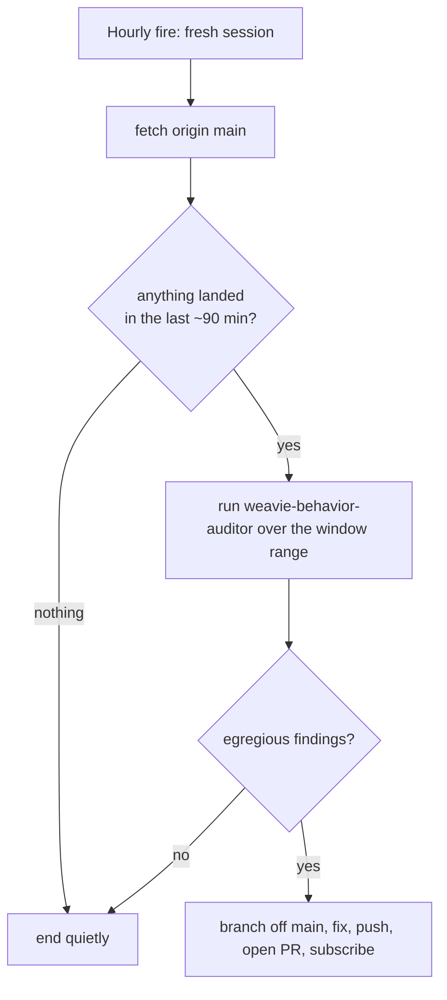

# Behavior-audit routine

A standing hourly reviewer that scans newly-landed commits on `main` for **egregious behavioral
pathologies** — approaches that are cost-pathological or insane even though the code is correct and
passes CI (the canonical case: a change-tracker that reads every file in the repo before and after
every tool call). It is the automated form of the manual `claude/audit-recent-commits` sweep.

It exists because nothing else catches this class: `weavie-reviewer` reviews one change set for
correctness + standards, CI checks that code works, and per-PR human review judges each diff locally
— a *correct but pathological* approach is green everywhere. See the
[`weavie-behavior-auditor`](../../.claude/agents/weavie-behavior-auditor.md) agent for the rubric of
what counts as egregious.

## Shape

- **Trigger** — a Claude Code Routine firing hourly (`0 * * * *`), fresh session per fire.
- **Window, not watermark** — each run audits everything that landed on `main` in roughly the last
  window (90 min). The **clock is the watermark**: the range is derived from commit *landing* times,
  so the routine remembers its place without persisting any state between its ephemeral sessions.
- **Auditor** — the run delegates the judgment to the `weavie-behavior-auditor` agent (read-only).
- **Surfacing** — genuinely egregious findings become a **fix PR** off `main`. A clean range opens
  nothing and ends silently. High bar, low noise.



## Why a time window, not a git-tag watermark

The original design watermarked the newest scanned SHA with the git tag `behavior-audit/last` and
scanned `behavior-audit/last..origin/main`. That requires the routine to **write a ref to the
remote** every run. In the hosted routine environment the git credential can create and fast-forward
**branches** but is denied **tag creation/update and ref deletion** (HTTP 403), so the watermark
could never be persisted and every run fell back to re-scanning a fixed 30-commit window.

A time window needs no persisted state at all, so it sidesteps the permission entirely. The trade is
a deliberate, cheap overlap between consecutive runs (the 90-min window is wider than the 60-min
cadence): re-auditing an already-clean commit is a no-op, and a flagged commit is guarded against a
duplicate PR (see below). The one real limitation — honest, not silently papered over — is that if an
entire hourly run is **skipped** (the session never fires), commits that landed only in that gap and
are older than the next run's window can be missed; the window is kept comfortably wider than the
cadence to absorb ordinary late/jittered fires.

## Deriving the range

`--first-parent --since` keys off *landing* time — a merge commit is dated when it merged, not when
its branch was written — so it captures what reached `main` in the window regardless of how old the
merged commits themselves are:

```
BASE=$(git log --first-parent --since="90 minutes ago" --format=%H origin/main | tail -1)
# nothing landed → BASE empty → stop
RANGE="$BASE^..origin/main"
```

`$BASE^..origin/main` expands past the first-parent line to the **full change set** — the merged
feature commits are reachable from `origin/main` but not from `$BASE^` (the previous `main` tip), so
they are all in range even though their own commit dates predate the window.

## Routine prompt

```
You are the hourly Weavie behavior-audit reviewer. Scan commits that landed on main in roughly the
last hour for EGREGIOUS behavioral pathologies (cost-pathological / insane approaches that pass CI,
e.g. reading every file in the repo per tool call). Do not touch anything that isn't such a pathology.

1. `git fetch origin main`. Record HEAD: `SCANNED=$(git rev-parse origin/main)`.
2. Derive the range from landing time — no watermark, the clock is the watermark. Take the oldest
   first-parent commit that landed in the last 90 minutes and audit from just before it:
     BASE=$(git log --first-parent --since="90 minutes ago" --format=%H origin/main | tail -1)
   If $BASE is empty, nothing landed this window — STOP silently (post nothing, open nothing).
   Otherwise RANGE="$BASE^..origin/main" (first-parent + --since keys off merge/landing time, and
   $BASE^..origin/main expands to the full change set, including merged feature commits whose own
   dates predate the window).
3. Invoke the `weavie-behavior-auditor` agent over $RANGE. Let it decide what's egregious; trust its
   verdict and its high bar.
4. If it reports the range CLEAN: STOP silently. Post nothing, open nothing.
5. If it reports egregious finding(s), for each offending commit <short-sha>:
   - If an open PR already addresses it (branch `fix/behavior-audit-<short-sha>` exists, or its PR is
     open), it's already handled by an earlier overlapping run — STOP, do not touch it.
   - Otherwise branch off the scanned tip: `git checkout -B fix/behavior-audit-<short-sha> $SCANNED`.
   - Fix ONLY the reported pathologies — the minimal, sane approach the auditor named (incremental,
     cached, event-driven, reused handle…). Do not fold in unrelated changes.
   - Run the build/tests for what you touched; keep the change green.
   - Push `-u origin` and open a ready-for-review PR. Title: "Fix egregious behavior: <one line>".
     Body: per finding — the offending commit SHA, path:line, the pathology, its cost/frequency, and
     the fix. Mirror any PR template in .github/.
   - Subscribe to the PR's activity so you follow it to green, then STOP.

Keep it low-noise: a clean hour produces no PR, no message, no comment — nothing at all.
```

## Notes

- **Why a fix PR, not an issue** — chosen for leverage: the routine drafts the revert/fix so a human
  reviews a concrete diff, not a bug report. Because behavioral calls are subjective, it always goes
  through review — nothing auto-merges.
- **No duplicate PRs on overlap** — the fix branch is keyed to the offending SHA
  (`fix/behavior-audit-<short-sha>`), and a run that re-scans a still-open finding in the overlap
  window bails before touching it. So a pathology is surfaced at most once while its PR is open.
- **Tuning the bar** — if it opens PRs for non-egregious things, tighten the rubric in the
  `weavie-behavior-auditor` agent, not this prompt. The prompt is plumbing; the agent is judgment.
```
