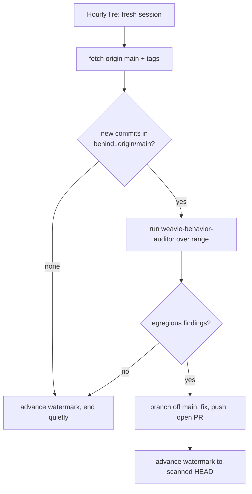

# Behavior-audit routine

A standing hourly reviewer that scans newly-landed commits on `main` for **egregious behavioral
pathologies** — approaches that are cost-pathological or insane even though the code is correct and
passes CI (the canonical case: a change-tracker that reads every file in the repo before and after
every tool call). It is the automated form of the manual `claude/audit-recent-commits` sweep.

It exists because nothing else catches this class: `weavie-reviewer` reviews one change set for
correctness + standards, CI checks that code works, and per-PR human review judges each diff locally
— a *correct but pathological* approach is green everywhere. See the
[`weavie-behavior-auditor`](../../.claude/agents/weavie-behavior-auditor.md) agent for the rubric of
what counts as egregious.

## Shape

- **Trigger** — a Claude Code Routine firing hourly (`0 * * * *`), fresh session per fire.
- **Watermark** — the git tag `behavior-audit/last` marks the newest SHA already scanned. Each run
  reviews only `behavior-audit/last..origin/main`, so no commit is ever reviewed twice and the scan
  stays cheap. The tag is on the remote, so it survives the ephemeral session.
- **Auditor** — the run delegates the judgment to the `weavie-behavior-auditor` agent (read-only).
- **Surfacing** — genuinely egregious findings become a **fix PR** off `main`. A clean range opens
  nothing; it only advances the watermark and ends quietly. High bar, low noise.



The watermark advances to the **scanned HEAD** whether or not a PR is opened, so the next run never
re-scans. Fix commits land *after* the watermark and are re-scanned next run — the auditor won't flag
a fix as a pathology.

## Setup

One-time, seed the watermark at the current tip so the first run only looks forward:

```
git fetch origin main && git tag -f behavior-audit/last origin/main && git push -f origin behavior-audit/last
```

Then create a Routine with cron `0 * * * *`, a fresh session per fire, and the prompt below.

## Routine prompt

```
You are the hourly Weavie behavior-audit reviewer. Scan commits that landed on main since the last
run for EGREGIOUS behavioral pathologies (cost-pathological / insane approaches that pass CI, e.g.
reading every file in the repo per tool call). Do not touch anything that isn't such a pathology.

1. `git fetch origin main --tags`. Record HEAD: `SCANNED=$(git rev-parse origin/main)`.
2. Determine the range. If the tag `behavior-audit/last` exists, RANGE="behavior-audit/last..origin/main".
   Otherwise RANGE="origin/main~30..origin/main" (first run without a watermark).
3. If `git log --oneline $RANGE` is empty, advance the watermark
   (`git tag -f behavior-audit/last $SCANNED && git push -f origin behavior-audit/last`) and STOP —
   nothing to review, do not message anyone.
4. Invoke the `weavie-behavior-auditor` agent over $RANGE. Let it decide what's egregious; trust its
   verdict and its high bar.
5. If it reports the range CLEAN: advance the watermark to $SCANNED, push the tag, and STOP quietly.
   Post nothing, open nothing.
6. If it reports egregious finding(s):
   - Branch off the scanned tip: `git checkout -B fix/behavior-audit-<short-sha> $SCANNED`.
   - Fix ONLY the reported pathologies — the minimal, sane approach the auditor named (incremental,
     cached, event-driven, reused handle…). Do not fold in unrelated changes.
   - Run the build/tests for what you touched; keep the change green.
   - Push `-u origin` and open a ready-for-review PR. Title: "Fix egregious behavior: <one line>".
     Body: per finding — the offending commit SHA, path:line, the pathology, its cost/frequency, and
     the fix. Mirror any PR template in .github/.
   - Advance the watermark to $SCANNED and push the tag (so the pathology's own commit is not
     re-scanned next hour; your fix commit will be, and is not a pathology).
   - Subscribe to the PR's activity so you follow it to green, then STOP.

Keep it low-noise: a clean hour produces no PR, no message, no comment — only an advanced watermark.
```

## Notes

- **Why a fix PR, not an issue** — chosen for leverage: the routine drafts the revert/fix so a human
  reviews a concrete diff, not a bug report. Because behavioral calls are subjective, it always goes
  through review — nothing auto-merges.
- **Runaway guard** — the watermark advances on *every* run, including runs that open a PR, so a
  pathology can be flagged at most once. If a run dies before advancing the tag, the next run simply
  re-scans the same range and re-opens (idempotent by branch name `fix/behavior-audit-<short-sha>`).
- **Tuning the bar** — if it opens PRs for non-egregious things, tighten the rubric in the
  `weavie-behavior-auditor` agent, not this prompt. The prompt is plumbing; the agent is judgment.
