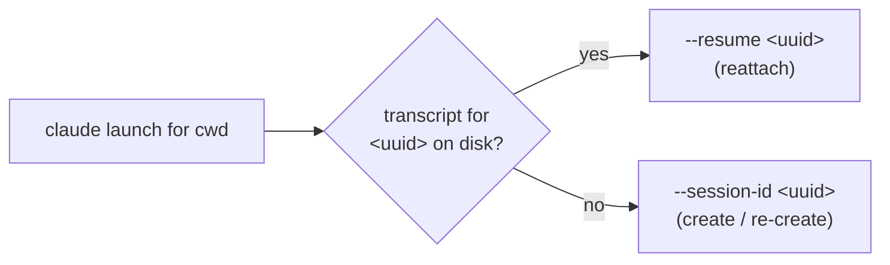

# Claude session resume

Status: implemented
Last updated: 2026-07-09

Reopening a Weavie session should continue the Claude conversation it had last time, not cold-start a
blank one. This resolves the open question carried by
[multi-session-and-worktrees.md](multi-session-and-worktrees.md) ("Auto-resume on restore — `claude
--continue` each restored session, or cold-start?"): **resume, by default.**

## Mechanism

Weavie **assigns** each session's Claude conversation a stable id rather than scraping Claude's storage,
so the id is known up front and resume is deterministic. The **first** launch in a working directory
passes `claude --session-id <uuid>` — a fresh UUID Weavie mints and owns; a **later** launch passes
`claude --resume <uuid>` for the same id to reattach.

Which flag a launch passes is decided from **whether Claude already has a transcript for the id on
disk** — the same thing `claude` itself enforces:

- Claude rejects `--session-id <id>` when a transcript for that id exists (*"Session ID … is already in
  use"*), and rejects `--resume <id>` when it does not (*"No conversation found with session ID: …"*).
- So Weavie resumes **iff** the transcript exists, and re-creates fresh **iff** it does not. Because the
  launch flag is read straight from disk (`ClaudeTranscripts`, which locates Claude's
  `<projects>/<encoded-cwd>/<id>.jsonl`), it can never disagree with what Claude will accept.

Because Claude scopes session lookup to the working directory, and Weavie always resumes from the same
directory it created the session in, this sidesteps the parent spec's "does `--resume` resolve across
worktrees" question entirely — there is no cross-directory resolve.

### Why disk, not a stored flag

An earlier design tracked resumability with a persisted `started` bit, flipped on the first user
message (the `UserPromptSubmit` hook). It could **drift** from what Claude actually had: a `--resume`
that died at startup for a transient reason (the id momentarily held by another process, a startup
hiccup) cleared the bit even though the transcript was intact. Every relaunch then re-created the id
with `--session-id`, which Claude refused — *"Session ID … is already in use"* — on a loop. Deriving the
flag from the transcript on disk removes the second source of truth, so the drift is impossible.

## State

`ClaudeSessionStore` (`src/Weavie.Core/Sessions/ClaudeSessionStore.cs`) persists the directory → id map
to `~/.weavie/claude-sessions.json`, app-global so every host and every parallel session shares one map
and each resumes **its own** directory's conversation. It mirrors `SessionStore`'s conventions: atomic
writes; a malformed file is backed up to `claude-sessions.json.bad` and reset. The id is **never null** —
`Resolve(cwd)` mints and persists one on first use and always returns a non-empty id. The store tracks
only the id; it does not decide resume-vs-create.

`ClaudeTerminalLifecycle` (`src/Weavie.Hosting/Agents/Claude`) is the single integration point: it
resolves the id from the store, reads transcript existence from `ClaudeTranscripts`, and renders the
launch for its `Workspace`. The shell session is untouched. All four hosts wire it, sharing one
app-level store.

## Clearing (`/clear`)

`/clear` starts claude on a *fresh* conversation but leaves the previous transcript on disk, so a naive
resume of Weavie's assigned id reattaches to the long, pre-clear conversation — the very thing the clear was
meant to escape (claude then greets you with its "resume this stale session?" prompt). Weavie keeps the store
honest with what claude actually did, off the same hook stream the change feed rides:

- **On `/clear`** — claude fires a `SessionStart` hook with `source=clear` (registered in `HookSettings` with
  the `clear` matcher, so only clears relay). `ClaudeTerminalLifecycle.ObserveHook` calls
  `ClaudeSessionStore.Clear(cwd)`, which **drops** the tracked id. The next launch mints a fresh id, so
  it cold-starts — nothing stale to resume.
- **On the next real message** — the `UserPromptSubmit` hook carries the id claude settled on;
  `ObserveHook` calls `ClaudeSessionStore.Adopt(cwd, sessionId)`, which **re-tracks** it. A
  cleared-*then-used* session therefore resumes its new, post-clear conversation. `Adopt` is a no-op when the
  id already matches, so the normal flow (claude stays on Weavie's assigned id) never thrashes the file.

`Adopt` also realigns the store whenever claude rotates its id out from under Weavie for any other reason,
repointing the directory at the id claude reports.

## The setting

`claude.resumeSession` (bool, default **on**, `ApplyMode.NextSession`) — a first-class, discoverable
toggle per the CLAUDE.md "no buried flags" rule. Off → no session flag is passed and Claude picks its own
id (the prior behavior); ids resume tracking when it's turned back on.

## Edges

- **In-process restarts resume too.** The pane is a permanent fixture (`RestartPolicy.Always`), so a
  Claude that exits (`/exit`, crash) relaunches; if its transcript exists it reattaches with `--resume`
  and continues the same conversation, and if it doesn't (never messaged yet, or pruned) it re-creates
  under the same id — so it never dead-panes.
- **Pruned / corrupt transcript.** Claude removes transcripts after `cleanupPeriodDays` (default 30). A
  *pruned* id simply has no transcript, so the next launch re-creates it with `--session-id` under the
  same id — no failure, no recovery needed. A transcript that is *present but corrupt* makes `--resume`
  fail at startup; the self-heal handles it: `ClaudeStartupWatcher` sees the unconfirmed crash and
  `ClaudeTerminalLifecycle.ObserveProcessExit` calls `ClaudeSessionStore.Forget`, so the next launch
  mints a fresh id and cold-starts. Confirmation is gated on a full TUI repaint (4 KB of output) so a
  fast-failing launch is never mistaken for one that came up. Most reopens — same day/week — resume
  cleanly.

## Verification

Unit coverage: `tests/Weavie.Core.Tests/Sessions/ClaudeSessionStoreTests.cs` (id lifecycle),
`ClaudeTranscriptsTests.cs` (transcript location + cwd encoding), `ClaudeStartupWatcherTests.cs`
(startup-failure detection), and `tests/Weavie.Hosting.Tests/TerminalControllerResumeTests.cs`, which
drives a real `TerminalController` over a scriptable PTY and asserts the launch flag end-to-end: no
transcript → `--session-id`, transcript present → `--resume` (even with nothing adopted this run — the
regression that produced "Session ID … is already in use"), and an unconfirmed startup crash forgets the
id.
