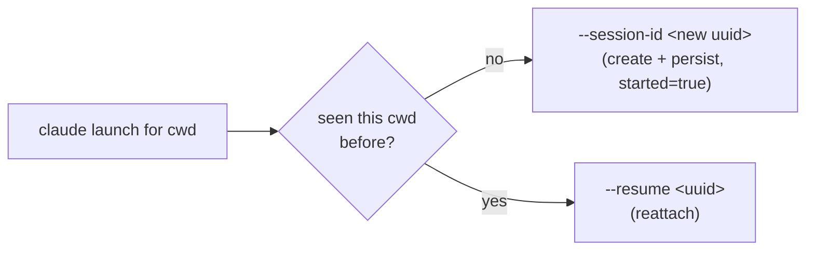

# Claude session resume

Status: implemented
Last updated: 2026-06-20

Reopening a Weavie session should continue the Claude conversation it had last time, not cold-start a
blank one. This resolves the open question carried by
[multi-session-and-worktrees.md](multi-session-and-worktrees.md) ("Auto-resume on restore — `claude
--continue` each restored session, or cold-start?"): **resume, by default.**

## Mechanism

Weavie **assigns** each session's Claude conversation a stable id rather than scraping Claude's storage,
so the id is known up front and resume is deterministic.

- The **first** launch in a working directory passes `claude --session-id <uuid>` — a fresh UUID Weavie
  mints and owns.
- **Every later** launch (an in-process restart by the `ProcessSupervisor`, or a brand-new app process)
  passes `claude --resume <uuid>` for the same id, reattaching to the same transcript.

Because Claude scopes session lookup to the working directory, and Weavie always resumes from the same
directory it created the session in, this sidesteps the parent spec's "does `--resume` resolve across
worktrees" question entirely — there is no cross-directory resolve.

## State

`ClaudeSessionStore` (`src/Weavie.Core/Sessions/ClaudeSessionStore.cs`) persists the directory → id map
to `~/.weavie/claude-sessions.json`, app-global so every host and every parallel session shares one map
and each resumes **its own** directory's conversation. It mirrors `SessionStore`'s conventions: atomic
writes; a malformed file is backed up to `claude-sessions.json.bad` and reset. The id is **never null** —
`Resolve(cwd)` mints and persists one on first use and always returns a non-empty `ClaudeLaunch`.

`TerminalController` (POSIX in `Weavie.Hosting`, plus the Windows sibling) is the single integration
point: the claude controller is handed the store and renders the flag for its `Workspace`. The shell
session is untouched. All four hosts wire it (Linux / macOS / Headless single session keyed by the
workspace; Windows `HostSession` keyed by each worktree, sharing one app-level store).

## Clearing (`/clear`)

`/clear` starts claude on a *fresh* conversation but leaves the previous transcript on disk, so a naive
resume of Weavie's assigned id reattaches to the long, pre-clear conversation — the very thing the clear was
meant to escape (claude then greets you with its "resume this stale session?" prompt). Weavie keeps the store
honest with what claude actually did, off the same hook stream the change feed rides:

- **On `/clear`** — claude fires a `SessionStart` hook with `source=clear` (registered in `HookSettings` with
  the `clear` matcher, so only clears relay). `TerminalController.ObserveHook` calls
  `ClaudeSessionStore.Clear(cwd)`, which **drops** the tracked id. Quit right after a clear and the next launch
  cold-starts fresh — nothing stale to resume.
- **On the next real message** — the `UserPromptSubmit` hook carries the id claude settled on;
  `ObserveHook` calls `ClaudeSessionStore.Adopt(cwd, sessionId)`, which **re-tracks** it (started). A
  cleared-*then-used* session therefore resumes its new, post-clear conversation. `Adopt` is a no-op when the
  id already matches and is started, so the normal flow (claude stays on Weavie's assigned id) never thrashes
  the file.

Together this is "null out on clear, re-track on the first message": clear-then-quit → fresh; clear-then-work
→ resumes the new conversation. Only the claude pane and only while `claude.resumeSession` is on.

## The setting

`claude.resumeSession` (bool, default **on**, `ApplyMode.NextSession`) — a first-class, discoverable
toggle per the CLAUDE.md "no buried flags" rule. Off → no session flag is passed and Claude picks its own
id (the prior behavior); ids resume tracking when it's turned back on.

## Edges

- **In-process restarts resume too.** The pane is a permanent fixture (`RestartPolicy.Always`), so a
  Claude that exits (`/exit`, crash) relaunches under `--resume` and continues the same conversation
  rather than starting blank — the desired continuity, and the reason `started` is persisted at first
  launch (so the very next launch, in any process, reattaches).
- **Pruned transcript (known limitation).** Claude removes transcripts after `cleanupPeriodDays`
  (default 30). Resuming a session whose transcript is gone fails and, under the always-restart policy,
  trips the crash-loop breaker — a *loud* dead pane, not a silent fallback. Self-heal (detect the
  not-found exit, re-create fresh under the same id via `MarkResumeFailed` → `--session-id`) is wired in
  the store but intentionally **not** auto-triggered from the controller in v1, to avoid the dangerous
  false positive of treating an unrelated quick crash as a missing session (which would collide
  `--session-id` against an existing transcript). Most reopens — same day/week — resume cleanly.

## Verification

`temp/resume-proof.mjs` launches the real `Weavie.Headless` host twice against one workspace and prints
the logged launch command: run 1 → `--session-id <uuid>`, run 2 → `--resume <same uuid>`. Independent of
Claude auth/network (the launch line is logged before Claude does anything). Unit coverage in
`tests/Weavie.Core.Tests/ClaudeSessionStoreTests.cs`.
