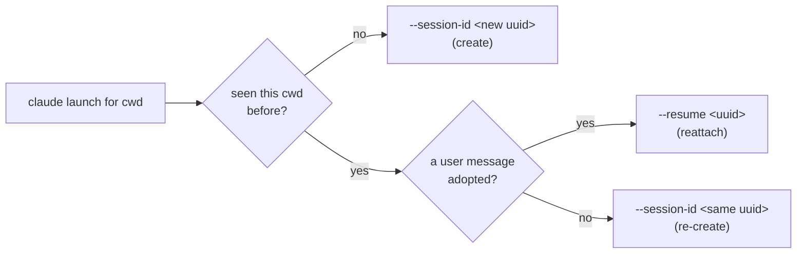

# Claude session resume

Status: implemented
Last updated: 2026-06-21

Reopening a Weavie session should continue the Claude conversation it had last time, not cold-start a
blank one. This resolves the open question carried by
[multi-session-and-worktrees.md](multi-session-and-worktrees.md) ("Auto-resume on restore — `claude
--continue` each restored session, or cold-start?"): **resume, by default.**

## Mechanism

Weavie **assigns** each session's Claude conversation a stable id rather than scraping Claude's storage,
so the id is known up front and resume is deterministic.

- The **first** launch in a working directory passes `claude --session-id <uuid>` — a fresh UUID Weavie
  mints and owns.
- **A later** launch (an in-process restart by the `ProcessSupervisor`, or a brand-new app process) passes
  `claude --resume <uuid>` for the same id **once the session is resumable**, reattaching to the same
  transcript; until then it re-creates under the same id with `--session-id`.

A session becomes resumable only when Weavie has **adopted a real user message** for it — the
`UserPromptSubmit` hook, which fires exactly when claude writes its transcript. Claude *painting its TUI* is
**not** evidence of a resumable conversation: a session opened but never messaged has no transcript, so
resuming it would dead-pane with "No conversation found with session ID: …" (the "missing session" bug).
Keying resumability off the first message, not output volume, is what prevents that. Because the started
flag is persisted, a session adopted in one run stays resumable in later runs even if a run resumes it and
unloads without sending a new message.

Because Claude scopes session lookup to the working directory, and Weavie always resumes from the same
directory it created the session in, this sidesteps the parent spec's "does `--resume` resolve across
worktrees" question entirely — there is no cross-directory resolve.

## State

`ClaudeSessionStore` (`src/Weavie.Core/Sessions/ClaudeSessionStore.cs`) persists the directory → id map
to `~/.weavie/claude-sessions.json`, app-global so every host and every parallel session shares one map
and each resumes **its own** directory's conversation. It mirrors `SessionStore`'s conventions: atomic
writes; a malformed file is backed up to `claude-sessions.json.bad` and reset. The id is **never null** —
`Resolve(cwd)` mints and persists one on first use and always returns a non-empty `ClaudeLaunch`.

`TerminalController` (POSIX in `Weavie.Hosting`, plus the Windows sibling) is the single integration
point: the claude controller is handed the store and renders the flag for its `Workspace`. The shell
session is untouched. All four hosts wire it (Linux / macOS / Headless single session keyed by the
workspace; Windows `HostSession` keyed by each worktree, sharing one app-level store).

## Clearing (`/clear`)

`/clear` starts claude on a *fresh* conversation but leaves the previous transcript on disk, so a naive
resume of Weavie's assigned id reattaches to the long, pre-clear conversation — the very thing the clear was
meant to escape (claude then greets you with its "resume this stale session?" prompt). Weavie keeps the store
honest with what claude actually did, off the same hook stream the change feed rides:

- **On `/clear`** — claude fires a `SessionStart` hook with `source=clear` (registered in `HookSettings` with
  the `clear` matcher, so only clears relay). `TerminalController.ObserveHook` calls
  `ClaudeSessionStore.Clear(cwd)`, which **drops** the tracked id. Quit right after a clear and the next launch
  cold-starts fresh — nothing stale to resume.
- **On the next real message** — the `UserPromptSubmit` hook carries the id claude settled on;
  `ObserveHook` calls `ClaudeSessionStore.Adopt(cwd, sessionId)`, which **re-tracks** it (started). A
  cleared-*then-used* session therefore resumes its new, post-clear conversation. `Adopt` is a no-op when the
  id already matches and is started, so the normal flow (claude stays on Weavie's assigned id) never thrashes
  the file.

Together this is "null out on clear, re-track on the first message": clear-then-quit → fresh; clear-then-work
→ resumes the new conversation. Only the claude pane and only while `claude.resumeSession` is on.

## The setting

`claude.resumeSession` (bool, default **on**, `ApplyMode.NextSession`) — a first-class, discoverable
toggle per the CLAUDE.md "no buried flags" rule. Off → no session flag is passed and Claude picks its own
id (the prior behavior); ids resume tracking when it's turned back on.

## Edges

- **In-process restarts resume too.** The pane is a permanent fixture (`RestartPolicy.Always`), so once a
  session has been messaged, a Claude that exits (`/exit`, crash) relaunches under `--resume` and continues
  the same conversation rather than starting blank — the desired continuity, and why `started` is persisted
  on the first message (so the very next launch, in any process, reattaches). A restart *before* the first
  message re-creates under the same id (nothing to resume yet), so it never dead-panes.
- **Pruned / corrupt transcript (reactive backstop).** Claude removes transcripts after `cleanupPeriodDays`
  (default 30). A session messaged long ago is `started`, so its relaunch attempts `--resume`; if the
  transcript is gone or corrupt the launch fails at startup. The self-heal handles it: `ClaudeStartupWatcher`
  sees the unconfirmed crash and `OnTerminalExited` heals the store — a failed `--resume` re-creates the same
  id (`MarkResumeFailed` → `--session-id`), a failed `--session-id` forgets it (`Forget`) — converging on a
  fresh session within a few relaunches, well under the crash-loop breaker. This **is** auto-triggered from
  the controller (since `fb9962e`); confirmation is gated on a full TUI repaint so a fast-failing launch is
  never mistaken for one that came up. Most reopens — same day/week — resume cleanly.

## Verification

`temp/resume-proof.mjs` launches the real `Weavie.Headless` host twice against one workspace and prints
the logged launch command: run 1 → `--session-id <uuid>`, run 2 → `--resume <same uuid>`. Independent of
Claude auth/network (the launch line is logged before Claude does anything). Unit coverage in
`tests/Weavie.Core.Tests/ClaudeSessionStoreTests.cs`.
