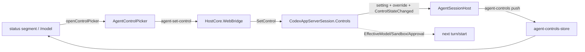

# Native composer controls, slash menu, and prompt history

**Status:** implemented

Three additions to the native structured-agent composer (`AgentComposer`/`AgentPane`, provider `codex`),
built so the **web composer never learns a Codex-specific concept**. The load-bearing move is a
provider-neutral capability interface, `IStructuredAgentControls`, that the Codex session implements and the
web reaches only through provider-neutral bridge messages — a sibling to `IStructuredAgentSession`, probed with
`is` in `AgentSessionHost` exactly like the terminal/structured session capabilities already are.

## Features

1. **Prompt history** — Up recalls the previous submitted prompt, Down the next, only with a collapsed caret
   on the first/last line so multi-line editing still works. Pure web: the prompts already live in the pane
   transcript (`user-message` / `user-steer`), so history is derived there — per-session and reload-durable,
   no new store (`prompt-history.ts`).

2. **Control status line** — a dim strip under the composer showing the session's **model**, **mode**,
   **approvals**, and **sandbox**. Each segment opens a picker; a change applies **live to the running
   session**.

3. **Slash menu** — typing `/` opens an autocomplete of built-in actions (`/model`, `/plan`, `/approvals`,
   `/sandbox` → their commands) plus the session's skills. Sourced through the same capability interface, so
   its contents are provider-supplied, not hardcoded in the UI. A built-in dispatches its command; a skill
   **stages** for structured invocation (below).

## The capability abstraction (Core, provider-neutral)

`AgentControls.cs` defines the records the web renders — all provider-neutral:

- `AgentControlOption { Id, Label, Description? }`
- `AgentControlAxis { Id, Label, Value, ValueLabel, Options, CommandId? }` — `Id` is opaque to the web
  (`collaborationMode` / `approvalPolicy` / `sandbox`); the web renders labels and echoes `Id` back.
  `CommandId` lets every surface advertise the effective, user-overridable keybinding.
- `AgentSlashEntry { Id, Name, Description, CommandId?, InsertText? }` — a built-in action dispatches
  `CommandId`; a skill/prompt inserts `InsertText`. Never both.
- `AgentControlState { Axes, Slash }`

`IStructuredAgentControls`: `AgentControlState ControlState`, `event ControlStateChanged`,
`void SetControl(string axis, string value)`.

## Live change mechanism

Verified against the installed Codex app-server schema (`codex app-server generate-json-schema`): `turn/start`
accepts `model`, `approvalPolicy`, and `sandboxPolicy` — each *"for this turn and subsequent turns."* So a live
model change needs **no thread restart**: the Codex session holds session-local overrides and sends the
effective values on the next `turn/start`. `SetControl` validates against the axis options, stores the selected
value as the default for subsequent Codex sessions, updates the override, and raises `ControlStateChanged`; the
status line reflects it immediately.

Collaboration mode is conversation-local rather than a workspace default. The session obtains the available
presets from Codex's `collaborationMode/list`, stores the selected preset beside the resumed thread id, and
sends its exact model/reasoning settings in `turn/start.collaborationMode`. A saved preset that Codex no longer
advertises is shown as an error and blocks a new turn until the user selects an advertised mode.

## Structured skill invocation

Selecting a skill **stages** it (a chip in the composer), and on submit it rides the turn as Codex's structured
`skill` input item (`{type:"skill", name, path}`) — so Codex loads the skill's `SKILL.md` instructions and runs
it, rather than pasting text. `AgentSlashEntry.SkillName` marks a skill entry; the web stages skill *names* and
submits them in `agent-submit`; the Codex session resolves each name to its `path` from its own `skills/list`
cache (`ResolveSkills`) — a web-supplied path is never trusted, and an unknown name is dropped. A turn may be a
skill alone. `AgentInputAttachment`-style staging keeps images and skills symmetric.

## Data flow

- **Push:** `IStructuredAgentControls.ControlStateChanged` → `AgentSessionHost.PublishControlState` →
  `AgentControlsProtocol.Message` (`agent-controls`) → `agent-controls-store`. Replayed on `ready`
  (`AgentSessionHost.ReplayControls`) so a (re)connecting web view self-heals.
- **Set:** web `agent-set-control` → `HostCore.WebBridge` → `Agent.Controls.SetControl`.
- Models come from the app-server's `model/list`, collaboration presets from `collaborationMode/list`, and
  skills from `skills/list` (re-fetched on `skills/changed`) — no hardcoded catalogs; approvals/sandbox options
  are the provider's own fixed enums.

## Keyboard integration

New user-facing actions are commands: `weavie.agent.selectModel` / `togglePlanMode` /
`selectApprovalPolicy` / `selectSandbox` (bare → open the picker; `value` arg → apply directly). Plan mode
defaults to Shift+Tab. The slash menu's built-ins reference commands by id, so status controls, the palette,
slash actions, and Claude all share one path.

The picker and slash menu are overlays with capture-phase key handling. While either is open it sets a context
key (`agentControlPickerOpen` / `agentSlashMenuOpen`); `AgentSubmit` (Enter) and `AgentInterrupt` (Escape) are
gated `&& !agentSlashMenuOpen && !agentControlPickerOpen`, so those keys drive the open overlay instead of
submitting/interrupting. Up/Down history recall is handled locally in the textarea and stands down while an
overlay is open — a deliberate exception to "actions are commands," since it is a caret-position-dependent
in-textarea editing behaviour that cannot be a keybinding `when`.

## Files

Core: `Agents/AgentControls.cs`, `Agents/IStructuredAgentControls.cs`,
`Agents/Codex/CodexAppServerProtocol.cs` (model on `turn/start`; `model/list` / `skills/list` + readers),
`Commands/CoreCommands.cs` (select commands; overlay gating).
Hosting: `Agents/Codex/CodexAppServerSession.Controls.cs`, `Agents/AgentControlsProtocol.cs`,
`Agents/AgentSessionHost.cs`, `HostCore.WebBridge.cs`.
Web: `agent/agent-controls-store.ts`, `agent/AgentStatusLine.tsx`, `agent/AgentControlPicker.tsx`,
`agent/AgentSlashMenu.tsx`, `agent/slash.ts`, `agent/prompt-history.ts`, `agent/AgentComposer.tsx`,
`agent/AgentPane.tsx`, `bridge.ts`, `commands/types.ts`.
