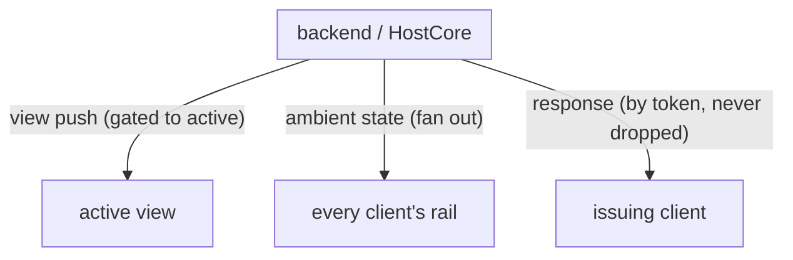
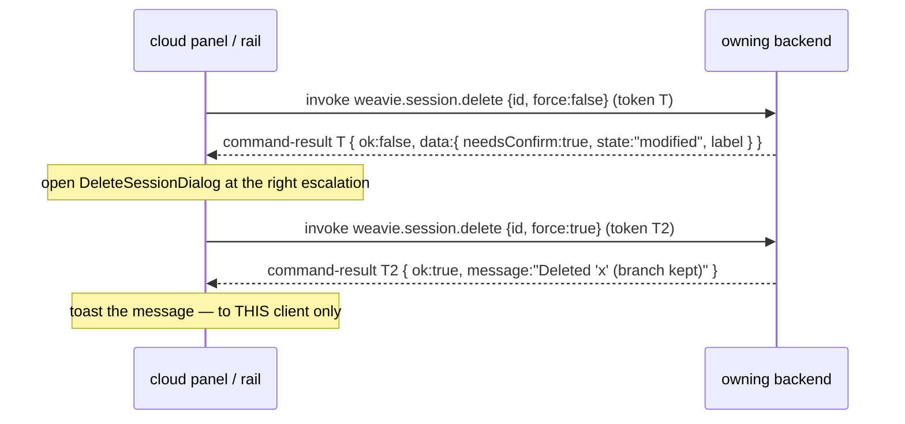

# Command responses

Status: implemented (phases 1–4; phase 5 trims the delete outcome — other bespoke flows pending)
Last updated: 2026-06-23

A follow-on to [Commands & keybindings](commands.md). Commands are the unit of action, but only one
trigger gets an answer back when it runs one: the embedded Claude (over MCP). Every other caller —
the web UI invoking a Core command — fires and forgets. This spec makes **a command invocation a
request/response everywhere**, with a structured, command-specific result payload, so the initiating
client always learns the outcome and can act on it.

## The problem

There are two command paths, and they're asymmetric in a way that matters:

- **Claude → host** (a *web* command): `run-command {id, args, token}` → web runs it → `command-ack
  {token, ok, error}`. Correlated, addressed, returns a result (`HostCore.WebBridge.cs`
  `InvokeWebCommandAsync` / `CompleteWebCommand`).
- **Web → host** (a *core* command): `invoke-command {id, args}` → the host runs it and **logs and
  drops** the `CommandResult` (`HostCore.WebBridge.cs` `RunCommandSafeAsync`). Fire-and-forget.

So when Claude runs a command it gets an answer; when the UI runs one it gets nothing. The command
system already *produces* an answer — `CommandResult(Ok, Message, Error)`
(`CommandDefinition.cs`) — the web path just discards it.

Because the UI had no result to act on, user feedback was improvised through `notify`: the host
composes a toast string and pushes it. That's the wrong primitive for a command outcome:

- A command result is **addressed to the caller**. "Your delete worked" belongs to the client that
  issued the delete.
- A `notify` is an **unaddressed push** to whoever's currently attached, gated by which backend is
  the active view (`bridge.ts` `deliverFromHost`: `backendId !== activeBackend()` ⇒ dropped). So a
  command run against a *background* backend (e.g. deleting a remote session from the cloud panel
  without switching to it) produces a toast the issuer never sees, while the toast it *is* about has
  no caller identity to be routed by.

This surfaced concretely in the remote-session delete work: the delete-confirm reply had to be
reclassified as a cross-backend "session message" just so it wouldn't be dropped by the view gate —
a workaround that routes a *response* through the *broadcast* lane. That's the smell this spec
removes.

## Three message classes

The host→web channel conflates distinct kinds of traffic. Naming them is the design:

1. **View pushes** — for the screen: `term-output`, editor pushes, `set-layout`, `focus-pane`.
   Correctly gated to the active backend — a background backend must never paint the page.
2. **Ambient state** — for every attached client: `session-list`, `session-status`. A backend's
   state changed and anyone watching should see it. This is the one legitimate fan-out, and it's why
   a chip disappearing is acceptable feedback even on another machine — *state changed*, not *you did
   X*.
3. **Correlated responses** — for the **caller**: the reply to a specific request, routed by a
   correlation token, never dropped by the view gate. Today this class barely exists — only
   `command-ack` and the `id`-correlated `fs-stat/read/write` replies live here. `branches-result`
   and the delete-confirm reply are responses too, but were forced into class 1/2.



The fix: make class 3 a real, general primitive, and let `notify` shrink to its honest job.

## Design

### 1. `CommandResult` carries a payload

`CommandResult` gains an optional, serialization-agnostic data field so a command can return a
command-specific value, not just a yes/no + string:

```csharp
public readonly record struct CommandResult(bool Ok, string? Message, string? Error, string? DataJson) {
    public static CommandResult Success() => new(true, null, null, null);
    public static CommandResult Success(string? message) => new(true, message, null, null);
    public static CommandResult Success(string? message, string? dataJson) => new(true, message, null, dataJson);
    public static CommandResult Failure(string error) => new(false, null, error, null);
    public static CommandResult Failure(string error, string? dataJson) => new(false, null, error, dataJson);
}
```

`DataJson` is raw JSON (an object), kept opaque in Core so command handlers own their own shapes
without Core taking a dependency on them. The MCP `runCommand` path can fold it into the tool
response; the web deserializes it per-command (typed at the call site — see open questions for a
typed registry later).

### 2. Web → host commands become request/response

`invoke-command` carries a token; the host replies with `command-result`, addressed by that token and
exempt from the view gate:

```
web  → host:  { type: "invoke-command", id, args, token, backendId? }
host → web:   { type: "command-result", token, ok, message?, error?, data? }
```

This is the exact mirror of the existing host→web `run-command` / `command-ack` pair — the bridge
gets a symmetric RPC in both directions. The host already has the machinery (`_pendingWebCommands`,
`InvokeWebCommandAsync`); this adds the reverse map on the web side.

Correlation is by token, so the result is effectively **unicast even over a broadcast transport**:
only the client holding that pending token consumes it. Two clients on one backend can't cross
wires, and a result for a background backend still reaches its issuer (it's class 3, not gated). This
is the same discipline the file provider already relies on (`fs-*` correlate by `id`).

### 3. `dispatchCommand` returns the result

The web's `dispatchCommand` becomes `Promise<CommandResult>` for **every** command, regardless of
where it runs:

- **Core command** → send tokened `invoke-command`, await the matching `command-result`.
- **Web command** → run the local handler; its return (or thrown error) maps to a `CommandResult`.

Callers that care render UX from the result — the host returns *data*, the client renders the toast:

```ts
const r = await dispatchCommand(CommandIds.deleteSession, { id, backendId, force });
if (!r.ok) addToast("error", r.error ?? "Delete failed");
else if (r.message) addToast("info", r.message);
```

`runForKeybinding` keeps its boolean (consumed/declined) contract for keystroke fall-through, but
routes through the same tokened path under the hood.

### 4. `notify` shrinks to unsolicited events

After this, `notify` is only for genuinely **caller-less** host events: Claude crashed, a background
worktree-setup finished, a save failed outside any command. Anything that is the *outcome of a
command someone ran* travels as that command's response. (Whether even unsolicited events should be
addressed in a future multi-client world is an open question, not this spec's concern.)

## Worked example: the delete flow collapses

Today's delete is three bespoke messages plus a `notify`: `delete-session-request` →
`session-delete-prompt` → `delete-session` → `notify`. With a payload-bearing result it's **one
command**:



The worktree classification that needed its own request/reply becomes the *payload* of a
not-yet-confirmed delete; the success/failure string becomes the result `message`/`error`. No
view-gate workaround, no broadcast, and the toast reaches exactly the client that asked — on any
backend, foreground or background. This is the case that motivates the payload field.

`list-branches` / `branches-result` migrate the same way (a query command returning the branch list
as `data`).

## Relationship to single-client / exclusive lease

The headless bridge today keeps a **single current socket**, last-connection-wins
(`WebSocketHostBridge.cs`): a second browser pointed at one backend silently steals the first's
socket. So a backend is *de facto* single-client, and the "one client per remote session" idea is
currently an accident of socket-clobbering, not a real lease.

This spec is **orthogonal** to that decision and correct under either:

- It does **not** depend on a lease. Token correlation gives per-caller addressing even if we later
  allow true concurrent multi-client.
- It does **not** substitute for a lease. A lease is a concurrency/safety policy (don't let two
  clients drive one Claude); responses are about *getting your answer back*. Decide the lease on its
  own merits.

One thing to settle if we ever do real concurrent multi-client: `command-result` on a broadcast
transport is consumed by token (fine, only the issuer acts), but the existing host→web `run-command`
(Claude invoking a *web* command) would be seen and acked by *all* connected clients. That's a
pre-existing multi-client bug to fix when/if we go there — flagged, out of scope here.

## No fabricated-timeout failures

The current host→web web-command await uses a fixed 5s timeout (`InvokeWebCommandAsync`). A core
command can legitimately take longer (the delete waits a second for handles to release, then runs
git). A short timeout that invents a failure is exactly the silent-fallback anti-pattern the repo
bans. Responses await the real reply and surface a real error when the **transport** says the backend
is gone (the socket closed / the bridge disconnected) — failure stays loud and observable, never
fabricated by a timer.

## Phasing

1. **Core** ✅: `CommandResult` gained `DataJson` (additive; existing call sites unchanged).
2. **Bridge** ✅: tokened `invoke-command` + `command-result`; web-side pending-token map;
   `command-result` exempt from the view gate (class 3); a dropped link fails in-flight commands.
   Token-less `invoke-command` stays fire-and-forget.
3. **Web** ✅: `dispatchCommand` returns `Promise<CommandResult>`; the shared `ContextMenu` toasts a
   command's failure. (Web command handlers still return `void | boolean`; `dispatchCommand`
   synthesizes their result — the typed web-handler-result contract is deferred, see open questions.)
4. **Collapse** ✅: `weavie.session.delete` gained a `classify` arg returning `{ state, label }` (via
   `ISessionHost.ClassifyDeleteAsync`); the UI classifies → confirms → deletes, all through the one
   command. Removed `delete-session-request` / `session-delete-prompt` / `delete-session` and the
   cross-backend workaround. (`list-branches` not yet migrated — it still uses `branches-result`.)
5. **Trim `notify`** ◑: the delete command-outcome notify is gone (its result carries the message).
   Remaining `Notify(...)` are either genuinely unsolicited (worktree setup/teardown progress) or the
   outcomes of *bespoke non-command* web messages (`new-session`, the inline-review
   `undo/revert/reject`, `save-scratch-as`). Those have no command result to carry them yet; each
   needs its own delete-style collapse onto a command before its notify can move. Tracked, not done.

## Open questions

- **Typed payloads on the web.** v1 is `data?: unknown` cast at the call site. Worth a per-command
  result-type registry (mirroring `argsSchema`) so `dispatchCommand<T>` is typed? Probably later.
- **Web-handled command results.** Changing the web `CommandHandler` contract from
  `void | boolean | Promise<void>` to also yield a `CommandResult` touches many handlers. Do it in
  phase 3, or let web commands keep returning void and synthesize a trivial success?
- **MCP payload exposure.** Should `runCommand` surface `DataJson` to Claude (e.g. as a JSON block in
  the tool result), or keep Claude's view message-only? Likely surface it — structured returns are
  useful to Claude too.
- **Ordering / dedupe.** Tokens are unique per invocation; a re-issued command is a new token. No
  ordering guarantees needed beyond "a token resolves once."
