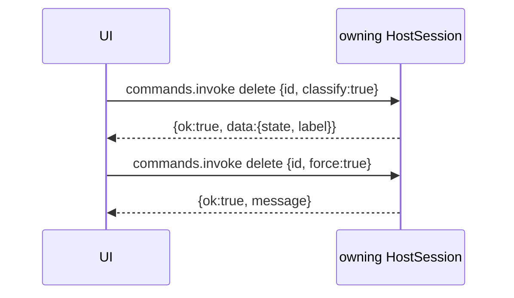

# Command responses

**Status:** implemented.

Every command invocation resolves to a structured `CommandResult`. The common message bus supplies
correlation, cancellation, peer addressing, and transport-failure behavior; commands do not maintain a
second token map or response protocol.

```ts
interface CommandResult {
  ok: boolean;
  message?: string;
  error?: string;
  data?: unknown;
}
```

## Web to Core

Core commands use their owning session bus:

```text
scope: session
feature: commands
name: invoke
payload: { id, args }
```

The envelope routes directly to one live `HostSession`, which invokes its own `CommandDispatcher`.
There is no payload source to validate, resolve, or accidentally substitute.

The response payload is `CommandResult`. Message-bus request identity is `(peer, requestId)`, so concurrent
pages and hosts cannot consume one another's replies. A transport drop rejects the pending request rather
than inventing an outcome or replaying a mutation.

## Core to web

A Core command whose implementation lives in the page uses the owning session's transient view:

```text
scope: session
feature: commands
name: run
payload: { id, args }
```

This is a request through `SessionView`, not a durable session event. It can succeed only while a page is
attached to that exact session because the operation requires mounted browser UI. Detach or displacement
cancels the request. The web handler receives the bound `ClientSession`, so even a command implementation
that knows nothing about routing acts on the correct owner.

## Local web commands

`dispatchCommand` runs web commands locally and maps their result onto `CommandResult`:

- `false` means declined;
- completion means success;
- a thrown or rejected error means failure.

`runCommandWithFeedback` is the shared presentation layer. It renders `error` or informational `message`
once at the caller. Command handlers return data; the host does not broadcast a toast as a substitute for a
reply.

## Domain payloads

`data` is command-specific JSON. Core keeps it serialization-agnostic as `DataJson`, while the caller parses
the shape it requested. This collapses multi-message workflows into one request:


```mermaid
sequenceDiagram
    participant UI
    participant H as owning HostSession
    UI->>H: commands.invoke delete {id, classify:true}
    H-->>UI: {ok:true, data:{state, label}}
    UI->>H: commands.invoke delete {id, force:true}
    H-->>UI: {ok:true, message}
```

## Invariants

- A Core command runs on the exact live session bus that received it.
- A web command runs only on the view bound to that owner.
- Results are responses to one physical peer, never broadcasts.
- Selection is never inferred by host message processing.
- There is no fixed command timeout and no automatic mutation retry.
- Unknown handlers and thrown errors resolve as explicit failures.

See [session-message-bus.md](session-message-bus.md) for the underlying request contract.
