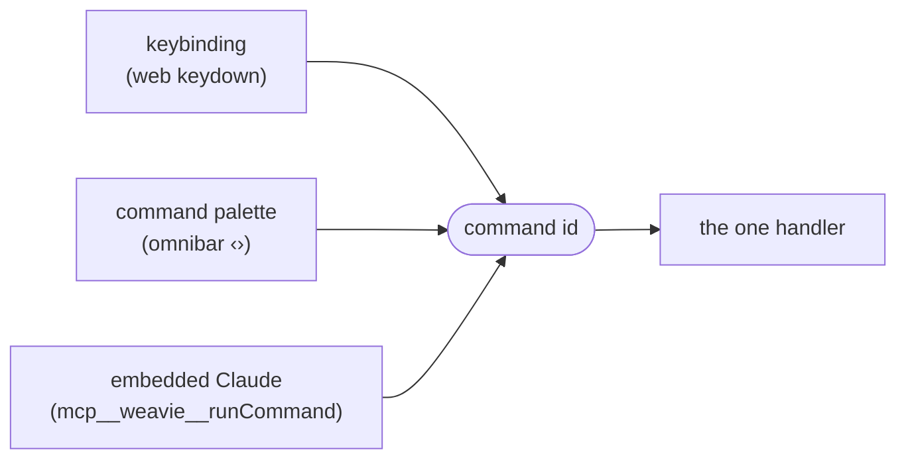
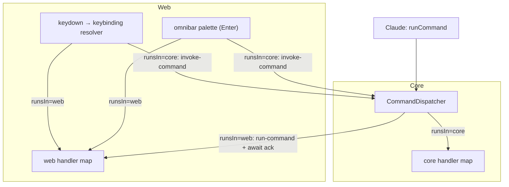

# Commands & keybindings

Status: implemented (Core + Windows + macOS hosts + web)
Last updated: 2026-06-18

The third concrete instance of the
[Claude-facing capability registry](../concepts/mcp-registry.md) (after settings and the layout
tools): **commands** — named actions Weavie can perform — declared once in Core and surfaced to
every trigger that should be able to run them. A command is the unit; a keybinding, the omnibar
command palette, and the embedded Claude (over MCP) are just *triggers* that invoke it by id.

This is the VS Code command model, adapted to Weavie's two-world (Core C# + web Solid) +
Claude-over-MCP shape. We reuse the *concepts*, not VS Code's command/keybinding/quick-input
**services** — see [Why not VS Code's services](#why-not-vs-codes-services).

## The core idea

Everything that "does a thing" is a **command**: a stable string id (`weavie.diff.toggleLayout`)
with a human title, registered once. **Nothing invokes a handler directly** — every surface invokes
the *command id*:



Today's Ctrl+1–9 is the anti-pattern this replaces: the action is welded into a `keydown` handler
(`App.tsx:405`), so it is not in the palette, not rebindable, and not reachable by Claude.
Converting it to a command fixes all three at once.

## Goals

1. One declaration per command drives the palette entry, the default keybinding, the MCP tool
   surface, and the natural-language mapping Claude uses.
2. Users can run any command from the omnibar command palette (the `>` mode already stubbed in
   `Omnibar.tsx`) and bind any command to keys in a user keybindings file.
3. The embedded Claude can run commands by talking ("reopen the terminal", "split the editor"),
   for free, because commands register onto the same registry server as settings.
4. Handlers live where the action lives — web-UI commands run in the web, Core commands run in
   Core — but the *catalog* is one source of truth in Core.
5. Strict + honest: unknown ids are rejected loudly with near-match suggestions (like `setSetting`);
   a command reported as run actually ran (acked), never a silent claim of success.
6. A foundation future plugins extend by contributing command declarations the same way.

## Non-goals (deferred)

- **Menus / context menus / toolbar buttons** as command triggers. The model supports them (they'd
  invoke ids like everything else); no menu surface is built in this milestone.
- **Command return values to Claude.** v1 commands are fire-and-act; `runCommand` reports
  *invoked / failed*, not a structured result payload. (The ack channel below leaves room for it.)
- **Arg-prompting in the palette.** Palette runs no-arg (or fully-defaulted) commands; a command
  that needs typed args is keybinding/MCP-only for now (e.g. focus-pane-by-index).
- **Per-keystroke chord UIs** (the "ctrl+k …" waiting-for-second-key hint). Chords *resolve*
  (tinykeys handles the sequence); the on-screen "chord pending" affordance is later.
- **A full `when` expression grammar.** A minimal evaluator ships (below); the long tail of VS Code's
  `ContextKeyExpr` is added only as real commands need it.

## Why not VS Code's services

We already depend on `@codingame/monaco-vscode-api` (v25) — and that family *does* ship VS Code's
real command, keybinding, quick-input, and context-key services. We deliberately do **not** enable
them, for the same reasons `vscode-services.ts` already refuses the workbench/configuration/keybindings
overrides (theming+LSP spec §18):

- The quick-input **palette is a workbench widget** — turning it on renders VS Code chrome, against
  the "distinct, *not* VS Code" design direction and the "weavie owns layout" stance in
  `vscode-services.ts`. We already have our own omnibar with its own fuzzy matcher.
- VS Code's keybinding/context services are wired to its **configuration service**, which wants to
  own settings — but Weavie's source of truth is the TOML `SettingsRegistry` that *also* feeds Claude.
  Two settings worlds would fight.
- It only solves the **web third**. Weavie's command model spans web + Core + MCP; VS Code (single-
  process JS) has no notion of a C# side or an MCP invoker, so the bulk of this — the cross-process
  registry — has no service to reuse regardless.

What we *do* reuse: the **concepts**. For the only fiddly mechanical bit — chord parsing/normalization
and cross-platform `$mod` — v1 ships a ~40-line inline single-chord matcher (`commands/keybindings.ts`)
rather than a dependency, since the initial commands need only single chords (no `ctrl+k ctrl+s`
sequences). [`tinykeys`](https://github.com/jamiebuilds/tinykeys) (~400 B, MIT) remains the planned drop-in
if/when multi-stroke sequences land. Everything else (registry, dispatch, palette, `when`) is a thin
Weavie layer that mirrors the existing settings/layout registries.

## The command declaration

Declared in code, exactly mirroring `SettingDefinition` / `PaneDefinition`. The registry is the
single source of truth for what exists, where it runs, its default keybinding(s), palette
visibility, `when` guard, and the docs/aliases Claude uses to map natural language.

```csharp
namespace Weavie.Core.Commands;

/// <summary>Which world executes a command's handler.</summary>
public enum CommandLocation {
    Web,   // handler lives in the Solid app (focus a pane, toggle diff layout, open the omnibar)
    Core,  // handler lives in Core/host (reopen the terminal, change layout, …)
}

public sealed record CommandDefinition {
    public required string Id { get; init; }                  // "weavie.diff.toggleLayout" — stable, namespaced
    public required string Title { get; init; }               // palette label ("Toggle Diff: Inline / Side-by-Side")
    public required CommandLocation RunsIn { get; init; }      // Web | Core
    public string? Category { get; init; }                    // palette grouping ("View", "Terminal", "Diff")
    public string Description { get; init; } = "";            // → MCP listCommands; longer than Title
    public IReadOnlyList<string> Aliases { get; init; } = []; // NL hints for Claude ("reopen terminal", "restart shell")

    // Default binding(s). Use the tinykeys "$mod" token = Cmd on macOS, Ctrl on Win/Linux, so one
    // string is cross-platform. Multiple defaults allowed; a user binding can override or unbind.
    public IReadOnlyList<string> DefaultKeybindings { get; init; } = [];

    public bool ShowInPalette { get; init; } = true;          // false for keybinding-only (e.g. focusByIndex)
    public string? When { get; init; }                        // context-key guard for keybinding + palette visibility
    public JsonElement? ArgsSchema { get; init; }             // optional JSON Schema for args (coerced like settings)
}
```

### `RunsIn` is the one new concept vs. settings

Settings have no execution side — they're just values. Commands do, and Weavie has two worlds, so a
command declares **where its handler runs**. The declaration (metadata) always lives in Core so the
MCP surface and the palette can see every command; the *handler* is registered on whichever side
owns the action. A `Web` command with no web handler registered at invoke time is a loud error
(strict), never a silent no-op.

## The command registry & dispatcher

Two Core types, mirroring the `SettingsRegistry` (catalog) / `SettingsStore` (behavior) split:

- **`CommandRegistry`** — the catalog. `Register(CommandDefinition)`, `Require(id)` (throws
  `UnknownCommandException` with near-match suggestions), `Definitions` in registration order.
  Byte-for-byte the shape of `SettingsRegistry` / `PaneRegistry`.
- **`CommandDispatcher`** — routes an invocation to its handler:
  - For a `Core` command, looks up a registered `Func<JsonElement?, CancellationToken, Task<CommandResult>>`
    in its handler map and awaits it.
  - For a `Web` command, posts a `run-command` bridge message to the web and awaits the web's
    `command-ack` (short timeout), so the caller (MCP / palette-over-MCP) hears the real outcome.

```csharp
public readonly record struct CommandResult(bool Ok, string? Message, string? Error);

public sealed class CommandDispatcher {
    public IDisposable RegisterHandler(string id, Func<JsonElement?, CancellationToken, Task<CommandResult>> handler);
    public Task<CommandResult> InvokeAsync(string id, JsonElement? args, CancellationToken ct);
}
```

`CoreCommands` registers Core's commands at startup (the way `CoreSettings` registers settings,
`LayoutPanes` registers panes). Core *declarations* for `Web` commands are also registered here (or
contributed alongside the web feature that owns them) — the web binds handlers to those ids on
startup.

## Dispatch flows

Three invokers × two execution sides. Only two cross the process boundary:



1. **Keybinding/palette → Web command** — web resolves the id, runs the local handler directly.
   (The Ctrl+1–9 case, and the diff-layout toggle.)
2. **Keybinding/palette → Core command** — web posts `invoke-command {id, args}`; the host calls
   `CommandDispatcher.InvokeAsync`.
3. **MCP → Core command** — `runCommand` tool → `InvokeAsync` → core handler. All in Core.
4. **MCP → Web command** — `runCommand` → `InvokeAsync` sees `RunsIn=Web` → posts `run-command
   {id, args, token}` to the web → web runs the handler and posts `command-ack {token, ok, error?}`
   → `InvokeAsync` returns that outcome to Claude.

`when` is evaluated **only** for keybinding activation and palette visibility — never for programmatic
invocation (MCP / `invoke-command`). This matches VS Code: `executeCommand` ignores `when`; the
handler itself may no-op if its preconditions aren't met. So Claude can always run a command by name;
the guard only governs *implicit* triggers.

## Keybindings

### A separate file, on purpose

Keybindings live in **`~/.weavie/keybindings.json`** — *not* `settings.toml`. This is a deliberate
config split, consistent with VS Code and with the user's existing `~/.claude/keybindings.json`:

- `settings.toml` is a flat catalog of typed **scalars** (`SettingDefinition` is String/Bool/Int/Path).
  Keybindings are a **list of structured records** with `when` strings, `args` objects, and an unbind
  syntax — they do not fit the scalar model and would fight the settings registry's design.
- JSON (JSONC-tolerant) is the natural shape for an array of records and mirrors the format users
  already know from `~/.claude/keybindings.json`.

`~/.weavie/` stays the shared home (settings.toml + keybindings.json), loaded/watched with the same
machinery as settings (atomic, debounced `FileSystemWatcher`, parse-guarded, malformed → keep
last-good + refuse writes).

```jsonc
// ~/.weavie/keybindings.json — ask the embedded Claude to "list weavie commands" for all ids
[
  { "key": "$mod+shift+t", "command": "weavie.terminal.reopen" },
  { "key": "$mod+1", "command": "-weavie.pane.focusByIndex", "args": { "index": 1 } }, // unbind a default
  { "key": "alt+1",  "command": "weavie.pane.focusByIndex", "args": { "index": 1 } }
]
```

### Resolution: defaults + user overrides, merged in Core

The command declarations carry the **default** bindings. The user file **layers on top**. Core does
the merge (it already owns file I/O and the registry) and ships the *resolved* binding list to the
web — the web never reads the file. `KeybindingStore`:

1. Seeds from every command's `DefaultKeybindings`.
2. Applies user entries in order: a normal entry adds/overrides the binding for that key; a
   `"-<command>"` entry removes a matching default (VS Code's unbind).
3. Validates each `command` is a registered id (unknown → logged loudly, entry dropped — strict but
   non-fatal, like a bad settings layer falling through).
4. Emits `KeybindingsChanged` (debounced/parse-guarded) on file edit, exactly like `SettingChanged`.

The resolved list is injected as `window.__WEAVIE_KEYBINDINGS__` before navigation (no first-paint
gap) and re-pushed as a `{ type: "commands", … }` bridge message on change — the same pattern as
`__WEAVIE_FONTS__` / `__WEAVIE_SHELL__`.

### Web-side key handling

A single window-level `keydown` listener in **capture phase** (as today) so chords win over a focused
xterm/Monaco, but `preventDefault` fires **only when a binding actually matches** — so unmatched
`Ctrl+digit` still passes through to the terminal/editor, preserving current behavior. `tinykeys`
parses/normalizes the key strings (including `$mod`); on a match we evaluate `when`, then dispatch.

### Global hotkeys

A binding may set `"global": true` (declared via `CommandKeybinding.Global`, carried through to the
resolved list and the `keybindings.json` schema). A global hotkey is registered with the **operating
system**, so it fires even when Weavie isn't the focused application — the only way to bind an action
like "show/hide Weavie" (`weavie.window.toggle`, default `ctrl+\``). Because the OS owns it, the
**web keydown resolver skips global bindings** (`keybindings.ts` filters `global === true`) — otherwise
they'd double-fire while Weavie *is* focused.

The mechanism splits Core/host the same way commands do:

- **`GlobalHotkeyService`** (Core, app-scoped) reads the global bindings out of `KeybindingStore`, parses
  each chord (`ChordParser` — mirrors the web's `parseChord`, with `$mod` left as an unresolved flag), and
  hands the set to a per-OS registrar. It re-applies on every `keybindings.json` edit. When the registrar
  reports a press, it invokes the bound command through the `CommandDispatcher` — a global hotkey is just
  another *trigger*, like a keybinding or the palette.
- **`IGlobalHotkeyRegistrar`** (Core seam) is implemented per platform: `WindowsGlobalHotkeys`
  (`RegisterHotKey` + `WM_HOTKEY` on a hidden message-only window) and `MacGlobalHotkeys` (Carbon
  `RegisterEventHotKey` + one application event handler — the API that needs no Accessibility permission
  and fires while unfocused). Each resolves `$mod` (Ctrl on Windows, Cmd on macOS) and maps the key token
  to its native virtual-key code. Registration failures (a chord another app already owns, an unmappable
  key) are logged loudly, never silently dropped.

`ctrl+\`` is used **literally** (not `$mod`) so the default is the same on Windows and macOS, where `Cmd+\``
is already the system "cycle windows" shortcut. The command runs in Core (the action is per-OS) and **toggles**:
it focuses Weavie when another app is in front, and — when Weavie is already focused — hands focus back to the
previously focused window so Weavie drops behind it (Windows: walk the Z-order to the window beneath ours and
`SetForegroundWindow` it — no minimize; macOS: `NSApplication.Hide`). The app-level dispatcher's handler
toggles the most-recently-active window; each session's dispatcher also handles it so MCP/palette toggle the
window that asked.

## `when` contexts

A minimal context-key layer maintained web-side (focus is already tracked via `focusin` in
`App.tsx:423`). Context keys for v1:

| key | type | meaning |
|-----|------|---------|
| `focusedPane` | string\|null | kind of the focused pane (`editor`, `terminal:claude`, `terminal:shell`) |
| `editorFocused` | bool | derived: `focusedPane == "editor"` |
| `terminalFocused` | bool | derived: focused pane is a terminal |
| `inputFocused` | bool | a text input/omnibar has focus |
| `paletteOpen` | bool | the omnibar command palette is open |

The evaluator supports `!`, `&&`, `==`, `!=`, and bare-key truthiness (e.g.
`terminalFocused && !inputFocused`). `||` and parentheses are added if a real command needs them.
Ctrl+1–9 needs no `when` (global). Context-key set grows with the command set.

## MCP tools (`listCommands` / `runCommand`)

Two tools on `McpServer`, advertised on the **registry server only** (like the settings + layout
tools — the IDE server's list is filtered before it reaches the model). Added as a `CommandToolEntries`
const and dispatched in `HandleToolCallAsync`, mirroring `listSettings`/`setSetting`.

- **`listCommands`** — no input. Returns the catalog Claude reads to map NL → exact id: per command
  the `id`, `title`, `category`, `description`, `aliases`, and **current resolved keybinding(s)** (so
  Claude can say "that's bound to Ctrl+1"). Description instructs Claude to call this first.
- **`runCommand`** — input `{ "id": "weavie.terminal.reopen", "args"?: { … } }`. Validates the id
  against the registry (unknown → error with near-match suggestions, like `setSetting`); coerces
  `args` against the command's `ArgsSchema` (lenient scalar coercion at the MCP boundary, since the
  embedded Claude stringifies scalars); invokes via `CommandDispatcher`; returns the
  `CommandResult` (invoked / failed + message). `when` is **not** checked.

```jsonc
// listCommands entry
{ "id": "weavie.terminal.reopen", "title": "Reopen Terminal",
  "category": "Terminal", "description": "Restart the shell terminal pane.",
  "aliases": ["reopen terminal", "restart shell"], "keybindings": ["ctrl+shift+t"] }
```

## The omnibar command palette

The `>` mode already stubbed in `Omnibar.tsx` (`commandMode`, "Commands — coming soon") becomes
real: when the query starts with `>`, list every command with `ShowInPalette` whose `when` passes,
fuzzy-ranked over `title` (+ `category`) by the existing `fuzzy.ts`; Enter/click dispatches the id
(local handler or `invoke-command` to host). No new UI — it reuses the omnibar's list rendering, just
sourcing rows from the command catalog instead of the file index, and showing the resolved keybinding
on the right of each row.

## Bridge additions

Mirrors the existing typed unions in `bridge.ts` + `ShellProtocol.cs`.

- **host → web** (`WebBoundMessage`): `{ type: "commands"; catalog: CommandInfo[]; keybindings:
  ResolvedBinding[] }` (also injected as `__WEAVIE_COMMANDS__` / `__WEAVIE_KEYBINDINGS__` pre-nav);
  `{ type: "run-command"; id: string; args?: unknown; token: string }`.
- **web → host** (`HostBoundMessage`): `{ type: "invoke-command"; id: string; args?: unknown }`
  (palette/keybinding → Core command); `{ type: "command-ack"; token: string; ok: boolean; error?:
  string }` (reply to `run-command`).

## Initial registered commands

A small, real set spanning both worlds and all three triggers — the migration targets plus a couple
that already exist in the web:

| id | runsIn | default key | palette | replaces / source |
|----|--------|-------------|---------|-------------------|
| `weavie.pane.focusByIndex` | Web | `$mod+1`…`$mod+9` (args `{index}`) | no | hardcoded Ctrl+1–9 (`App.tsx`) |
| `weavie.view.toggleFileBrowser` | Web | `$mod+b` | yes | `toggleBrowser` (`App.tsx`) |
| `weavie.omnibar.focusFiles` | Web | `$mod+p` | yes | focus omnibar (Go to File) |
| `weavie.omnibar.focusCommands` | Web | `$mod+shift+p` | yes | focus omnibar in `>` mode |
| `weavie.terminal.reopen` | Core | — | yes | `TerminalController.Restart()` (exists) |
| `weavie.window.toggle` | Core | `ctrl+\`` (**global**) | no | show/hide (toggle) the window from anywhere |

Double-tapping **Shift** also triggers `weavie.omnibar.focusFiles` (Go to File), IntelliJ-style. This is a
*gesture*, not a keybinding: a bare modifier double-tap can't be expressed as a chord (the resolver never
matches a modifiers-only binding), so it lives in a dedicated capture-phase detector (`commands/double-shift.ts`,
wired in `App.tsx`) that dispatches the command directly. It is not yet user-configurable.

> The spec originally named `weavie.diff.toggleLayout` (inline/side-by-side diff toggle). That toggle was
> removed when the diff view became inline-only (`editor/inline-diff.ts`), so the two view-panel toggles
> above took its slot as the initial palette-visible web commands.

`focusByIndex` is keybinding-only (`ShowInPalette = false`) — "focus pane index 3" is not a
meaningful palette row without context; nice per-pane palette entries ("Focus: Claude Terminal") are
a follow-up once dynamic/contributed commands exist.

## Architecture / placement

```
Weavie.Core/
  Commands/
    CommandDefinition.cs    // record + CommandLocation enum + CommandResult
    CommandRegistry.cs      // register + Require(id) + catalog  (mirrors SettingsRegistry)
    CommandDispatcher.cs    // handler map (Core) + route-to-web; InvokeAsync
    CoreCommands.cs         // registers core + web command declarations; wires core handlers
    KeybindingStore.cs      // load/merge/watch ~/.weavie/keybindings.json → resolved list
    ChordParser.cs          // chord string → modifiers + key token (mirrors the web parser)
    IGlobalHotkeyRegistrar.cs // per-OS seam: Apply(global hotkeys) + Pressed; GlobalHotkey record
    GlobalHotkeyService.cs  // app-scoped: resolved global bindings → registrar; press → dispatcher
  Mcp/
    McpServer.cs            // + listCommands / runCommand (CommandToolEntries, registry server)

src/Weavie.Win/Hosting/
  WindowsGlobalHotkeys.cs   // RegisterHotKey + WM_HOTKEY on a message-only window
  WindowFocus.cs            // SetForegroundWindow helper (focus from another app's foreground)
src/Weavie.Mac/Hosting/
  MacGlobalHotkeys.cs       // Carbon RegisterEventHotKey + one application event handler

src/web/src/commands/
  registry.ts               // consume __WEAVIE_COMMANDS__; register web handlers; lookup
  keybindings.ts            // consume resolved bindings; tinykeys; capture-phase keydown → resolve
  context.ts                // when context keys + minimal evaluator
  dispatch.ts               // run(id,args): local handler | invoke-command; inbound run-command + ack
```

Both hosts construct the `CommandRegistry` + `CommandDispatcher` + `KeybindingStore` and hand them to
the `McpServer` (the way they already hand it the `SettingsStore` / `LayoutStore`), inject the catalog
+ resolved keybindings before navigation, and re-push on change.

## Build sequence

1. **Core registry + dispatcher** — `CommandDefinition`/`CommandRegistry`/`CommandDispatcher`/
   `CoreCommands`; register the initial commands; wire the one Core handler (`weavie.terminal.reopen`
   → existing `Restart()`). Unit tests in `Weavie.Core.Tests` (register/Require + unknown-id
   suggestions, Core dispatch, args coercion).
2. **Keybindings file** — `KeybindingStore` (load/merge defaults + user, unbind syntax, validation,
   watch/debounce/parse-guard), resolved-list emission. Tests mirror `SettingsStoreTests` (merge
   precedence, unbind, unknown-command drop, malformed fallback, change-on-edit).
3. **Web layer** — `commands/{types,registry,keybindings,context}.ts` + `chrome/omnibar-controller.ts`
   (an inline single-chord matcher, not `tinykeys`, for v1); inject + push catalog and bindings;
   capture-phase keydown resolver. **Migrate Ctrl+1–9** to `weavie.pane.focusByIndex` (delete the
   hardcoded handler) — the handler returns `false` when no pane exists at that index so unmatched
   chords still pass through to the terminal/editor.
4. **Palette** — wire the `Omnibar.tsx` `>` mode to the catalog; dispatch on Enter; show resolved
   keys. Verify running a Web and a Core command from the palette.
5. **MCP tools** — `listCommands`/`runCommand` on `McpServer` (registry server). Verify end-to-end
   by asking the embedded Claude to reopen the terminal and to toggle the diff layout (exercising
   both `Core` and `Web` dispatch incl. the `run-command`/`command-ack` round-trip).

## Decisions baked in (flag if you disagree)

Per the "consult before config/philosophy calls" standing note, the choices that weren't forced by
existing patterns:

- **Keybindings in their own JSON file** (`~/.weavie/keybindings.json`), not `settings.toml` — see
  [Keybindings](#a-separate-file-on-purpose). Departs from "everything is a setting," matching VS
  Code and `~/.claude/keybindings.json`.
- **Command ids are `weavie.*` namespaced**, not VS Code-compatible (`workbench.*`). We're not aiming
  for keybindings.json portability with VS Code.
- **`runCommand` acks** (web round-trip with timeout) rather than fire-and-forget — honest reporting
  over simplicity. Return *values* to Claude stay deferred.
- **`$mod` cross-platform default keys** (resolved by the inline matcher: Cmd on macOS, Ctrl elsewhere)
  so one declaration covers Win + macOS.

## Open questions

- **Dynamic / contributed commands** (per-pane "Focus: <pane>" palette entries; plugin-contributed
  commands at runtime). The registry is static at startup in v1.
- **Chord-pending UI** and multi-stroke discoverability.
- **Command return values** to Claude (structured `runCommand` results) — the ack channel can carry
  them later.
