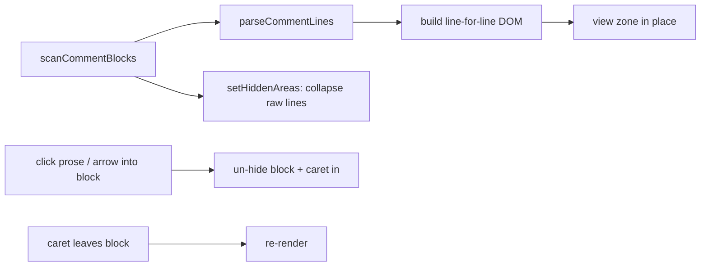

# Comment prose rendering

Comments render in the editor as styled prose — markers stripped, italic, with inline `code` chips — instead of
raw monospace comment lines, **preserving the author's line breaks exactly** (no reflow). The raw comment
collapses in place and a widget shows the styled version; clicking it, or arrowing into it, reveals the source
for editing. Which comments render is a four-way choice via the `editor.commentProse` setting
(`none` / `documentation` / `multiline` / `all`, default `documentation`).

## Why

Long explanatory comments and doc blocks read better without the `//` clutter and in a softer proportional
face, while staying inline with the code they describe. Rendering them line-for-line (rather than reflowing
into paragraphs) keeps them **true to how they were written** — a deliberate line break the author added is
never rewritten — and keeps the source fully editable and untouched on disk.

## What renders

`scanCommentBlocks` (in `comment-markup.ts`) finds **every** full-line comment block for the model's language —
line-comment runs (`//`, `#`, `--`, … per language), block comments (`/* … */`, doc `/** … */`), and, for JSX
dialects (`typescriptreact` / `javascriptreact`), `{/* … */}` expression-container comments. Each block carries
a `doc` flag (a doc-marker block, or an all-`///`/`//!` run) and its line span. Trailing comments (after code on
the same line, so the line doesn't start with the marker) are skipped. The per-language comment syntax lives in
a small table in `comment-markup.ts`, defaulting to the C-family (`//` + `/* */`).

Which of those blocks actually render is decided by the **`editor.commentProse` mode** (the scan finds them all;
the renderer filters):

- **`none`** — render nothing.
- **`documentation`** (default) — only documentation comments (`///`, `//!`, `/** … */`), **including
  single-line** ones.
- **`multiline`** — documentation comments plus any comment spanning ≥2 lines.
- **`all`** — every full-line comment, including lone single-line ones.

JSX `{/* … */}` comments are non-doc, so they render in `multiline` / `all` (not `documentation`). A block whose
opening/closing delimiter sits on its own line (e.g. `/**` … `*/`, or `{/*` … `*/}`) keeps that line as a blank
line in the rendered prose, so the rendered footprint stays identical to the raw one (no shift) — see below.

## Parsing

`parseCommentLines` turns the marker-stripped text into one array of inline runs **per source line** — plain
text plus `` `backtick` `` spans lifted to inline-code chips — without joining or reflowing: one line in, one
line out. C# (and similar) XML doc comments are first lifted into readable text (`
`/`<para>` tags
dropped, `<c>`/`<see cref>` → inline code, `<param>`/`<returns>` → labelled lines), still one line in, one out.
This is deliberately lightweight, not a full LSP-backed doc renderer — comment detection uses the per-language
syntax table rather than semantic tokens, so it stays synchronous and dependency-free.

## Parsing

`parseCommentLines` turns the marker-stripped text into one array of inline runs **per source line** — plain
text plus `` `backtick` `` spans lifted to inline-code chips — without joining or reflowing: one line in, one
line out. C# (and similar) XML doc comments are first lifted into readable text (`
`/`<para>` tags
dropped, `<c>`/`<see cref>` → inline code, `<param>`/`<returns>` → labelled lines), still one line in, one out.
This is deliberately lightweight, not a full LSP-backed doc renderer — comment detection uses the per-language
syntax table rather than semantic tokens, so it stays synchronous and dependency-free.

## Rendering + editing

`comment-prose.ts` owns the editor integration:

- The raw comment lines are collapsed with Monaco **hidden areas** (a private source token so the folding
  controller's hidden areas are untouched), and a **view zone** drops the prose widget into the gap. The zone
  is marked `showInHiddenAreas` (else Monaco zeroes a zone anchored at a hidden boundary) and carries a small
  `z-index` so it sits above the `.view-lines` text layer and receives clicks.
- The widget is one `white-space: pre` node whose `line-height` is pinned to the editor's, with the source
  lines separated by real newlines. So each source line is **exactly one editor line tall and never wraps**,
  and the node's height is deterministically `lineCount × lineHeight` — the raw comment's exact footprint, with
  **no measurement, no ResizeObserver, no async grow**. Collapsing to prose never reflows the code below, and
  expanding back to raw is a zero-height swap; the layout never shifts. The prose is indented to the raw
  comment's column so a member's doc tracks the member's nesting instead of hugging the gutter.
- `render()` rebuilds all zones from scratch (tearing every zone down before re-adding), which momentarily
  drops collapsed comments to zero height and makes Monaco re-anchor the viewport. To avoid that jump it
  **pins `scrollTop`** across the rebuild; since the rebuilt content is the same height, restoring the
  pre-render scroll just cancels the transient.
- A block stays **raw** while the caret is inside it. Hidden areas stop the caret drifting into a collapsed
  block, so a block opens two ways: a **click** on its prose, or **arrowing into it** — the cursor handler
  spots the single up/down step the hidden area would otherwise swallow whole (landing the caret on the
  block's near edge, one keypress, not a multi-line skip) and un-hides the block instead. When the caret
  leaves, it re-collapses to prose.
- The model is never mutated — only decorations/zones/hidden-areas, all torn down on dispose — so saving,
  diffing, and LSP see the real comment text.
- Rendering is **suspended** for a model that has an active inline diff (`isBlocked`, wired to
  `InlineDiff.hasDiffForUri`) so a collapsed comment never hides a changed line under review.

## Setting

`editor.commentProse` (Core `EditorSettings`, `ApplyMode.Live`) is a four-way choice —
`none` / `documentation` / `multiline` / `all`, **default `documentation`** — flowing to the web like the other
editor options (injected global + `editorOptions` push). The controller reads it at creation and re-renders on
change. Discoverable/drivable via `listSettings` / `setSetting` / natural language.
