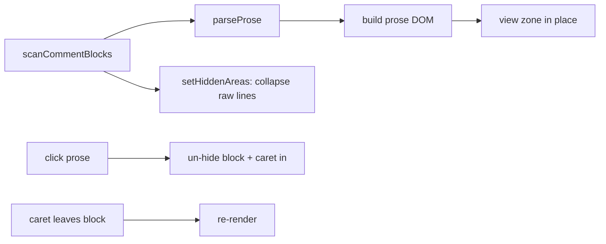

# Comment prose rendering

Multi-line and documentation comments render in the editor as styled prose — wrapped text, numbered/bulleted
lists, and inline `code` chips — instead of raw monospace comment lines. The raw comment collapses in place and
a widget shows the formatted version; clicking it reveals the source for editing. Controlled by the
`editor.commentProse` setting (on by default).

## Why

Long explanatory comments and doc blocks are prose, not code. Rendering them as prose (the way they'd look in
rendered docs) makes them far easier to read while keeping them inline with the code they describe, and keeps
the source fully editable and untouched on disk.

## What renders

`scanCommentBlocks` (in `comment-markup.ts`) finds the blocks worth rendering for the model's language:

- **Block comments** (`/* … */`, `/** … */`) spanning ≥2 lines, or any doc block (`/**`).
- **Runs of ≥2 consecutive line comments** (`//`, `#`, `--`, … per language), and any doc-comment run
  (`///`, `//!`).

Trailing comments (after code on the same line) and lone single-line non-doc comments are left as code. The
per-language comment syntax lives in a small table in `comment-markup.ts`, defaulting to the C-family
(`//` + `/* */`).

## Parsing

`parseProse` turns the marker-stripped text into a tiny markdown-ish model: blank lines separate paragraphs,
`1.`/`-` lines become ordered/unordered lists, and `` `backtick` `` spans become inline-code chips.
Paragraph lines are joined so the text reflows. C# (and similar) XML doc comments are first lifted into the
same shape (`
`/`<para>` → paragraph breaks, `<c>`/`<see cref>` → inline code, `<param>`/`<returns>`
→ labelled lines). This is deliberately lightweight, not a full LSP-backed doc renderer — comment detection
uses the per-language syntax table rather than semantic tokens, so it stays synchronous and dependency-free.

## Rendering + editing

`comment-prose.ts` owns the editor integration:

- The raw comment lines are collapsed with Monaco **hidden areas** (a private source token so the folding
  controller's hidden areas are untouched), and a **view zone** drops the prose widget into the gap. The zone
  is marked `showInHiddenAreas` (else Monaco zeroes a zone anchored at a hidden boundary) and carries a small
  `z-index` so it sits above the `.view-lines` text layer and receives clicks.
- A block stays **raw** while the caret is inside it. Because hidden areas stop the caret arrowing into a
  collapsed block, a block only opens via a **click** on its prose; the click un-hides it and drops the caret
  in. When the caret leaves, it re-collapses to prose.
- The model is never mutated — only decorations/zones/hidden-areas, all torn down on dispose — so saving,
  diffing, and LSP see the real comment text.
- Rendering is **suspended** for a model that has an active inline diff (`isBlocked`, wired to
  `InlineDiff.hasDiffForUri`) so a collapsed comment never hides a changed line under review.

## Setting

`editor.commentProse` (Core `EditorSettings`, `ApplyMode.Live`, default on) flows to the web like the other
editor options (injected global + `editorOptions` push). The controller reads it at creation and re-renders on
change. Discoverable/drivable via `listSettings` / `setSetting` / natural language.
