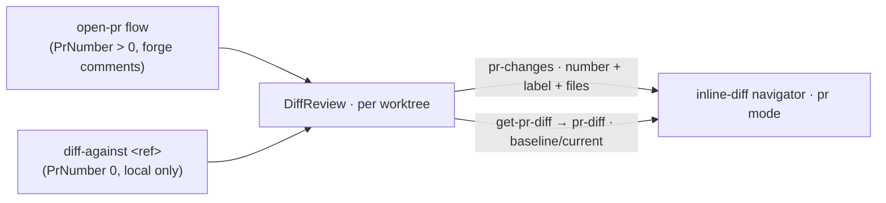

# Diff Against

Status: implemented
Last updated: 2026-07-02

Review the working tree against **any ref** — a branch, tag, commit, or expression like `HEAD~2` — in the
same read-only inline-diff navigator a pull request uses ([open-pr.md](open-pr.md) Phase 2). No forge, no
new session, no checkout: the review arms on the **current** session, and the diff is pure local git.

## Commands

| id | title | default key | behavior |
|----|-------|-------------|----------|
| `weavie.diff.against` | Diff Against… | `$mod+Shift+d` | Prompt for a ref (typeahead over local branches; any commit-ish accepted). A `ref` arg — e.g. Claude via `runCommand` — skips the prompt. |
| `weavie.diff.againstParent` | Diff Against Parent | — | The fixed ref `HEAD^`: the last commit's changes plus anything uncommitted. |
| `weavie.diff.againstHead` | Diff Against HEAD | — | The fixed ref `HEAD`: the uncommitted changes. |

All three are `RunsIn = Web` (the prompt is a web modal, mirroring `weavie.pr.open`) and funnel into one
host message: `diff-against { ref }`.

## Semantics

- **Base = `merge-base(ref, HEAD)`** — so diffing against a branch shows only *this side's* changes since
  the fork point (exactly what a PR shows), and a ref that's an ancestor (HEAD, HEAD^, an old commit) diffs
  from itself. A ref *ahead* of HEAD therefore shows nothing of the other side — never a reversed diff.
- **Current = the working tree** — the changed-file list is `git diff --numstat <base>` **plus
  untracked-but-not-ignored files** as all-added entries (`IGitService.DiffWorktreeAsync`); a brand-new
  file is an uncommitted change to the user, so it is never silently absent. Each file's diff pairs the
  file at the base (`ShowFileAtRefAsync`; empty when absent there) with the file on disk.
- **Read-only** — the base is committed history, so there is no keep/revert (nothing was auto-applied) and
  no commenting (no forge behind a local ref). The navigator's walk (`←`/`→` files, `↑`/`↓` hunks) is
  unchanged.

## The shared review-diff surface

`HostCore.DiffReviews.cs` owns the one review-per-session state (`DiffReview`, keyed by worktree) and the
message feed both producers share; a PR is the same record with a forge attached:

- The `pr-changes` push carries a `label` ("PR #12" / "vs main") shown in the navigator's subtitle and the
  parked bar, so the surface always names what it's diffing against.
- Arming replaces the session's previous review; a session switch re-pushes the active session's review
  (`PushActiveReviewChanges`), so the navigator follows sessions exactly as PR reviews do.

## Failure surfaces (all user-facing toasts)

- Unknown ref → `'x' isn't a branch, tag, or commit here.` (`ResolveCommitAsync` also rejects
  option-shaped input at the trust boundary — a web-supplied ref can never be read as a git flag.)
- No common history → `'x' shares no history with HEAD — there's no base to diff from.`
- Nothing differs → `No changes against 'x'.` — and any prior review is **retracted** (an empty
  `pr-changes` clears the stale walk) instead of arming an unwalkable navigator.

## Testing

- `DiffAgainstTests` (Weavie.Hosting.Tests): the flow end-to-end over a real temp repo — HEAD/parent
  diffs, the `pr-diff` baseline/current pair, unknown ref, empty-diff retraction, merge-base semantics.
- `diff-against.spec.ts` (Playwright): the user journeys — Diff Against HEAD on an uncommitted edit
  (read-only toolbar, `vs HEAD` label), the ref prompt + multi-file walk, and the no-changes toast.
