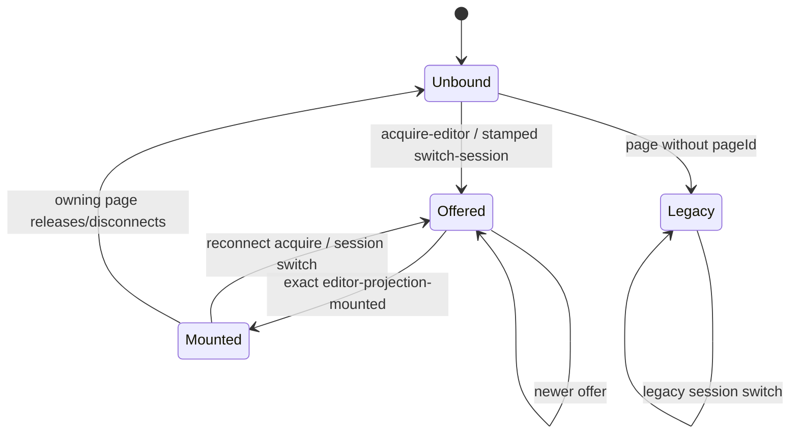

# Editor projection ownership

**Status:** implemented.

Weavie has many durable sessions but one visible editor/terminal surface per page. Switching therefore is
an ownership transfer, not a collection of independent UI updates. The host offers a versioned projection;
the page commits its backend, session, tabs, media surface, and editor binding together; Monaco acknowledges
only after the offered session has rebound.

This protocol prevents delayed work from an earlier `A → B → A` transition from becoming current again.
It also keeps agent results durable: projection revisions fence viewport traffic only. Agent transcripts,
change trackers, open-diff state, and terminal state remain owned by their `HostSession` and replay when that
session next mounts.

## Identity and state

A stamped projection is:

```text
{ sessionId, railSessionId, projectionEpoch, projectionRevision, projectionPageId }
```

- `projectionEpoch` is unique to one host process. A worker restart cannot reuse an old stamp.
- `projectionRevision` increases for every offer in that process. Session id alone is insufficient for ABA.
- `projectionPageId` targets one browser/WebView page even when a headless bridge broadcasts to several.
- `sessionId` identifies the live `HostSession` that owns editor state and authenticated media routes.
- `railSessionId` identifies its stable rail slot/terminal pane. Worktree sessions deliberately use a branch
  name here while their live host session has an opaque id; conflating the two leaves every chip inactive.

The host owns this state machine:



An ordinary `ready` replays ambient host state but never acquires a stamped editor. This matters because the
page maintains background connections to remote backends: their initial connection or reconnect must not
mute the backend currently driving another page. The active page sends `acquire-editor` explicitly. A
cross-backend handoff sends `release-editor` with the outgoing stamp before requesting the new session. Release
is a page-lease operation: a matching host epoch and page id relinquish even a superseding revision, so teardown
cannot strand an offer created during rebind. The page releases only while that immutable binding is still
current; the headless bridge also releases when the page's last WebSocket disconnects.

## Offer and mount

1. The host deactivates the session's `SessionEditorChannel`, clears the prior offer's deferred page events,
   increments the revision, and sends stamped `set-editor-session` to the target page.
2. The page atomically installs one immutable `EditorBinding`. Backend/session/tab/media consumers observe the
   same commit; a rail-only pending intent may show immediate input feedback without moving the terminal/editor.
   If that intent moves on before an offer arrives, the page releases the rejected page-targeted offer so its
   host cannot remain muted in `Offered`. A missing target or disconnected backend clears the rail intent.
3. The page serializes Monaco rebinds. A rebind acknowledges its captured binding only if that exact object is
   still current. A superseded rebind may finish cleanup but cannot mount or paint.
4. The host accepts the exact mount while `Offered`, flushes events deferred during the rebind, activates the
   session channel, and replays durable review state. This order guarantees a queued reset cannot erase a held
   `show-diff` as the channel activates.

Page-to-host editor reports (`editor-session-changed`, `active-editor-changed`, and
`open-editors-changed`) are accepted for the exact current stamp in both `Offered` and `Mounted`. The tab store
reports restored tabs synchronously before Monaco finishes, so requiring `Mounted` would deterministically lose
that report.

Host-to-page edge events are deferred while `Offered`, never dropped. This includes file refresh/deletion,
watcher batches, and turn-review updates. Durable review mutation is gated by active session identity, not by
page mount; only its rendering waits for the projection.

## Backend and filesystem routing

`activeBackend` is the committed visible backend. A separate pending backend admits only its targeted
`set-editor-session`; accepting that projection commits `activeBackend` and `EditorBinding` in one Solid batch.
Terminal visibility therefore cannot switch ahead of tabs/media/Monaco. Errors from the pending backend remain
admitted, so a failed acquisition is visible even while the outgoing backend is still the committed surface.

Every filesystem request records the editor backend selected when the request is issued. Its correlated reply
is admitted from that backend even if a handoff commits before the reply returns. No response consults the
mutable current backend. Request ids are page-unique, preventing collisions between concurrent pages.

Every editor surface transition invalidates pending text model loads. A late text read may populate the owning
tab's cached working copy, but binding identity plus the monotonic open sequence prevent it from calling
`setModel` after a newer text/media/web/source/empty transition.

## Compatibility

Mixed-version remote workers remain usable:

- A new host receiving `ready` or `switch-session` without `pageId` sends an unstamped restore and accepts legacy
  editor reports for the active session. Initial output mounts at `monaco-ready`; subsequent legacy switches
  clear the outgoing review projection before activating the incoming session channel.
- A new page receiving an entirely unstamped `set-editor-session` installs a legacy binding, skips the mount
  acknowledgment, and emits the pre-projection editor-report shape to that backend.
- Partially stamped messages are malformed and rejected; they are never treated as legacy.

## Invariants

- At most one exact stamped projection is current per host and one immutable binding per page.
- Only a committed binding selects the visible backend/editor/media/terminal surface.
- A stale epoch, revision, page, or session can neither mount nor mutate editor state.
- Projection fencing never rejects agent-pane or terminal results; those remain session-owned.
- Work produced while unbound is reconstructed from durable session state; work produced while offered is
  deferred and flushed at mount.
- A background backend's `ready` has no editor-ownership side effect.
- An unbound host remains unbound across internal session changes until a page explicitly acquires it.
