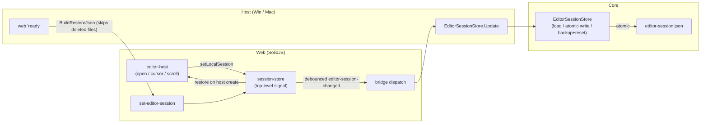

# Editor session (open files + per-file location)

**Status:** implemented.

When a workspace window opens, Weavie restores the editor to the file the user had open, at the same
scroll/cursor/folding position they left it — the way VS Code reopens your editors when you reopen a
folder. The session is persisted per workspace, host-side, so it survives a full relaunch and `Ctrl+R` —
and the **same** `restoreSession()` covers a dev hot reload (HMR), so there is one restore path, not two.

This is the editor-state analogue of [window layout](layout.md), and it deliberately mirrors that
feature end-to-end: a Core store that loads/persists/serves a per-workspace JSON file, a host that
bridges both directions, and a **top-level web module store** seeded by a host push that survives HMR.

## Why this shape (the load-bearing insight)

`ready` is emitted once at page load from `main.tsx`, **not** from `App`'s `onMount`. On HMR, `main.tsx`
is not re-run, so the host never re-pushes. The layout nonetheless survives HMR purely because
`layout/store.ts` is a top-level module signal that isn't reloaded when `App` or the editor chunk
hot-swaps. The editor session does the same: a top-level web store (`editor/session-store.ts`, imported at
top level by `App.tsx`), seeded by a host push at load and kept live by the editor host. That gives **one**
restore path — `restoreSession()` reads the store on every fresh build of the editor widget — across:

- **launch restore** — host reads the persisted session, pushes `set-editor-session` on `ready`, and
  `restoreSession()` reopens the active file from it on create;
- **`Ctrl+R` restore** — same path (a reload re-runs `main.tsx` → `ready`);
- **HMR restore** — the store survives the hot-swap, so `restoreSession()` reads it directly. The host does
  *not* re-push (no `ready`), so on teardown the old host **synchronously flushes** the live state into the
  store (`dispose()` → `captureSession()`), and the open file *working copies* are kept alive on `window`
  (`__WEAVIE_EDITOR_REFS__`). The rebuilt host's `restoreSession()` → `showFile()` → `ensureRef()` re-adopts
  the surviving working copy (no disk re-read, unsaved edits intact) at the flushed view state.

The synchronous flush is what lets HMR share the launch path instead of needing its own snapshot: the
open/cursor/scroll hooks write the store on a debounce, which the teardown would otherwise drop, so
`dispose()` flushes it once more before the widget dies.

## Scope

There are no editor tabs yet (one editor pane). The persisted shape is a **list** of open files so it
extends to tabs cleanly, but the only visible behavior today is: the **active** file reopens at its saved
scroll/cursor on launch. Non-active entries are not eagerly reopened (no LSP spin-up for invisible files).

## Data model

Persisted JSON (per workspace, **no file contents** — those live on disk):

```jsonc
// ~/.weavie/workspaces/<id>/editor-session.json
{
  "active": "/abs/path/to/file.ts",
  "open": [ { "path": "/abs/path/to/file.ts", "viewState": { /* opaque Monaco view state */ } } ]
}
```

`viewState` is the JSON from Monaco `editor.saveViewState()` (scroll + cursor + folding). Weavie stores and
forwards it **opaquely** and restores via `editor.restoreViewState(...)` — it never interprets it.

Two wire messages cross the bridge:

| Direction | `type` | Payload | Meaning |
| --- | --- | --- | --- |
| host → web (`WebBoundMessage`) | `set-editor-session` | `{ session: { active, open: [{ path, viewState }] } }` | Launch/`Ctrl+R` restore. **No content** — the web reopens each file as a VSCode working copy resolved from disk through the host file provider (`createModelReference`), so the model is read from disk even on a fresh page. |
| web → host (`HostBoundMessage`) | `editor-session-changed` | `{ session: { active, open: [{ path, viewState }] } }` | Debounced. The open-list + active + view states, **NO content** — the host reads disk; it never trusts the web for file contents. |

## Architecture



### Core

- `WeaviePaths.WorkspaceEditorSessionFile(WorkspaceId)` → `~/.weavie/workspaces/<id>/editor-session.json`
  (mirrors `WorkspaceLayoutFile`).
- `EditorSession` / `EditorSessionEntry` (`Editor/EditorSessionModel.cs`) — records; `viewState` is an
  opaque `JsonElement?`; unknown top-level fields round-trip via `[JsonExtensionData]`.
- `EditorSessionSerialization` — camelCase, indented on disk; a compact, nulls-kept options for the
  bridge message (so `active`/`viewState` are explicit, not undefined).
- `EditorSessionStore` (sibling of `EditorStore`, modeled on `LayoutStore`) — loads on construct, atomic
  writes via `IFileSystem.WriteAllTextAtomic`, malformed-file backup (`editor-session.json.bad`) + reset,
  `Current` / `Changed` / `Update(...)`. `BuildRestoreJson()` checks each open file still exists on disk
  (its own `IFileSystem`), skips + logs files that no longer exist, and nulls `active` if it was skipped.
  No file content is read or pushed — the web reopens from disk through the file provider.

The `Changed` event exists for parity with `LayoutStore`; the web is the sole writer today, so hosts do
**not** re-push on it (that would echo). A future MCP "open file" capability would use it.

### Hosts (Win + Mac, in lockstep)

Each host owns an `EditorSessionStore` keyed by the window's workspace id (Windows uses its
`WorkspaceWindow.Id`; macOS derives `WorkspaceId.ForPath(workspace)` since its layout store is still the
legacy single-window file). On the web `ready` message it pushes `set-editor-session` (the open-file list +
view states, no content). It handles inbound `editor-session-changed` by calling `EditorSessionStore.Update(...)`,
which persists. Mirrors `PushLayoutToWeb` / `HandleLayoutChanged` exactly.

### Web

- `editor/session-store.ts` — a top-level signal seeded by `onHostMessage('set-editor-session')` (registered
  at module load) plus `setLocalSession(...)` which keeps the signal live (HMR fidelity) and posts the
  debounced `editor-session-changed`. Imported at top level by `App.tsx` so it isn't only in the editor
  chunk (or it would reload with that chunk and lose state).
- `editor/editor-host.ts` — on host create, `restoreSession()` reopens the active file through `showFile()`,
  the **one** path that swaps the editor's file (a user open and a restore differ only in placement: reveal a
  line vs. restore a view state). `showFile()` → `ensureRef(monaco.Uri.file(path))` (the shared resolve-or-reuse
  helper that reads the file from disk through the host file provider and wires its save listener) → `setModel`,
  whose `onDidChangeModel` drives the active-editor notification to Claude — so a restored file is opened
  identically to a clicked one. It runs on every fresh widget build (launch / `Ctrl+R` / HMR). The
  open/cursor/scroll hooks (collected into the host's `disposables`) call `setLocalSession(...)` so the store
  always holds the live state, and `dispose()` flushes one final `captureSession()` synchronously so a hot
  reload restores the exact teardown position.
- `App.tsx` — after `createEditorHost`, the restored active file flows into `setCurrentFile(...)` (read from
  the session store, not Monaco, to keep the editor chunk out of the shell); a `pendingOpen` user request
  that arrived during load still wins.

## Persistence & failure handling

`~/.weavie/workspaces/<id>/editor-session.json`, written via `WriteAllTextAtomic`. Load is non-fatal,
mirroring `LayoutStore`:

- **Missing file** → empty session (nothing open).
- **Malformed** → log, back the bad file up to `editor-session.json.bad` (don't silently delete), reset to
  empty. No silent fallbacks.
- **Open file deleted between sessions** → skipped + logged at restore-push time; `active` is nulled if it
  was the skipped file. The remaining files still restore.

## Notes / non-goals

- Only real `file://` working copies are captured (`isUserFileModel`). The transient inline-review model
  (scheme `weavie-review`) is therefore suppressed, so a session is never persisted mid-review and an empty
  editor persists an empty session.
- Restoring **non-active** open entries as background models is deferred until tabs exist.
