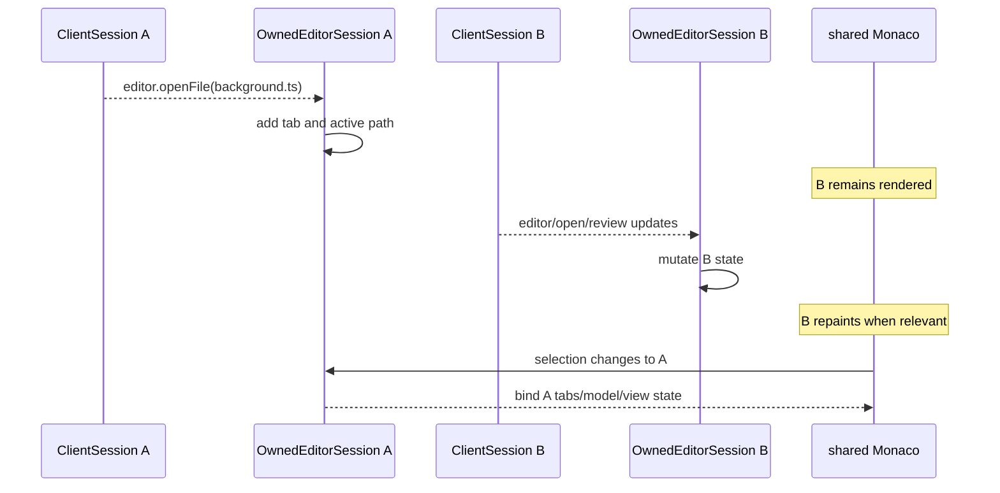

# Editor session

**Status:** implemented.

Each workspace session owns its open tabs, active tab, and per-file view state. `HostSession` keeps
the authoritative in-memory snapshot, and the matching web `ClientSession` keeps its exact rendered
copy. The web may reuse one Monaco editor widget, but it never reuses ownership: selection only binds
that widget to one `OwnedEditorSession`.

This follows the [session-owned message bus](session-message-bus.md) contract.

## Persisted state

The host persists every slot's editor state in the workspace's `sessions.json` overlay:

```jsonc
{
  "version": 3,
  "sessions": [
    {
      "id": "feature/editor-state",
      "worktreePath": "/abs/path/to/worktree",
      "editorSession": {
        "active": "/abs/path/to/worktree/file.ts",
        "open": [{ "path": "/abs/path/to/worktree/file.ts", "viewState": {} }]
      }
    }
  ]
}
```

`kind` is `null` for a file and `web`, `source`, or `plan` for a session-owned overlay. File and
source contents never appear in this state. Monaco reads and writes file contents through the
owning session's `files` feature; plan and source content live in their owning host-session state.
The editor session contains navigation metadata only.

`SessionStore` loads and writes the overlay atomically and backs up malformed or superseded documents.
`EditorSessionSerialization` filters missing or out-of-session-root file entries before restore. Overlay
entries do not require a filesystem path. A deleted active file becomes `null`. Unload keeps the slot's
editor state, and loading or reopening the workspace restores that exact slot rather than borrowing state
from another session.

## Protocol

Both messages use the owning session bus:

| Direction | Feature/name | Payload | Meaning |
| --- | --- | --- | --- |
| host → web | `editor.restore` | `{session:{active,open}}` | Full authoritative state during `lifecycle.sync` |
| host → web | `editor.openFile`, `openOverlay`, `closeTab` | operation | Host mutation already recorded in the authoritative state |
| web → host | `editor.sessionChanged` | `{session:{active,open}}` | Debounced user-driven state update |
| host → attached view → host | `editor.flush` | request / `{session}` response | Save dirty models and return the exact final snapshot before teardown |

The web also publishes `editor.openEditorsChanged` for agent context and sends direct actions such as
`activeChanged`, `newScratch`, and `discardScratch` on the same bus.

There is no session id in the payload. The envelope already carries `(slot, incarnation)`.
Because `sessionChanged`, `activeChanged`, and `openEditorsChanged` describe the shared widget, the
host admits them only from the page currently bound to that exact session. The binding check happens
when the message enters its feature lane, so a mutation authored while attached remains valid if a
later selection change occurs before it executes.

## Web ownership

`editor/session-store.ts` keeps a `WeakMap<ClientSession, OwnedEditorSession>`.
`registerSessionFeature` creates state for every live session and disposes it with that session.

An `OwnedEditorSession`:

- restores only from its owner's `editor.restore`;
- applies tab operations even while its owner is not selected;
- debounces user-driven `editor.sessionChanged` back to the same captured feature channel;
- cancels its pending persistence timer when the session closes;
- exposes selection-neutral `openTabsFor`, `activePathFor`, and related operations.

The selected accessors are convenience views over that map for UI actions. They do not route inbound
messages.

## Shared Monaco

The editor controller holds review state, pending opens, and models by `ClientSession`. File URIs
include the session incarnation, so equal native paths in different sessions cannot share a model or
file-provider request.


```mermaid
sequenceDiagram
    participant A as ClientSession A
    participant AS as OwnedEditorSession A
    participant B as ClientSession B
    participant BS as OwnedEditorSession B
    participant UI as shared Monaco

    A-->>AS: editor.openFile(background.ts)
    AS->>AS: add tab and active path
    Note over UI: B remains rendered
    B-->>BS: editor/open/review updates
    BS->>BS: mutate B state
    Note over UI: B repaints when relevant
    UI->>AS: selection changes to A
    AS-->>UI: bind A tabs/model/view state
```

Opening a background tab updates its owned state immediately. Resolving a VSCode working copy may
wait until that session is presented; this avoids paying Monaco/LSP cost for an invisible model while
preserving the command.

Every asynchronous apply checks the model/session object it captured before touching the shared
widget. A delayed file response can finish for its owner without repainting a newly selected session.

## Restore and reload

After `connection.hello`, each live `ClientSession` requests `lifecycle.sync`. The host unicasts the
session's editor restore alongside LSP, review, files, git, agent, and terminal state to that
requesting page. Reconnect uses the same path without replaying mutations to other attached pages.

The top-level web store survives normal component remounts. Before an editor widget is disposed it
captures the current view state and flushes the selected owner's pending session update. Working-copy
references use session-namespaced URIs and can be re-adopted by the rebuilt widget.

Unload and delete first request `editor.flush` from the page presenting that exact session. The page
saves dirty working copies, flushes its pending session update, and returns its final state. A save
failure aborts teardown visibly; no attached view is a valid case because host-driven state is
already authoritative.

## Failure behavior

- Missing sessions overlay: empty editor state for each newly discovered slot.
- Malformed or superseded sessions overlay: back up as `.bad`, report it, and reset.
- Missing restored entry: report and omit it. An entry outside the worktree is restored like any other.
- Dirty model save failure during unload/delete: fail the command and leave the session live.
- Removed `ClientSession`: cancel its pending update and dispose its models/references.
- Stale incarnation restore or file response: no matching client endpoint, so it is ignored.

There is no projection offer, lease, active-session gate, release handshake, or cross-session replay.
