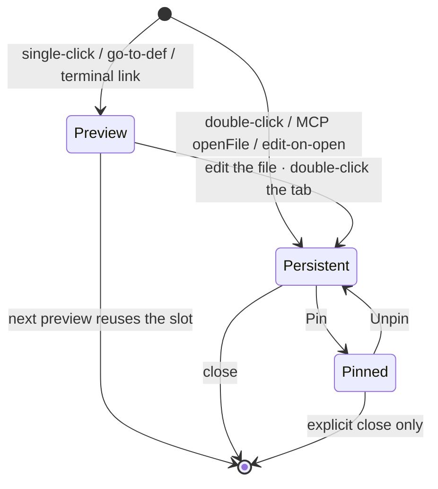
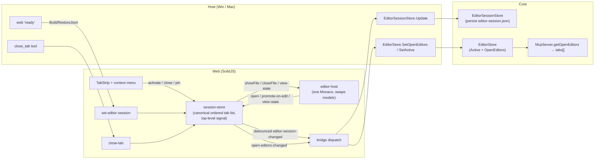

# Editor tabs (multiple open files in the editor pane)

**Status:** implemented (web + Core static-verified). Host wiring (Win/Mac dispatch, `FileOpener`,
`McpDiffPresenter`) is in place but not yet built end-to-end — the branch's host projects were mid-refactor
by parallel work at implementation time; a full-app + live IDE-MCP pass is still pending a clean host build.

Today the editor pane shows one file at a time: opening a file swaps the single Monaco editor's model
(see [editor-session.md](editor-session.md)). Editor tabs let several files stay open at once, switchable
from a tab strip above the editor, the way VS Code does. This is the
visible payoff of a shape that was already built for it: the persisted session is a **list** of open files,
the working-copy reference cache already keeps every opened model alive across switches, and the MCP layer
already returns a `tabs[]` array.

This is **only** the editor-tab layer. It is not the [session model](file-management-and-sessions.md): a
future session *contains* an array of editor tabs — tabs do not depend on that refactor and do not pull it
forward. One editor pane, many tabs; split editors are out of scope.

## Scope / non-goals

- **In:** an ordered, switchable set of open files in the single editor pane; preview / persistent / pinned
  tab states; close + bulk-close actions; a tab strip and a per-tab context menu; full persistence across
  relaunch / `Ctrl+R` / HMR; the real open set reported to Claude over MCP.
- **Out:** split / side-by-side editors (a layout-pane change, not a tab change); editor groups; drag-out
  to a new window; MRU `Ctrl+Tab` quick-pick (we cycle in visual order — see *Switching*).

## Tab states

A tab is in exactly one of three states. The first two are VS Code's preview/normal distinction; **pinned**
is a third, independent state.



- **Preview** — italic title; there is **at most one** preview tab. Opening another previewable file reuses
  the same slot (same position) rather than adding a tab. Promoted to persistent by editing the file or
  double-clicking the tab. This keeps the strip from filling up while navigating (go-to-def, jumping around
  the file tree).
- **Persistent** — an ordinary open tab. The default for an intentional open (double-click in the file tree,
  MCP `openFile`, or editing a preview).
- **Pinned** — an explicit user action, distinct from persistent. A pinned tab is **rendered compact**
  (icon, no title / no inline close until hover), **sorted furthest-left**, and **protected from bulk-close**
  (it survives Close All / Close Others / Close to the Left / Close to the Right). It closes only when closed
  explicitly (its own close affordance, or `Close` on that tab).

## Ordering & pinning

The open list is partitioned: **pinned tabs first (in pin order), then unpinned (in open order)**. This is an
invariant the store maintains, and it is also the persisted order.

- A new open appends to the end of the unpinned section (the preview tab also lives there).
- **Pin** moves a tab to the end of the pinned section and marks it compact.
- **Unpin** moves it to the start of the unpinned section.

## Opening, switching, closing

**Open / activate.** Opening resolves to one of: already open → activate it; previewable and a preview slot
exists → replace that slot's file in place; otherwise → append a new tab (preview or persistent per the
gesture) and activate it. Whether an open is *preview* is decided by the originating gesture (below), not by
the host.

| Gesture | Result |
| --- | --- |
| File tree **single-click**, terminal `file:line` link, go-to-def / peek | **preview** |
| File tree **double-click**, omnibar **Go to File** (Enter), MCP `openFile` | **persistent** |
| Editing a preview tab's file, double-clicking a preview tab | promotes preview → **persistent** |

**Switching.** `nextTab` / `prevTab` move through the strip in **visual order**, wrapping at the ends.
Activating a tab snapshots the outgoing tab's Monaco view state into its entry and restores the incoming
entry's, so cursor/scroll/folding are per-tab. (No MRU ordering and no `Ctrl+Tab` quick-pick overlay in v1.)

**Closing.** Weavie auto-saves real files on a debounce and reloads from disk on host `fs-change`, so a normal
tab has no manual-dirty model and **no unsaved-changes prompt**; closing first flushes any pending save for
that tab, then disposes its working-copy reference and removes the entry. When the active tab closes, the
neighbor to its right (else its left, else a pinned tab, else nothing) becomes active.

The one exception is a **scratch (untitled) buffer with content** (see *Scratch buffers* below): it has no
real name yet, so closing it **confirms a discard** and then deletes its temp file. Every close path — the
keyboard, the context menu, middle-click, bulk close, and MCP `close_tab` — funnels through a single guard in
the editor controller, so no path can drop an unsaved scratch without that confirm.

- **Close** — the target tab (active tab from the keyboard; the right-clicked tab from the context menu).
- **Close All** — closes every **unpinned** tab; pinned tabs remain.
- **Close Others** — closes every unpinned tab except the target (and except pinned).
- **Close to the Left** / **Close to the Right** — closes unpinned tabs positioned left / right of the target.
  (Pinned tabs are leftmost and are always skipped.)

Disposing the reference is new: today references are **never** disposed (`editor-host.ts`,
`__WEAVIE_EDITOR_REFS__`) so models survive HMR. Only an **explicit close** disposes; HMR teardown still must
not, or a hot reload would lose open tabs. So disposal is gated on user-initiated close, never on `dispose()`.

## Commands & keybindings

New commands in `Weavie.Core/Commands/CoreCommands.cs` (web `runsIn`) with handlers in `src/web/src/App.tsx`,
following the existing command pattern. Per the keyboard-first rule, each affordance reads its shortcut from
the command catalog (`CommandInfo.keys` + `formatKey`) — nothing hardcoded.

| Command id | Title | Default key | Notes |
| --- | --- | --- | --- |
| `weavie.editor.closeTab` | Close Editor | `$mod+w` | Active tab (or context-menu target). |
| `weavie.editor.nextTab` | Next Editor | `$mod+Tab` | Visual order, wrapping. Assumes the keybinding layer receives `Ctrl+Tab` (no `Ctrl+PageDown` fallback). |
| `weavie.editor.prevTab` | Previous Editor | `$mod+Shift+Tab` | |
| `weavie.editor.closeAll` | Close All Editors | — | Palette / context menu (the keybinding resolver has no chord support, so no default key). Skips pinned. |
| `weavie.editor.closeOthers` | Close Other Editors | — | Palette / context menu. Skips pinned. |
| `weavie.editor.closeToLeft` | Close Editors to the Left | — | Palette / context menu. |
| `weavie.editor.closeToRight` | Close Editors to the Right | — | Palette / context menu. |
| `weavie.editor.togglePin` | Pin / Unpin Editor | — | Palette / context menu. |
| `weavie.editor.newFile` | New File | `$mod+n` | Opens a scratch buffer. Gated `!terminalFocused` (so `Ctrl+N` stays readline's next-history in a terminal), not `editorFocused`, so it works from anywhere else — including with no tab open. |
| `weavie.editor.save` | Save | `$mod+s` | Gated `editorFocused`. A scratch buffer prompts for a name (native dialog); a real file is already autosaved, so it just consumes the key (a focused terminal keeps `Ctrl+S` = XOFF). |

`Ctrl+1–9` is unchanged — it stays `weavie.pane.focusByIndex` (focus pane by number), **not** tab-by-index.
The unbound commands are a deliberate exception to "every action gets a default binding": they are positional
/ menu-driven and have no ergonomic chord-free key, and they stay discoverable through the palette and the
context menu (both of which surface any binding the user later assigns).

## Tab strip & context menu

The strip is **chrome inside the existing editor pane**, not a new layout pane — it renders inside
`.editor-surface` in `App.tsx`, directly above `<div class="editor">`. It must **not** touch
`LayoutView`'s `KINDS` (the editor stays a single layout pane that the layout system only repositions).

- Renders tabs from the store signal: active styling, **italic** for preview, **compact** for pinned, a dirty
  dot, an `×` close (hidden on pinned until hover), horizontal overflow scroll.
- Mouse: click → activate; double-click → promote preview → persistent; middle-click → close; right-click →
  context menu.
- **Context menu** items map one-to-one to the close/pin commands above (`Close`, `Close Others`, `Close to
  the Left`, `Close to the Right`, `Close All`, `Pin`/`Unpin`). Each row shows the command's label and its
  effective shortcut from the catalog. The menu's target is the right-clicked tab (passed to the command);
  keyboard invocation targets the active tab.

## Data model

The persisted shape ([editor-session.md](editor-session.md)) gains two optional per-entry flags; the array
order is the visual tab order (pinned-first):

```jsonc
// ~/.weavie/workspaces/<id>/editor-session.json
{
  "active": "/abs/path/to/file.ts",
  "open": [
    { "path": "/abs/pinned.ts",  "viewState": { /* … */ }, "pinned": true },
    { "path": "/abs/file.ts",    "viewState": { /* … */ } },
    { "path": "/abs/scratch.ts", "viewState": null, "preview": true }
  ]
}
```

`EditorSessionEntry` (web `editor/session-types.ts`, Core `Editor/EditorSessionModel.cs`) adds `preview?:
bool` and `pinned?: bool` (both default false; absent ⇒ false, so old files round-trip). `viewState` stays
opaque Monaco state, stored and forwarded verbatim. No file contents are ever persisted or sent — disk is the
source of truth.

Wire messages (`src/web/src/bridge.ts`; host dispatch `WorkspaceWindow.WebBridge.cs` / `AppDelegate.cs`):

| Direction | `type` | Change | Meaning |
| --- | --- | --- | --- |
| host → web | `set-editor-session` | carries the full `open[]` with flags | Launch / `Ctrl+R` restore (existing message, fuller payload). |
| web → host | `editor-session-changed` | carries the full `open[]` with flags | Debounced persist (existing message, fuller payload). |
| web → host | `reveal-file` | add optional `preview?: bool` | File tree single vs double click chooses preview-ness; host echoes it back. |
| host → web | `open-file` | add optional `preview?: bool` | Round-tripped from `reveal-file`; MCP `openFile` honors its `preview` arg (default `false` = persistent). |
| web → host | `open-editors-changed` | **new** | The live tab set for MCP: `[{ path, isActive, isPinned, isPreview }]` — `path` is the web's own tab key (the host derives the uri/label and fills `languageId` for the active tab from `active-editor-changed`). Fired on open/close/activate/pin/promote (and once on restore), but not on view-state-only commits. Distinct from `active-editor-changed`, which keeps carrying the rich active editor (text + selection) for `getCurrentSelection` / `selection_changed`. |
| host → web | `close-tab` | **new** | MCP `close_tab` asks the web to close a tab by `path` (the same key it reported), resolved from the tool's `tab_name` (exact path, else basename). |

## Architecture

The canonical tab state is the top-level web store (so it survives HMR, exactly as the session store does
today); the editor host owns Monaco model-swapping and view-state capture and calls the store's mutators; the
host bridges persistence (as today) and now also the live open set for MCP.



### Web

- `editor/session-store.ts` becomes the **canonical, ordered tab list** (the existing top-level
  `EditorSession` signal, with the richer entry). It exposes mutators — `openTab`, `activateTab`, `closeTab`,
  `togglePin`, `promote` — and continues to post the debounced `editor-session-changed`, plus a new
  `open-editors-changed` whenever the set changes. Staying a top-level module is load-bearing: it is what
  survives HMR and gives the one restore path.
- `editor/editor-host.ts` keeps `showFile()` as the single model-swap path (activate = `showFile`; the refs
  cache already keeps non-active models alive). New: `closeFile(uri)` flushes the pending save then disposes
  the reference (the only place a reference is ever disposed — gated on explicit close, never on `dispose()`).
  View state is snapshotted into the outgoing entry and restored from the incoming entry on every switch; a
  preview tab promotes itself on first `onDidChangeModelContent`. `restoreSession()` reopens **all** tabs
  into the store but materializes a Monaco model only for the **active** one — non-active tabs materialize on
  first activation (no LSP spin-up for invisible files).
- `editor/vscode-services.ts` — the editor-service `openEditor` callback (go-to-def / peek targets) routes
  through the store as a **preview** open instead of a bare `setModel`.
- `TabStrip.tsx` (new) renders the strip + context menu inside `.editor-surface` (`App.tsx`).
- `App.tsx` — registers the new command handlers; `currentFile` continues to track the active tab.

### Hosts (Win + Mac, in lockstep)

`FileOpener.Open(path, line, preview)` forwards the `preview` flag onto `open-file`. The bridge dispatch
handles the fuller `editor-session-changed` (persist, unchanged path) and the new `open-editors-changed` by
calling `EditorStore.SetOpenEditors(...)`. MCP `close_tab` posts `close-tab` to the web. Mac mirrors Windows
exactly (the active-editor and session plumbing already exist on both).

### Core

- `Editor/EditorSessionModel.cs` — `EditorSessionEntry` gains `Preview` / `Pinned`; `BuildRestoreJson()`
  preserves order and flags (still skips files deleted on disk; still no content).
- `Editor/EditorStore.cs` — gains an `OpenEditors` list alongside the single `Active` (its docstring already
  anticipates "the full set of open editors alongside the active one"). `SetOpenEditors` raises `Changed`.
- `Mcp/McpServer.cs` — `BuildOpenEditorsResult` reports the real `OpenEditors` set (uri / isActive / label /
  languageId / isDirty, plus `isPinned` / `isPreview`) instead of just the active editor; `close_tab` (schema
  already present) is wired to post `close-tab`. `openFile` honors its `preview` arg, defaulting to a
  **persistent** tab.

## Diff / review interplay

Inline diffs are keyed by URI and render only for the active model (`inline-diff.ts`), so applied-turn and
view diffs are already per-tab. An inbound `openDiff` **makes its file the active tab** (opening one if the
file wasn't already open — including a brand-new file that doesn't exist yet) so the strip and title name what
is under review, instead of leaving the previously-open file selected. The review path (`beginReview` /
`endReview`) swaps that tab's model to a transient `weavie-review:` model and back; the file tab keeps its
identity. `applyActive` guards on the active review so making the reviewed file active never swaps the
real working copy in over the transient model. Resolution:

- **Keep** — the tab stays. If the file's working copy is open it shows (reloading to the kept content via
  fs-change); if not (a new file, or one that wasn't open), the editor keeps showing the proposed content and
  the tab becomes a real working copy the next time it's opened, after Claude's write lands.
- **Reject / cancel** — a tab we opened *only* to host the review is dropped (`dropReviewTab`) and the
  previously-active tab restored; for a brand-new file that means no dangling tab to a file that was never
  created. A file that was already open before the review stays open.

The active-editor / open-editors emit still suppresses the `weavie-review:` scheme (`isUserFileModel`), so the
transient model is never reported as the active editor; the reviewed *file* tab, however, does join the open
set while under review (and a kept file persists with it).

## Persistence & failure handling

Inherits [editor-session.md](editor-session.md) wholesale — atomic write, malformed-file backup
(`editor-session.json.bad`) + reset, no silent fallbacks. Additions:

- **Restore reopens all tabs** (order + pinned/preview flags), active eager, others lazy.
- **Open file deleted between sessions** → that entry is skipped + logged at restore-push time; if it was the
  active or only-preview file, `active` is recomputed from the surviving tabs.

## Scratch (untitled) buffers

**New File** (`Ctrl+N`) opens a scratch buffer — VS Code's "untitled editor", adapted to Weavie's
disk-backed pipeline. Weavie's editor is built entirely on `file://` working copies resolved through the
host-backed file provider (autosave, view-state, restore-on-relaunch all assume a real path), and the session
persists **paths, never content** ("disk is the source of truth"). VS Code's untitled-hot-exit persistence is
therefore not free here. So a scratch buffer is backed by a **real temp file**, created on `Ctrl+N`, that lives
*outside* the workspace in a per-workspace scratch dir — `~/.weavie/workspaces/<id>/scratch/Untitled-N` (see
`WeaviePaths.WorkspaceScratchDir`, `Editor/ScratchStore.cs`). Being a real file, it reuses the **entire**
pipeline for free: it autosaves, keeps view state, restores across `Ctrl+R` and relaunch, and round-trips in
`editor-session.json`. Being outside the workspace, it never reaches the file tree, the index, git, or Claude.

- **Provider scope.** `FileProviderService` takes the scratch dir as a **required** second allowed root, so
  the editor can read/write these buffers while everything else outside the workspace stays refused. The root
  is required, not optional — a session always has one, and an omitted root would silently refuse all scratch
  I/O.
- **The flag.** `EditorSessionEntry` gains `scratch?: bool` (web + Core), persisted like `preview`/`pinned`, so
  a restored scratch tab keeps its identity (shown as `Untitled-N`, still saving-prompts, still discard-on-close).
- **Save** (`Ctrl+S`) on a scratch buffer runs **Save As**: the web cancels the buffer's pending autosave (so
  nothing re-creates the temp during the dialog) and posts `save-scratch-as`; the host opens a **native Save
  dialog** (default dir = workspace root, default name = `Untitled-N`), writes the content to the chosen path,
  deletes the temp file, and replies `scratch-saved`. The web then converts the tab to the saved file in place
  (`convertScratch`) when it landed inside the workspace, or — saved elsewhere, where the editor can't edit it —
  drops the scratch tab after a toast. A real file's `Ctrl+S` is a no-op (it's already autosaved).
- **Close** confirms + discards: closing a scratch buffer that has content prompts (`ConfirmDialog`), and on
  confirm the host deletes its temp file (`discard-scratch`). Empty scratch buffers close without a prompt.
- **GC.** On launch the host deletes scratch temp files not referenced by the restored session
  (`ScratchStore.GarbageCollect`), so a crash or a reset `editor-session.json` can't leave orphans.

New web↔host messages: `new-scratch`, `save-scratch-as`, `discard-scratch` (web→host); `scratch-saved`
(host→web); `open-file` gains `scratch?`.

## Notes / non-goals

- One editor pane. Split editors / editor groups are a layout change, explicitly out of scope.
- No MRU `Ctrl+Tab` cycling or quick-pick overlay in v1 — `next/prevTab` walk visual order.
- No unsaved-changes prompt on close **for real files** — auto-save + disk-reload means there's no manual-dirty
  state to guard. A **scratch** buffer is the exception: it has no real name, so closing it confirms a discard
  (see *Scratch buffers*). Every close path funnels through one guard so none can bypass it.
- The Save-As name prompt is a **native OS dialog** (reusing the host's existing native-dialog wiring); the
  discard confirm is a small in-app modal (a yes/no that benefits from staying in the synchronous web close flow).
- `Ctrl+Tab` is assumed to reach the keybinding layer; there is no `Ctrl+PageDown/PageUp` fallback.
