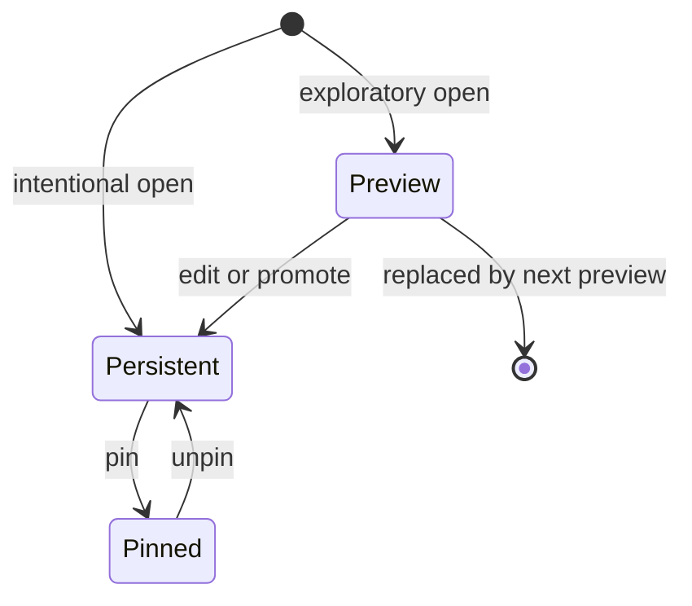
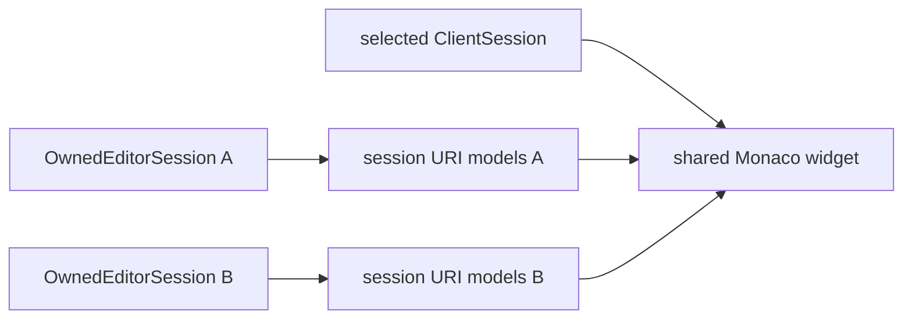

# Editor tabs

**Status:** implemented.

Each `ClientSession` owns an ordered set of editor tabs. The page reuses one Monaco widget to present the
selected owner, but tab state, models, file operations, review state, and persistence remain session-owned.
See [editor-session.md](editor-session.md) for the ownership boundary.

## States

A file tab may be preview, persistent, or pinned:


```mermaid
stateDiagram-v2
    [*] --> Preview: exploratory open
    [*] --> Persistent: intentional open
    Preview --> Persistent: edit or promote
    Preview --> [*]: replaced by next preview
    Persistent --> Pinned: pin
    Pinned --> Persistent: unpin
```

- **Preview:** italic; at most one per session. The next preview replaces it in place.
- **Persistent:** ordinary open tab.
- **Pinned:** compact, ordered before unpinned tabs, and protected from bulk-close.

Editing or double-clicking a preview promotes it. Pinning moves a tab to the end of the pinned partition;
unpinning moves it to the start of the unpinned partition.

## Opening and navigation

An open operation captures its `ClientSession` before doing any asynchronous file work:

- an already-open path activates its existing tab;
- a preview replaces the current preview slot;
- otherwise the tab appends to that session's list.

Exploratory gestures such as a file-tree single click, terminal link, and go-to-definition use preview.
Intentional gestures such as a double click, Go to File, and agent `openFile` use persistent tabs.

Next/previous tab walks visual order and wraps. Activating a tab snapshots the outgoing Monaco view state
and restores the incoming tab's state. Back/forward navigation and closed-tab history are also held per
session.

A background `editor.openFile` updates its owner's tab list immediately. Model materialization may wait
until that owner is selected. Selecting it later presents the already-mutated state.

## Closing

All close paths pass through the editor controller:

- Close targets one tab.
- Close All, Others, Left, and Right skip pinned tabs.
- Closing the active tab chooses its nearest surviving neighbor.
- A real file flushes pending autosave before its working-copy reference is disposed.
- A non-empty scratch tab confirms discard before deleting its backing temp file.

Explicit close is the only operation that disposes a tab's working-copy reference. Component remount and HMR
keep references so the session can re-adopt its models.

## Session data

The ordered tab entry is:

```ts
interface EditorSessionEntry {
  path: string;
  kind?: "file" | "web" | "source" | "plan";
  viewState: unknown | null;
  preview?: boolean;
  pinned?: boolean;
  scratch?: boolean;
}
```

`OwnedEditorSession` stores `{active, open[]}` in a `WeakMap<ClientSession, ...>`. It publishes
`editor.sessionChanged` on its captured session feature channel and reports active/open editor context on
that same owner. No payload carries a routing slot.

The host restores state with `editor.restore` during `lifecycle.sync`. File contents are never part of the
tab payload.

## Monaco model identity

File models use session-namespaced URIs. Two worktrees may expose the same native path string without sharing
a model, save queue, LSP client, or review.


```mermaid
flowchart LR
    A["OwnedEditorSession A"] --> MA["session URI models A"]
    B["OwnedEditorSession B"] --> MB["session URI models B"]
    SEL["selected ClientSession"] --> E["shared Monaco widget"]
    MA --> E
    MB --> E
```

Every delayed operation retains the owner/model it began with. Completion may mutate that owner's state, but
it repaints the widget only when the same owner and model are still presented. This is rendering discipline,
not message filtering.

## Reviews

A diff proposal carries its owning `ClientSession`. Review models also use owner-specific URIs. Opening a
review activates its file tab in that session; resolving it sends `editor.resolveDiff` on the same session
bus.

- Keep returns the tab to the kept working copy.
- Reject removes a tab created only for the proposal and restores that session's prior active tab.
- Changing selection does not transfer or cancel another session's review.

## Scratch buffers

New File creates a real temp file under the session's workspace-specific scratch directory. This reuses the
same file-provider, autosave, restore, and view-state pipeline while keeping the buffer outside the worktree,
git, file index, and agent context.

Saving a scratch buffer uses the session's `editor.saveScratchAs` or `saveScratchNamed` request. The host
writes the chosen file, removes the temp, and returns a structured result. Discard uses
`editor.discardScratch`. Session startup garbage-collects temp files not referenced by restored state.

## Commands

Tab actions are web commands in the shared command catalog:

- close, next, previous, and reopen closed;
- close all/others/left/right;
- pin/unpin;
- new and save file;
- copy name/relative path/absolute path.

UI affordances read effective shortcuts from the catalog. A command handler receives or captures the
selected `ClientSession` at invocation; inbound editor messages never call a selected-session lookup.

## Required coverage

- tab ordering and the single-preview invariant are per session;
- background opens mutate only their owner;
- equal paths in two sessions create different model URIs;
- delayed file reads cannot repaint another owner;
- selection restores each session's active tab and view state;
- close/bulk-close preserve pinned tabs and guard scratch content;
- review resolution routes through the proposal owner;
- session removal cancels persistence and disposes only its models;
- restore preserves order, flags, active tab, and valid paths.
