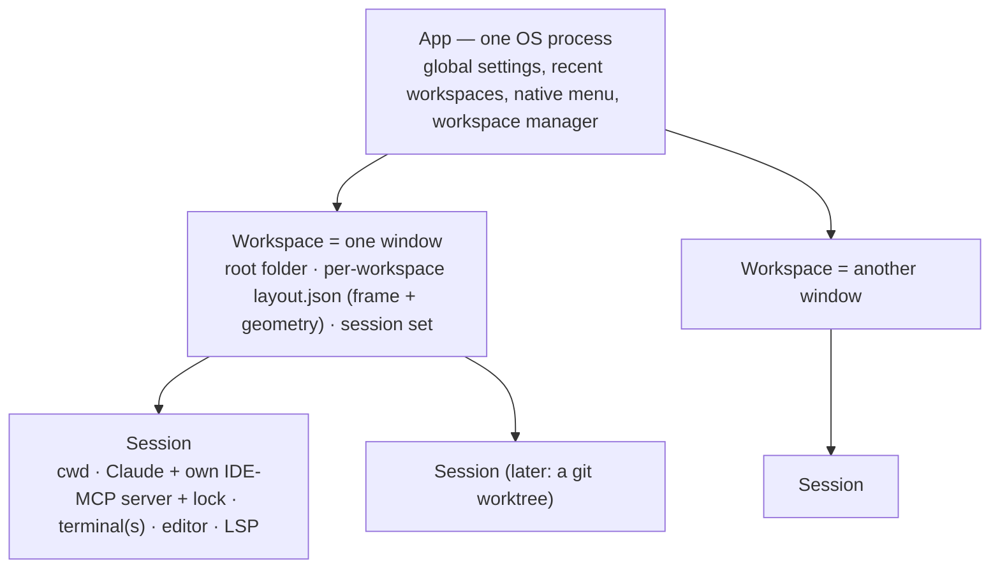
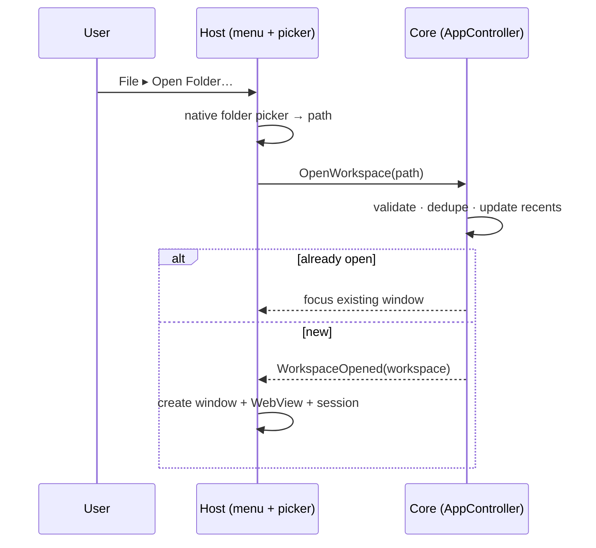

# File management & sessions

Status: proposed
Last updated: 2026-06-17

How Weavie opens a folder as a project, restores it across launches, scopes everything to it, and
supports more than one open at once. The feature introduces a three-tier runtime model —
**App → Workspace → Session** — that replaces today's single fused "the app *is* the one folder"
assumption.

The thesis: **a workspace is a *place* (a folder + a window), a session is a *unit of agentic work*
(a Claude + a working directory).** Two agents on the same repo should share the window and the
spatial frame but own their own editor/terminal/Claude; two unrelated repos should be two windows.

## The model

- **App** — one process. Owns process lifecycle, the native menu, the single `settings.toml`
  (global prefs), the recent-workspaces list, and a manager of open workspaces. Multiple open folders
  are multiple **windows in one process**, not multiple processes (see [Process model](#process-model)).
- **Workspace** — one OS window opened on a root folder. Owns the window + WebView, the per-workspace
  pane **layout + window geometry**, and a set of sessions. The root folder is what appears in recents.
- **Session** — a full working context inside a window: its own working directory (= workspace root
  for now, later a git worktree), a Claude instance, **its own IDE-MCP server + `~/.claude/ide/<port>.lock`**,
  terminal(s), editor, and LSP rooted at the session's cwd. A session is almost a mini-workspace; the
  one thing it is **not** is its own window.

**v1 ships exactly one auto-created session per workspace** — we build the session seam (everything
session-scoped) but defer the multi-session switcher UI.

## Layout vs instances — the key split

The **layout is per workspace**: a frame of pane *slots* by kind (`editor`, `terminal:claude`,
`terminal:shell`) plus splits and window geometry, stable across sessions. A **session supplies the
live instances** bound into those slots by kind. Switching sessions re-binds the slots to a different
session's instances — `slot[kind] ← activeSession.instance[kind]` — the frame stays put, the contents
swap.

This maps directly onto what already exists: pane *kinds* are already singletons in
`Weavie.Core/Layout`, and `layout.json` is moving per-workspace anyway. The session layer is a
**binding indirection** added now; for v1 (one session) it renders identically to today.

The binding is also the **virtualization seam**: only the active session's instances are bound into
the visible frame, so only the active session needs a live Monaco/xterm. Background sessions can hold
serializable state and re-hydrate on focus. The rule to keep this possible: **never bake "every
session = a permanently-mounted Monaco/xterm" into the data model** — a session is described by data
the view renders. (Live *backend* processes — Claude, PTY, LSP — stay per-session regardless; only
the heavy frontend renderers get virtualized. That cost is intrinsic to N parallel agents.)

## File browser

Not a persistent sidebar and not a layout slot. A **contextual/virtualized navigator rooted at the
session's root directory** (the session cwd) that reveals/expands down to the current file's location,
surfaced on demand and following whatever's open. Because its root is the session's cwd and the active
file belongs to the active session's editor, it simply follows the active session — no separate
ownership question. Requires directory enumeration added to `IFileSystem` (Phase 3).

## Process model

**One process, many windows.**

- macOS effectively requires it — a bundled `.app` is single-instance; spawning extra processes
  (`open -n`) fights the dock, the menu bar, and activation. The native idiom is one process, many
  `NSWindow`s. Windows is happy either way, so single-process is the only model uniform across both.
- One in-memory `SettingsStore` shared across windows → a live settings/theme/font change propagates
  to every window with no `settings.toml` write contention.
- Enables later cross-window features (command-palette switch, move-pane-to-window).

## Persistence & state partitioning

| State | Scope | Location | Notes |
|---|---|---|---|
| Global prefs (fonts, theme, `claude.path`, `terminal.shell`, `claude.allowAllTools`, diagnostics) | App | `~/.weavie/settings.toml` | Stays one file, one in-memory store. |
| Pane layout + window geometry | Workspace | `~/.weavie/workspaces/<id>/layout.json` | `LayoutStore` stops being a singleton; keyed per workspace. `<id>` = hash of the normalized absolute path. |
| Recent workspaces + last-opened | App | `~/.weavie/recents.json` | New store, `LayoutStore` conventions (atomic write, malformed → `.bad` + reset, `Changed` event). |
| Active workspace root | Session | (in `recents.json` / per-workspace) | The `workspace` *setting* is **demoted** from a global setting to session state; kept readable as a migration source so existing configs still open. |

## Core vs host split

You can't create an `NSWindow`/`Form` from Core, so the seam is: **logic in Core, native UI in the
host.**

- **Core** owns all logic: validate a folder, dedupe against open workspaces, manage recents, decide
  restore-on-launch, and construct the workspace-scoped Core services (MCP/LSP/layout/filesystem). It
  exposes `OpenWorkspace(path)`, `RecentWorkspaces`, etc., and raises `WorkspaceOpened`/`WorkspaceClosed`.
- **Host** owns only native UI: the menu (`MenuStrip` / `NSMenu`), the folder **picker**
  (`FolderBrowserDialog` / `NSOpenPanel`), and — reacting to `WorkspaceOpened` — creating the window +
  WebView and the host-side per-session pieces (PTYs via ConPTY/PTY, the bridge, the file opener).

## Editor buffers (working copies)

The editor's open files are real VSCode **working copies** backed by a host-`file://` provider, not
hand-created Monaco models: the page opens a file via `createModelReference` (resolved over a correlated
`fs-read`/`fs-stat` bridge → `IFileSystem`), saves it via `fs-write` on weavie's debounce, and reloads it
when the host pushes `fs-change` (Claude edits via the change tracker; external edits via the
`WorkspaceWatcher`). Logic lives in Core (`Editor/FileProvider{Protocol,Service}.cs`,
`IFileSystem.TryGetStat`); the hosts only parse the bridge messages and call the service (workspace-scoped
via `BufferStore.IsWithinWorkspace`). This replaced the old `save-buffer` autosave + `refresh-file`
live-refresh messages. Details and rationale: [theming-and-lsp.md](theming-and-lsp.md) §9.

## Window lifecycle

- **Launch:** reopen the **last** workspace; if there is no history, show the welcome window.
- **Open Folder:** if the folder is already open → focus its window; else open a new workspace window.
  (v1 is *new window only* — in-place re-root is deferred.)
- **Last window closed:** show the welcome window (macOS keeps the app alive by convention anyway).

## Routing

Each session runs its **own IDE-MCP server on its own port** with its own
`~/.claude/ide/<port>.lock`, and the discovery env is injected into *that* session's Claude. So a
diff/`openFile`/selection from a session's Claude routes to that session automatically — the server
*is* the session's private channel. `IDiffPresenter` (and the in-flight `PermissionModeDiffPresenter`
+ change-tracking work, see [permission-modes-and-change-tracking.md](permission-modes-and-change-tracking.md))
become **session-aware**: a diff carries a session id and renders in that session's editor.

## Build sequence

- **Phase 0 — App/Workspace/Session refactor (zero behavior change).** Extract the
  `MainForm`/`AppDelegate` god-objects into an app-level controller (owns the `SettingsStore` + the set
  of workspace windows), a per-window workspace host, and a session that bundles the per-session
  services (claude + shell terminals, `IdeIntegration`/MCP, `LspBridgeServer`, `FileOpener`, diff
  presenter, cwd). Introduce Core `Workspace`/`Session` identity + `WeaviePaths` per-workspace hooks.
  Still single window, still booting the current folder. De-risks everything else.
- **Phase 1 — per-workspace state + recents + welcome window.** Partition `layout.json` + geometry per
  workspace. Demote the `workspace` setting to session/workspace state (migration source). Add the
  `RecentWorkspaces` store. Add the welcome/empty window (no session/terminals/Claude/LSP).
- **Phase 2 — menu + open folder + multi-window + restore.** Core open-workspace logic (validate,
  dedupe, recents, restore-last). Native menu + folder picker per host. Multiple windows in one
  process. Launch reopens the last workspace; dedupe focuses an existing window.
- **Phase 3 — file browser.** Directory enumeration on `IFileSystem` (+ `LocalFileSystem` +
  `InMemoryFileSystem`); bridge messages to list a directory; the contextual session-rooted browser;
  click-to-open through the existing `open-file` path.

Each phase: build + unit tests + drive the live Windows app to validate end-to-end, then commit.

### Implementation status (2026-06-17)

Phases 0–3 are **implemented and committed for the Windows host**, each verified by build + Core tests
(188 passing) + driving the live app. The shared logic lives in Core (`WorkspaceId`, `RecentWorkspaces`,
`WorkspaceManager`, `WorkspaceBrowser`, `IFileSystem` enumeration), so the **macOS host is not yet
mirrored** — it was being actively edited by a parallel agent during this build and there was no Mac
toolchain to compile-verify against. The Mac host (`src/Weavie.Mac/AppDelegate.cs` et al.) needs the same
split as Windows: an app controller + per-window host + `HostSession` analogue, an `NSMenu` + `NSOpenPanel`,
the welcome `NSWindow`, per-workspace layout, and a `list-dir` handler — built on a Mac against the
existing Core, using the Windows host (`Weavie.Win/Hosting/`) as the template.

## Open questions / deferred

> The worktree-per-session, session switcher, multi-session creation, and per-session status items
> below are now specced in [multi-session-and-worktrees.md](multi-session-and-worktrees.md).

- **Worktree-per-session + multi-root / re-rooted LSP.** The `Session.WorkingDirectory` seam is
  defined now, but worktree creation and an LSP that follows a session's worktree are later. The LSP
  `WorkspaceWatcher` is constructor-injected and not currently mutable.
- **Session switcher UI** — the data model nests instances under a session id now; the switcher and
  multi-session creation come after v1.
- **Editor/terminal view virtualization** — keep one live Monaco + one live xterm, re-hydrate on
  focus from serializable per-session state. Architecture preserves the option; not built.
- **macOS LSP gap** — the Mac host does not currently inject `__WEAVIE_LSP__` / wire the LSP bridge
  (Windows-only today); carried forward as pre-existing.
- **"Open Folder in this window"** (in-place re-root) — deferred in favor of new-window-only for v1.
- **Commands capability scope** — "open folder" / "new session" become *commands* in the registry
  (vs the existing *settings* capability); a command's target scope (session vs workspace) is TBD.
