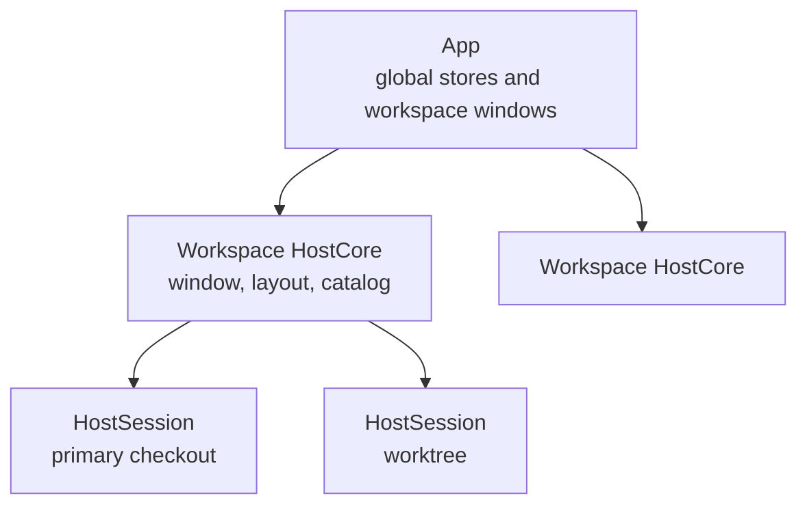

# Workspaces, files, and sessions

**Status:** implemented.

Weavie's runtime has three ownership levels:

```mermaid
graph TD
    A["App<br/>global stores and workspace windows"]
    A --> W1["Workspace HostCore<br/>window, layout, catalog"]
    A --> W2["Workspace HostCore"]
    W1 --> S1["HostSession<br/>primary checkout"]
    W1 --> S2["HostSession<br/>worktree"]
```

- **App:** process-wide settings, recents, native application lifecycle, and open workspace windows.
- **Workspace:** one `HostCore`, window/page, layout, HTTP origin, and session catalog.
- **Session:** one working directory plus agent, terminals, editor state, files, LSP, hooks, reviews, and
  exact message endpoint.

A workspace is a place. A session is a unit of agentic work in that place.

## Layout and presentation

Pane layout and window geometry belong to the workspace. Session contents belong to `ClientSession`
objects. The page renders the selected session's editor and terminal/agent panes into the shared layout.

Sharing the frame or Monaco widget does not rebind ownership. Background sessions continue updating their
own state, and selecting one presents the state it already has.

## File provider

Monaco file working copies use the owning session's `files` feature:

| operation | kind | payload/result |
| --- | --- | --- |
| `files.stat` | request | path → file metadata |
| `files.read` | request | path → contents and metadata |
| `files.write` | request | path/content → write result |
| `files.listDirectory` | event | directory request |
| `files.directory` | event | directory result |
| `files.changed` | event | watcher/change-tracker updates |
| `files.reveal` | event | validated path open |

The session envelope is the route. Paths are domain values and never select a backend.

`FileProviderService` allows the worktree root and that session's scratch root. It refuses other paths.
Every model URI includes the session incarnation, and `HostFileProvider` resolves the owner from that URI
before sending a request. A delayed response therefore returns to the original model/session even after a
selection change.

## File browser

The contextual file browser is rooted at the selected session's worktree. Directory state is cached by
`ClientSession`; switching presentation reads the target owner's cache and requests missing directories on
that owner's bus.

The browser is UI chrome, not another filesystem owner. Open actions capture the relevant `ClientSession`
and forward to its editor controller.

## Watchers and edits

Each `HostSession` owns a `WorkspaceWatcher`. Its asynchronous Git inventory supplies tracked and untracked,
non-ignored paths. Linux uses one shared inotify instance with flat watches only for inventoried directories;
Windows and macOS use one kernel-recursive root subscription and filter every event through the inventory. It
periodically refreshes the authoritative inventory and refreshes immediately when directory topology changes,
so Linux startup and change capture never walk ignored trees such as `.git/objects`. A debounced disk-change
batch fans out inside that owner:

For non-Git folders, the navigation index supplies the files and visited directories from its existing walk to
the same flat watcher. Watcher mutations are replayed over that snapshot, so files created, moved, or deleted
while navigation is still walking cannot be resurrected or lost. Change monitoring itself never initiates a
workspace walk.

- file-provider change events refresh matching Monaco working copies;
- LSP `workspace/didChangeWatchedFiles` updates that session's servers;
- change tracking and review state update from provider-reported paths.

No callback scans or routes through the selected workspace. Session teardown stops and drains the watcher
before its worktree can be removed.

## Persistence

| state | scope |
| --- | --- |
| settings, keybindings, remote-agent registry, recents | app |
| layout and window geometry | workspace |
| session slot/load overlay | workspace host |
| primary editor session and scratch references | workspace |
| live editor/terminal/agent/LSP/review state | exact session incarnation |

Persisted editor state contains paths and view metadata, not file contents. Disk remains authoritative for
contents.

## Windows and hosts

Native app controllers may own multiple workspace windows in one process. Each window creates its own
`HostCore`, transport, host incarnation, catalog, and session set. Process-wide stores may be shared, but
message buses never are.

Headless represents one workspace host without a native window. A remote page connects to it through the
same exact host/session envelope protocol.

## Invariants

- A session feature receives its bus from its owning `HostSession` or `ClientSession`.
- File requests contain no host, slot, current-session, or selected-session routing fields.
- Equal paths in different sessions are distinct models and operations.
- Host selection never gates file, watcher, editor, or LSP state mutation.
- Rendering checks happen only after owner state is updated.
- Unload removes the endpoint and drains file/watcher work before worktree teardown.

See [session-message-bus.md](session-message-bus.md),
[editor-session.md](editor-session.md), and
[multi-session-and-worktrees.md](multi-session-and-worktrees.md).
