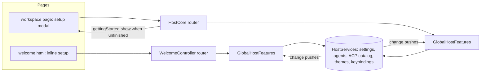

# Getting Started

A short, skippable first-run setup for **global** preferences: color scheme, the default agent (Claude Code or an
ACP agent, installable from the registry), AI inference, and a primer on the first keyboard shortcuts to learn. It
is setup only: teaching features belongs to [contextual suggestions](../concepts/suggestions.md). Per-workspace setup
belongs to [workspace auto-config](../concepts/workspace-autoconfig.md).

## Behavior

- **Where it shows.** Inline on the welcome screen until setup is done. Over a workspace, the host publishes
  `gettingStarted.show` on connect while it's unfinished, and the page opens it as a modal. The `Getting Started`
  command (`weavie.gettingStarted.open`) reopens it from the palette, the welcome screen, or Claude over MCP. It has
  no default keybinding because it's rarely run.
- **Every choice saves immediately.** Each step writes an existing setting through the host, so there is no draft
  state: `theme.mode` / `theme.light` / `theme.dark`, `agent.defaultProvider`, and `inference.enabled` /
  `inference.allowAutomatic` / `inference.defaultProvider`.
- **Done state.** The only new persisted state is the `gettingStarted.completed` setting. Finish, Skip, Esc, and
  clicking outside all set it; setting it back to `false` shows setup again on the next launch. While it's false the
  startup tip and the automatic-inference toast are held back, because setup covers inference.
- **Claude detection.** Claude Code reports itself unavailable, with a reason, when `claude.path` doesn't resolve to
  an executable. That feeds the setup page and the New Session prompt. "Check again" re-reads the agent list after
  an install outside Weavie.

## Architecture

The welcome screen has no workspace, so the app-wide message handlers live in `GlobalHostFeatures`, not
`HostCore`: themes, `settings.get` / `settings.set`, `agentDefaults.get` / `setProvider`, ACP registry list/install,
web logging, and the theme / agent-defaults / command-catalog pushes. `HostCore` and `WelcomeController` each attach
one to their own message bus, so a page gets the same app-wide features with or without a workspace open.

Every host shares one `HostServices` across its windows (Windows included), so a change made in the welcome window
is the same change every workspace window sees.

## Next: action-triggered suggestions

Setup is deliberately not a feature tour. Teaching belongs in suggestions that react to what the user does, e.g.
pasting editor text into the agent composer ("Weavie already shares your selection; revise in place with
Cmd+Shift+E"). Today `SuggestionService` only evaluates workspace state. That needs:

- a definition that declares a trigger (an event kind plus a predicate) in place of `IsRelevant`;
- the web detecting the action (it owns the composer and the selection) and publishing a
  `suggestions.event` on the owning session's endpoint, while Core decides whether and which card to show;
- an app-wide dismissal store, since tips about the user's habits aren't per-repo.
