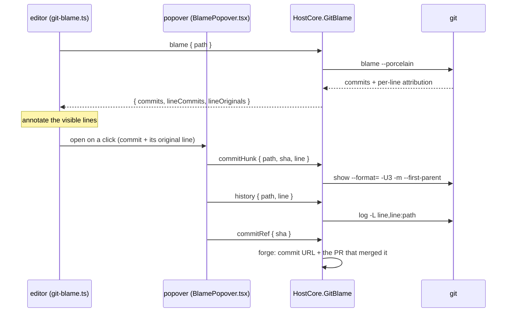

# Git blame annotations

Status: implemented
Last updated: 2026-08-16

Who last changed each line, shown as faded text at the end of it, and a popover behind each one that answers
the question the annotation raises: **what was the change that produced this line?** The popover's subject is
one hunk — the area of text around this line, as that commit wrote it — not the commit and not the pull
request. Those are one click out to the forge.

## The surface

| Where | What |
|-------|------|
| End of the cursor's line | `Kapps, 3 days ago • Fix the drain race`, dimmed and italic; `Uncommitted changes` for a working-tree line |
| Click an annotation | The blame popover, anchored beside it |
| Popover head | Subject, author, when, short sha, and `PR #N ↗` / `Commit ↗` links |
| Popover body | The hunk of that commit covering this line, with the blamed line marked |
| Popover foot | **This line** / **This file** history; picking one re-points the body at that commit |

### Settings and commands

| id | kind | behavior |
|----|------|----------|
| `editor.gitBlame` | setting, `off` \| `currentLine` \| `all`, default `currentLine` | Which lines are annotated |
| `weavie.git.toggleBlame` | Core command | Flips the setting: any showing mode → `off`, `off` → `currentLine` |
| `weavie.git.showBlame` | Web command, `editorFocused` | Opens the popover on the cursor's line, or says why that line has no commit behind it |

Neither command has a default keybinding; both are palette- and MCP-reachable, and bindable in
`~/.weavie/keybindings.json`.

The toggle owns no state of its own — it writes `editor.gitBlame`. The setting, the palette, the keybinding,
and `mcp__weavie__setSetting` therefore cannot disagree, and the choice survives a restart. Turning blame off
and back on returns to the default rather than rewriting an `all` preference the user set deliberately.

### One label per run, not per line

`all` annotates only the lines that **start** a run — where the line above belongs to a different commit, or
to none. A commit usually owns a stretch of consecutive lines, and repeating its label down every one of them
is what makes a whole file unreadable; the label belongs where the change begins. A file written in a single
commit therefore carries exactly one label, at its top, and a locally typed line splits the run either side of
it.

Run starts are computed from the file, not the viewport, so scrolling never moves a label — a run beginning
above the visible window stays unlabelled there rather than acquiring a label at the window's edge.

## Blame is a property of the file on disk

`git blame` reads the working tree, so the annotations describe the **saved** file. Two consequences shape the
implementation:

- **Refetch when the file changes on disk**, not when the buffer changes. The `files.changed` event the host
  already publishes (a save landing, an agent write, a checkout) is the invalidation signal.
- **Re-align, don't refetch, while typing.** Each Monaco content change is reduced to
  `{ startLine, removedLines, addedLines }` and spliced through the per-line arrays
  (`blame-model.ts`). The line an edit starts on keeps its attribution; inserted lines become unattributed,
  which is exactly what they are — the commit that will carry them doesn't exist yet.

Only the visible lines (plus overscan) are decorated, re-run on scroll: a long file's blame is thousands of
lines and injected text costs per rendered line.

A file Git won't blame — untracked, binary, ignored — simply has no annotations, which is the honest
rendering of "Git has nothing to say about these lines" and is not worth a toast every time one is opened.
The reason is kept, though: `weavie.git.showBlame` is an explicit question, so it answers with Git's own
reason rather than declining a keystroke for no visible cause.

## The wire

Four request handlers on the session's `git` feature, all concurrent (read-only git probes, and the popover
issues three at once). Every one addresses a file, so each resolves its path against **the owning session's**
worktree; a path outside it is refused rather than reaching git unanchored.



`blame` is deduplicated on the wire: `commits` holds each commit once, and `lineCommits[i]` /
`lineOriginals[i]` index into it. `git blame --porcelain` already emits this shape — a commit's headers appear
only on its first line — so the parser carries them forward rather than rebuilding them per line.

### Why `lineOriginals` matters

Blame reports each line's number **inside the commit that wrote it**. That number is what selects the hunk:
`git show <sha>` is matched against its post-image at that line. Without it there is no way to find which part
of a large commit produced this particular line.

The same problem appears one level out, for the *other* commits in the history list — the line has a different
number in each. `git log -L a,b:path` follows the range back through every rewrite and reports it in each
commit's `@@` header, so the history response carries a per-commit `line` alongside the metadata. Its patch
body is deliberately unread: `-L` emits a bare one-line hunk with no context, unreadable on its own, so the
line number is taken from it and the *contexted* hunk comes from `git show`.

**The line walk must start at the blamed commit, not `HEAD`.** Blame numbers lines against the *working tree*;
`git log -L` numbers them against whatever commit it starts from. Walking from `HEAD` with a working-tree line
number answers about a different line the moment the file has uncommitted line-count changes above it, and
fails outright (`fatal: file has only N lines`) when the tree is the longer of the two. Since the agent is
editing files constantly, "has uncommitted changes" is the normal state here, so the request carries the
blamed commit's sha and *its* line number:

```
git log -L <originalLine>,<originalLine>:<path> <blamedSha>
```

A line no commit holds yet has no anchor, so it has no line history — the popover says so instead of quietly
showing the file's.

File-scoped history has no such mapping — a commit that changed the file needn't have changed this line — so
those entries carry `line: 0` and the popover says the change is elsewhere rather than presenting some other
part of the commit as if it were this line's.

### Merges

`git show` prints nothing for a merge by default, so a line blamed to one would have no hunk. `-m
--first-parent` gives a merge the same shape as an ordinary commit — its diff against the branch it merged
into — and is a no-op for a non-merge.

### The pull request behind a commit

`IPullRequestProvider.FindForCommitAsync` asks the forge (`GET /repos/{o}/{r}/commits/{sha}/pulls`) rather
than parsing `(#N)` out of the commit subject: the subject convention only holds for squash merges, and the
forge is the authoritative source. It prefers the merged pull request when a commit is reachable from several.
`CommitUrl` is built from the repo identity, so the `Commit ↗` link needs no credential and appears even when
the PR lookup fails or finds nothing.

## Testing

| Level | Covers |
|-------|--------|
| `BlamePorcelainTests` | The porcelain parse: commit dedup, per-line mapping, the all-zero sha, CRLF, content that looks like a header |
| `UnifiedDiffTests` | Hunk selection by post-image line; counts (not prefixes) ending a hunk, so a patch of a patch reads correctly |
| `GitBlameIntegrationTests` | Real `git`: attribution, uncommitted lines, the blamed line anchoring the right hunk, line history reaching past a rewrite, rename following, merges |
| `HostCoreGitBlameTests` | The session bus: absolute-path resolution, out-of-worktree refusal, non-sha refusal, forge links |
| `blame-model.test.ts` | Line re-alignment through inserts, deletes, and replacements; label and relative-time formatting |
