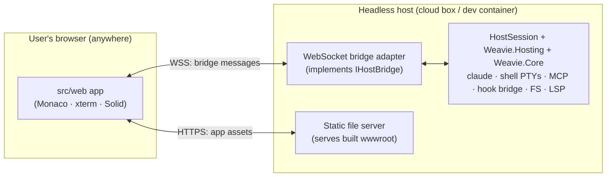

# Headless host (browser-connectable Weavie)

**Status:** implemented (Phase 1, loopback). The **web WebSocket transport**, the **`Weavie.Headless`
host**, and an **end-to-end harness** (a mock host plus a real-host integration test) are landed and
verified on Linux: a real browser connects over a WebSocket to the headless host and its `ready` reaches
the C# `Weavie.Core` session. Built on the shared `Weavie.Hosting` / `IHostBridge` layer (from the
Linux-host work). Remaining gaps are noted under [Known gaps](#known-gaps): monaco-vscode-api's default
theme/grammar extension assets don't yet resolve in a plain browser, and the LSP bridge isn't tunneled.

## Goal

Run Weavie's whole backend headless on a machine (a cloud dev container, a remote box) and let a user
open it in an ordinary **browser** — no native window, no WebView, no VNC. This is **Phase 1** of the
`remote-host.md` guardrail spec ("headless host, single-user, loopback"): the same `src/web` app and the
same `Weavie.Core` engine, with the **in-process bridge replaced by a WebSocket**.

The motivating need: a remote agent session (Claude Code on the web) builds and edits Weavie on Linux
but cannot run the native Win/Mac shells, so host↔web features (e.g. PR #2's editor-session restore)
were never exercised anywhere — "verified" but dead. A headless host makes the *real* web talk to
the *real* host on Linux, so those features can be driven and tested in CI, and a human can connect to a
live session.

## The one seam: the bridge transport

The native shells (`Weavie.Win`/`Weavie.Mac`/`Weavie.Linux`) and the web app already talk over a fully
serializable JSON protocol (`src/web/src/bridge.ts`, `HostBoundMessage`/`WebBoundMessage`). The shells
carry it over the WebView's in-process script-message channel; the headless host carries the **same JSON**
over a WebSocket. Nothing else moves — `Weavie.Core` and the web app are untouched in shape.

## Web side (landed)

`bridge.ts` picks a transport once at module load:

1. **native** — `window.webkit.messageHandlers.weavie` present → the in-process channel (desktop shells).
   Unchanged.
2. **websocket** — no native channel, but a bridge URL is advertised → a `WebSocketTransport` that
   buffers sends until the socket opens (so the very first `ready` from `main.tsx` is never lost),
   reconnects with capped backoff, and feeds inbound frames through the same `deliverFromHost` dispatch
   the native channel uses. The page cannot tell a WebSocket host from a native one.
3. **none** — neither present (a plain browser on the dev server) → outbound is a no-op, nothing is
   received, never throws. The pre-existing dev behavior, preserved.

The bridge URL comes from (first wins):

- `?weavie-bridge=ws://host:port/path` — a query override, handy for manual testing;
- `window.__WEAVIE_BRIDGE_WS__` — injected by the headless host before navigation (like `__WEAVIE_FONTS__`).
  The literal value `"auto"` derives a same-origin `ws(s)://<location.host>/weavie-bridge` — the common
  case where the headless host serves both the page and the socket.

So the headless host's only web-facing obligations are: **serve the built app**, and **inject
`window.__WEAVIE_BRIDGE_WS__ = "auto"`** (or a concrete URL) into `index.html`.

## C# side — `Weavie.Headless` (landed)

`src/Weavie.Headless` (`net10.0`, no UI framework) reuses the host-agnostic pieces in `Weavie.Hosting`
(keyed on `IHostBridge`: `TerminalController`, `FileOpener`, `McpDiffPresenter`) plus `Weavie.Core`,
exactly as the native shells do. It is the platform-agnostic `WorkspaceHost` / `AppDelegate` with the
native window, geometry, and main-thread marshaling stripped out. Three files:

- **`WebSocketHostBridge : IHostBridge`** — the adapter. `PostToWeb(json)` funnels through a single
  channel + pump task (WebSocket sends may not overlap); inbound text frames are reassembled and raised as
  `MessageReceived`. The bridge **outlives any one connection** — like the native hosts, the host persists
  while the page reloads — so a browser refresh just re-attaches a fresh socket and the page re-sends
  `ready`. Pushes made with no page connected are dropped (the page re-requests state on `ready`).
- **`Program.cs`** — Kestrel on `127.0.0.1:<port>` (env `WEAVIE_SERVE_PORT`, default 8700; `0` binds an
  OS-assigned port, reported by the ready line, which prints only once the listener accepts). Serves the
  built `wwwroot`, injecting the bootstrap globals (`__WEAVIE_BRIDGE_WS__="auto"` + fonts + command /
  keybinding catalog) into `index.html` before the module graph runs — the document-start injection the
  native shells do via `AddUserScript`. Exposes the `/weavie-bridge` WebSocket upgrade.
- **`HeadlessSession`** — builds the same `Weavie.Core` graph the native shells do (settings, commands /
  keybindings, the two terminal controllers, the `FileProviderService`, the IDE/registry MCP servers, the
  `LayoutStore` + `EditorSessionStore`, change tracking) and runs the identical `OnWebMessage` dispatch,
  pushing the persisted layout + editor session on `ready`. Off-thread Core events post straight to the
  bridge (its pump is thread-safe), so no UI-thread marshaling is needed.

> **Duplication note.** `OnWebMessage` + the `Push*` helpers are now copied a fourth time (Win/Mac/Linux
> each have their own). The right fix is to extract a shared `WorkspaceBridgeSession` into
> `Weavie.Hosting` and have all four hosts use it; that's a cross-host refactor deliberately deferred
> (it can't be built/verified for Win/Mac on Linux) and is the natural next cleanup.

### What does not move (from `remote-host.md`)

`claude`, the hook-bridge named pipe, and both MCP servers stay **host-local** — they talk only to the
host, never to the browser, so the hook-bridge security model survives for free. The **one** browser-
consumed loopback service that must ride the authenticated transport is the **LSP bridge**
(`Weavie.Core/Lsp`); Phase 1 can keep it on its existing loopback WS (same machine) and fold it onto the
remote transport in Phase 2.

## Testing (landed)

`src/web/e2e/` drives the **built** app in headless Chromium two ways:

- **`bridge.spec.ts`** against a `MockHost` (an in-process stand-in that serves `dist/` and speaks the
  bridge over a WebSocket, answering the `fs-*` file provider from an in-memory map): a plain browser
  connects over the WebSocket transport, its pre-open `ready` is buffered + delivered, and a host-pushed
  `notify` renders as a toast (outbound + inbound round-trip); and with no bridge advertised, the page
  boots silently and error-free (the dev/plain-browser path).
- **`headless-host.spec.ts`** against the **real** `Weavie.Headless` host: spawns the built host, points a
  browser at it, and asserts the page's `ready` reaches the C# session. Skips when the host isn't built,
  so the web-only run still works; CI that builds the solution exercises it.

Run with `pnpm run e2e` (builds `dist`, then `playwright test`); `pnpm run e2e:install` fetches Chromium.
The suite extends naturally to the editor-session restore round-trip the `MockHost` is already shaped for
(seed a file, push `set-editor-session`, assert the editor reopens it).

## Known gaps

- **Default theme/grammar extension assets in a plain browser.** monaco-vscode-api registers its
  default-extension resources (themes, TextMate grammars, `onig.wasm`) under a virtual `extension-file://`
  scheme that the native shells resolve through their custom scheme handler. In a plain browser served over
  http that scheme doesn't resolve, so the default theme currently fails to load (the bridge, editor, file
  ops, layout, and terminals all work). Fixing it means serving those extension assets over http and
  pointing monaco-vscode-api's asset resolution at that base — tracked as the next step to make the
  in-browser UI fully render.
- **LSP not tunneled.** The editor's language features ride a separate loopback WS (`Weavie.Core/Lsp`)
  that the headless host doesn't yet expose to the browser — deferred to Phase 2 with the auth work below.

## Connecting to a live session (infra, out of scope here)

Reaching the headless host from outside the sandbox is a runner/network concern, not a code one: a forwarded
port, or a userspace/loopback tunnel (e.g. Tailscale) on the box. The headless host itself only needs to
bind a port and serve; how that port is exposed is configured at the runner level.

## Security posture

- **Phase 1 (loopback / same user):** no new trust boundary; the bridge WS binds loopback like the LSP
  bridge does today.
- **Phase 2 (remote):** TLS + real auth on the bridge WS, and the LSP connection folded onto it. Keep
  token verification a swappable layer (per `remote-host.md` invariants 2 & 7) so this is an add, not a
  redesign. Until then the headless host must **not** be bound to a public interface without a tunnel in
  front.
