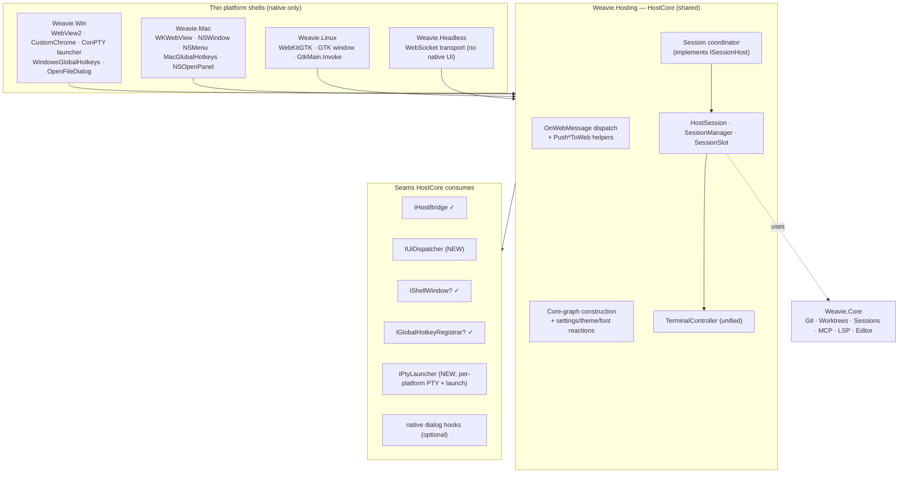

# Host-core unification (and why the macOS session rail is empty)

Status: implemented (host side; runtime verification pending)
Last updated: 2026-06-19

## The symptom and the real problem

The macOS session rail renders only the `+` and no session chips. The proximate cause is narrow:
the macOS host (`Weavie.Mac/AppDelegate`) never sends a `session-list` message, so the web rail's
`sessions` signal stays at its `[]` seed. But that is a *symptom*. The disease is structural:

**Session support was built into exactly one of four hosts, because the four hosts share no host
core.** Each platform host re-implements the same ~600 lines of bridge dispatch, `Push*ToWeb`
helpers, and Core-graph wiring; the multi-session machinery (`HostSession` / `SessionManager` /
`ISessionHost` / the session coordinator) was added only to `Weavie.Win`. Mac, Linux, and Headless
never got it.

Fixing only the macOS symptom (push a one-element `session-list`) would create a *fifth* divergent
copy of session logic. The right fix is to remove the duplication: a shared `HostCore` that every
platform drives, so the session feature — and every future host feature — lands on all hosts at once.

This spec is the cross-platform refactor that the
[multi-session spec](multi-session-and-worktrees.md) already anticipated:

> **macOS host**: mirror the Win wiring (needs the parent spec's HostSession-per-window split first).
> Windows-first; the macOS host still needs the parent spec's `HostSession`-per-window split before
> it can multiplex sessions.

## The duplication, quantified

Four hosts, **no shared base class or partial** — each is fully standalone:

| Host | Orchestrator | Base type | Bridge-dispatch lines | References `Weavie.Hosting`? |
|---|---|---|---|---|
| Win | `WorkspaceWindow` (+`HostSession`) | `Form` | 606 (`WebBridge`) + 612 (`Sessions`) | **No** — private 479-line fork |
| Mac | `AppDelegate` (3 partials) | `NSApplicationDelegate` | 517 (`WebBridge`) | Yes |
| Linux | `WorkspaceHost` | plain class | 579 (one file) | Yes |
| Headless | `HeadlessSession` | plain class | 533 (one file) | Yes |

The inbound `OnWebMessage` `switch(type)` is the worst offender. Sixteen message types
(`term-*`, `diff-resolved`, `reveal-file`, `active-editor-changed`, `get-change-diff`,
`fs-stat/read/write`, `accept-turn`, `undo-turn`, `invoke-command`, `command-ack`, `ready`,
`layout-changed`) are handled near-identically by all four hosts. `InvokeWebCommandAsync`,
`CompleteWebCommand`, `UndoTurn`, `Notify`, `JsonString`, `FsId`, `FsPath`, `TerminalFor` are
byte-identical across hosts. Session messages (`switch-session` / `new-session` /
`delete-session*`) are **Win-only**.

`Weavie.Win` is the outlier: it does not reference `Weavie.Hosting` at all, so it carries private
copies of `TerminalController` (315), `FileOpener` (65), `McpDiffPresenter` (99), and a `HostBridge`
that doesn't implement `IHostBridge` — **479 lines that are functional duplicates** of the shared
`Weavie.Hosting` versions Mac/Linux/Headless already share. The only real difference is the PTY
backend (`WindowsConPtyTerminal` vs `PosixPtyTerminal`), which already sits behind the `ITerminal`
seam.

## What is already shared (build on these, don't invent)

- **`IHostBridge`** (`Weavie.Hosting/IHostBridge.cs`) — the universal seam: `event MessageReceived`
  + `PostToWeb(string)`. Mac/Linux/Headless bridges implement it; Win's does not (only because Win
  doesn't reference the project — it already has the exact surface).
- **`ISessionHost`** (`Weavie.Core/Sessions/ISessionHost.cs`) + **`SessionCommands.RegisterHandlers`**
  — a clean, platform-blind Core seam. `RegisterHandlers(dispatcher, host)` wires palette/MCP/keyboard
  to the host. A shared coordinator implements `ISessionHost` once and is passed as `host`; the
  registration code does not change.
- **`IShellWindow` + `ShellController`** (`Weavie.Core/Shell/`) — the gold-standard pattern: a thin
  platform interface (`Minimize`/`ToggleMaximize`/`StartResize`/…) and a fat shared orchestrator that
  parses title-bar web messages. Explicitly designed so "both hosts share one implementation; the host
  supplies the `IShellWindow` and its post delegate."
- **`IGlobalHotkeyRegistrar` + `GlobalHotkeyService`** — same shape (thin per-host registrar, shared
  service). Implemented by `WindowsGlobalHotkeys` / `MacGlobalHotkeys`.
- **`ITerminal`** (`Weavie.Core/Terminal/`) — already abstracts the PTY backend
  (`PosixPtyTerminal` / `WindowsConPtyTerminal`).
- **`Headless` is the shared core in disguise** — `HeadlessSession.Start()` builds the entire
  platform-agnostic Core graph, `OnWebMessage()` dispatches the common cases, and the `Push*` helpers
  depend only on `IHostBridge`. Its class doc says it is "the platform-agnostic `WorkspaceHost` /
  `AppDelegate` with the native window, geometry, and main-thread marshaling removed." It posts to the
  bridge inline because its bridge is thread-safe by construction (channel + single pump).

## The one missing seam

There is **no UI-thread marshal abstraction** anywhere. Each GUI host hand-rolls it:

- Win — `Control.BeginInvoke` behind an `InvokeRequired` guard
- Mac — `NSApplication.BeginInvokeOnMainThread` (async; sync `InvokeOnMainThread` in a few documented
  deadlock-sensitive spots)
- Linux — `GtkMain.Invoke` (GLib idle source)
- Headless — a dedicated serial pump (`SerialUiDispatcher`), its stand-in for a UI thread

The recurring shape is identical across all GUI hosts:
`_changes.Changed += () => MARSHAL(PushChangesToWeb)`, etc. — only the `MARSHAL` token differs. **A
single injected `IUiDispatcher` collapses all of it.**

```csharp
// in Weavie.Hosting
public interface IUiDispatcher {
    void Post(Action action);   // fire-and-forget marshal onto the host's UI thread
}
// Win: BeginInvoke · Mac: BeginInvokeOnMainThread · Linux: GtkMain.Invoke · Headless: SerialUiDispatcher
```

**The dispatcher is also HostCore's concurrency model.** Session state (`_session`, the slot set) is
only touched on the dispatcher: inbound bridge messages arrive on it (native WebView callbacks are
UI-thread; the headless bridge posts each frame onto its serial pump), and any async work that ends in
a session-scoped push (a PR diff, the file-index walk, git status, change-tracker events off hook/watcher
threads) re-posts its **active-session guard together with the `PostToWeb`** via `_ui.Post`. Guarding
off-dispatcher and posting directly is a race: the check can pass, a switch can land, and the stale
message still arrives after the incoming session's message train.

## Target architecture

A `HostCore` in `Weavie.Hosting` owns everything platform-agnostic; each platform shrinks to a thin
shell that supplies the native seams. Headless already demonstrates the end-state shell (≈195 lines of
transport + zero native UI code).



What stays in each shell: web-view + scheme-handler + bridge transport, native window creation +
geometry persistence, native menu, global-hotkey registrar, native dialogs, the PTY launcher, and the
entry point / run loop. Everything else moves into `HostCore`.

## TerminalController unification

One shared `TerminalController` is feasible because the lifecycle/session methods touch the PTY only
through `ITerminal`. The single construction site (`new PosixPtyTerminal` / `new WindowsConPtyTerminal`)
plus the two launcher methods (`ResolveClaudeLauncher` / `ResolveShellLauncher`) and the base
environment are the only platform-specific parts — abstract them behind an injected launcher:

```csharp
public interface IPtyLauncher {
    ITerminal Create();
    (string Command, IReadOnlyList<string> Arguments) ResolveClaude(string claudePath, /* mcp/settings/prompt paths */ ...);
    (string Command, IReadOnlyList<string> Arguments) ResolveShell(string? shellSetting);
    IReadOnlyDictionary<string, string> BaseEnvironment(bool isClaude); // POSIX adds TERM/COLORTERM; Win returns empty
}
```

The Win-only members fold into the shared controller with no behavior change for existing hosts:
- `OnReady(cols,rows)` supersedes `Start(cols,rows)` — same launch path plus an "already running →
  nudge size to repaint" branch (a benign no-op on first start). The three POSIX hosts switch their
  `term-ready` handler from `Start` to `OnReady`.
- `OutputActive` (default `true`) gates `OnOutput` — single-session hosts are unaffected; it is the
  mute used when a background session isn't the visible one.
- `EnsureStarted()` brings a session's backend up without binding the page (background load).
- `SupervisorChanged` re-broadcasts supervisor transitions for the per-session status machine (fires
  into zero subscribers on hosts that don't use it — free).

Both PTY launchers live in shared code — `PosixPtyLauncher` and `WindowsPtyLauncher` in `Weavie.Hosting`,
with their backends (`PosixPtyTerminal`, `WindowsConPtyTerminal` + `ConPtyNativeMethods`) in
`Weavie.Core.Terminal`. Each host injects the launcher for the OS it runs on; the Windows shell and the
headless worker both pick `WindowsPtyLauncher` via `OperatingSystem.IsWindows()`, so a headless worker
deployed on Windows gets ConPTY rather than the POSIX backend's `libc` P/Invoke. (Originally the ConPTY
backend was `internal` to `Weavie.Win`; it moved to shared code so the worker could run on Windows.)

## Session coordinator extraction

`WorkspaceWindow.Sessions.cs` (612 lines) is ~95% portable orchestration: worktree
create/reconcile/load/unload/delete/switch, `PushSessionList`, status wiring, branch-name derivation,
the `ISessionHost` implementation. Only ~15–25 lines are platform glue:

- `RunOnUi` body (WinForms `InvokeRequired`/`BeginInvoke`) → replaced by `IUiDispatcher.Post`
- `WindowFocus.Toggle(this)` (the `ToggleWindow` command handler) → an `IShellWindow`/host hook
- `_app.*` (AppController) + `PickVsixFileAsync` (native file dialog) → passed via a build context

A shared `SessionCoordinator` (in `Weavie.Hosting`) owns `SessionManager`/`SessionSlot`/`HostSession`,
implements `ISessionHost`, and depends on the platform only through `IUiDispatcher` + `IHostBridge` +
a Core-services build context:

```csharp
public sealed record SessionBuildContext {
    public required CommandRegistry CommandRegistry { get; init; }
    public required KeybindingStore Keybindings { get; init; }
    public required ThemeOverridesStore ThemeOverrides { get; init; }
    public required SettingsStore Settings { get; init; }
    public required LayoutStore Layout { get; init; }
    public required string WorkspaceRoot { get; init; }
    public required string ScratchDir { get; init; }
    public required string PageOrigin { get; init; }
    public Func<CancellationToken, Task<string?>>? PickVsixFile { get; init; } // optional native dialog
}
```

`SessionManager` and `SessionSlot` move unchanged (already pure). `HostSession` moves to
`Weavie.Hosting` rebinding to `IHostBridge` + the unified `TerminalController`. Mac/Linux today inline
the same component graph as a single session with no rail — the shared coordinator gives them the full
multi-session/worktree feature for free. **The macOS empty rail is fixed at this step, on every host,
through one implementation.**

## Phased plan

Each phase ends green (build + `Weavie.Core` tests + web `tsc`/`biome`) and is independently
committable — important on a shared branch where a long-lived broken state would block other agents.

- **Phase 0 — Win joins the shared hosting layer.** Add the `Weavie.Hosting` ProjectReference to
  `Weavie.Win`; make Win `HostBridge` implement `IHostBridge` (declaration only; keep
  `Attach(WebView2)`). No behavior change. Smallest possible first step; unblocks everything.
- **Phase 1 — Unify `TerminalController`.** Introduce `IPtyLauncher`; move the single controller (with
  the Win-only members folded in) to `Weavie.Hosting`; add the POSIX + Win launchers; delete Win's
  private `TerminalController`/`FileOpener`/`McpDiffPresenter` (~479 lines). Switch the three POSIX
  hosts' `term-ready` from `Start` to `OnReady`. Verify all four hosts still build and run a terminal.
- **Phase 2 — Add `IUiDispatcher`; extract `HostCore`; migrate Headless.** Seed `HostCore` from
  `HeadlessSession` (the cleanest existing body): Core-graph construction, the common `OnWebMessage`
  cases, the `Push*`/`Handle*` helpers, the command round-trip. Migrate Headless first (degenerate
  case: inline dispatcher, null optional seams) to prove `HostCore` with zero native-UI risk.
- **Phase 3 — Migrate Linux onto `HostCore`.** Linux shell shrinks to GTK window + WebKitGTK bridge +
  scheme + geometry + `GtkMain.Invoke` as `IUiDispatcher`. Run it.
- **Phase 4 — Migrate Mac onto `HostCore`.** Mac shell shrinks to NSWindow + WKWebView + NSMenu +
  Carbon hotkeys + NSOpenPanel/NSSavePanel + `BeginInvokeOnMainThread` as `IUiDispatcher`. Win's
  `WorkspaceWindow.WebBridge.cs` collapses into `HostCore` too (its session cases come in Phase 5).
- **Phase 5 — Share the session coordinator.** Move `SessionManager`/`SessionSlot`/`HostSession` and
  extract `SessionCoordinator : ISessionHost` into `Weavie.Hosting`; `HostCore` owns it and routes the
  session bridge messages + `PushSessionList`. Win switches from "`WorkspaceWindow` implements
  `ISessionHost`" to "the shared coordinator does." **Mac/Linux gain the rail, multi-session, and
  worktrees here — the macOS symptom is resolved as a property of the shared core, not a Mac patch.**

Ordering rationale: the terminal unification (Phase 1) is a prerequisite for sessions on the POSIX
hosts (background-load needs `OnReady`/`EnsureStarted`/`OutputActive`), and `HostCore` (Phase 2) is the
home the coordinator (Phase 5) plugs into.

## Risks & decisions

- **Sync vs async marshal.** `IUiDispatcher.Post` is fire-and-forget (matches Mac's documented
  preference for async `BeginInvokeOnMainThread` to avoid the PTY-teardown deadlock). Value-returning
  UI work (native dialogs) stays as explicit `Task`-returning seam methods, as it already is via
  `TaskCompletionSource`. Confirm no `HostCore` path needs a *synchronous* round-trip to the UI thread.
- **Per-session hook-bridge pipe.** The multi-session spec flags this as load-bearing: the hook relay
  pipe must be per-session, or session B's Claude events feed session A's status + change tracker once
  N>1. `HostSession` already owns a per-session `IdeIntegration`; **verify the hook relay pipe name is
  per-session before Phase 5 lands** (it is the same prerequisite the multi-session spec calls out).
- **Shared-branch sequencing.** Phases are independently green and committable; avoid a multi-phase
  branch that leaves any host non-building. Prefer worktree isolation if phases run in parallel.
- **Per-session LSP on switch** remains deferred (unchanged from the multi-session spec): the LSP
  socket doesn't re-bind on switch, so a secondary session's semantic features point at the primary
  worktree. Tracked, not blocking.
- **Win custom chrome.** `WorkspaceWindow` implements `IShellWindow`; routing
  `window-control`/`window-resize`/`menu-action` through the optional `IShellWindow` seam in `HostCore`
  is a clean follow-up but not required for the session fix.

## Implementation status (2026-06-19)

All six phases landed. The duplication is gone and the session feature is shared by every host — the
macOS rail is fixed as a property of the shared core, not a Mac patch.

- **`TerminalController` unified** behind `IPtyLauncher` (`PosixPtyLauncher` + Win-side
  `WindowsPtyLauncher`); the Win-only multi-session members folded into the one shared controller.
- **Session model shared** — `HostSession` / `SessionManager` / `SessionSlot` moved to
  `Weavie.Hosting`, rebound to `IHostBridge` + the unified controller.
- **`HostCore`** (in `Weavie.Hosting`, three partials) owns the Core graph, the bridge dispatch + Push
  helpers, and the session coordinator (implements `ISessionHost`). New seams: `IUiDispatcher`,
  `IHostPlatform` (bundles bridge / dispatcher / PTY launcher / chrome identity / optional
  window·hotkeys·dialogs), `IHostDialogs`, and the `HostServices` store bundle.
- **All four hosts migrated to thin shells:** Headless (`HeadlessSession` 533 → `HeadlessPlatform`
  ~45 + thin `Program`), Linux (`WorkspaceHost` 579 → ~150 + `LinuxPlatform`), macOS (`AppDelegate`
  trio ~1200 → ~430 + `MacDialogs` + `MacPlatform` impl), Windows (`WorkspaceWindow` trio ~1860 +
  479-line private fork → ~430-line shell + `WinDialogs` + `WindowsPtyLauncher`). Each shell now holds
  only its native window / chrome / dialogs / marshal and an `IHostPlatform`.

**Verification.** `Weavie.Core`/`Hosting`/`Headless`/`Linux`/`Mac` build clean (0 warnings); `Win`
typechecks clean via `-p:EnableWindowsTargeting=true` (Windows reference assemblies — not a runnable
Windows exe). Core suite: 371 pass; the 5 failures are pre-existing macOS-environment issues (named
pipes, git-worktree integration, a Windows-path settings test) confirmed failing on `main`. Web tsc +
biome green. Headless was runtime-smoke-tested end to end (boots, starts IDE-MCP + LSP, serves the
injected bootstrap). **Still pending:** runtime verification of the GUI hosts — drive the macOS app and
confirm the rail shows the primary chip + `+`, and a Windows run.

**Per-session hook-bridge pipe (the flagged prerequisite).** Each `HostSession` already owns its own
`IdeIntegration` (per-port IDE-MCP + its own hook bridge), so the per-session isolation the multi-session
spec required is intact in the shared model — but it has not been exercised with N>1 sessions at runtime
yet. Verify before relying on multi-session status with concurrent agents.

## Out of scope / deferred

- A throwaway macOS-only `session-list` stopgap (populate the rail before the refactor lands). Possible
  in ~tens of lines, but it creates a fifth divergent copy and is discarded by Phase 5 — **not
  recommended** unless the rail must be visible before the refactor completes.
- Transcript-fork, OS attention escalation, suspend/idle-unload, "land this session" — all unchanged
  from the multi-session spec's deferred list.
