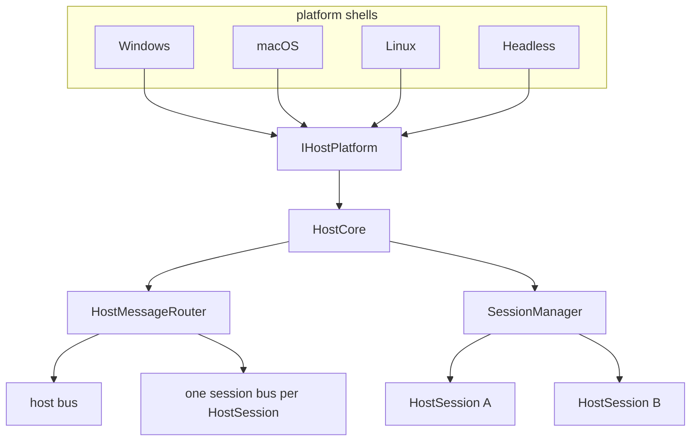

# Shared host core

**Status:** implemented.

Windows, macOS, Linux, and Headless are thin shells over one `HostCore` in `Weavie.Hosting`. A host-facing
feature is implemented once in the core and reaches every transport. Platform projects contain only native
windowing, WebView or WebSocket transport, UI-thread marshaling, dialogs, hotkeys, and PTY launch details.

## Runtime graph

```mermaid
flowchart TB
    subgraph shells["platform shells"]
        W["Windows"]
        M["macOS"]
        L["Linux"]
        H["Headless"]
    end

    P["IHostPlatform"] --> C["HostCore"]
    W & M & L & H --> P
    C --> R["HostMessageRouter"]
    R --> HB["host bus"]
    R --> SB["one session bus per HostSession"]
    C --> SM["SessionManager"]
    SM --> S1["HostSession A"]
    SM --> S2["HostSession B"]
```

`IHostPlatform` supplies:

- `IWebTransportHub`, preserving the physical `WebPeer`;
- `IUiDispatcher`, serializing host-owned catalog and store changes;
- `IPtyLauncher`;
- platform identity and transport kind;
- optional window and dialog services;
- clipboard, external URL, and window-toggle operations.

Process-wide shortcuts sit above this workspace seam. Each desktop composition root creates one
`ApplicationHotkeys`, which drives a per-OS `IGlobalHotkeyRegistrar` and targets the frontmost app window.

Native transports expose one `WebPeer.Native`. The headless WebSocket transport assigns an opaque peer to
each connection, broadcasts events to all peers, and unicasts responses through `Send`.

## Host and session ownership

`HostCore` owns one workspace host:

- host settings, keybindings, theme overrides, layout, rail/search preferences, remote-host registry, and
  workspace HTTP routes;
- the session catalog and worktree manager;
- the host message bus and exact-address router.

Each loaded `HostSession` owns its workspace-dependent graph:

- exact `SessionEndpoint` and handlers;
- agent runtime, shell and agent terminals;
- editor state, file provider, scratch/media stores, and change tracker;
- LSP controller and workspace watcher;
- review, git, source, test, and attention state;
- session command dispatcher and background task scope.

No host field records which session a page selected. `SessionManager` knows loaded and dormant slots; it does
not choose a message recipient.

## Message transport

Every shell implements the same `IWebTransportHub`. Raw JSON enters `HostMessageRouter`, which validates the
standard envelope and routes by either:

- `scope: "host"` to the one host bus; or
- `scope: "session"` and exact `(slot, incarnation)` to one session bus.

Application features never receive `WebPeer` or raw transport handles. Responses are returned to the
requesting peer by the bus. Durable session events broadcast with their exact address. Presentation-only
requests use the session's explicit `SessionView`.

See [session-message-bus.md](session-message-bus.md) for the full protocol.

## Concurrency model

The platform dispatcher protects host catalog, shared-store, and native UI mutations. Every host-bus handler
enters it after per-feature lane admission; session-bus handlers execute directly, so unrelated session
features and sessions remain independent. Background callbacks enter a session-owned `SessionTaskScope`,
which is cancelled and drained during teardown.

This separates two concerns:

- the UI dispatcher orders host graph changes;
- the message bus orders domain work by owner and feature.

Neither mechanism uses presentation selection.

## Lifecycle

`HostCore.StartAsync`:

1. starts the workspace HTTP service;
2. initializes the primary `HostSession`;
3. reconciles worktrees into loaded or dormant slots;
4. restores the loaded-slot overlay;
5. wires host stores, native capabilities, and transport callbacks.

`connection.hello` returns the host incarnation, complete session catalog, command catalog, layout, and host
state. Each client then requests `lifecycle.sync` from every exact live session.

Session disposal first removes its endpoint from inbound routing, then cancels and drains handlers and
session background work, disposes its resources, and finally closes its bus. `HostCore.DisposeAsync` detaches
store and transport subscriptions, disposes all sessions, the router, and the HTTP service.

## Adding a feature

1. Decide ownership. If its meaning changes with workspace/session, add it to `HostSession`; otherwise add it
   to `HostCore`.
2. Obtain `Bus.Feature("name")` from that owner and register handlers there.
3. Publish or request through the captured feature channel. Do not pass a slot, host id, peer, or selection
   callback into feature code.
4. Put long-lived processes under `ProcessSupervisor` and async work under the owning task scope.
5. Add a routing test with two sessions and make the non-selected owner receive the message.

The architecture makes omission easier to detect: a session feature that asks for a current session or
parses routing fields from its payload is crossing the ownership boundary.

## Platform contract

All behavior above is shared. Platform shells may differ only where the OS requires it:

| concern | Windows | macOS | Linux | Headless |
| --- | --- | --- | --- | --- |
| page transport | WebView2 | WKWebView | WebKitGTK | WebSocket |
| UI dispatcher | WinForms | Cocoa | GTK | serial worker |
| PTY | ConPTY | POSIX | POSIX | runtime OS |
| native UI | window/dialogs/hotkeys | window/dialogs/hotkeys | window/hotkeys | none |

Feature protocol, sessions, worktrees, commands, files, terminals, LSP, and teardown remain in
`Weavie.Hosting`.
