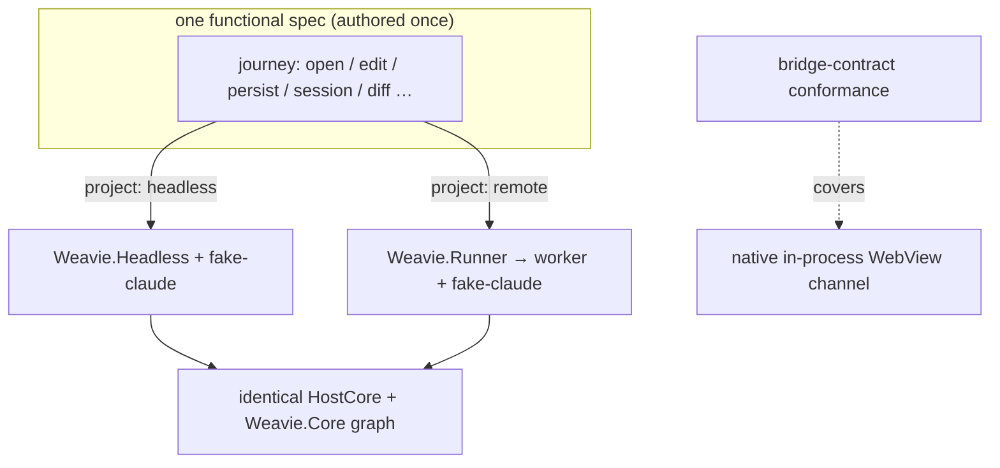
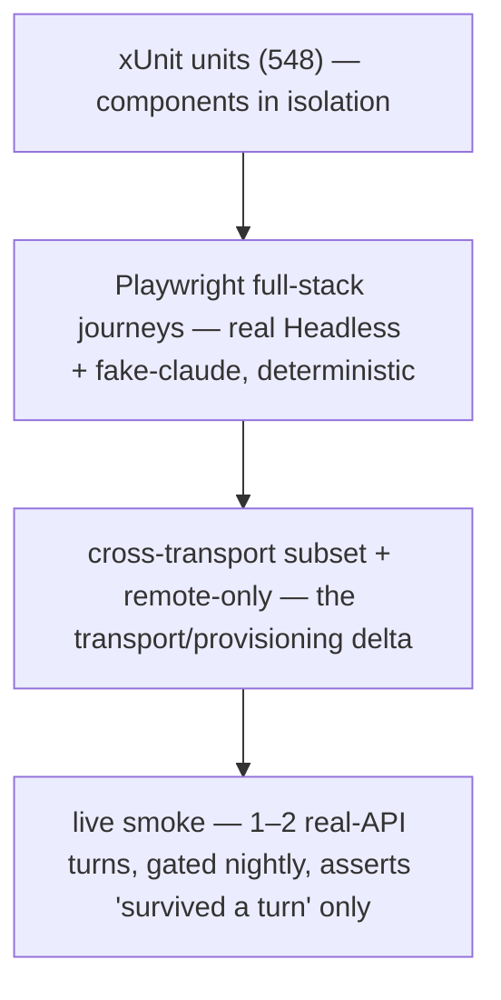

# Integration testing strategy

Status: proposed
Last updated: 2026-06-24

## The problem

Weavie is heavily vibe-coded and regresses in *its own* code — the WSS bridge, session routing, the
hook gate, worktrees, change-tracking, the MCP registry round-trip, rendering, layout. The 548 xUnit
tests cover units well but don't exercise a real journey through the whole stack, and the existing
Playwright specs (`src/web/e2e/`) only prove the bridge transport, not features.

The tempting answer — "run the whole app, including the remote runner, and assert on Claude's real
responses end to end" — is the wrong target on two counts:

- **Real model responses are non-deterministic.** Every `claude` spawn is a real Anthropic API call
  (we strip `ANTHROPIC_API_KEY` so it runs on the user's subscription). Asserting on what the model
  *says* makes every test a coin flip, needs live credentials in CI, and tests Anthropic, not Weavie.
- **"Every test on both local and remote" doubles the slowest, flakiest tests to cover a small
  delta.** Headless-local and remote run *byte-for-byte the same* web bundle, WSS bridge, `HostCore`,
  and `Weavie.Core`. Remote only adds the `Weavie.Runner` control plane (port alloc, token,
  worktree-per-session, worker spawn) in front of the identical worker. Re-running a functional
  journey on remote re-executes code already proven under headless.

## Principles

1. **Test what is ours, deterministically; treat the model as a separate, non-blocking concern.**
   Stub `claude` at the process seam so a full-stack test exercises the entire real Weavie stack
   (web → WSS → HostCore → PTY → hook bridge → MCP → render) with zero model dependency.
2. **Transport is a harness parameter, not a copy of the suite.** Any test *can* run on either
   transport; the default coverage is full suite on `headless`, a tagged cross-section on `remote`,
   and a few `remote`-only tests for what only exists remotely.
3. **Spend the budget on the delta, not the duplication.** A scenario runs on `remote` only when
   something is structurally different there (persistence lands on the worker, session provisioning,
   reconnect/replay, multi-worktree routing).
4. **No sleeps as synchronization.** Assert on the state event (dirty→clean flush, session-ready),
   never `wait(1s)` — a timing guess is the silent-timeout fallback the repo bans and the #1 flake
   source.

## The fake-`claude` seam (keystone)

`TerminalController.ResolveClaudeLaunch` (`src/Weavie.Hosting/TerminalController.cs`) is the single
point where the embedded CLI is launched. A test seam points it at a **scripted fake `claude`** that:

- emits known bytes to its PTY → assert xterm rendering / streaming,
- calls the hook relay with scripted tool calls → assert the permission gate **and** the change feed,
- connects to the registry MCP and invokes `mcp__weavie__*` tools → assert the capability round-trip.

This one fake turns the entire stack deterministic. It is the prerequisite for every functional
journey below.

## Transports and the "local" fork

"Local" is ambiguous; the two readings differ in testability:

- **Headless-local** — browser → WSS → `Weavie.Headless`. Playwright-drivable; identical transport
  to remote.
- **Remote** — browser → WSS → `Weavie.Runner` → spawned `Weavie.Headless` worker. Playwright-drivable;
  adds provisioning + auth.
- **Native app** (Win/Mac/Linux, in-process WebView channel) — Playwright cannot cleanly drive
  WebView2/WKWebView/GTK webviews. The web bundle is identical across all hosts, so native is covered
  by a thin **bridge-contract conformance test** (the in-process channel honors the same message
  contract), not a second full E2E run.

## Coverage matrix

The canonical run-once / cross / remote-only policy. New tests slot into this table.

| Scenario | Runs on | Why |
|---|---|---|
| Omnibar open → syntax highlight | headless | Pure frontend (Monaco/Shiki); transport-irrelevant |
| LSP find-all-references | **both** | LSP framing crosses the bridge — real seam, latency-sensitive |
| Edit → dirty clears → persisted to disk | **both** | On remote the write lands on the *worker's* worktree, not the client |
| Session create / unload / open / delete | **both** (priority) | Strongest remote case — Runner provisioning, worktree-per-session, worker spawn, token |
| Markdown preview updates on edit | headless | Pure frontend reactivity |
| MCP (fake-claude) edits settings → UI reflects | headless | Registry MCP is loopback *inside the worker* in both modes; round-trip identical |
| Resize / fullscreen-pane toggle | headless | `LayoutStore` frontend; transport-irrelevant |
| Fake-claude diffs → accept / require-approval | headless (+1 cross smoke) | Hook gate is a pipe local to the worker in both modes; only the approval UI round-trips |
| Diff navigation between sessions | **both** | Multi-session = multiple worktrees + `SlotId` routing — stresses remote provisioning |

**Remote-only** (no local analog): runner spawns worker and returns `{url, token}`; bad/missing token
→ 403; WSS reconnect + replay (the buffering/auto-reconnect in `src/web/src/bridge.ts`).

## Layers

- **Live smoke** is the only place a real model runs. It asserts the app survives one real turn — no
  content assertions — and is the canary for "did Anthropic change the CLI/hook contract." It runs
  nightly, never on the PR path, so its flake never blocks a merge.
- The **capture harness** (`npm run capture`) stays a human-review tool, not a regression gate.

## Gotchas

- **Remote persistence verification** asserts against the *worker's* filesystem, not the client's —
  the remote fixture must know the worker's workspace root.
- **Dirty-clear, session-ready, reconnect** are state events; wait on the event, never a fixed sleep.

## Build order

1. Fake-`claude` seam + scripted-tool harness (unblocks everything).
2. Transport-parameterized Playwright projects (`headless`, `remote`) over the existing
   `src/web/e2e/` setup.
3. Functional journeys per the matrix (headless first, then tag the cross set).
4. Remote-only transport/provisioning tests.
5. Native bridge-contract conformance test.
6. Gated nightly live-smoke.
