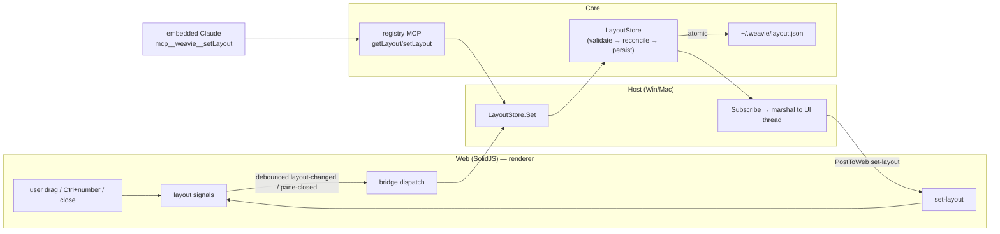

# Window layout

**Status:** design (not yet implemented). Supersedes the hardcoded two-column layout in
`src/web/src/App.tsx`.

Weavie's window is currently a fixed arrangement: a left column with the Claude-Code and shell
terminals stacked as a focus-accordion, and the Monaco editor on the right (with the diff view as an
absolute overlay). The arrangement, the split ratio, and which terminal is expanded all live as
ad-hoc SolidJS signals (`leftPct`, `activeLeft`) in `App.tsx`. Nothing is persisted, nothing is
addressable from Claude, and adding a new surface means editing the JSX tree by hand.

This spec replaces that with a real layout system: a recursive split tree owned by Core, persisted
across launches, manipulable by the user (keyboard + mouse) and by Claude (MCP), and
forward/backward-compatible as pane kinds are added or removed.

## Goals

- **Fast, keyboard-first pane switching.** Jump between panes without leaving the keyboard, and land
  with the keyboard focus actually *inside* the target pane (type immediately, no click).
- **Persisted & self-healing.** Layout is restored on launch; a corrupt layout file is backed up and
  reset, never fatal.
- **Claude-drivable.** "Split into left terminal, right editor, 33% each" works via MCP.
- **Forward/backward compatible.** A newly-shipped default pane appears for existing users exactly
  once; a removed pane disappears cleanly; neither breaks loading an old or newer file.

## Non-goals (deferred)

- Directional (arrow-key) navigation — see [Keybindings](#keybindings). `Ctrl+1..9` ships first.
- Multiple instances of one pane kind (two editor groups), tabs within a pane, and detached/multi
  windows. The model is built to *allow* these later (pane **id** ≠ **kind**) but v1 treats kinds as
  singletons.
- Editor atomic-save (`files.atomicSave`-style). Separate decision; see
  [Atomic writes](#atomic-writes-the-filesystem-seam).

## Architecture

Core owns the layout model; the web layer renders it and applies live interaction optimistically.
This mirrors the existing settings→MCP→host flow exactly (`SettingsStore.Set` → `SettingChanged`
event → host `Subscribe` → marshal to UI thread), and it's required for Claude to manipulate layout
*semantically* — an opaque blob persisted by the host would give the MCP handler nothing to mutate.



Three things write the model — the user (web), Claude (MCP), and reconcile-on-load — and they all go
through one entry point (`LayoutStore.Set`) and one notification (`Changed`). The web is a pure
function of the document it's handed, plus optimistic local echoes for drag latency.

### Latency: optimistic web, debounced persist

A splitter drag updates the local weight signal immediately (no round-trip), exactly as today. Only
on settle (pointer-up) does the web emit a debounced `layout-changed`; the host calls
`LayoutStore.Set`, which persists. Focus changes (frequent — every `Ctrl+number`) are coalesced into
the same debounce so we never write disk per keystroke. This reuses the pattern the settings store
already relies on (its `FileSystemWatcher` debounces at 250ms).

## Data model

A layout is a recursive **weighted split tree**. N-ary splits with a `weights` array (not nested
binary splits) make "33% each" trivial and resolution-independent.

```ts
// src/web/src/layout/types.ts  (Core mirrors this in C#, below)
export type SplitDir = "row" | "column";
export type PaneKind = "editor" | "terminal:claude" | "terminal:shell";

export type LayoutNode =
  | { type: "split"; dir: SplitDir; weights: number[]; children: LayoutNode[] }
  | { type: "pane";  id: string;    kind: PaneKind };

export interface WindowState {       // host-owned; the web never reads this
  x: number; y: number; width: number; height: number;
  maximized: boolean;
}

export interface LayoutDocument {
  version: number;        // envelope version — migration escape hatch (see Two numbers)
  seenPaneLevel: number;  // highest pane epoch this user has been shown
  focused?: string;       // pane id with keyboard focus
  dismissed: string[];    // pane KINDS the user explicitly closed
  window?: WindowState;   // native window geometry (host-owned); absent → default size + centered
  root: LayoutNode;
}
```

Invariants (enforced by `LayoutStore` / `LayoutReconciler`):

- `split.weights.length === split.children.length`, every weight `> 0`, normalized to sum `1`.
- A split has `≥ 2` children; a 1-child split is collapsed into its child.
- Pane `id`s are unique within a document; `kind` resolves to a registered `PaneDefinition`.
- `focused`, if set, references an existing pane id; otherwise it's repaired to the first pane.

The diff view stays a **transient overlay/mode**, not a persisted pane — persisting a pane that
points at a diff which no longer exists is meaningless. Today's focus-accordion ("active terminal
expands to 80%") is just a column split whose weights shift on focus; it is not a special case.

### The two numbers (this matters)

There are deliberately *two* version-like integers, and conflating them is the easy mistake:

| Field | Scope | Bumped when | Drives |
| --- | --- | --- | --- |
| `version` | the document envelope | a genuine structural reshape needs a migration | migration escape hatch (rare) |
| `seenPaneLevel` | pane-introduction watermark | reconcile shows the user a newer default pane | the new-default-appears-once logic |

`seenPaneLevel` is the everyday compat mechanism and needs no code to bump (reconcile does it).
`version` exists only so that if we ever *reshape* the tree format itself we have a migration hook —
nothing more. See [Compatibility](#compatibility--reconcile).

## Core interfaces

All new types live under `Weavie.Core.Layout`. Records and file-scoped namespaces, matching the
existing `Configuration` code.

### Atomic writes (the filesystem seam)

`IFileSystem.WriteAllText` is *not* made atomic, because two production callers use it to save the
user's actual source files — `InMemoryDocumentModel.Save()` and the MCP diff-apply in
`McpServer.HandleOpenDiff` (`FILE_SAVED`). Atomic tmp+rename on a user's source file is a loaded
behavior change (different file-watcher events, broken hardlinks, lost ACLs, a `.tmp` blinking next
to their code) — that's why editors make it an opt-in setting, and it's out of scope here. Instead we
add an explicit variant for *our own* config documents:

```csharp
public interface IFileSystem {
	bool FileExists(string path);
	string ReadAllText(string path);
	void WriteAllText(string path, string contents);          // honest in-place write (user docs, general)
	void WriteAllTextAtomic(string path, string contents);    // tmp + File.Replace/Move (our config)
}
```

- `LocalFileSystem.WriteAllTextAtomic` — write `path + ".tmp"`, then `File.Replace` (preserves ACLs)
  falling back to `File.Move` when the target doesn't exist. This is lifted verbatim from
  `SettingsStore.SaveAtomicLocked`, which then **migrates onto this method** (it currently calls
  `File.WriteAllText`/`File.Replace` directly, bypassing the seam so it can't run in-memory).
- `InMemoryFileSystem.WriteAllTextAtomic` — a dict swap; atomic by construction. (The in-memory
  fake's `WriteAllText` is already atomic, so today the real and fake impls quietly disagree on
  atomicity; this method makes the *intended* atomic path identical across both.)

`WeaviePaths` gains `LayoutFile = Path.Combine(Root, "layout.json")` (sibling of `settings.toml`).

### Pane registry

Pane kinds are *declared*, the way settings are declared in `CoreSettings.Register`. The registry is
the single source of truth for "what default panes exist and when they were introduced," which is
what makes the compat story data-driven instead of code-driven.

```csharp
namespace Weavie.Core.Layout;

public enum PaneAnchor { Main, FarLeft, FarRight, Top, Bottom, LeftTop, LeftBottom }

public sealed record PaneDefinition {
	public required string Kind { get; init; }            // "editor", "terminal:claude", "terminal:shell"
	public required string Description { get; init; }     // human- and Claude-facing
	public bool ShowByDefault { get; init; } = true;
	public int IntroducedIn { get; init; } = 1;           // monotonic pane epoch
	public PaneAnchor DefaultAnchor { get; init; } = PaneAnchor.Main;
	public bool Singleton { get; init; } = true;          // v1: one instance per kind
}

public sealed class PaneRegistry {
	public void Register(PaneDefinition pane);            // throws if Kind already registered
	public PaneDefinition? Find(string kind);
	public IReadOnlyList<PaneDefinition> All { get; }
	public int CurrentPaneLevel { get; }                 // max IntroducedIn across All
}
```

The initial registration (in a `LayoutPanes.Register(registry)` static, mirroring `CoreSettings`):

```csharp
registry.Register(new() { Kind = "editor",          Description = "Code editor",       IntroducedIn = 1, DefaultAnchor = PaneAnchor.Main });
registry.Register(new() { Kind = "terminal:claude", Description = "Claude Code session", IntroducedIn = 1, DefaultAnchor = PaneAnchor.LeftTop });
registry.Register(new() { Kind = "terminal:shell",  Description = "Shell terminal",     IntroducedIn = 1, DefaultAnchor = PaneAnchor.LeftBottom });
// future: registry.Register(new() { Kind = "fileTree", Description = "File tree", IntroducedIn = 2, DefaultAnchor = PaneAnchor.FarLeft });
```

Shipping the file tree later is the single commented line above — `IntroducedIn = 2`. No migration,
no JSX edit; reconcile handles the rest.

### Layout store

```csharp
namespace Weavie.Core.Layout;

public enum LayoutSource { User, Mcp, Reconcile }
public sealed record LayoutChange(LayoutDocument Document, LayoutSource Source);
public sealed record LayoutResult(bool Applied, string Summary);

public sealed class LayoutStore {
	public LayoutStore(IFileSystem fs, PaneRegistry registry, string? path = null);

	/// Reconciled, validated, never null. Reflects disk at construction, then every Set.
	public LayoutDocument Current { get; }

	/// Validate → reconcile → persist atomically → raise Changed (off the UI thread).
	/// Throws LayoutValidationException for an unusable tree (cycle, unknown kind, bad weights).
	public LayoutResult Set(LayoutDocument doc, LayoutSource source);

	public event Action<LayoutChange>? Changed;
	public IDisposable Subscribe(Action<LayoutChange> handler);
}

public sealed class LayoutValidationException(string message) : Exception(message);
```

Constructor flow mirrors `SettingsStore`: read `layout.json`, deserialize, **reconcile against the
registry**, and if reconcile mutated anything, persist immediately so `seenPaneLevel` is durable
before the user can act. A malformed/missing file is non-fatal (see
[Persistence & failure](#persistence--failure-handling)).

`Set` does *not* let callers write the bookkeeping fields blindly — see the MCP merge rule below.

### Reconciler

A pure function — the heart of the compat story. Easy to unit-test in isolation.

```csharp
public static class LayoutReconciler {
	public static ReconcileOutcome Reconcile(LayoutDocument doc, PaneRegistry registry);
}
public sealed record ReconcileOutcome(LayoutDocument Document, bool Mutated, IReadOnlyList<string> Notes);
```

### Serialization

`System.Text.Json` with polymorphic nodes and round-tripped unknown envelope fields (so a *newer*
file's extra top-level keys survive a downgrade write, consistent with how settings preserves unknown
TOML subtrees):

```csharp
[JsonPolymorphic(TypeDiscriminatorPropertyName = "type")]
[JsonDerivedType(typeof(SplitNode), "split")]
[JsonDerivedType(typeof(PaneNode),  "pane")]
public abstract record LayoutNode;

public sealed record SplitNode : LayoutNode {
	public required SplitDirection Dir { get; init; }
	public required IReadOnlyList<double> Weights { get; init; }
	public required IReadOnlyList<LayoutNode> Children { get; init; }
}
public sealed record PaneNode : LayoutNode {
	public required string Id { get; init; }
	public required string Kind { get; init; }
}

public sealed record LayoutDocument {
	public int Version { get; init; } = 1;
	public int SeenPaneLevel { get; init; }
	public string? Focused { get; init; }
	public IReadOnlyList<string> Dismissed { get; init; } = [];
	public required LayoutNode Root { get; init; }
	[JsonExtensionData] public IDictionary<string, JsonElement>? Extra { get; init; }
}
```

## Compatibility & reconcile

The trap (your point #4): a persisted layout is *simultaneously* a user customization to respect and
a snapshot of an old default that may be missing newly-shipped panes. You cannot tell "user
deliberately closed the file tree" from "this layout predates the file tree" **unless you persist
that distinction** — which is why `seenPaneLevel` (what they've been shown) and `dismissed` (what they
explicitly closed) are stored, not just the tree.

### Reconcile algorithm

`Reconcile(doc, registry)` runs on every load and inside every `Set`:

1. **Prune unknown kinds.** DFS the tree; drop any `PaneNode` whose `Kind` isn't registered. Collapse
   now-empty / single-child splits and re-normalize sibling weights. Emit a note per pruned kind.
   *(Backward compat: a removed pane vanishes cleanly; a newer file's unknown pane is pruned + logged
   rather than rendered as a broken tile — see [Open questions](#open-questions--deferred).)*
2. **Inject new defaults.** For each registered pane satisfying **all** of:
   ```
   pane.ShowByDefault
   && pane.IntroducedIn > doc.SeenPaneLevel     // new to this user
   && !doc.Dismissed.Contains(pane.Kind)         // not explicitly killed
   && !TreeContainsKind(doc.Root, pane.Kind)     // not already placed
   ```
   insert a fresh `PaneNode` at its `DefaultAnchor`. *(Forward compat: the new default appears once.)*
3. **Bump the watermark.** `SeenPaneLevel = registry.CurrentPaneLevel`.
4. **Normalize & repair.** Enforce the weight/child invariants; ensure `Focused` references a live
   pane (else first pane).

`Mutated` is true if anything changed, so the store knows to persist.

### Why both `seenPaneLevel` and `dismissed`

`seenPaneLevel` alone prevents *nagging* — once a default has been shown, its epoch is `≤` the
watermark and step 2 never re-injects it, whether or not the user kept it. `dismissed` carries a
*different* signal: explicit user intent. It's the guard that keeps an explicitly-closed pane gone
even under a future "re-offer defaults" / "reset layout" action, and it future-proofs against an
`IntroducedIn` miscount. They are not redundant: *seen* ≠ *wanted*.

Bookkeeping rules:

- The web sends an explicit **`pane-closed { kind }`** when the user closes a pane; the host adds the
  kind to `dismissed`. A pane merely *removed by rearrangement* (drag, or an MCP `setLayout` that
  omits it) is **not** dismissed.
- Any kind that is **present** in a newly-applied document is removed from `dismissed` (re-adding a
  pane clears its tombstone).

### Anchor → insertion

`DefaultAnchor` is a coarse hint mapped to a robust tree op so injection works against *any* user
tree:

- `FarLeft` / `FarRight` → wrap the current root in a `row` split, new pane on that side at weight
  `0.2`.
- `Top` / `Bottom` → wrap the root in a `column` split.
- `LeftTop` / `LeftBottom` → best-effort: find the leftmost column split and add there; fall back to
  `FarLeft`.
- `Main` → replace the root only when the tree is empty; otherwise no-op (the main region already
  exists).

### Worked examples

- **Ship the file tree** (`IntroducedIn = 2`, `FarLeft`). Existing user has `seenPaneLevel = 1`,
  hasn't dismissed it: `2 > 1` → injected far-left at 20%, watermark → 2, persisted. Next launch
  `2 > 2` is false → never re-injected. User closes it → `dismissed += "fileTree"`; even a future
  re-offer respects it.
- **Retire a pane.** Its `PaneDefinition` is removed; any persisted `PaneNode` of that kind is pruned
  + logged on next load; weights re-normalize. No crash, no migration.
- **Downgrade / synced-from-newer file.** Unknown pane kinds are pruned (their placement is lost on
  re-upgrade — accepted tradeoff for v1); unknown *envelope* fields survive via `[JsonExtensionData]`.

## MCP surface

Two tools, on the **registry** server only (model-facing, `mcp__weavie__*`). Kept to `get`/`set` to
avoid bloating Claude's per-turn context with a verb-per-gesture — read-modify-write covers every
request ("33% each", "left terminal right editor", etc.). Added the same hardcoded way as the
settings tools — three edits in `McpServer.cs`:

1. **Advertise** — a `LayoutToolEntries` constant, concatenated into `_toolsListJson` in registry
   mode (alongside `SettingsToolEntries`):

```jsonc
{"name":"getLayout","description":"Get the current Weavie window layout as a JSON tree of nested row/column splits and panes.","inputSchema":{"type":"object","properties":{}}}
{"name":"setLayout","description":"Replace the Weavie window layout. Provide a tree of row/column splits with weights and panes. Pane kinds: editor, terminal:claude, terminal:shell. Optionally set 'focused' to a pane id.","inputSchema":{"type":"object","properties":{"root":{"type":"object"},"focused":{"type":"string"}},"required":["root"]}}
```

2. **Route** — `case "getLayout"` / `case "setLayout"` in the `switch` in `HandleToolCallAsync`.
3. **Handle** — handlers with the established signature
   `Task HandleXAsync(WebSocket ws, JsonElement args, string? idRaw, CancellationToken ct)`:

```csharp
private async Task HandleSetLayoutAsync(WebSocket ws, JsonElement args, string? idRaw, CancellationToken ct) {
	// Parse root (+ optional focused) into a LayoutNode/string.
	// MERGE into the live document — Claude provides geometry only; it cannot set
	// version/seenPaneLevel/dismissed (those are internal bookkeeping).
	var next = _layout.Current with { Root = parsedRoot, Focused = parsedFocused ?? _layout.Current.Focused };
	try {
		var result = _layout.Set(next, LayoutSource.Mcp);   // validates + reconciles + persists + notifies UI
		await SendToolTextAsync(ws, idRaw, result.Summary, ct);
	} catch (LayoutValidationException ex) {
		await SendToolErrorAsync(ws, idRaw, ex.Message, ct);  // isError result, mirrors setSetting
	}
}
```

`getLayout` returns `_layout.Current` serialized. Registry mode requires a `LayoutStore` (as it
already requires a `SettingsStore`), so `IdeIntegration` constructs and passes one when
`registryMode: true`.

**The merge rule is load-bearing:** Claude only ever supplies `root`/`focused`; `seenPaneLevel` and
`dismissed` are preserved from the current document. So no amount of Claude rearrangement can corrupt
the appears-once / explicit-dismissal bookkeeping.

## Host wiring

Each host constructs the `LayoutStore`, subscribes, and bridges both directions — structurally
identical to how `terminal.shell` is wired today (`MainForm.cs:187`, `AppDelegate.cs:96`):

```csharp
// Windows
_layout.Subscribe(change => BeginInvoke(() => _bridge.PostToWeb(SetLayoutMessage(change.Document))));
// macOS
_layout.Subscribe(change => InvokeOnMainThread(() => _bridge.PostToWeb(SetLayoutMessage(change.Document))));
```

On startup, after the web sends `ready`, the host pushes `set-layout` with `LayoutStore.Current`. The
dispatch `switch` in each host (`AppDelegate.cs:153-206`, `MainForm.cs:222-275`) gains
`layout-changed` and `pane-closed` cases routing to `LayoutStore.Set` / dismissal.

## Window geometry (host-owned)

Window size, position, and maximized state persist in the same `layout.json`, under the top-level
`window` field — but they are **purely host-owned**: the web layer never sees them, and they don't flow
over the bridge. The store exposes a dedicated `SetWindow(WindowState?)` that persists *without* raising
`Changed` (the host is the only consumer, and it's the caller — so there's no echo to the web).

Host behavior (symmetric across Win/Mac):

- **On launch**, before the window is shown, read `LayoutStore.Current.Window`. If present **and** the
  bounds intersect a connected screen's working area, apply them (and maximize/zoom if flagged);
  otherwise fall back to a centered 1280×840 default. The on-screen guard is what stops a window from
  opening off-screen after a monitor is unplugged or `layout.json` is carried to another machine.
- **Restore bounds, not maximized bounds.** When maximized, persist the *un-maximized* size as the
  geometry plus `maximized: true` — Windows reads `Form.RestoreBounds`; macOS keeps the prior
  un-zoomed bounds while `IsZoomed`. So un-maximizing returns to the right size.
- **When to save.** Windows persists on `ResizeEnd` (covers drag-resize *and* move), on maximize/
  restore transitions (`SizeChanged`), and on `FormClosing`. macOS persists on
  `DidEndLiveResizeNotification`, `WillClose`, and `WillTerminate`. Minimized/miniaturized states are
  never saved. `SetWindow` no-ops when nothing changed, so these handlers are cheap.

## Web design

### Bridge protocol additions

`src/web/src/bridge.ts` has **no** layout messages today; these are the only new native↔web wire.

| Direction | `type` | Payload | Meaning |
| --- | --- | --- | --- |
| host → web (`WebBoundMessage`) | `set-layout` | `{ document: LayoutDocument }` | Render this layout (launch restore, MCP change, reconcile). |
| web → host (`HostBoundMessage`) | `layout-changed` | `{ document: LayoutDocument }` | User changed geometry/focus; debounced; persist. |
| web → host (`HostBoundMessage`) | `pane-closed` | `{ kind: PaneKind }` | Explicit close → add to `dismissed`. |

### Pane contract & focus delegation

This is the "activated" requirement: switching to a pane must put real keyboard focus *inside* it, so
you type immediately without clicking the input. Every pane exposes an imperative `focus()`; the
layout controller owns one `focused` id; when it changes (by click, key, or `set-layout`), the
controller calls that pane's `focus()`.

```ts
export interface PaneHandle {
  readonly id: string;
  readonly kind: PaneKind;
  focus(): void;   // terminal → xterm.focus() (its hidden textarea); editor → monaco editor.focus()
}
// panes self-register on mount into a Map<string, PaneHandle>; deregister on cleanup.
```

```mermaid
sequenceDiagram
    participant K as window keydown (capture)
    participant C as layout controller
    participant H as PaneHandle
    participant X as xterm / monaco
    K->>K: Ctrl+2 — preventDefault + stopPropagation
    K->>C: setFocused(paneId#2)
    C->>H: handle.focus()
    H->>X: xterm.focus() / editor.focus()
    Note over C,X: re-entrancy guard: focusin echoes back;<br/>ignore if value unchanged / applying from host
```

Two correctness requirements:

- **Capture-phase switching.** The switch listener is `window.addEventListener("keydown", on, { capture: true })`
  so it fires *before* a focused xterm/Monaco consumes the key — that's what lets a global shortcut
  win while a terminal holds focus.
- **Re-entrancy guard.** Setting `focused` → `focus()` → a `focusin` that would set `focused` again.
  Guard by no-op'ing when the target is already active, and flag "applying from host" while rendering
  an inbound `set-layout` so we don't echo `layout-changed` straight back.

`Ctrl+N` maps to the N-th pane in a **stable flatten order** (DFS, left-to-right / top-to-bottom).

### Renderer

A recursive `<LayoutTree node={root}>`: a `SplitNode` renders a flexbox (`dir` → `flex-direction`,
each child `flex-grow: weight`) with a draggable `.splitter` between children adjusting the two
adjacent weights; a `PaneNode` renders its surface. Drag updates local weights immediately;
pointer-up emits debounced `layout-changed`.

**Pane-instance preservation (constraint).** Restructuring the tree must **not** unmount a pane's
body — remounting an xterm tears down scrollback and the editor loses state. Panes are keyed by
stable `id` and their bodies kept alive across re-splits (keyed rendering / reparent, not
recreate). The terminal/editor instances are owned above the tree and positioned by it. Flagged as
the main frontend implementation risk.

## Keybindings

Decision: **`Ctrl+1..9` direct-jump to the N-th pane**, shipping first. Rationale: for the hot path
(typing to Claude, jump to the editor) a single numeric chord beats reaching for arrows *and*
reasoning about geometry — and it's the muscle memory VS Code already trains (`Ctrl+number` = focus
editor group), with near-zero conflict in shell/Monaco.

- **`Ctrl+Tab` / `Ctrl+Shift+Tab` are reserved** for future *session* switching — not spent here.
- **Directional (arrow) navigation is deferred.** Every modifier+arrow combo collides with in-pane
  editing (`Ctrl+Arrow` = word-nav in both shell and Monaco; `Alt+Arrow` = Monaco move-line / mac
  word-nav; `Ctrl+[` is literally the ESC byte in a terminal). If/when added, the likely default is
  `Alt+Arrow`, accepting the Monaco shadow.
- **Bindable.** These are *defaults* of a future keybindings setting (per the project's "every flag
  is a first-class setting" rule), not hardcoded constants — so power users rebind.

## Persistence & failure handling

`~/.weavie/layout.json`, written via `WriteAllTextAtomic`. Load is non-fatal, mirroring the settings
store's posture (log via the existing `Log` event, never throw out of construction):

- **Missing file** → `LayoutDefaults.Initial(registry)` (the current 40/60 claude+shell | editor
  arrangement, built from registered defaults).
- **Malformed / failing validation** → log, **rename the bad file to `layout.json.bad`** (don't
  silently delete — the user may want to inspect it), then write a fresh default. Backup-then-reset,
  not just reset.
- **Valid but stale/newer** → handled by reconcile, not by failure (above).

## Testing

- **Reconcile** — pure-function unit tests: inject-new-default-once, prune-removed-kind, watermark
  bump, dismissed tombstone, weight normalization, anchor insertion against assorted trees.
- **LayoutStore** — over `InMemoryFileSystem`: persist round-trip, atomic write, malformed →
  backup+reset, corrupt-then-valid recovery.
- **MCP** — loopback WebSocket like `McpSettingsToolsTests`: `setLayout` applies + persists + confirms;
  bogus tree → `isError`, no persist; `setLayout` cannot mutate `seenPaneLevel`/`dismissed`.
- **Web** — flatten order for `Ctrl+N`; focus delegation calls inner `focus()`; re-entrancy guard
  doesn't loop; pane bodies survive a re-split.

## Open questions / deferred

- **Newer-file unknown panes** — v1 prunes + logs (placement lost on re-upgrade). Alternative: keep
  them as inert "unsupported pane" tiles that round-trip. Deferred until cross-version sync is real.
- **Multi-instance panes & tabs** — model allows it (`id` ≠ `kind`, `Singleton` flag); UI/reconcile
  for it is out of scope.
- **Editor atomic-save** — a separate `files.atomicSave`-style setting on the document path, not this
  spec.
- **Directional navigation** default — revisit once layouts routinely exceed ~4 panes.

## Build sequence

1. **Done.** `IFileSystem.WriteAllTextAtomic` (+ both impls); `WeaviePaths.LayoutFile`. *(Migrating
   `SettingsStore.SaveAtomicLocked` onto the seam is deferred — that's the settings agent's code; it
   still works, it just doesn't share the primitive yet.)*
2. **Done + tested.** `Weavie.Core.Layout`: model, `PaneRegistry` + registrations, `LayoutReconciler`,
   serialization, `LayoutStore`. 13 unit tests green (reconcile compat + store persistence).
3. **Done (Win built; Mac unverified).** Window geometry: `WindowState` on the document,
   `LayoutStore.SetWindow`, host restore-on-launch + save-on-change. Windows compiles clean; the macOS
   mirror needs a Mac build to confirm the AppKit calls.
4. **Done + tested.** MCP `getLayout`/`setLayout` on the registry server (4 loopback tests); wired
   `LayoutStore` into `IdeIntegration` registry mode and both hosts.
5. **Done (Win built; Mac mirrored).** Bridge messages (`set-layout`, `layout-changed`) + host
   subscribe / dispatch / startup-push on `ready`. (`pane-closed` deferred — no close UI yet.)
6. **Done.** Web: types, bridge handlers, recursive renderer (`LayoutView` + `geometry.ts`), splitters
   at every boundary, optimistic + debounced persist, and **pane-instance preservation** via stable
   absolutely-positioned slots (xterm/Monaco are repositioned, never remounted). Typecheck + lint +
   production build all clean. *(Focus delegation / `PaneHandle` + capture-phase `Ctrl+1..9` still
   pending — the one deferred sub-item.)*
7. **Done.** Replaced the hardcoded `App.tsx` tree with `<LayoutView>`; deleted `leftPct`/`activeLeft`
   and the `TerminalPane` accordion.

The mapping that round-tripped `leftPct`/`activeLeft` through the tree (the intermediate from step 5's
first cut) is gone — `App.tsx` now holds the layout as a real `LayoutNode` tree end to end.
