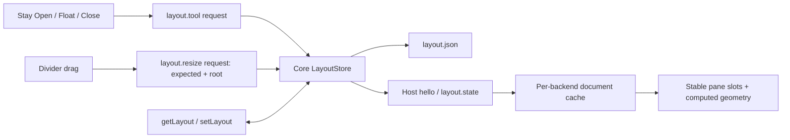

# Window layout

Core owns a recursive split tree; the web positions stable pane slots from that tree. Agent, shell,
and editor share this layout with optional File Browser and Find in Files docks. There is no
drag-and-drop layout editor: users resize dividers, activate commands, and pin tools with **Stay Open**.
The layout is also readable and editable through the capability registry's `getLayout`/`setLayout`.

## Ownership and rendering

`LayoutStore` is the authoritative writer. It validates pane kinds, reconciles the document against
`LayoutPanes`, persists through `IFileSystem.WriteAllTextAtomic`, and broadcasts changes.
`HostCore` supplies the same bridge behavior for every platform host.

```mermaid
flowchart LR
    Tool["Stay Open / Float / Close"] --> Mutation["layout.tool request"]
    Drag["Divider drag"] --> Resize["layout.resize request: expected + root"]
    Mutation --> Store["Core LayoutStore"]
    Resize --> Store
    MCP["getLayout / setLayout"] <--> Store
    Store --> Disk["layout.json"]
    Store --> State["Host hello / layout.state"]
    State --> Cache["Per-backend document cache"]
    Cache --> Slots["Stable pane slots + computed geometry"]
```

The web caches documents by backend; selecting a session chooses its backend's document, never moves
one host's layout into another. A gesture captures the owning backend before awaiting its request.
The renderer's local resize preview is not another persisted document.

`LayoutView` renders one stable slot per pane kind. Geometry, visibility, and floating presentation
change without reparenting or remounting surfaces. Terminals retain their instances and scrollback;
the editor retains its models; tools retain expanded directories, search query, and results.
Tool contents mount lazily on first use and remain mounted while hidden.

## Model

A `LayoutDocument` contains its `root`, focused pane ID, host-owned window bounds, and registry
reconciliation bookkeeping. A node is either:

- `{ type: "split", dir: "row" | "column", weights, children }`: an ordered weighted split.
- `{ type: "pane", id, kind, hidden }`: a singleton surface. Hidden leaves retain their position.

Registered kinds are `terminal:claude`, `terminal:shell`, `editor`, `files`, and `search`.
The agent kind identifies the stable agent slot regardless of whether its content is terminal or
structured ACP UI. Pane IDs identify instances; kinds identify renderers.

The default tree puts agent above shell in the left 40%, and editor in the right 60%.
Files and Search are registered but not shown by default.

Hidden leaves have no rectangle. Splits distribute their available space across visible child
subtrees using the saved weights. An entirely hidden subtree takes no space and produces no divider.
Splitter paths still address the original tree; resizing visible neighbors skips hidden siblings
without changing their saved weights.

## Optional tools

Files and Find in Files float by default and stay open until closed. Each header provides:

- **Stay Open**: dock in the far-left column.
- **Float**: remove the docked leaf, leaving the tool open as an overlay.
- **Close**: hide the tool; a dock retains its location and sizes.

The first pinned tool wraps the primary pane tree in a row with a 22% tool column.
Pinning the other tool stacks Files above Search inside that column. The original agent/shell/editor
subtree and its ratios remain unchanged. Removing tool leaves collapses redundant splits.

Core's `ToolLayout` applies `dock`, `float`, `show`, and `hide` to the current document.
These are operations, not stale whole-document replacements. Closing a dock sets `hidden`; opening
it clears `hidden`. Docking and hidden geometry persist across reloads. Floating visibility is
temporary, owned by the web per backend.

Compact mode presents explicitly opened tools as overlays without rewriting desktop docking.
Opening a dock while a primary pane is fullscreen exits fullscreen so the tool is reachable.
Numbered pane navigation excludes Files and Search, keeping the agent/shell/editor shortcuts stable.

## Resizing and concurrency

Pointer movement updates a local geometry preview. Pointer-up sends one `layout.resize` request
containing the source tree and the proposed tree. Core compares the source with its current tree
under the same lock as the mutation. A stale resize is rejected visibly; it cannot undo a dock,
another client's edit, or an MCP layout change.

The preview remains visible until authoritative state arrives. Request failure clears that preview
and shows an error. An authoritative layout change, pointer cancellation, or Escape cancels an
active drag and removes its window listeners. No debounced whole-layout write remains.

Layout nodes carry their own polymorphic discriminator and split-direction JSON encoding, so typed
bridge requests and persisted documents use the same row/column representation.

## Keyboard and dismissal

All tool actions are registered commands, available to the palette and agent. Header tooltips read
the effective bindings from the command catalog rather than copying default keys.

| Command | Default binding |
| --- | --- |
| Toggle File Browser | Mod+B |
| Find in Files | Mod+Shift+F |
| Toggle File Browser Stay Open | Mod+Alt+B |
| Toggle Find in Files Stay Open | Mod+Alt+F |
| Close Tool Panel | Mod+Shift+W |
| Close Floating Panel | Escape |

`Mod` is Command on macOS and Control elsewhere. Close Tool Panel uses shared focus classification,
including the palette's prior-focus snapshot, so invoking it from the palette closes the right tool.

Floating surfaces register dismissal ownership. Most recently raised tool windows are visually
stacked in the same order. Opening a tool retires transient popovers whose visual layer is above
tools. Escape closes exactly one floating surface even after focus moves back into the editor.
Docked tools do not participate in floating dismissal.

Ordinary command bindings resolve in capture; floating dismissal resolves in bubble. Local controls
can consume Escape to cancel completion, close a nested menu, or abandon another operation before
the surrounding window gets it. Modal command guards remain authoritative. Application-menu
dismissal restores keyboard focus to its trigger without stealing focus on outside clicks.

## Persistence and verification

The host persists native window bounds independently of pane edits and does not broadcast a pane
change for a window move. Document loading reconciles registered defaults and explicit dismissals;
malformed documents are backed up to `layout.json.bad` before reseeding.

Core tests cover docking order, primary-tree preservation, hide/reopen/reload geometry, stale resize
rejection, and typed wire serialization. Web tests cover hidden-tree geometry and bubble dismissal.
Full-stack journeys prove real terminal/editor instance continuity, directory expansion and query
retention, resizing and reload, palette focus, nested Escape, fullscreen, and compact inbox access.
