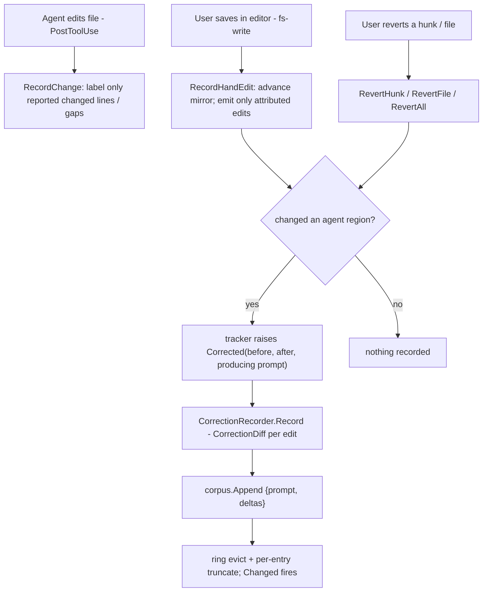
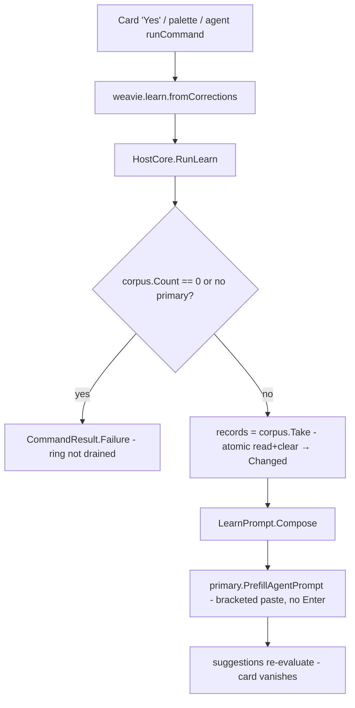

# Learn from corrections

Status: implemented
Last updated: 2026-07-12

Weavie sits between the user and the embedded agent. When the user **edits the agent's output in the editor
or reverts a hunk in the review UI**, that correction never enters the agent's transcript — so it is
invisible to the model forever. That *edit over agent output* is signal only Weavie has.

This feature persists those corrections per-workspace and lets the user run **`/learn`** to have the
primary session's Claude mine them for `AGENTS.md` rules. The division of labor is firm: **Weavie stores
the signal; Claude does all the reasoning** — there is no classifier, scorer, or intent-detector in Core.
The corpus holds raw deltas only.

A correction is captured **as a discrete event, at the moment the user acts** — an editor save that lands
over an agent hunk, or a review-UI revert — never reconstructed by diffing the working tree at a turn
boundary. This is the definitive design: the tree-diff-at-boundary approach it replaces swept in machine
noise (formatter reflow, regenerated build artifacts, a parallel agent's commits) and depended on a
full-repo content scan. Capturing at the user's action, gated to the lines the agent actually wrote, records
only genuine corrections.

It reuses two existing systems almost whole:

- The [contextual suggestions](../concepts/suggestions.md) surface (the `workspace.setup` card is the
  template for the nudge, the command, and prompt-into-session delivery).
- The `SessionChangeTracker` review model, which already holds each file's agent output (`_current`) and
  review baseline. The tracker raises a `Corrected` event; the `CorrectionRecorder` is a plain subscriber
  (`Changes.Corrected += recorder.Record`) — no injected dependency, no router slot.

The only new primitives are a line-alignment helper (`LineHunker`, which also backs `CorrectionDiff`) and a
compact unified-diff emitter (`CorrectionDiff`) so a delta stores as one diff rather than doubling bytes.

## Model

All in `Weavie.Core.Corrections` unless noted:

- **`CorrectionRecord`** — one user action's corrections: the producing turn's `Prompt` (inline, truncated;
  null for providers that report none) plus a list of `CorrectionFile { Path, Delta }`. `Delta` is a
  unified diff of `before → after`; `Path` is workspace-root-relative. Serializes as one JSONL line.
- **`CorrectionCorpus`** (per workspace) — a byte-capped ring over `IFileSystem` at
  `~/.weavie/workspaces/<id>/corrections.jsonl` (`WeaviePaths.WorkspaceCorrectionsFile`): `Append`,
  `ReadAll`, `Take` (atomic read+clear), a locked `Count`, and a `Changed` event. Oldest-first; eviction
  drops whole leading lines.
- **`CorrectionRecorder`** (per session) — a plain subscriber to the tracker's `Corrected` event. Its
  `Record(edits)` diffs each edit's `before → after` (`CorrectionDiff`), drops EOL-only deltas, and appends
  one `CorrectionRecord` per producing prompt to the shared corpus.
- **`SessionChangeTracker.Corrected`** (`SessionChangeTracker.Corrections.cs`) — the event, raising
  `CorrectionEdit { RelativePath, Before, After, Prompt }` batches from `RecordHandEdit` and the reverts.
- **`LineHunker`** (`Weavie.Core.Changes`) — the LCS line alignment: `Hunks(before, after)` returns each
  changed region's range on both sides. Its exact linear-memory alignment backs both provenance tracking and
  `CorrectionDiff` (one alignment, no coarse large-file fallback).

The corpus is **per-workspace** (rules about "how the agent codes in this repo" are repo-level, pooled
across every session/worktree), which is why it is a standalone store owned by `HostCore` and **not** part
of the per-session tracker state.

## Capturing a correction

A correction is emitted at the two moments the user acts on the agent's output; the tracker raises
`Corrected` and the recorder appends. Nothing is reconstructed later, and nothing scans the tree.

**Editor save — `RecordHandEdit(path, content)`** (called from the `fs-write` bridge handler on every
editor save that reaches disk). Each tracked file has a full-text provenance mirror whose live lines and
deletion gaps carry their producing prompt and pending/kept state:

1. agent completion aligns the pre-tool file with the provider-reported file and labels only changed lines
   or deletion gaps; unchanged origins survive, including origins from earlier turns;
2. every editor save advances the full mirror, but only a change wholly over one pending origin records.
   An insertion records at an attributed deletion gap or strictly between lines from the same origin;
3. unrelated user/external edits remain unlabelled, so a later agent edit cannot absorb them into agent
   ownership. The review-only `_current` projection applies only attributed agent/correction changes.

**Review-UI revert.** `RevertHunk` records the rejected hunk (`before` = the agent's lines, `after` = the
baseline lines spliced back); `RevertFile`/`RevertAll` record the whole file (`before` = `_current`,
`after` = the review baseline, or empty when reverting a created file deletes it). Reverts write disk
directly (never through `fs-write`), so they never double-fire with the editor path.

Because capture is scoped to agent regions, **out-of-band edits are intentionally invisible**: a change made
in vim, by a formatter run over the agent's Bash/exec, or by a parallel agent never flows through
`fs-write` or a revert, so it is never a correction. This is what kills the false-positive classes the old
tree-diff approach suffered — it is a deliberate narrowing, not a gap.

**Prompt attribution.** Each attributed line/gap stores the in-flight turn's prompt, so different hunks in
one file retain different producing turns. Codex reports no prompt, so its origins carry null.

An empty delta (the difference was EOL-only, or the save touched nothing the agent wrote) records nothing.
A file the **agent itself** deletes (a Bash rm reconciled at PostToolUse) records nothing — no user action
fired — while a **user revert** that deletes a created file records the full rejection.

**Prompt plumbing.** `HookRequest` carries `Prompt` (parsed from the Claude `UserPromptSubmit` payload) and
`AgentPromptSubmitted` carries a `Prompt` field.

## Running `/learn`

`/learn` is the Core command `weavie.learn.fromCorrections` ("Learn From My Corrections"), handled in
`HostCore.Learn.cs`. Corrections are already in the ring (recorded at each user action), so it just reads
the corpus, composes a static analysis prompt (`LearnPrompt.Compose` — header + corrections), **prefills**
it into the **primary** session (Claude via bracketed paste, Codex via `PrefillPrompt`) — never
auto-submits; the user reviews and presses Enter — then consumes the ring. Because prefill does not fire
`UserPromptSubmit`, `/learn` records no spurious correction of its own.

Two loud edges, no silent paths:

- An **empty ring fails the command** ("No corrections recorded yet…") — visible in the palette/toast, not
  a quiet no-op. The emptiness (and the missing-primary case) is checked via `Count` *before* consuming, so
  a loud failure never drains the ring.
- The consume is a single **atomic `Take`** (read+clear under one lock), so a correction another session
  appends mid-/learn is either returned here (analyzed) or lands afterward and survives in the ring — it can
  never be evicted in a window between a separate read and a positional clear.

`/learn` is reachable from the card and the command palette (and Claude itself via `runCommand`). Per the
keyboard-first rule's "default keybindings sparingly" stance, it gets **no default chord** — it is
infrequent and already discoverable through two surfaces.

## The nudge

A second suggestion, `corrections.learn`, mirrors `workspace.setup`: predicate
`ctx.PendingCorrectionCount >= corrections.learnThreshold`, primary action
`RunCommand(weavie.learn.fromCorrections)`, plus Snooze / DismissForever. It self-regulates — it appears
once enough corrections accumulate and vanishes after `/learn` clears the ring.

`SuggestionContext` gains `PendingCorrectionCount`. Unlike the one-shot `HasBuildManifest`, the count
changes over time, so `SuggestionService` reads it fresh each `Evaluate()` from a supplier
(`() => corpus.Count`, a locked int — free). `IsRelevant` stays a pure, no-I/O predicate. Beyond the
existing triggers (probe completion, setting change), **the corpus's `Changed` event re-evaluates** — the
card appears the moment an append crosses the threshold and withdraws the moment /learn consumes the ring,
with no per-session trigger plumbing.

`corrections.learnThreshold` (Int, default 3, min 1, `Live`) is the only user-facing setting — the byte
caps below are context-budget invariants, not config.

## Storage, eviction, truncation

On-disk is JSONL, oldest-first, one `CorrectionRecord` per line. The corpus loads into an ordered
in-memory line list with a running byte total; `Append` pushes, evicts from the front while over the cap,
then atomically rewrites the file (temp + rename — the ≤96 KB cap makes a full rewrite per turn trivial).
A malformed line is dropped at load rather than wedging the ring.

The byte cap doubles as a **context budget**: the whole ring feeds one `/learn` analysis and must fit the
model's window. Fixed named constants: `MaxBytes` 96 KB; per-entry ceiling `MaxBytes / 4` (one monster
turn keeps ≥3 entries of history — trailing files drop with a `DroppedFiles` count, never silently, and a
lone delta whose JSON escaping inflates past the ceiling shrinks until the line fits); prompt 2 KB;
per-file delta 8 KB. Overflow is truncated with a marker.

**The ring stores printable text plus `\n`/`\t` only.** Deltas embed raw file content, and /learn replays
the ring into a *bracketed paste* — a raw PTY input sink whose `ESC[201~` terminator, smuggled inside a
hostile file's bytes, would end the paste early and turn the remainder into typed input (a `\r` submits;
`!cmd\r` runs a shell command with no model in the loop). `Append` therefore strips every other control
character (C0/C1 incl. ESC, DEL, CR) from prompt, path, and delta at the one choke point, so corpus
content can never escape the paste.

Evicting the oldest correction is the **one sanctioned silent cap** here (a deliberate exception to the
no-silent-fallback rule): this is a best-effort *learning* corpus, not a correctness path, and biasing
toward recent corrections is the intent, not a hidden failure. Everywhere else the loud-path rule holds —
an empty ring fails the command at the surface that meets the user.

## Non-goals

- **No reasoning in Core.** Detection, classification, and rule-authoring are Claude's; the corpus is raw
  deltas. The `LearnPrompt` header tells the model to ignore noise (one-off fixes, unrelated edits,
  another agent's concurrent work) rather than Core trying to filter it.
- **No live feedback per correction.** Preventing the agent from building on a reverted hunk mid-session
  is a separate, live concern (a `systemMessage` on the next `UserPromptSubmit`); this feature is the
  batch, reflective half.
- **No auto-submit and no background model calls.** Tokens are spent only when the user clicks Learn or
  presses Enter.

## Known approximations

All follow from the best-effort-corpus stance and are surfaced to the model (which reasons about noise),
not hidden:

- Only edits made **through Weavie's editor** (an `fs-write`) or a review-UI revert are captured; an edit
  to an agent hunk made in an external editor is not. This is the deliberate narrowing that excludes machine
  noise — the realistic correction workflow is in-editor.
- A pure **insertion of new lines at the top or bottom edge** of an agent region (a prepend or an append,
  rather than lines inserted *between* agent-written lines) is treated as new authoring, not a correction, so
  it does not record — and so a run of the user's own lines typed at the end of an agent file, which autosave
  saves repeatedly, never accumulates bogus corrections.
- The ring is consumed at prefill; a user who abandons the prefilled prompt has spent the ring (the prompt
  text still holds every delta on screen).

## Testing

Per [integration-testing-strategy](integration-testing-strategy.md), no test runs the real model; hooks
are replayed at the seam and the analysis text is never asserted. Coverage:

- **Hunker / diff / corpus / recorder** (Core, `InMemoryFileSystem`) — `LineHunker` change grouping +
  range overlap; `CorrectionDiff` hunk grouping + headers + EOL-normalized no-ops; ring reload, FIFO
  eviction, per-entry ceilings, counted clears, malformed-line tolerance, `Changed` events; capture
  semantics (hand-edit over an agent hunk recorded; edit to an agent-untouched region **not** recorded;
  repeated save of the same content records once; hunk/file revert recorded; late revert still recorded and
  attributed to the producing prompt; kept-file edits not recorded; agent deletion not recorded; user
  revert-delete recorded; Codex null prompt).
- **Nudge** (Core) — below/at threshold, threshold setting honored, supplier re-read per `Evaluate()`.
- **`/learn` full-stack** (`TestHost`) — hook-driven agent turns whose output the user edits via an
  `fs-write` (the editor-save capture point) surface the card at the default threshold; the command
  bracketed-pastes header + corpus into the primary Claude pane with no trailing submit; the persisted ring
  empties and the card withdraws; an empty ring fails the command and writes nothing to the PTY.

`HostSession` wires the recorder to the production event (`Changes.Corrected += Corrections.Record`), so the
full-stack test drives the real capture seam (the `fs-write` handler) rather than a test-only re-plumb.

## Build order (as landed)

1. `CorrectionRecord`, `CorrectionCorpus`, `LineHunker`, `CorrectionDiff` — pure Core, unit-tested over `InMemoryFileSystem`.
2. Prompt plumbing — `HookRequest.Prompt`, `AgentPromptSubmitted(SessionId, Prompt)`, adapter, Codex protocol.
3. Tracker `Corrected` event + action-time provenance mirror + revert capture
   (`SessionChangeTracker.Corrections.cs`).
4. `CorrectionRecorder` subscriber + `Changes.Corrected` wiring in `HostSession` + the `fs-write` capture
   point (`HostCore.WebBridge.cs`) + capture tests.
5. `CorrectionsSettings`, `SuggestionContext.PendingCorrectionCount`, the service supplier, the
   `corrections.learn` card, the corpus `Changed` → `Evaluate()` trigger.
6. `weavie.learn.fromCorrections` + `HostCore.Learn.cs` + `LearnPrompt` — full-stack `/learn` tests.
