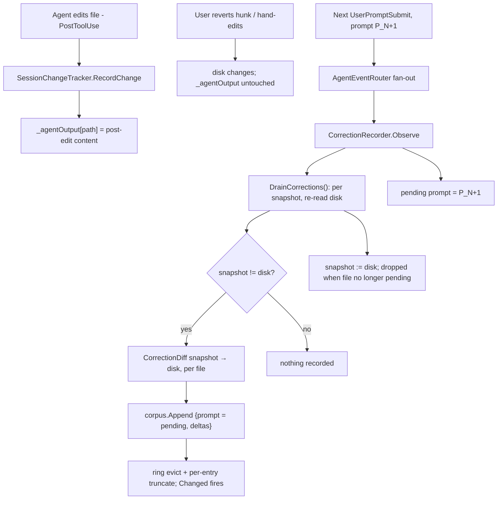
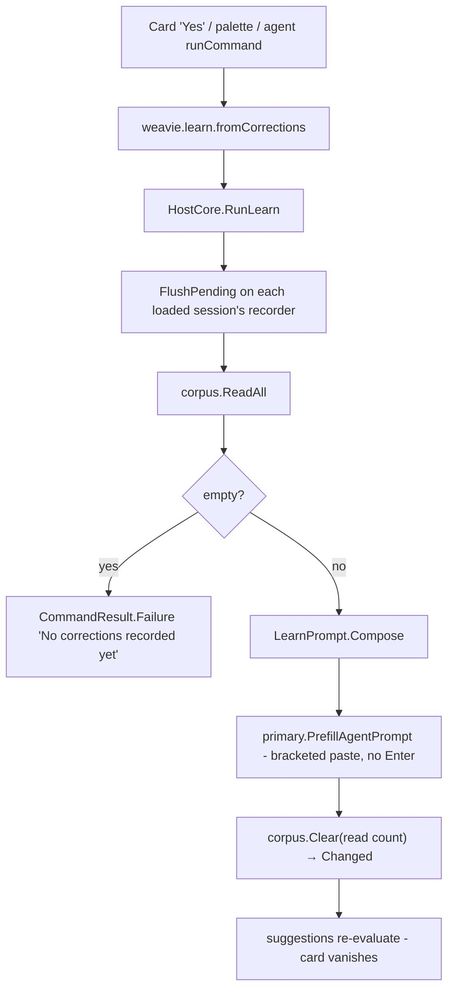

# Learn from corrections

Status: implemented
Last updated: 2026-07-11

Weavie sits between the user and the embedded agent and observes turn-review. When the user **reverts a
hunk or hand-edits the agent's output**, that correction happens out-of-band and never enters the agent's
transcript — so it is invisible to the model forever. That *net edit over agent output* is signal only
Weavie has.

This feature persists those corrections per-workspace and lets the user run **`/learn`** to have the
primary session's Claude mine them for `CLAUDE.md` rules. The division of labor is firm: **Weavie stores
the signal; Claude does all the reasoning** — there is no classifier, scorer, or intent-detector in Core.
The corpus holds raw deltas only.

It reuses two existing systems almost whole:

- The [contextual suggestions](../concepts/suggestions.md) surface (the `workspace.setup` card is the
  template for the nudge, the command, and prompt-into-session delivery).
- The per-session agent-event fan-out (`AgentEventRouter`), where a `CorrectionRecorder` slots in as a
  fourth fixed consumer beside `SessionChangeTracker` / `ObservedPermissionMode` / `SessionStatusMachine`.

The only new rendering primitive is a compact unified-diff emitter (`CorrectionDiff`) so a delta stores as
one diff rather than doubling bytes with before/after text.

## Model

All in `Weavie.Core.Corrections` unless noted:

- **`CorrectionRecord`** — one boundary's worth of corrections: the turn's user `Prompt` (inline,
  truncated; null for providers that report none) plus a list of `CorrectionFile { Path, Delta }`.
  `Delta` is a unified diff of `agentText → finalText`; `Path` is workspace-root-relative. Serializes as
  one JSONL line.
- **`CorrectionCorpus`** (per workspace) — a byte-capped ring over `IFileSystem` at
  `~/.weavie/workspaces/<id>/corrections.jsonl` (`WeaviePaths.WorkspaceCorrectionsFile`): `Append`,
  `ReadAll`, `Clear(count)`, a locked `Count`, and a `Changed` event. Oldest-first; eviction drops whole
  leading lines.
- **`CorrectionRecorder`** (per session) — the router's fourth consumer. Holds the pending prompt; at each
  turn boundary drains the tracker and appends any net delta to the shared corpus. `FlushPending()` runs
  the same drain on demand (/learn).
- **`SessionChangeTracker` snapshot** (`SessionChangeTracker.Corrections.cs`) — a retained `_agentOutput`
  map (what the agent last wrote per file, untouched by keep/revert) plus `DrainCorrections()`, which
  re-reads disk for each entry and returns the differing `{RelativePath, AgentText, FinalText}` triples.

The corpus is **per-workspace** (rules about "how the agent codes in this repo" are repo-level, pooled
across every session/worktree), which is why it is a standalone store owned by `HostCore` and **not** part
of the per-session tracker state.

## Capturing a correction

The agent's original output cannot be reconstructed from live tracker state (`_current` is overwritten by
reverts; `_reviewBaseline` advances on keeps), so it is snapshotted on every `RecordChange` (PostToolUse
reads the post-edit disk content). The final state at a drain is a fresh disk read, which captures
hand-edits the `WorkspaceWatcher` never routes to the tracker. The stored prompt is the *previous*
boundary's — the one that produced the corrected output.

**The snapshot's lifetime follows the review model, not the turn.** Turn-review *accumulates*: the user is
encouraged to fire several prompts and walk the review set later, so a revert can land many turns after
the write. A per-turn snapshot drain would miss exactly those. Instead, at each boundary
`DrainCorrections()`:

1. diffs every snapshot against disk and reports the differing files (a correction reports **once**);
2. advances each snapshot to the disk content;
3. drops a snapshot only once its file has **no pending review changes left** (review baseline == current
   — i.e. the user kept, reverted, or keep-all'ed it).

So hand-edits over *still-unreviewed* agent output keep counting as corrections, while edits made after
the user accepted the output are their own coding, not signal. One asymmetry is deliberate: a file the
**agent itself** deletes (a Bash rm reconciled at PostToolUse) drops its snapshot — agent action, not a
correction — while a **user revert** that deletes a created file keeps it, so the full-rejection records.

An empty delta (the user kept everything, or the difference was EOL-only) records nothing.

**Prompt plumbing.** `HookRequest` gains `Prompt` (parsed from the Claude `UserPromptSubmit` payload) and
`AgentPromptSubmitted` gains a `Prompt` field. Codex's `turn/started` carries no prompt, so a Codex
correction records `{prompt: null, deltas}` — acceptable, since the delta is the signal and the prompt is
context.

## Running `/learn`

`/learn` is the Core command `weavie.learn.fromCorrections` ("Learn From My Corrections"), handled in
`HostCore.Learn.cs`. It flushes every loaded session's recorder (the still-uncommitted last correction),
reads the corpus, composes a static analysis prompt (`LearnPrompt.Compose` — header + corrections),
**prefills** it into the **primary** session (Claude via bracketed paste, Codex via `PrefillPrompt`) —
never auto-submits; the user reviews and presses Enter — then consumes the ring. Because prefill does not
fire `UserPromptSubmit`, `/learn` records no spurious correction of its own.

Two loud edges, no silent paths:

- An **empty ring fails the command** ("No corrections recorded yet…") — visible in the palette/toast, not
  a quiet no-op.
- The consume is **`Clear(count)`** over exactly the entries `ReadAll` returned, so a correction another
  session appends mid-/learn survives unread rather than being clobbered by a clear-all.

`/learn` is reachable from the card and the command palette (and Claude itself via `runCommand`). Per the
keyboard-first rule's "default keybindings sparingly" stance, it gets **no default chord** — it is
infrequent and already discoverable through two surfaces.

## The nudge

A second suggestion, `corrections.learn`, mirrors `workspace.setup`: predicate
`ctx.PendingCorrectionCount >= corrections.learnThreshold`, primary action
`RunCommand(weavie.learn.fromCorrections)`, plus Snooze / DismissForever. It self-regulates — it appears
once enough corrections accumulate and vanishes after `/learn` clears the ring.

`SuggestionContext` gains `PendingCorrectionCount`. Unlike the one-shot `HasBuildManifest`, the count
changes over time, so `SuggestionService` reads it fresh each `Evaluate()` from a supplier
(`() => corpus.Count`, a locked int — free). `IsRelevant` stays a pure, no-I/O predicate. Beyond the
existing triggers (probe completion, setting change), **the corpus's `Changed` event re-evaluates** — the
card appears the moment an append crosses the threshold and withdraws the moment /learn consumes the ring,
with no per-session trigger plumbing.

`corrections.learnThreshold` (Int, default 3, min 1, `Live`) is the only user-facing setting — the byte
caps below are context-budget invariants, not config.

## Storage, eviction, truncation

On-disk is JSONL, oldest-first, one `CorrectionRecord` per line. The corpus loads into an ordered
in-memory line list with a running byte total; `Append` pushes, evicts from the front while over the cap,
then atomically rewrites the file (temp + rename — the ≤96 KB cap makes a full rewrite per turn trivial).
A malformed line is dropped at load rather than wedging the ring.

The byte cap doubles as a **context budget**: the whole ring feeds one `/learn` analysis and must fit the
model's window. Fixed named constants: `MaxBytes` 96 KB; per-entry ceiling `MaxBytes / 4` (one monster
turn keeps ≥3 entries of history — trailing files drop with a `DroppedFiles` count, never silently, and a
lone delta whose JSON escaping inflates past the ceiling shrinks until the line fits); prompt 2 KB;
per-file delta 8 KB. Overflow is truncated with a marker.

**The ring stores printable text plus `\n`/`\t` only.** Deltas embed raw file content, and /learn replays
the ring into a *bracketed paste* — a raw PTY input sink whose `ESC[201~` terminator, smuggled inside a
hostile file's bytes, would end the paste early and turn the remainder into typed input (a `\r` submits;
`!cmd\r` runs a shell command with no model in the loop). `Append` therefore strips every other control
character (C0/C1 incl. ESC, DEL, CR) from prompt, path, and delta at the one choke point, so corpus
content can never escape the paste.

Evicting the oldest correction is the **one sanctioned silent cap** here (a deliberate exception to the
no-silent-fallback rule): this is a best-effort *learning* corpus, not a correctness path, and biasing
toward recent corrections is the intent, not a hidden failure. Everywhere else the loud-path rule holds —
an empty ring fails the command at the surface that meets the user.

## Non-goals

- **No reasoning in Core.** Detection, classification, and rule-authoring are Claude's; the corpus is raw
  deltas. The `LearnPrompt` header tells the model to ignore noise (one-off fixes, unrelated edits,
  another agent's concurrent work) rather than Core trying to filter it.
- **No live feedback per correction.** Preventing the agent from building on a reverted hunk mid-session
  is a separate, live concern (a `systemMessage` on the next `UserPromptSubmit`); this feature is the
  batch, reflective half.
- **No auto-submit and no background model calls.** Tokens are spent only when the user clicks Learn or
  presses Enter.

## Known approximations

All follow from the best-effort-corpus stance and are surfaced to the model (which reasons about noise),
not hidden:

- A correction made to turn N during a later turn is attributed to the *latest* pending prompt, not the
  one that produced the output.
- A correction to the final turn is not in the ring until the next prompt — mitigated by `FlushPending()`
  on `/learn` and on session dispose (so unloading a session after a full rejection still records it).
- The ring is consumed at prefill; a user who abandons the prefilled prompt has spent the ring (the prompt
  text still holds every delta on screen).
- A hand-edit by *another agent or the user for unrelated reasons* inside a still-pending file records as
  a correction; the `LearnPrompt` instructs the model to discard such noise.

## Testing

Per [integration-testing-strategy](integration-testing-strategy.md), no test runs the real model; hooks
are replayed at the seam and the analysis text is never asserted. Coverage:

- **Diff / corpus / recorder** (Core, `InMemoryFileSystem`) — hunk grouping + headers + EOL-normalized
  no-ops; ring reload, FIFO eviction, per-entry ceilings, counted clears, malformed-line tolerance,
  `Changed` events; capture semantics including the accumulate cases (late revert recorded; kept-file
  edits not recorded; agent deletion not recorded; user revert-delete recorded; flush idempotent; Codex
  null prompt).
- **Nudge** (Core) — below/at threshold, threshold setting honored, supplier re-read per `Evaluate()`.
- **`/learn` full-stack** (`TestHost`) — hook-driven corrected turns surface the card at the default
  threshold; the command bracketed-pastes header + corpus into the primary Claude pane with no trailing
  submit; the persisted ring empties and the card withdraws; an empty ring fails the command and writes
  nothing to the PTY.

`HostSession` exposes its event router (`Events`), so integration tests drive the exact production fan-out
(tracker + recorder ordering) rather than a test-only re-plumb.

## Build order (as landed)

1. `CorrectionRecord`, `CorrectionCorpus`, `CorrectionDiff` — pure Core, unit-tested over `InMemoryFileSystem`.
2. Prompt plumbing — `HookRequest.Prompt`, `AgentPromptSubmitted(SessionId, Prompt)`, adapter, Codex protocol.
3. Tracker snapshot — `_agentOutput` + `DrainCorrections()` (`SessionChangeTracker.Corrections.cs`).
4. `CorrectionRecorder` + router wiring + `HostSession` construction + capture tests.
5. `CorrectionsSettings`, `SuggestionContext.PendingCorrectionCount`, the service supplier, the
   `corrections.learn` card, the corpus `Changed` → `Evaluate()` trigger.
6. `weavie.learn.fromCorrections` + `HostCore.Learn.cs` + `LearnPrompt` — full-stack `/learn` tests.
